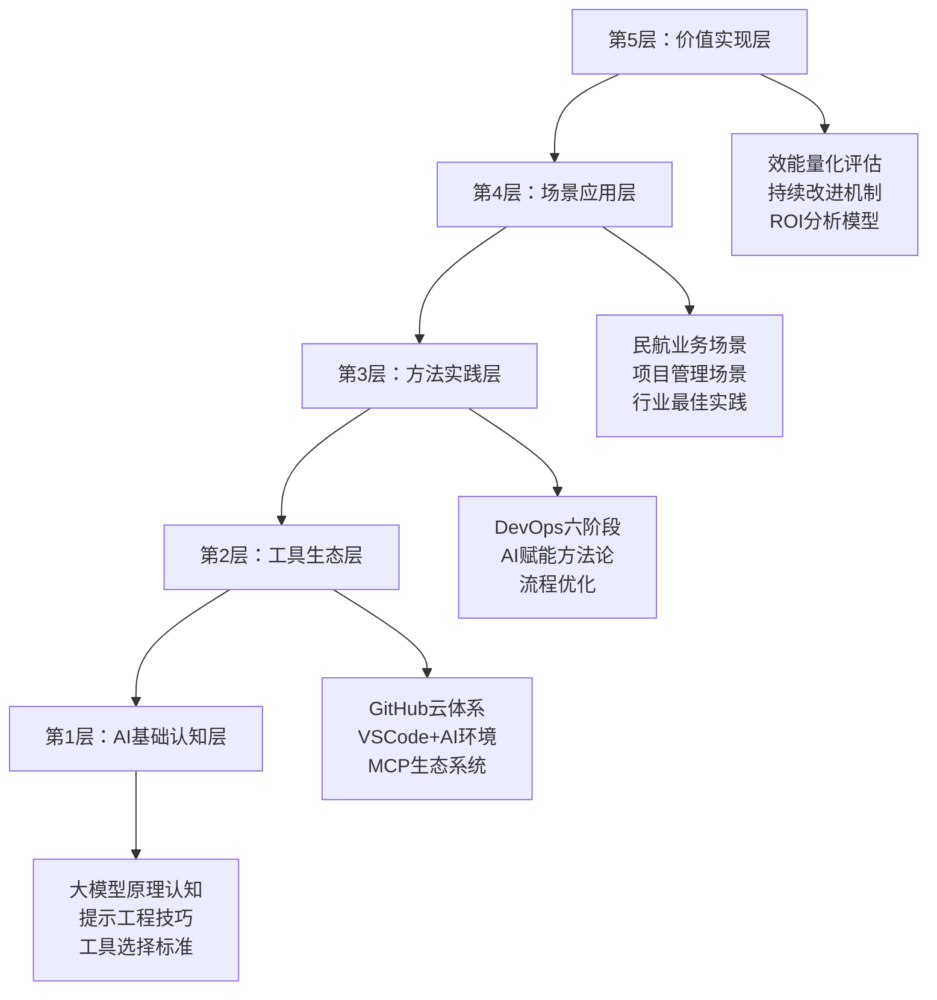

# DevOps开发AI工具链设计方案

## 📋 方案概述

基于AI+DevOps五层架构，构建面向民航业务场景的智能化开发工具链，实现从需求分析到运维监控的全流程AI赋能，提升开发效率2-3倍，降低缺陷率70%+。

---

## 🏗️ 工具链整体架构

### 架构设计原则
- **全流程覆盖**：需求→设计→开发→测试→部署→运维
- **工具协同**：各阶段工具无缝集成，数据互通
- **智能驱动**：AI贯穿始终，提供智能决策支持
- **民航定制**：针对民航业务特点深度优化
- **可扩展性**：支持工具的灵活替换和扩展

### 五层工具链架构



---

## 🔧 核心工具链配置

### 1. 需求分析阶段工具链

#### 主要工具组合
| 工具名称 | 功能定位 | AI能力 | 民航场景应用 |
|---------|---------|--------|-------------|
| **ChatGPT-4 + Miro AI** | 需求收集分析 | 智能需求提取、分类整理 | 航班调度需求分析、票务系统功能梳理 |
| **Claude Sonnet 3.5** | 需求文档生成 | 自动PRD生成、用户故事编写 | 机场运营管理需求文档、API规格说明 |
| **Notion AI** | 需求管理 | 智能标签分类、优先级排序 | 需求变更跟踪、版本管理 |
| **DeepSeek** | 需求验证 | 需求一致性检查、冲突识别 | 多系统集成需求冲突检测 |

#### 工作流配置
```yaml
需求工作流:
  步骤1_需求收集:
    工具: ChatGPT-4 + 录音转录
    输入: 用户访谈录音
    输出: 结构化需求清单
    AI提示模板: "基于航空业务特点，提取核心功能需求..."
  
  步骤2_需求分析:
    工具: Claude + Miro AI
    输入: 原始需求清单
    输出: 需求分类、优先级矩阵
    验证规则: 业务价值评分、技术实现复杂度
  
  步骤3_文档生成:
    工具: Notion AI
    输入: 分析后需求
    输出: PRD文档、用户故事
    质量检查: DeepSeek一致性验证
```

### 2. 架构设计阶段工具链

#### 核心工具配置
| 工具名称 | 功能定位 | AI增强能力 | 集成方式 |
|---------|---------|-----------|---------|
| **Claude + Napkin AI** | 架构设计 | 智能架构模式推荐、组件拆分 | API集成 |
| **Draw.io + AI Plugin** | 架构图绘制 | 自动图表生成、布局优化 | 浏览器扩展 |
| **GitHub Copilot** | 代码框架生成 | 基于架构生成代码骨架 | IDE集成 |
| **PlantUML + AI** | 序列图生成 | 智能交互流程设计 | 命令行工具 |

#### 设计模板库
```
民航业务架构模板:
├── 微服务架构模板
│   ├── 航班管理服务
│   ├── 票务处理服务
│   ├── 机场运营服务
│   └── 数据分析服务
├── API设计模板
│   ├── RESTful API标准
│   ├── 异步消息处理
│   └── 错误处理机制
└── 数据架构模板
    ├── 实时数据流处理
    ├── 历史数据存储
    └── 缓存策略设计
```

### 3. 开发阶段工具链

#### AI增强开发环境
```yaml
VSCode配置:
  核心插件:
    - GitHub Copilot: 智能代码生成
    - GitHub Copilot Chat: 代码解释与优化
    - Continue: 本地大模型集成
    - SonarLint: 实时代码质量检查
    - GitLens: 智能Git历史分析
  
  自定义配置:
    - 民航业务代码片段库
    - 项目模板自动生成
    - 智能提交信息生成
    - AI代码审查工作流
```

#### 代码质量工具链
| 工具 | AI增强功能 | 检查维度 | 民航定制规则 |
|-----|-----------|---------|-------------|
| **SonarQube AI** | 智能缺陷检测 | 安全漏洞、性能问题 | 航空安全关键代码检查 |
| **CodeClimate** | 技术债务分析 | 代码复杂度、重复度 | 维护成本评估 |
| **DeepCode** | 语义缺陷检测 | 逻辑错误、边界条件 | 业务逻辑正确性验证 |
| **GitHub Actions AI** | 智能CI流水线 | 自动构建、测试 | 多环境部署策略 |

### 4. 测试阶段工具链

#### 智能测试工具矩阵
```yaml
测试工具配置:
  单元测试:
    工具: GitHub Copilot + Jest/JUnit
    AI功能: 
      - 测试用例自动生成
      - 边界条件覆盖分析
      - Mock数据智能生成
    
  集成测试:
    工具: Testim + AI录制
    AI功能:
      - 用户行为路径分析
      - 异常场景自动识别
      - 测试数据动态生成
    
  性能测试:
    工具: K6 + AI分析
    AI功能:
      - 负载模式智能设计
      - 性能瓶颈自动识别
      - 优化建议生成
    
  安全测试:
    工具: OWASP ZAP + AI扫描
    AI功能:
      - 漏洞智能识别
      - 攻击模式模拟
      - 修复方案推荐
```

#### 测试数据管理
```javascript
// AI生成的民航测试数据模板
const flightTestData = {
  generator: "AI-powered",
  scenarios: [
    {
      name: "高峰期票务处理",
      data: generateFlightBookingData(1000),
      validation: aiValidateBusinessLogic()
    },
    {
      name: "航班延误处理",
      data: generateDelayScenarios(),
      validation: checkNotificationLogic()
    }
  ]
};
```

### 5. 部署阶段工具链

#### CI/CD智能流水线
```yaml
# .github/workflows/ai-enhanced-cicd.yml
name: AI增强CI/CD流水线

on:
  push:
    branches: [main, develop]
  pull_request:
    branches: [main]

jobs:
  ai-quality-gate:
    runs-on: ubuntu-latest
    steps:
    - uses: actions/checkout@v3
    
    - name: AI代码审查
      uses: github/super-linter@v4
      with:
        ai_enhanced: true
        custom_rules: ./aviation-coding-standards.yml
    
    - name: 智能测试执行
      run: |
        npm run test:ai-generated
        npm run test:performance
    
    - name: AI部署决策
      uses: ./ai-deployment-advisor
      with:
        target_env: ${{ github.ref }}
        risk_threshold: medium
```

#### 容器化与编排
| 工具 | AI增强能力 | 应用场景 |
|-----|-----------|---------|
| **Docker + AI Optimizer** | 镜像大小优化、安全扫描 | 容器构建优化 |
| **Kubernetes + KubeAI** | 资源调度优化、故障预测 | 容器编排管理 |
| **Helm + AI Templates** | 配置模板智能生成 | 应用部署配置 |
| **ArgoCD + AI GitOps** | 部署策略智能推荐 | 持续部署管理 |

### 6. 运维阶段工具链

#### 智能监控体系
```yaml
监控工具栈:
  基础监控:
    - Prometheus + AI Alerting: 智能告警规则
    - Grafana + AI Dashboard: 自动仪表盘生成
    - ELK Stack + AI Log Analysis: 日志智能分析
  
  应用监控:
    - New Relic AI: 应用性能智能分析
    - DataDog AI: 基础设施智能监控
    - Jaeger + AI Tracing: 链路追踪智能分析
  
  业务监控:
    - Custom Metrics + AI: 业务指标智能分析
    - Error Tracking + AI: 异常模式识别
    - User Analytics + AI: 用户行为分析
```

#### AIOps运维自动化
```python
# AI驱动的故障处理示例
class AIIncidentResponse:
    def __init__(self):
        self.ai_analyzer = ClaudeAnalyzer()
        self.knowledge_base = AviationOpsKB()
    
    def analyze_incident(self, alert_data):
        # AI分析告警数据
        analysis = self.ai_analyzer.analyze(
            alert_data,
            context=self.knowledge_base.get_context()
        )
        
        # 生成处理建议
        recommendations = self.generate_recommendations(analysis)
        
        # 自动执行安全操作
        if analysis.confidence > 0.9 and analysis.risk_level == 'low':
            self.auto_remediate(recommendations)
        
        return {
            'analysis': analysis,
            'recommendations': recommendations,
            'auto_actions_taken': self.get_actions_log()
        }
```

---

## 🔗 工具链集成配置

### MCP生态系统集成

#### MCP服务器配置
```json
{
  "mcpServers": {
    "aviation-devops": {
      "command": "node",
      "args": ["./aviation-mcp-server.js"],
      "env": {
        "AVIATION_DOMAIN_CONTEXT": "true",
        "AI_MODEL_ENDPOINT": "https://api.deepseek.com"
      }
    },
    "code-analyzer": {
      "command": "python",
      "args": ["./code-analysis-server.py"],
      "capabilities": [
        "code_review",
        "security_scan",
        "performance_analysis"
      ]
    },
    "deployment-advisor": {
      "command": "./deployment-mcp",
      "tools": [
        "risk_assessment",
        "rollback_strategy",
        "capacity_planning"
      ]
    }
  }
}
```

#### Claude Desktop集成
```yaml
工作流集成:
  需求分析:
    - MCP工具: requirements-analyzer
    - 输入: 业务需求文档
    - 输出: 结构化PRD + 用户故事
  
  代码审查:
    - MCP工具: code-reviewer
    - 输入: GitHub PR链接
    - 输出: 审查报告 + 改进建议
  
  部署决策:
    - MCP工具: deployment-advisor
    - 输入: 应用配置 + 目标环境
    - 输出: 部署方案 + 风险评估
```

### GitHub生态系统整合

#### GitHub Actions工作流
```yaml
# 智能化GitHub Actions配置
name: 民航AI-DevOps流水线

on:
  push:
  pull_request:
  schedule:
    - cron: '0 2 * * *'  # 每日AI健康检查

jobs:
  ai-requirements-check:
    if: github.event_name == 'pull_request'
    runs-on: ubuntu-latest
    steps:
    - name: AI需求合规性检查
      uses: ./github-actions/ai-requirements-validator
      with:
        aviation_standards: true
        
  ai-code-quality:
    runs-on: ubuntu-latest
    steps:
    - name: GitHub Copilot代码质量分析
      uses: github/copilot-code-analyzer
      
    - name: 安全漏洞AI扫描
      uses: github/codeql-action/analyze
      with:
        languages: javascript, python, java
        
  ai-testing-strategy:
    runs-on: ubuntu-latest
    steps:
    - name: AI测试用例生成
      run: |
        npx generate-test-cases --ai-enhanced
        npm run test:generated
        
  ai-deployment-decision:
    needs: [ai-code-quality, ai-testing-strategy]
    runs-on: ubuntu-latest
    steps:
    - name: AI部署风险评估
      uses: ./github-actions/ai-deployment-advisor
      with:
        target_environment: ${{ github.ref == 'refs/heads/main' && 'production' || 'staging' }}
```

---

## 📊 效能评估体系

### 关键指标监控

#### 开发效率类指标
```yaml
开发效率KPI:
  代码生成效率:
    指标: "AI辅助代码行数/总代码行数"
    目标: "> 40%"
    监控工具: "GitHub Copilot Analytics + 自定义脚本"
    
  需求理解速度:
    指标: "需求澄清轮次"
    目标: "< 2轮"
    监控方式: "Notion AI + 需求变更跟踪"
    
  文档生成效率:
    指标: "文档页数/人时"
    目标: "提升80%"
    工具: "AI文档生成器 + 时间跟踪"
```

#### 质量提升类指标
```yaml
质量KPI:
  代码质量评分:
    工具: "SonarQube AI"
    指标: "质量门禁通过率"
    目标: "> 95%"
    
  缺陷逃逸率:
    监控: "Jira + AI缺陷分析"
    计算: "生产缺陷数/总缺陷数"
    目标: "< 5%"
    
  测试覆盖率:
    工具: "Jest + AI测试生成"
    指标: "代码覆盖率 + 业务逻辑覆盖率"
    目标: "代码90%+ | 业务80%+"
```

#### 运维效率类指标
```yaml
运维KPI:
  故障恢复时间:
    工具: "AI故障诊断系统"
    指标: "MTTR (Mean Time To Recovery)"
    目标: "< 30分钟"
    
  部署成功率:
    监控: "CI/CD Pipeline + AI风险评估"
    指标: "部署成功率"
    目标: "> 98%"
    
  预测性维护:
    工具: "AIOps预测分析"
    指标: "预防性处理比例"
    目标: "> 60%"
```

### ROI计算模型

#### 成本效益分析
```python
class DevOpsAIROICalculator:
    def __init__(self):
        self.cost_factors = {
            'ai_tools_subscription': 50000,  # 年费
            'training_cost': 80000,          # 培训成本
            'environment_setup': 30000,     # 环境搭建
            'maintenance': 40000             # 维护成本
        }
        
    def calculate_benefits(self, team_size=20, months=12):
        benefits = {
            'development_efficiency': {
                'time_saved_hours': team_size * 8 * 20 * months * 0.3,  # 30%效率提升
                'hourly_rate': 200,
                'value': lambda h: h * 200
            },
            'quality_improvement': {
                'defect_reduction': 0.7,  # 70%缺陷减少
                'defect_cost': 5000,      # 每个缺陷成本
                'monthly_defects': 20,
                'value': lambda: 20 * months * 0.7 * 5000
            },
            'operational_efficiency': {
                'deployment_speed': 2.0,  # 2倍部署速度
                'ops_cost_reduction': 0.4,  # 40%成本减少
                'monthly_ops_cost': 50000,
                'value': lambda: 50000 * months * 0.4
            }
        }
        
        total_benefits = sum([
            benefit['value']() if callable(benefit['value']) 
            else benefit['value'](benefit.get('time_saved_hours', 0))
            for benefit in benefits.values()
        ])
        
        total_costs = sum(self.cost_factors.values())
        roi = ((total_benefits - total_costs) / total_costs) * 100
        
        return {
            'total_benefits': total_benefits,
            'total_costs': total_costs,
            'roi_percentage': roi,
            'target_achieved': roi > 300  # 目标ROI > 300%
        }
```

---

## 🚀 实施路线图

### 阶段一：基础工具链搭建（1-2周）
```yaml
Week1-2:
  目标: "建立核心AI开发环境"
  任务:
    - VSCode + AI插件配置
    - GitHub Copilot团队版部署
    - MCP服务器基础搭建
    - 代码质量工具集成
  交付:
    - 标准化开发环境
    - 基础AI工具使用指南
    - 团队配置模板
```

### 阶段二：流程集成优化（2-3周）
```yaml
Week3-5:
  目标: "AI工具与现有流程深度集成"
  任务:
    - CI/CD流水线AI增强
    - 需求管理工具AI集成
    - 测试自动化AI优化
    - 监控告警AI升级
  交付:
    - 智能化CI/CD模板
    - AI增强的需求管理流程
    - 自动化测试策略
```

### 阶段三：民航场景定制（3-4周）
```yaml
Week6-9:
  目标: "民航业务场景深度适配"
  任务:
    - 航空业务规则库建设
    - 民航特定AI提示模板
    - 行业最佳实践集成
    - 合规性检查自动化
  交付:
    - 民航业务AI助手
    - 行业定制提示词库
    - 合规检查工具链
```

### 阶段四：效能监控优化（1-2周）
```yaml
Week10-11:
  目标: "建立完整的效能评估体系"
  任务:
    - 效能指标监控面板
    - AI使用情况分析
    - ROI计算自动化
    - 持续改进机制
  交付:
    - 效能监控仪表盘
    - ROI分析报告
    - 改进建议引擎
```

---

## 🛡️ 风险管控与最佳实践

### 安全性保障
```yaml
安全控制措施:
  代码安全:
    - AI生成代码安全扫描
    - 敏感信息泄露检测
    - 代码权限访问控制
    
  数据安全:
    - 训练数据隐私保护
    - API调用加密传输
    - 本地模型优先策略
    
  合规性:
    - 民航行业标准遵循
    - 数据处理合规检查
    - 审计日志完整记录
```

### 质量保障机制
```yaml
质量控制:
  AI输出验证:
    - 多模型交叉验证
    - 人工审核机制
    - 自动化测试覆盖
    
  持续优化:
    - AI效果定期评估
    - 提示词版本管理
    - 模型性能监控
    
  知识管理:
    - 最佳实践沉淀
    - 问题解决方案库
    - 团队经验共享
```

### 成本控制策略
```yaml
成本优化:
  工具选择:
    - 开源优先原则
    - 按需付费模式
    - 批量采购优惠
    
  使用优化:
    - API调用频率控制
    - 本地缓存机制
    - 智能调度策略
    
  效果评估:
    - 月度成本分析
    - ROI定期评估
    - 工具使用效率监控
```

---

## 📈 预期效果与价值

### 量化预期效果

#### 效率提升
- **开发效率**：整体提升 **2-3倍**
- **需求澄清**：时间减少 **60%**
- **代码编写**：速度提升 **50%+**
- **文档编写**：效率提升 **80%**
- **测试设计**：时间减少 **40%**

#### 质量改善
- **代码质量**：评分提升 **30%+**
- **缺陷逃逸**：率降低 **70%+**
- **测试覆盖**：率提升 **25%+**
- **安全漏洞**：检测率提升 **80%**

#### 运维优化
- **部署频率**：提升 **100%+**
- **故障恢复**：时间减少 **70%**
- **监控告警**：准确率提升 **60%**
- **运维成本**：降低 **40%+**

### 业务价值实现

#### 对民航业务的价值
1. **航班管理系统**
   - 更快的功能迭代速度
   - 更高的系统稳定性
   - 更好的用户体验

2. **票务系统优化**
   - 高并发处理能力提升
   - 用户界面优化加速
   - 支付安全性增强

3. **机场运营平台**
   - 数据分析效率提升
   - 决策支持更加智能
   - 系统集成更加顺畅

#### 团队能力提升
- **技术能力**：AI工具熟练使用，新技术快速学习
- **协作效率**：跨部门沟通更加顺畅，问题解决更加高效
- **创新能力**：更多时间投入创新性工作，业务价值创造
- **职业发展**：掌握前沿技术，个人竞争力显著提升

---

## 🎯 结论与建议

### 核心价值主张
通过构建完整的DevOps AI工具链，实现：
- **效率跃升**：从手工作业到智能辅助的质的飞跃
- **质量保障**：多层次AI质量检查，确保交付品质
- **成本优化**：自动化程度提升，人力成本有效控制
- **创新驱动**：释放创造力，聚焦核心业务价值

### 实施建议
1. **分阶段推进**：避免一次性大规模改动，确保平稳过渡
2. **培训先行**：投资团队AI能力建设，确保工具链有效使用
3. **持续优化**：建立反馈机制，根据使用效果持续改进
4. **文化变革**：推动学习型组织建设，拥抱AI协作模式

### 成功关键因素
- **领导支持**：管理层的坚定支持和资源投入
- **团队参与**：开发团队的积极参与和主动学习
- **循序渐进**：从简单场景开始，逐步扩展到复杂应用
- **效果导向**：以实际效果为准，灵活调整实施策略

这套DevOps AI工具链将为民航凯亚团队带来研发效能的显著提升，助力企业在数字化转型中占据先机。

---

*📅 文档版本：v1.0 | 创建时间：2025年8月19日 | 适用范围：民航凯亚DevOps团队*
