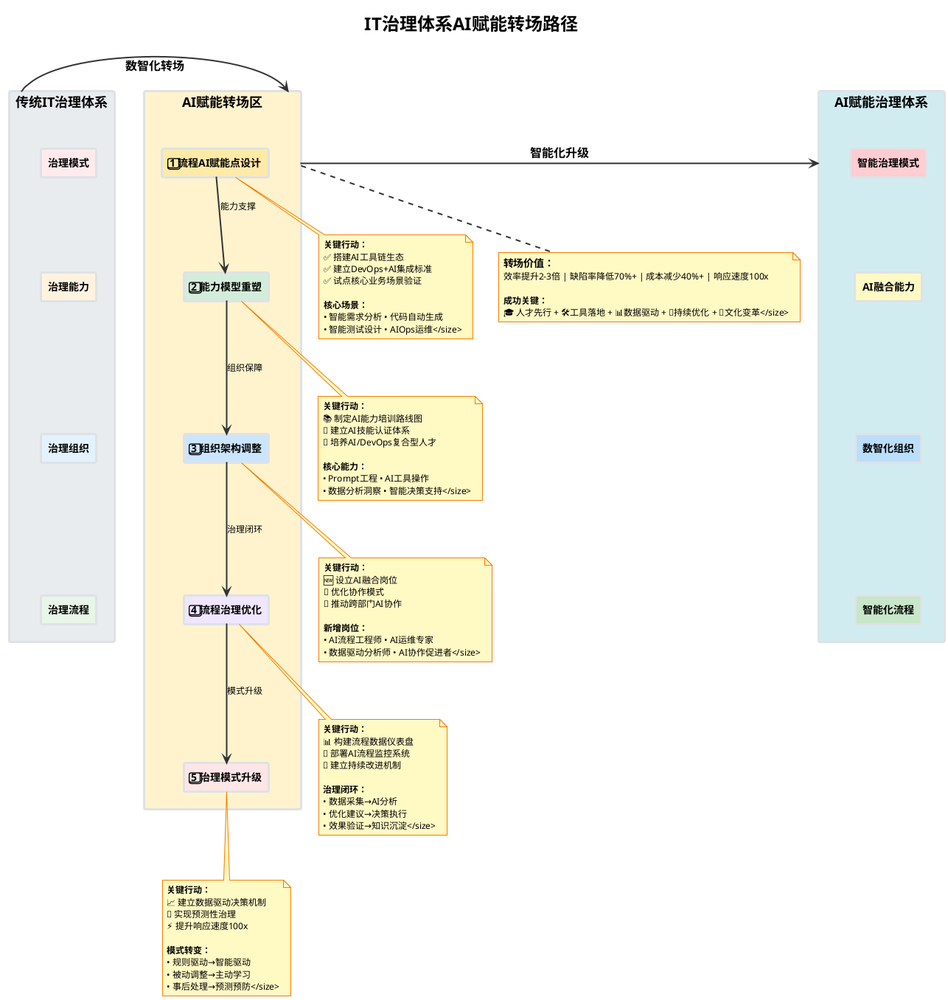
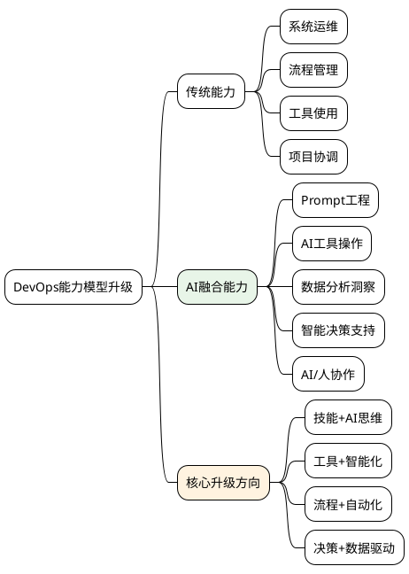
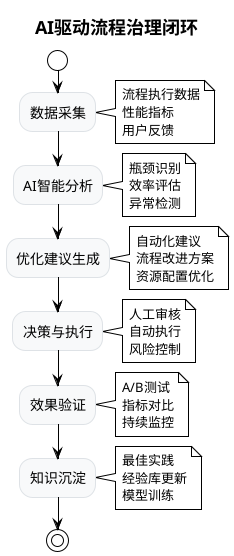

# IT治理体系AI赋能转场方案

## 🚀 从传统治理到智能治理的五大关键转场点

---

### 📊 转场路径全景图

---

## 🎯 五大转场点详细方案

### 1️⃣ **流程中AI赋能点设计** 🔧

> **核心目标：** 识别并设计DevOps全流程的AI集成方案

| 流程环节             | AI赋能技术     | 典型应用场景               | 预期提升       |
| -------------------- | -------------- | -------------------------- | -------------- |
| **需求分析**   | 大模型+NLP     | 智能需求提取、用户故事生成 | 效率提升50%    |
| **架构设计**   | 知识图谱+AI    | 智能架构推荐、技术选型     | 决策质量↗️   |
| **代码开发**   | GitHub Copilot | 智能编程、代码审查         | 开发速度2x     |
| **自动化测试** | AI测试生成     | 智能用例设计、缺陷预测     | 测试覆盖率90%+ |
| **部署运维**   | AIOps          | 智能监控、故障预测         | 故障率降低70%  |

**🎯 关键行动:**

- ✅ 搭建AI工具链生态
- ✅ 建立DevOps+AI集成标准
- ✅ 试点核心业务场景验证

---

### 2️⃣ **能力模型重塑** 💡

> **核心目标：** 构建面向AI时代的DevOps能力蓝图

**🎯 关键行动:**

- 📚 制定AI能力培训路线图
- 🏅 建立AI技能认证体系
- 👥 培养AI/DevOps复合型人才

---

### 3️⃣ **组织架构调整** 🏢

> **核心目标：** 设立AI/DevOps融合岗位，优化协作模式

#### 🆕 新增关键岗位

| 岗位名称                 | 核心职责                   | 技能要求        | 汇报关系 |
| ------------------------ | -------------------------- | --------------- | -------- |
| **AI流程工程师**   | DevOps流程AI化设计与优化   | AI工具+流程设计 | 技术总监 |
| **AI运维专家**     | 智能运维平台建设与维护     | AIOps+系统架构  | 运维总监 |
| **数据驱动分析师** | 流程数据分析与智能决策支持 | 数据分析+AI建模 | 产品总监 |
| **AI协作促进者**   | 跨部门AI应用推广与协调     | 项目管理+AI认知 | CTO      |

#### 🔄 协作模式升级

- **传统模式：** 瀑布式、各部门独立作业
- **AI赋能模式：** 敏捷协作、AI助力跨部门融合、数据驱动决策

---

### 4️⃣ **流程治理与优化** ⚙️

> **核心目标：** 建立AI驱动的流程持续优化闭环

**📊 核心价值：**
- 🕐 7x24小时智能监控
- ⚡ 秒级异常响应  
- 🔄 持续自我优化
- 📚 经验自动沉淀

**🎯 关键行动:**

- 📊 构建流程数据仪表盘
- 🤖 部署AI流程监控系统
- 🔄 建立持续改进机制

---

### 5️⃣ **治理模式升级** 🎖️

> **核心目标：** 从"规则驱动"转向"数据+智能驱动"

#### 📈 治理模式对比

| 维度               | 传统规则驱动      | AI智能驱动         | 升级效果          |
| ------------------ | ----------------- | ------------------ | ----------------- |
| **决策依据** | 经验+规则         | 数据+算法+专家智慧 | 🎯 精准度提升80%  |
| **响应速度** | 人工处理，天/周级 | 自动化处理，分钟级 | ⚡ 响应速度100x   |
| **适应能力** | 被动调整          | 主动学习与进化     | 🔄 自适应能力     |
| **治理范围** | 重点环节          | 全流程智能覆盖     | 📊 治理颗粒度↗️ |
| **风险控制** | 事后处理          | 预测+预防+实时干预 | 🛡️ 风险降低90%  |

---

## 🏆 转场价值总结

### 💎 **核心价值主张**

> **"以流程为牵引，AI为驱动，实现IT治理的数智化跃升"**

| 价值维度           | 量化指标                       | 实现路径            |
| ------------------ | ------------------------------ | ------------------- |
| **效率提升** | 整体效率提升**2-3倍**    | AI工具链+自动化流程 |
| **质量改善** | 缺陷率降低**70%+**       | 智能测试+预测性维护 |
| **成本优化** | 运维成本减少**40%+**     | 智能运维+资源优化   |
| **创新加速** | 产品交付周期缩短**50%+** | 敏捷流程+AI辅助决策 |

### 🎯 **成功关键要素**

1. **🎓 人才先行** - AI+DevOps复合型人才培养
2. **🛠️ 工具落地** - AI工具链与现有系统无缝集成
3. **📊 数据驱动** - 建立完善的数据采集与分析体系
4. **🔄 持续优化** - 敏捷迭代，快速试错与改进
5. **🤝 文化变革** - 推动组织向学习型、创新型转变

---

*🚀 **转场成功 = 技术升级 + 能力重塑 + 组织进化 + 文化变革***
