# Model Context Protocol (MCP) 培训文档

## 📋 目录

1. [MCP概述](#mcp概述)
2. [架构设计](#架构设计)
3. [核心概念](#核心概念)
4. [实现原理](#实现原理)
5. [开发实战](#开发实战)
6. [最佳实践](#最佳实践)
7. [故障排查](#故障排查)
8. [案例分析](#案例分析)

## 1. MCP概述

### 1.1 什么是MCP？

Model Context Protocol (MCP) 是一个开放标准，旨在为AI模型提供安全、可扩展的方式来访问外部数据源和工具。它建立了AI模型与外部系统之间的标准化接口。

### 1.2 MCP架构总览

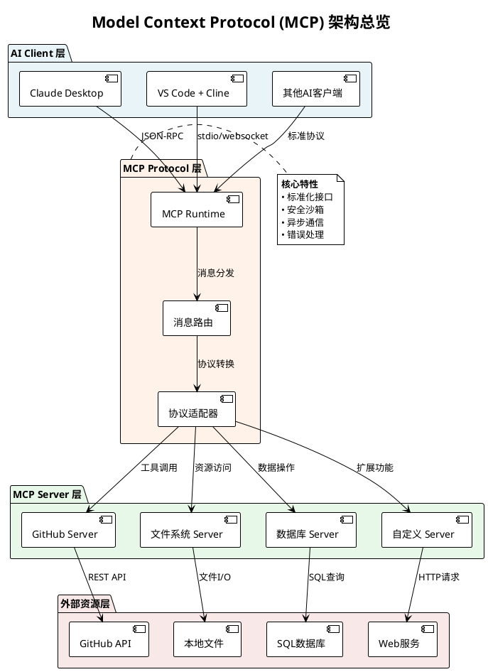

### 1.3 MCP核心优势

- **🔒 安全性**: 沙箱环境，权限控制
- **🔌 标准化**: 统一的接口规范
- **🚀 可扩展**: 插件化架构
- **⚡ 高效性**: 异步通信机制
- **🛠️ 易用性**: 简化的开发模式

## 2. 架构设计

### 2.1 MCP通信架构

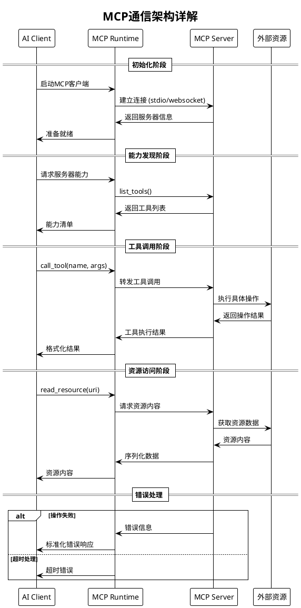

### 2.2 MCP协议栈

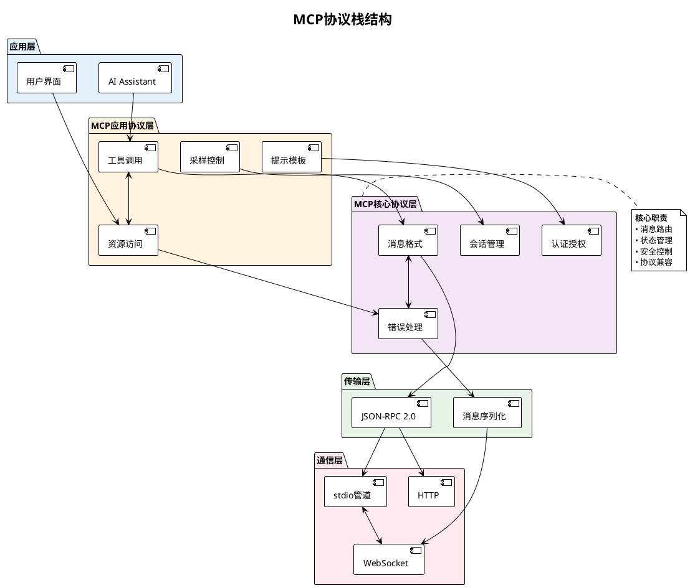

## 3. 核心概念

### 3.1 MCP实体关系图

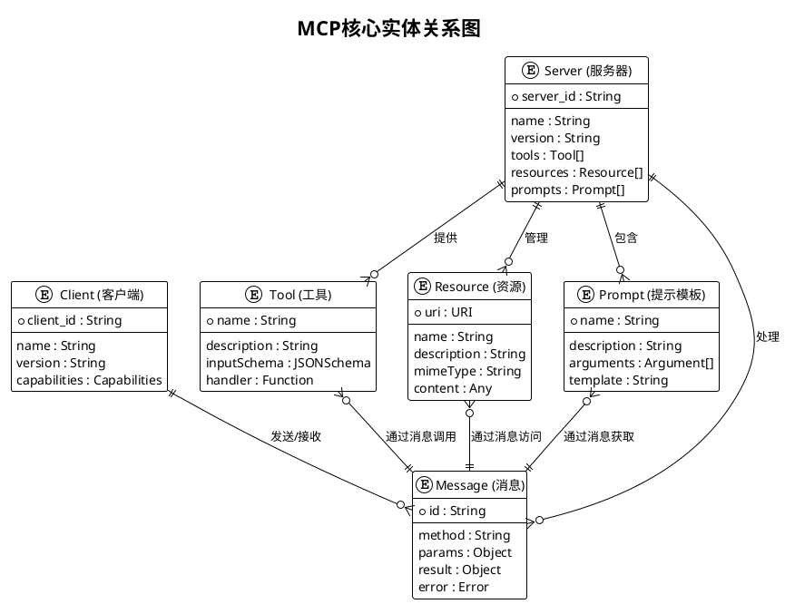

### 3.2 MCP状态机

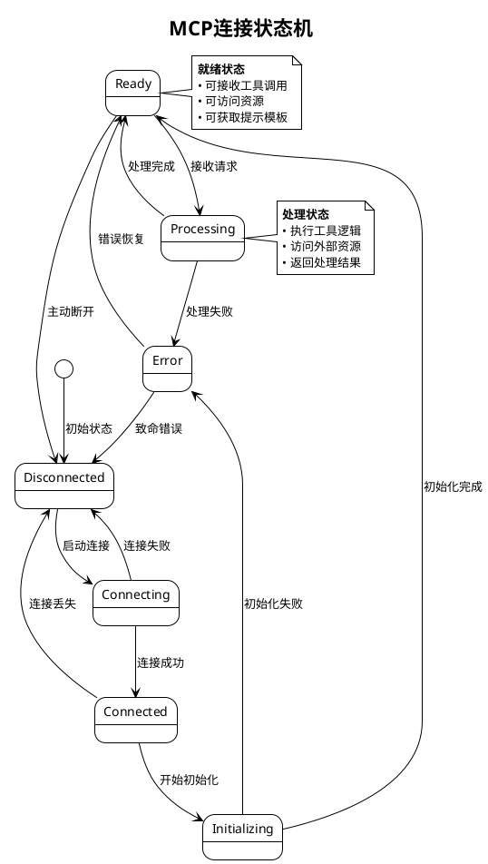

## 4. 实现原理

### 4.1 MCP消息流程

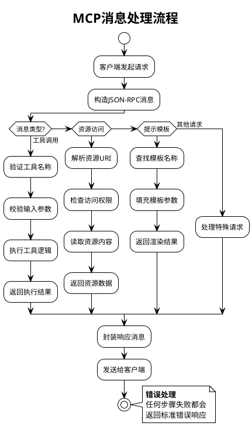

### 4.2 MCP安全模型

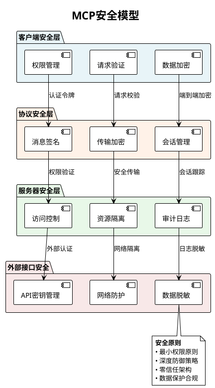

## 5. 开发实战

### 5.1 MCP Server开发流程

```plantuml
@startuml MCP_Development_Flow
!theme plain
title MCP Server开发流程

start

:定义服务器需求;
note right: 确定要提供的工具和资源

:设计API接口;
:创建项目结构;

partition "开发阶段" {
    :实现MCP协议层;
    :开发工具处理器;
    :实现资源访问器;
    :添加错误处理;
}

partition "测试阶段" {
    :单元测试;
    :集成测试; 
    :性能测试;
    :安全测试;
}

:打包和发布;
:部署配置;
:文档编写;

stop

note bottom
  <b>最佳实践</b>
  • 遵循MCP标准
  • 完善的错误处理
  • 详细的日志记录
  • 安全的权限控制
end note

@enduml
```

### 5.2 典型MCP Server代码结构

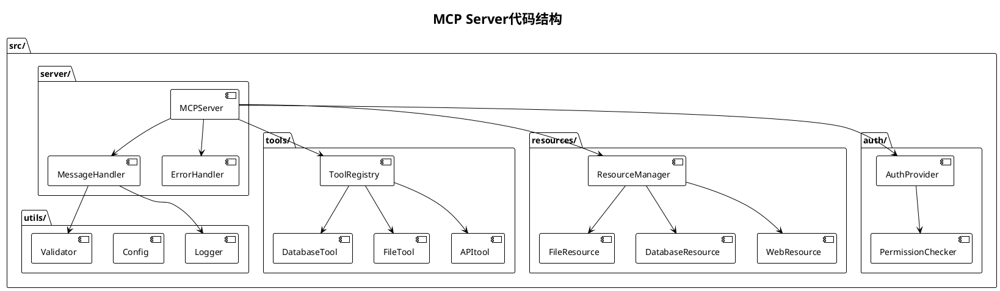

## 6. 最佳实践

### 6.1 MCP部署架构

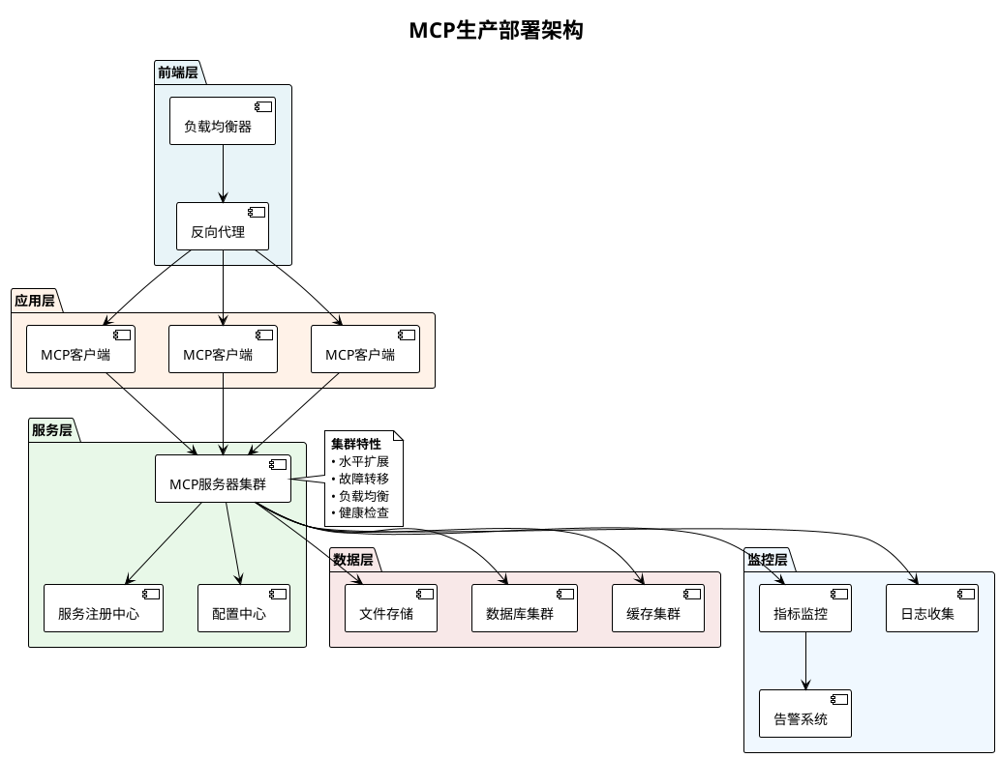

### 6.2 MCP性能优化策略

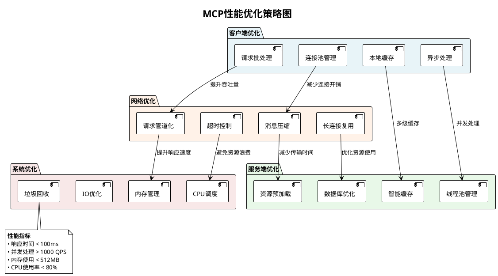

## 7. 故障排查

### 7.1 MCP故障诊断流程

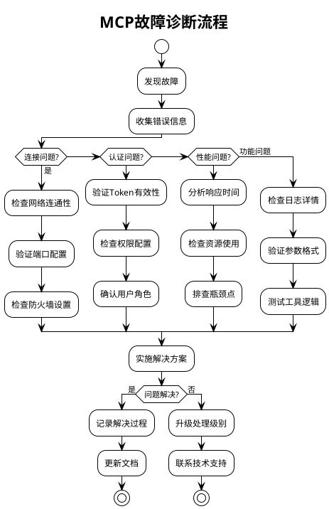

### 7.2 常见问题分类

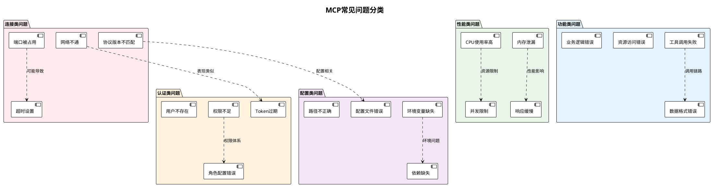

## 8. 案例分析

### 8.1 民航空管系统MCP集成案例

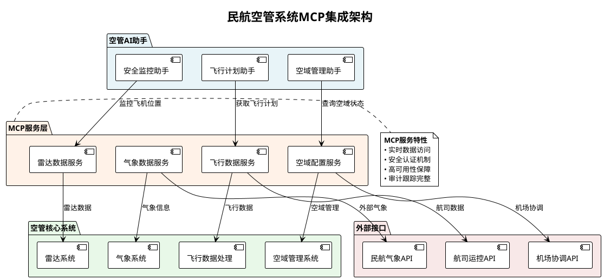

## 📊 培训效果评估

### 学习路径建议

1. **基础阶段** (1-2周)
   - 理解MCP概念和架构
   - 熟悉JSON-RPC协议
   - 掌握基本配置方法

2. **实践阶段** (2-3周)  
   - 部署现有MCP服务器
   - 开发简单的自定义工具
   - 集成到现有工作流程

3. **高级阶段** (3-4周)
   - 开发复杂MCP服务器
   - 性能优化和故障排查
   - 安全配置和合规要求

4. **专家阶段** (持续学习)
   - 架构设计和最佳实践
   - 团队培训和知识分享
   - 社区贡献和标准制定

### 实战练习项目

1. **文件管理MCP服务器**
2. **数据库查询MCP工具**
3. **API集成MCP代理**
4. **日志分析MCP助手**

---

*培训文档版本*: v1.0  
*适用对象*: 技术团队、开发工程师、系统架构师  
*培训时长*: 8-12周 (根据基础调整)  
*更新周期*: 每月更新一次
