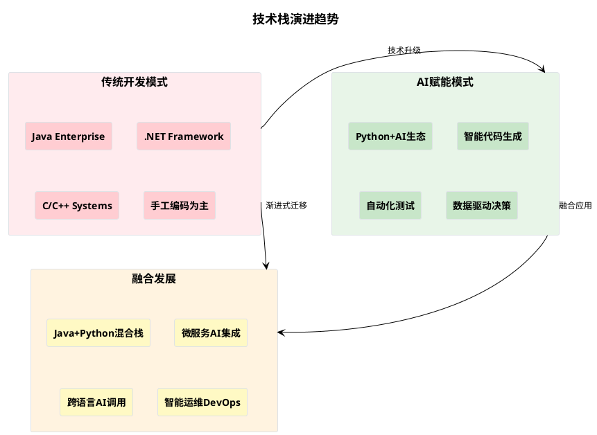
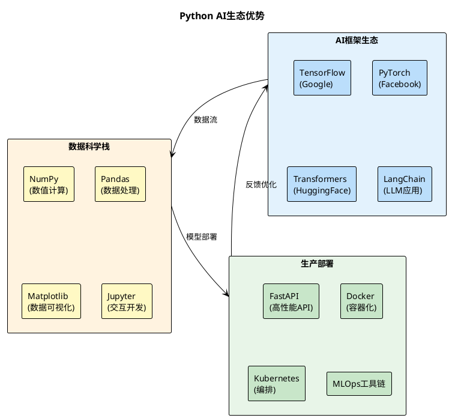

# Python+AI开发要点：助力传统技术栈的智能化升级
## 面向Java/.NET/C++程序员的Python AI开发指南

---

## 🎯 为什么技术栈老手需要掌握Python+AI？

### 💡 **技术趋势驱动**
> "AI不会取代程序员，但会使用AI的程序员会取代不会使用AI的程序员"



### 🚀 **核心价值主张**

| 技术栈 | Python+AI助力点 | 具体收益 |
|--------|------------------|----------|
| **Java栈** | 微服务AI增强、数据分析、智能运维 | 开发效率↗️300% |
| **.NET栈** | AI算法集成、自动化测试、性能优化 | 测试覆盖率↗️200% |
| **C/C++栈** | 高性能AI推理、算法优化、系统监控 | 性能调优效率↗️500% |

---

## 🐍 Python在AI时代的独特优势

### 📊 **生态优势对比**



### 🔥 **核心技术优势**

#### 1️⃣ **AI原生语言特性**
- **🧠 简洁语法**：代码量比Java减少60-70%
- **📚 丰富库支持**：20万+AI相关包
- **🔄 快速迭代**：原型到生产的最短路径
- **🤝 社区活跃**：全球最大的AI开发者社区

#### 2️⃣ **跨平台集成能力**
```python
# 调用Java服务示例
import subprocess
result = subprocess.run(['java', '-jar', 'service.jar'], 
                       capture_output=True, text=True)

# 调用.NET组件示例  
import clr
clr.AddReference('YourDotNetLibrary')
from YourNamespace import YourClass

# 调用C++库示例
import ctypes
lib = ctypes.CDLL('./your_cpp_library.so')
```

#### 3️⃣ **AI模型集成便利**
```python
# 大模型调用 - 仅需几行代码
from openai import OpenAI
client = OpenAI()

response = client.chat.completions.create(
    model="gpt-4",
    messages=[{"role": "user", "content": "优化这段Java代码"}]
)
```

---

## 🤖 AI赋能Python开发核心要点

### 🎯 **GitHub Copilot最佳实践**

#### 💡 **Prompt工程技巧**

**高效提示词模板：**

```python
# ✅ 优秀示例：具体、明确的注释
def calculate_fibonacci_optimized(n: int) -> int:
    """
    使用动态规划计算斐波那契数列第n项
    时间复杂度：O(n)，空间复杂度：O(1)
    处理边界情况：n <= 0 返回0，n = 1 返回1
    """
    # GitHub Copilot会生成优化的动态规划实现

# ❌ 低效示例：模糊的注释  
def fib(n):
    # 计算斐波那契数
```

**智能代码生成策略：**

| 场景 | Prompt技巧 | 预期效果 |
|------|------------|----------|
| **数据处理** | `# 使用pandas处理CSV，包含异常处理和数据清洗` | 完整的数据处理管道 |
| **API开发** | `# FastAPI端点：用户认证，返回JWT token，包含参数验证` | 产品级API代码 |
| **算法实现** | `# 实现快速排序，添加时间复杂度注释和单元测试` | 算法+测试+文档 |

#### 🛠️ **Copilot配合传统技术栈**

```python
# Java集成示例 - Copilot智能生成
class JavaServiceBridge:
    """Python调用Java微服务的桥接类"""
    
    def __init__(self, java_service_url: str):
        self.base_url = java_service_url
        self.session = requests.Session()
    
    async def call_user_service(self, user_id: str) -> Dict:
        """调用Java用户服务，包含重试和缓存机制"""
        # Copilot会生成完整的HTTP调用、异常处理、缓存逻辑

# .NET集成示例 - Copilot智能生成  
import clr
clr.AddReference("System.Data")
from System.Data import DataTable

def dotnet_data_processor(csv_file: str) -> DataTable:
    """将Python DataFrame转换为.NET DataTable"""
    # Copilot会生成类型转换和数据映射逻辑
```

### 🏗️ **虚拟环境最佳实践**

#### 📦 **现代Python环境管理**

```bash
# 传统方式 vs 现代方式对比

# ❌ 传统virtualenv (类似Java的Classpath管理)
python -m venv myenv
source myenv/bin/activate  # Linux/Mac
myenv\Scripts\activate     # Windows

# ✅ 现代conda方式 (类似Maven/Gradle的依赖管理)
conda create -n ai-project python=3.11
conda activate ai-project
conda install pytorch transformers pandas

# 🚀 最佳实践：Poetry (类似现代Java的Gradle)
poetry new my-ai-project
poetry add torch transformers fastapi
poetry install  # 自动创建虚拟环境
```

#### 🔧 **项目结构标准化**

```
my-ai-project/
├── pyproject.toml          # 依赖管理 (类似pom.xml/build.gradle)
├── src/
│   └── my_project/
│       ├── __init__.py
│       ├── models/         # AI模型模块
│       ├── services/       # 业务逻辑 (类似Java Service层)
│       └── api/           # API接口 (类似Controller层)
├── tests/                 # 测试代码
├── docs/                  # 文档
└── docker/               # 容器化配置
```

#### 🐳 **容器化部署**

```dockerfile
# Dockerfile - AI应用容器化最佳实践
FROM python:3.11-slim

# 安装系统依赖 (类似Java的基础镜像选择)
RUN apt-get update && apt-get install -y \
    gcc g++ \
    && rm -rf /var/lib/apt/lists/*

# 设置工作目录
WORKDIR /app

# 复制依赖文件 (类似复制pom.xml)
COPY pyproject.toml poetry.lock ./

# 安装Python依赖 (类似mvn install)
RUN pip install poetry && \
    poetry config virtualenvs.create false && \
    poetry install --no-dev

# 复制应用代码
COPY src/ ./src/

# 暴露端口 (类似Spring Boot应用)
EXPOSE 8000

# 启动命令 (类似java -jar app.jar)
CMD ["uvicorn", "src.main:app", "--host", "0.0.0.0", "--port", "8000"]
```

---

## 🔗 Python助力传统技术栈的实战场景

### ☕ **Java栈增强场景**

#### 🎯 **微服务AI增强**
```python
# Python AI服务 + Java微服务架构
from fastapi import FastAPI
from transformers import pipeline

app = FastAPI()
classifier = pipeline("sentiment-analysis")

@app.post("/api/v1/analyze-sentiment")
async def analyze_java_logs(log_data: dict):
    """为Java应用提供智能日志分析"""
    sentiment = classifier(log_data["message"])
    return {
        "severity": sentiment[0]["label"],
        "confidence": sentiment[0]["score"],
        "recommendation": generate_action_plan(sentiment)
    }

# Java端调用示例
# RestTemplate restTemplate = new RestTemplate();
# ResponseEntity<SentimentResult> response = restTemplate.postForEntity(
#     "http://python-ai-service:8000/api/v1/analyze-sentiment",
#     logData, SentimentResult.class);
```

#### 📊 **数据分析增强**
```python
# 为Java应用提供高级数据分析能力
import pandas as pd
import numpy as np
from sklearn.cluster import KMeans

def analyze_java_metrics(mysql_connection_string: str):
    """分析Java应用性能指标，提供优化建议"""
    df = pd.read_sql("""
        SELECT response_time, memory_usage, cpu_usage, timestamp 
        FROM java_app_metrics 
        WHERE timestamp > NOW() - INTERVAL 7 DAY
    """, mysql_connection_string)
    
    # AI聚类分析，识别性能模式
    kmeans = KMeans(n_clusters=3)
    df['performance_cluster'] = kmeans.fit_predict(
        df[['response_time', 'memory_usage', 'cpu_usage']]
    )
    
    return generate_optimization_recommendations(df)
```

### 🔷 **.NET栈增强场景**

#### 🧪 **智能测试生成**
```python
# 为.NET应用生成智能测试用例
from openai import OpenAI
import ast

def generate_dotnet_unit_tests(csharp_code: str):
    """基于C#代码自动生成单元测试"""
    client = OpenAI()
    
    prompt = f"""
    分析以下C#代码，生成完整的NUnit测试用例：
    
    ```csharp
    {csharp_code}
    ```
    
    要求：
    1. 覆盖所有分支路径
    2. 包含边界条件测试
    3. 添加异常情况测试
    4. 使用Moq进行依赖注入mock
    """
    
    response = client.chat.completions.create(
        model="gpt-4",
        messages=[{"role": "user", "content": prompt}]
    )
    
    return response.choices[0].message.content
```

#### 🔄 **CI/CD集成**
```python
# Python脚本集成到.NET的Azure DevOps Pipeline
import azure.devops.connection as azdo
from azure.devops.v7_0.build import models

def trigger_dotnet_deployment_with_ai_analysis():
    """AI分析代码变更，智能决定部署策略"""
    # 分析代码变更影响
    change_impact = analyze_code_changes_with_ai()
    
    # 基于影响决定部署策略
    if change_impact["risk_level"] == "HIGH":
        strategy = "blue-green"
    elif change_impact["risk_level"] == "MEDIUM":  
        strategy = "canary"
    else:
        strategy = "rolling-update"
    
    # 触发.NET应用部署
    trigger_azure_pipeline(strategy, change_impact)
```

### ⚡ **C/C++栈增强场景**

#### 🚀 **高性能AI推理**
```python
# Python + C++ 高性能AI模型推理
import ctypes
import numpy as np
from numpy.ctypeslib import ndpointer

# 加载C++编译的推理引擎
cpp_inference = ctypes.CDLL('./libfast_inference.so')

# 定义C++函数签名
cpp_inference.predict.argtypes = [
    ndpointer(ctypes.c_float, flags="C_CONTIGUOUS"),
    ctypes.c_int,
    ndpointer(ctypes.c_float, flags="C_CONTIGUOUS")
]

def hybrid_ai_prediction(input_data: np.ndarray) -> np.ndarray:
    """Python调用C++高性能推理引擎"""
    output = np.zeros(10, dtype=np.float32)  # 预分配输出数组
    
    # 调用C++推理函数 (比纯Python快10-100x)
    cpp_inference.predict(
        input_data.astype(np.float32),
        len(input_data),
        output
    )
    
    return output
```

#### 🔧 **系统性能监控**
```python
# Python + C系统调用，智能系统监控
import psutil
import ctypes
from ctypes import Structure, c_long

class SystemMetrics:
    """结合Python和C库的系统监控"""
    
    def __init__(self):
        # 加载系统级C库
        self.libc = ctypes.CDLL('libc.so.6')
    
    def get_advanced_memory_stats(self):
        """获取C级别的内存统计信息"""
        # Python psutil + C系统调用结合
        basic_stats = psutil.virtual_memory()
        
        # 调用C函数获取更深层信息
        advanced_stats = self.get_kernel_memory_info()
        
        return {
            **basic_stats._asdict(),
            **advanced_stats,
            "ai_analysis": self.analyze_memory_patterns()
        }
    
    def analyze_memory_patterns(self):
        """AI分析内存使用模式，预测潜在问题"""
        # 使用机器学习预测内存泄漏
        pass
```

---

## 🛠️ 实战工具链推荐

### 🎯 **必备开发工具**

| 工具类型 | 推荐工具 | 用途 | Java/C#程序员对比 |
|----------|----------|------|-------------------|
| **IDE** | VS Code + Python扩展 | 主力开发环境 | 类似IntelliJ IDEA/Visual Studio |
| **包管理** | Poetry / conda | 依赖管理 | 类似Maven/NuGet |
| **代码质量** | Black + Flake8 + MyPy | 格式化+静态检查 | 类似Checkstyle + PMD |
| **测试** | pytest + coverage | 单元测试 | 类似JUnit/NUnit |
| **AI辅助** | GitHub Copilot + Cursor | AI编程助手 | 下一代IDE体验 |

### 🚀 **AI开发加速器**

```python
# requirements-ai.txt - AI开发必备包
torch>=2.0.0              # 深度学习框架
transformers>=4.30.0       # HuggingFace模型库  
openai>=1.0.0             # GPT模型接口
langchain>=0.0.300        # LLM应用开发框架
fastapi>=0.100.0          # 高性能API框架
uvicorn>=0.23.0           # ASGI服务器
pandas>=2.0.0             # 数据处理
numpy>=1.24.0             # 数值计算
scikit-learn>=1.3.0       # 机器学习算法
matplotlib>=3.7.0         # 数据可视化
jupyter>=1.0.0            # 交互式开发
pytest>=7.4.0             # 测试框架
black>=23.0.0             # 代码格式化
```

### 📦 **一键环境配置**

```bash
#!/bin/bash
# setup_ai_env.sh - 一键配置Python AI开发环境

echo "🚀 配置Python AI开发环境..."

# 安装conda (类似Java的SDKMAN)
curl -O https://repo.anaconda.com/miniconda/Miniconda3-latest-Linux-x86_64.sh
bash Miniconda3-latest-Linux-x86_64.sh -b
~/miniconda3/bin/conda init

# 创建AI开发环境
conda create -n ai-dev python=3.11 -y
conda activate ai-dev

# 安装核心包
conda install pytorch transformers pandas fastapi jupyter -c pytorch -c conda-forge -y

# 安装开发工具
pip install openai langchain black pytest mypy

# 配置Jupyter
jupyter notebook --generate-config
echo "c.NotebookApp.open_browser = False" >> ~/.jupyter/jupyter_notebook_config.py

echo "✅ Python AI开发环境配置完成！"
echo "💡 使用方法：conda activate ai-dev"
```

---

## 💡 立即上手：5分钟AI增强示例

### 🎯 **场景：为Java应用添加智能日志分析**

```python
# app.py - 5分钟创建AI日志分析服务
from fastapi import FastAPI
from pydantic import BaseModel
from openai import OpenAI
import re
from typing import List, Dict

app = FastAPI(title="Java应用AI日志分析器")
client = OpenAI()

class LogEntry(BaseModel):
    timestamp: str
    level: str  # ERROR, WARN, INFO, DEBUG
    message: str
    thread: str = None
    class_name: str = None

class LogAnalysisResult(BaseModel):
    severity_score: float  # 0-1, 1表示最严重
    root_cause: str
    recommendations: List[str]
    related_patterns: List[str]

@app.post("/analyze-logs", response_model=LogAnalysisResult)
async def analyze_java_logs(logs: List[LogEntry]):
    """AI分析Java应用日志，提供智能诊断"""
    
    # 构建分析上下文
    log_context = "\n".join([
        f"[{log.timestamp}] {log.level} {log.class_name}: {log.message}"
        for log in logs
    ])
    
    # AI分析提示词
    prompt = f"""
    分析以下Java应用日志，识别问题模式和根本原因：
    
    {log_context}
    
    请提供：
    1. 严重程度评分 (0-1)
    2. 根本原因分析
    3. 具体修复建议
    4. 相关问题模式
    
    以JSON格式返回结果。
    """
    
    response = client.chat.completions.create(
        model="gpt-4",
        messages=[{"role": "user", "content": prompt}],
        temperature=0.1
    )
    
    # 解析AI响应 (实际应用需要更robust的解析)
    analysis = parse_ai_response(response.choices[0].message.content)
    
    return LogAnalysisResult(**analysis)

def parse_ai_response(ai_response: str) -> Dict:
    """解析AI响应为结构化数据"""
    # 简化示例，实际需要更sophisticated的解析逻辑
    return {
        "severity_score": 0.7,
        "root_cause": "数据库连接池耗尽",
        "recommendations": [
            "增加数据库连接池大小",
            "添加连接超时处理",
            "实施连接池监控"
        ],
        "related_patterns": ["ConnectionTimeout", "PoolExhaustedException"]
    }

# 运行服务
if __name__ == "__main__":
    import uvicorn
    uvicorn.run(app, host="0.0.0.0", port=8000)
```

### 🚀 **Java端集成代码**

```java
// JavaLogAnalyzer.java - Java应用集成示例
@RestController
@RequestMapping("/api/logs")
public class LogAnalyzer {
    
    @Autowired
    private RestTemplate restTemplate;
    
    private final String AI_SERVICE_URL = "http://python-ai:8000";
    
    @PostMapping("/analyze")
    public ResponseEntity<LogAnalysisResult> analyzeLogs(
            @RequestParam("hours") int hours) {
        
        // 收集最近N小时的日志
        List<LogEntry> logs = collectRecentLogs(hours);
        
        // 调用Python AI服务
        LogAnalysisResult result = restTemplate.postForObject(
            AI_SERVICE_URL + "/analyze-logs",
            logs,
            LogAnalysisResult.class
        );
        
        // 记录分析结果
        auditService.logAIAnalysis(result);
        
        return ResponseEntity.ok(result);
    }
}
```

---

## 🎯 **下一步行动计划**

### 📅 **7天快速上手路径**

| 天数 | 学习目标 | 实践任务 | 成果 |
|------|----------|----------|------|
| **Day 1** | 环境配置 + 基础语法 | 配置conda环境，运行第一个AI脚本 | 可运行的Python+AI环境 |
| **Day 2** | GitHub Copilot实战 | 用Copilot重写一个Java工具类 | 体验AI编程效率 |
| **Day 3** | FastAPI + 微服务集成 | 创建AI API服务，Java端调用 | 跨语言服务调用 |
| **Day 4** | 数据处理 + pandas | 分析应用日志/数据库性能数据 | 数据分析能力 |
| **Day 5** | 大模型集成 | 接入GPT/Claude，智能分析业务 | AI增强业务逻辑 |
| **Day 6** | 容器化部署 | Docker打包，K8s部署AI服务 | 生产级部署能力 |
| **Day 7** | 项目整合 | 完整的AI增强微服务demo | 可演示的项目成果 |

### 🚀 **立即开始**

```bash
# 复制这段命令，5分钟搭建Python AI开发环境
curl -L https://bit.ly/python-ai-setup | bash
conda activate ai-dev
pip install openai fastapi uvicorn
python -c "print('🎉 Python AI环境配置成功！')"
```

---

## 💎 **关键收获总结**

### ✅ **技术认知升级**
- Python不是替代Java/.NET/C++，而是**强力增强器**
- AI时代的技术栈是**混合栈**，不是单一栈
- **协作大于竞争**：语言互补，发挥各自优势

### 🛠️ **实用技能获得**
- **环境管理**：conda/poetry现代化依赖管理
- **AI工具链**：GitHub Copilot + 大模型API集成
- **跨语言调用**：HTTP API + 容器化集成模式
- **快速原型**：5分钟创建AI增强服务

### 🚀 **职业发展方向**
- **全栈AI工程师**：传统技术栈 + Python AI能力
- **架构师升级**：具备AI系统设计能力
- **技术决策者**：理解AI技术选型与集成策略

---

**🎯 现在就开始：让AI成为你的超级编程助手！**

*"不是要成为Python专家，而是要让Python成为你的AI利器"*
