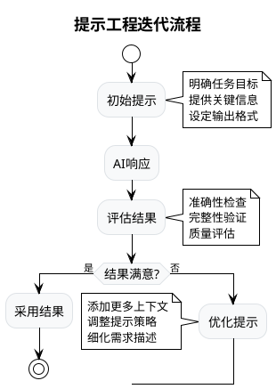
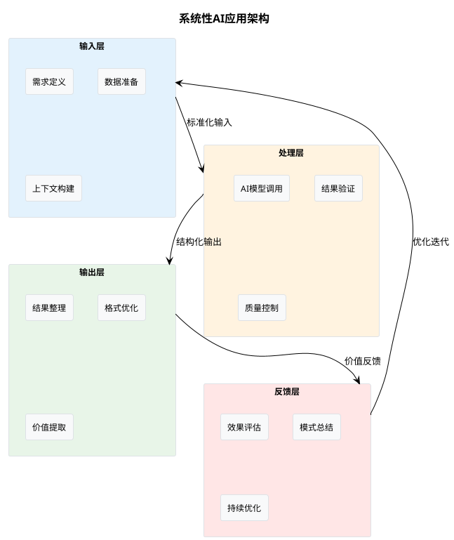
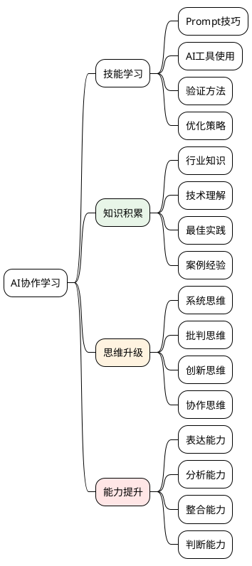
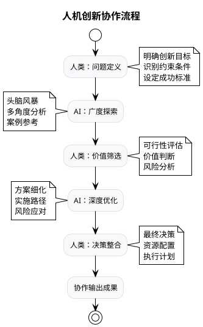

# 大模型时代用户思维模式培养指南

## 从传统思维到AI协作思维的转变

---

## 🎯 核心认知转变

### 💡 **思维模式转变矩阵**

| 维度               | 传统思维模式     | 大模型时代思维模式 | 转变要点       |
| ------------------ | ---------------- | ------------------ | -------------- |
| **问题解决** | 独立思考→执行   | 人机协作→迭代     | 学会与AI对话   |
| **知识获取** | 记忆→查询→应用 | 提问→引导→验证   | 从记忆转向引导 |
| **工作流程** | 线性规划执行     | 敏捷迭代优化       | 拥抱不确定性   |
| **技能发展** | 专业深度钻研     | T型复合能力        | 广度+深度并重  |
| **创新方式** | 个人灵感驱动     | 人机协同创造       | 激发AI创造力   |

---

## 🧠 五大核心思维模式

### 1️⃣ **提示工程师思维（Prompt Engineering Mindset）**

> **核心理念：** 学会与AI"对话"，掌握人机协作的艺术

#### 🎯 **关键能力要素**

**精准表达能力：**

```markdown
❌ 低效提示：
"帮我写个函数"

✅ 高效提示：
"请用Python写一个函数，实现以下功能：
- 函数名：calculate_roi
- 输入参数：初始投资(float)，期末价值(float)，投资期间(int年)
- 返回：年化投资收益率(百分比)
- 要求：包含输入验证、异常处理、详细注释
- 输出格式：保留2位小数的百分比"
```

**迭代优化思维：**



#### 💪 **实用技巧体系**

**CLEAR提示框架：**

- **C**ontext (上下文)：提供背景信息
- **L**ength (长度)：明确期望的回答长度
- **E**xample (示例)：给出具体例子
- **A**udience (受众)：说明目标读者
- **R**ole (角色)：为AI设定专业角色

**示例应用：**

```
Context: 我正在为企业高管准备一份关于AI转型的汇报
Length: 请控制在500字以内
Example: 类似于麦肯锡咨询报告的风格
Audience: 面向非技术背景的CEO和董事会成员
Role: 请以数字化转型专家的身份回答

请分析传统制造业引入AI的三大核心价值点...
```

### 2️⃣ **系统性思维（Systems Thinking）**

> **核心理念：** 将大模型视为智能系统的一部分，而非单独的工具

#### 🏗️ **架构化应用思维**

**AI工作流设计：**



#### 🔄 **多模型协作思维**

**模型组合策略：**

| 任务类型           | 主力模型         | 辅助模型   | 协作模式       |
| ------------------ | ---------------- | ---------- | -------------- |
| **复杂分析** | GPT-4            | Claude-3   | 结果交叉验证   |
| **创意生成** | GPT-4            | Midjourney | 文本+视觉结合  |
| **代码开发** | GitHub Copilot   | GPT-4      | 生成+优化+解释 |
| **数据处理** | Code Interpreter | 专业工具   | AI+传统工具链  |

### 3️⃣ **批判性思维（Critical Thinking）**

> **核心理念：** 保持理性思考，不盲从AI输出

#### 🔍 **AI输出验证框架**

**FACT检验法：**

- **F**actual (事实性)：信息是否准确？
- **A**ccuracy (精确性)：数据是否精确？
- **C**onsistency (一致性)：逻辑是否一致？
- **T**imeliness (时效性)：信息是否最新？

**验证清单：**

```markdown
✅ 事实核查清单：
□ 关键数据是否可以独立验证？
□ 引用的案例/研究是否真实存在？
□ 统计数字是否有可靠来源？
□ 技术描述是否符合实际情况？

✅ 逻辑验证清单：
□ 推理过程是否合理？
□ 因果关系是否成立？
□ 结论是否与证据匹配？
□ 是否存在明显的逻辑漏洞？

✅ 偏见检测清单：
□ 是否存在确认偏见？
□ 样本是否具有代表性？
□ 是否考虑了反面观点？
□ 结论是否过于绝对？
```

#### ⚠️ **AI局限性认知**

**常见AI陷阱与应对：**

| AI局限性             | 具体表现                 | 应对策略         |
| -------------------- | ------------------------ | ---------------- |
| **知识截止**   | 无法获取最新信息         | 结合实时搜索验证 |
| **幻觉现象**   | 生成虚假但看似合理的内容 | 交叉验证关键信息 |
| **上下文遗忘** | 长对话中丢失前文信息     | 定期总结和确认   |
| **偏见传承**   | 反映训练数据中的偏见     | 多角度思考验证   |

### 4️⃣ **学习型思维（Learning Mindset）**

> **核心理念：** 将与AI的每次交互视为学习机会

#### 📚 **持续学习策略**

**知识图谱构建：**



#### 🔄 **反思改进循环**

**PDCA学习法：**

1. **Plan (计划)**：设定AI协作学习目标
2. **Do (执行)**：实践不同的提示策略
3. **Check (检查)**：评估AI协作效果
4. **Act (改进)**：总结经验，优化方法

**学习记录模板：**

```markdown
## AI协作学习记录

**日期：** 2024-XX-XX
**任务：** [具体任务描述]
**使用模型：** [GPT-4/Claude等]

**提示策略：**
- 初始提示：[记录]
- 优化过程：[记录迭代过程]
- 最终提示：[最有效的版本]

**结果评估：**
- 准确性：⭐⭐⭐⭐⭐
- 实用性：⭐⭐⭐⭐⭐
- 效率提升：[具体数据]

**经验总结：**
- 成功要素：[关键成功因素]
- 改进建议：[下次优化方向]
- 通用模式：[可复用的模式]
```

### 5️⃣ **创新协作思维（Innovation Collaboration）**

> **核心理念：** 将AI视为创新伙伴，而非替代工具

#### 🎨 **人机创新协作模式**

**创新流程设计：**



#### 💡 **创新思维技巧**

**SCAMPER+AI方法：**

| 思维技巧                    | 传统应用 | AI增强应用     | 实例                                 |
| --------------------------- | -------- | -------------- | ------------------------------------ |
| **S**ubstitute        | 替代思考 | AI生成替代方案 | "用AI列出传统银行服务的10种替代方案" |
| **C**ombine           | 组合创新 | AI跨域组合     | "结合区块链和AI，创新金融服务模式"   |
| **A**dapt             | 适应改造 | AI案例迁移     | "将游戏化机制应用到企业培训"         |
| **M**odify            | 修改优化 | AI参数调优     | "优化现有产品的用户体验流程"         |
| **P**ut to other uses | 新用途   | AI用途扩展     | "探索现有技术的新应用场景"           |
| **E**liminate         | 简化删除 | AI精简建议     | "简化复杂业务流程"                   |
| **R**everse           | 反向思考 | AI逆向分析     | "从失败案例中发现成功要素"           |

---

## 🚀 思维模式实践指南

### 📋 **阶段化培养路径**

#### 🌱 **初级阶段（1-2个月）**

**核心目标：** 建立基础AI协作意识

**关键任务：**

- [ ] 学习基础提示技巧
- [ ] 完成10个不同领域的AI协作任务
- [ ] 建立AI输出验证习惯
- [ ] 记录3个最佳实践案例

**评估标准：**

- 能够写出结构化的提示词
- 具备基本的AI输出验证能力
- 开始形成人机协作的工作习惯

#### 🌿 **进阶阶段（3-6个月）**

**核心目标：** 形成系统性AI应用能力

**关键任务：**

- [ ] 设计3个复杂的AI工作流
- [ ] 掌握多模型协作技巧
- [ ] 建立个人AI工具箱
- [ ] 完成1个完整项目的AI增强

**评估标准：**

- 能够设计多步骤的AI协作流程
- 具备模型选择和组合应用能力
- 能够独立解决复杂问题

#### 🌳 **高级阶段（6个月+）**

**核心目标：** 成为AI协作专家

**关键任务：**

- [ ] 创建原创的AI应用方法论
- [ ] 指导他人进行AI协作
- [ ] 参与AI工具和流程优化
- [ ] 建立个人AI协作知识体系

**评估标准：**

- 具备AI协作的战略思维
- 能够创新AI应用场景和方法
- 成为团队的AI协作引领者

### 🛠️ **实践工具箱**

#### 📝 **提示词模板库**

**分析类模板：**

```
请以[专业角色]的身份，从[分析维度]分析[具体问题]。

背景信息：[提供相关背景]
分析要求：
1. [具体要求1]
2. [具体要求2]  
3. [具体要求3]

输出格式：
- 核心发现：[3-5个要点]
- 深度分析：[详细分析]
- 行动建议：[具体建议]
```

**创意类模板：**

```
我需要为[目标场景]设计[创意内容]。

目标受众：[目标用户画像]
核心需求：[用户核心需求]
约束条件：[限制条件]

请提供：
1. 3个不同风格的创意方向
2. 每个方向的具体实施建议
3. 预期效果和风险评估
```

#### 📊 **评估工具**

**AI协作效果评估表：**

| 评估维度           | 评估标准         | 评分(1-5) | 改进建议 |
| ------------------ | ---------------- | --------- | -------- |
| **效率提升** | 完成时间缩短程度 | ___       |          |
| **质量改善** | 输出质量提升度   | ___       |          |
| **创新程度** | 创新思路丰富度   | ___       |          |
| **准确性**   | 结果准确性水平   | ___       |          |
| **实用性**   | 实际应用可行性   | ___       |          |

#### 🎯 **常用场景清单**

**工作场景应用：**

- [ ] 会议纪要整理和行动项提取
- [ ] 报告撰写和内容优化
- [ ] 数据分析和洞察发现
- [ ] 项目方案设计和评估
- [ ] 客户沟通内容准备
- [ ] 培训材料开发和优化

**学习场景应用：**

- [ ] 知识点解释和案例分析
- [ ] 练习题生成和解答
- [ ] 学习计划制定和调整
- [ ] 复杂概念的类比解释
- [ ] 多角度问题分析
- [ ] 知识体系构建

---

## 💎 核心价值与成功要素

### 🎯 **价值主张**

**个人价值提升：**

- 📈 **工作效率**：提升200-500%的工作效率
- 🧠 **思维能力**：增强分析和创新思维
- 🚀 **竞争优势**：掌握未来工作核心技能
- 💡 **创新能力**：释放创造力和想象力

**组织价值创造：**

- ⚡ **决策速度**：加快决策和执行速度
- 🎯 **质量提升**：提高工作质量和准确性
- 💰 **成本节约**：降低人力和时间成本
- 🔄 **流程优化**：优化工作流程和方法

### 🏆 **成功关键因素**

**心态建设（40%）：**

- 开放心态：拥抱新技术和新方法
- 学习心态：持续学习和改进
- 协作心态：视AI为伙伴而非工具
- 批判心态：保持理性和质疑精神

**技能掌握（35%）：**

- 提示工程技能
- AI工具使用技能
- 结果验证技能
- 流程设计技能

**实践经验（25%）：**

- 多场景实践经验
- 失败经验和教训
- 成功模式和方法
- 持续优化能力

---

## 🔮 未来展望

### 📈 **思维模式进化趋势**

**短期发展（1-2年）：**

- AI协作成为标准工作技能
- 提示工程师成为热门职业
- 人机协作模式日趋成熟
- AI素养成为基础技能要求

**中期发展（3-5年）：**

- AI助手个性化定制普及
- 专业领域AI工具深度集成
- 跨模态AI协作成为常态
- AI伦理和安全意识增强

**长期愿景（5年+）：**

- 人机协作成为思维本能
- AI增强人类成为新常态
- 创新协作模式持续涌现
- 人类独特价值更加凸显

### 🎯 **个人发展建议**

**立即行动：**

1. **开始实践**：选择一个具体场景开始AI协作
2. **建立习惯**：每天至少进行一次AI协作
3. **记录总结**：建立个人AI协作经验库
4. **分享交流**：与他人交流AI协作经验

**持续发展：**

- 关注AI技术发展趋势
- 参与AI协作社区活动
- 不断优化个人工作流程
- 培养他人AI协作能力

---

**🚀 结语：拥抱AI时代，成就更好的自己！**

> *"未来属于那些能够与AI协作的人，而不是被AI替代的人。培养正确的思维模式，是在AI时代保持竞争力的关键。"*
