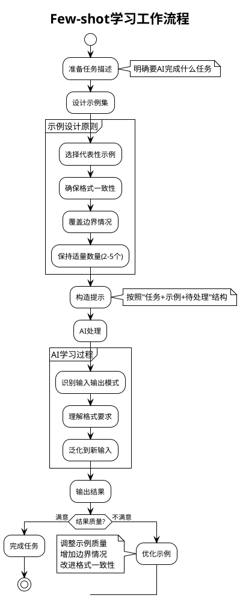
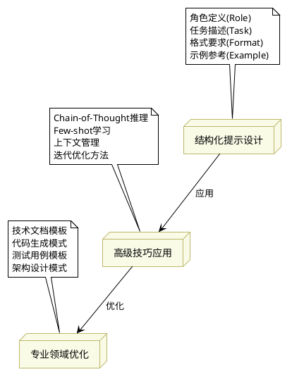

# 提示工程技巧培训文档

---

## 1. 什么是提示工程？

提示工程（Prompt Engineering）是指为AI大模型（如GPT、Claude等）设计高效、可控的输入提示，以获得更优质、更可控的输出结果。它是AI应用开发的核心能力之一。

---

## 2. 提示词工程的核心原则

### 2.1 清晰性原则（Clarity Principle）

**核心要点**：提示词必须清晰、明确、无歧义

#### ✅ 好的示例：
```markdown
请为Python函数编写单元测试，包含以下要求：
1. 测试正常情况
2. 测试边界值 
3. 测试异常情况
4. 使用pytest框架
```

#### ❌ 不好的示例：
```markdown
帮我写点测试
```

### 2.2 具体性原则（Specificity Principle）

**核心要点**：提供具体、详细的要求和约束条件

#### 实践指南：
- **明确输出格式**：JSON、表格、代码块等
- **指定技术栈**：Python 3.9+、React 18、PostgreSQL等
- **定义业务场景**：电商平台、金融系统、教育应用等
- **设置约束条件**：字数限制、性能要求、兼容性等

### 2.3 结构性原则（Structure Principle）

**核心要点**：使用结构化的提示模板，提高AI理解效率

#### 标准结构模板：
```markdown
**角色定义(Role)**：[定义AI要扮演的角色]
**背景信息(Context)**：[提供相关背景]
**任务描述(Task)**：[明确要完成的任务]
**输出格式(Format)**：[指定输出的结构]
**约束条件(Constraints)**：[设定限制条件]
**示例参考(Examples)**：[提供参考示例]
```

### 2.4 渐进性原则（Progressive Principle）

**核心要点**：从简单到复杂，逐步引导AI理解复杂任务

#### 实践方法：
1. **分步骤描述**：将复杂任务拆解为简单步骤
2. **示例递进**：提供由简单到复杂的示例序列
3. **逐步细化**：先给出大纲，再补充细节

### 2.5 一致性原则（Consistency Principle）

**核心要点**：保持提示词内部的格式、风格、术语一致

#### 关键要求：
- **术语统一**：在同一提示中使用相同的专业术语
- **格式一致**：示例之间保持相同的输出格式
- **风格统一**：正式或非正式语调保持一致

### 2.6 可测试性原则（Testability Principle）

**核心要点**：设计的提示词应该能产生可验证、可评估的结果

#### 实现方法：
- **设定评判标准**：准确性、完整性、效率等
- **提供验证方法**：测试用例、检查清单等
- **建立反馈机制**：错误分析、效果评估等

### 2.7 核心原则实战应用

#### 案例：优化前后对比

**❌ 优化前（违反多个原则）**：
```markdown
帮我写个函数
```

**✅ 优化后（遵循核心原则）**：
```markdown
**角色定义**：你是一名Python高级开发工程师
**任务描述**：编写一个用户认证函数，验证用户名和密码
**具体要求**：
1. 函数名：authenticate_user
2. 参数：username (str), password (str)
3. 返回：dict格式，包含success (bool), message (str), user_id (int或None)
4. 验证规则：用户名长度3-20字符，密码至少8位且包含数字和字母

**输出格式**：
- Python代码块
- 包含完整的函数定义
- 添加详细的文档字符串
- 包含类型提示

**示例输出**：
```python
def authenticate_user(username: str, password: str) -> dict:
    """
    验证用户认证信息
    
    Args:
        username: 用户名
        password: 密码
    
    Returns:
        认证结果字典
    """
    # 实现逻辑...
```

**验证标准**：
- 代码符合PEP 8规范
- 包含完整的错误处理
- 文档字符串清晰完整
```

#### 原则应用分析：
1. **清晰性**：明确指出要实现的功能和要求
2. **具体性**：详细说明参数类型、返回格式、验证规则
3. **结构性**：使用标准化模板组织提示内容
4. **渐进性**：从角色定义到具体要求逐步细化
5. **一致性**：术语和格式保持统一
6. **可测试性**：提供了明确的验证标准

---

## 3. 核心方法与结构化设计

### 3.1 结构化提示设计

- **角色定义（Role）**：指定AI扮演的身份
- **任务描述（Task）**：明确要完成的任务
- **格式要求（Format）**：输出的结构和样式
- **示例参考（Example）**：给出标准示例

#### 案例：技术文档自动生成

```markdown
**角色**：你是一名资深技术文档工程师
**任务**：请为以下API生成详细的接口说明文档
**格式**：
- 接口名称
- 输入参数（类型、说明）
- 输出结果（类型、说明）
- 示例代码
**示例**：
接口名称：getUserInfo
输入参数：userId (string) - 用户ID
输出结果：userInfo (object) - 用户信息
示例代码：
GET /api/user/info?userId=123
```

---

### 3.2 高级技巧应用

- **Chain-of-Thought推理**：引导AI分步思考，提升复杂任务的准确率
- **Few-shot学习**：通过提供少量（通常2-5个）高质量示例，让AI理解任务模式并泛化到新情况
- **上下文管理**：合理组织历史对话和背景信息
- **迭代优化方法**：多轮提示、逐步完善

#### 案例：代码生成与优化

```markdown
**任务**：请用Python实现一个快速排序算法，并逐步解释每一步。
**Chain-of-Thought示例**：
1. 首先，选择一个基准元素。
2. 将数组分为小于和大于基准的两部分。
3. 对两部分递归排序。
4. 合并结果。

**Few-shot示例**：
示例1：请用Python实现冒泡排序。
示例2：请用Python实现归并排序。
```

---

### 3.3 专业领域优化

- **技术文档模板**：标准化输出结构
- **代码生成模式**：函数、类、接口等多样化模板
- **测试用例模板**：自动生成高质量测试代码
- **架构设计模式**：引导AI输出架构图、流程图

#### 案例：自动生成测试用例

```markdown
**角色**：你是一名资深测试工程师
**任务**：请为以下函数生成3个边界测试用例
**函数定义**：def add(a: int, b: int) -> int
**格式**：
- 测试用例编号
- 输入参数
- 预期输出
**示例**：
用例1：a=0, b=0 → 输出0
用例2：a=-1, b=1 → 输出0
用例3：a=99999, b=1 → 输出100000
```

---

## 4. Few-shot学习详解

### 4.1 什么是Few-shot学习？

Few-shot学习是指通过提供少量（通常2-5个）具体示例，让AI模型理解任务的模式和规律，从而能够在新的类似情况下正确执行任务。

**核心原理**：
- 📊 **模式识别**：AI通过示例识别输入输出的关系模式
- 🧠 **快速泛化**：基于示例快速适应新的任务场景
- 📝 **结构学习**：理解输出的格式和结构要求

### 4.2 Few-shot vs Zero-shot vs One-shot

| 类型 | 示例数量 | 适用场景 | 效果 |
|------|----------|----------|------|
| **Zero-shot** | 0个示例 | 简单、常见任务 | 基础效果 |
| **One-shot** | 1个示例 | 格式要求明确的任务 | 中等效果 |
| **Few-shot** | 2-5个示例 | 复杂、专业化任务 | 最佳效果 |

### 4.3 Few-shot实战案例

#### 案例1：数据格式转换

**任务**：将用户信息转换为JSON格式

**Few-shot提示**：
```
请将以下用户信息转换为JSON格式：

示例1：
输入：张三，男，25岁，软件工程师
输出：{"name": "张三", "gender": "男", "age": 25, "job": "软件工程师"}

示例2：
输入：李四，女，30岁，产品经理  
输出：{"name": "李四", "gender": "女", "age": 30, "job": "产品经理"}

示例3：
输入：王五，男，28岁，UI设计师
输出：{"name": "王五", "gender": "男", "age": 28, "job": "UI设计师"}

现在请转换：
输入：赵六，女，32岁，数据分析师
```

**AI输出**：
```json
{"name": "赵六", "gender": "女", "age": 32, "job": "数据分析师"}
```

#### 案例2：代码注释生成

**Few-shot提示**：
```python
# 请为以下函数添加详细的文档注释：

# 示例1：
def add(a, b):
    """
    计算两个数的和
    
    Args:
        a (int): 第一个加数
        b (int): 第二个加数
        
    Returns:
        int: 两数之和
        
    Examples:
        >>> add(3, 5)
        8
    """
    return a + b

# 示例2：
def get_max(numbers):
    """
    获取列表中的最大值
    
    Args:
        numbers (list): 数字列表
        
    Returns:
        int/float: 列表中的最大值
        
    Raises:
        ValueError: 当列表为空时抛出异常
        
    Examples:
        >>> get_max([1, 3, 2, 5])
        5
    """
    if not numbers:
        raise ValueError("列表不能为空")
    return max(numbers)

# 现在请为这个函数添加注释：
def calculate_average(scores):
    total = sum(scores)
    count = len(scores)
    return total / count if count > 0 else 0
```

#### 案例3：测试用例生成

**Few-shot提示**：
```
请为以下函数生成测试用例：

示例1：
函数：def is_even(n): return n % 2 == 0
测试用例：
- test_even_positive(): assert is_even(4) == True
- test_odd_positive(): assert is_even(3) == False  
- test_zero(): assert is_even(0) == True
- test_negative_even(): assert is_even(-2) == True
- test_negative_odd(): assert is_even(-3) == False

示例2：
函数：def get_grade(score): 
    if score >= 90: return 'A'
    elif score >= 80: return 'B'
    elif score >= 70: return 'C' 
    elif score >= 60: return 'D'
    else: return 'F'
    
测试用例：
- test_grade_a(): assert get_grade(95) == 'A'
- test_grade_b(): assert get_grade(85) == 'B'
- test_grade_boundary(): assert get_grade(90) == 'A'
- test_grade_fail(): assert get_grade(45) == 'F'
- test_edge_cases(): assert get_grade(100) == 'A'

现在请为这个函数生成测试用例：
函数：def validate_email(email):
    import re
    pattern = r'^[a-zA-Z0-9._%+-]+@[a-zA-Z0-9.-]+\.[a-zA-Z]{2,}$'
    return re.match(pattern, email) is not None
```

### 4.4 Few-shot最佳实践

#### ✅ 好的Few-shot示例特点：
1. **多样性**：示例覆盖不同的输入类型和边界情况
2. **一致性**：所有示例遵循相同的格式和风格
3. **渐进性**：从简单到复杂，帮助AI理解模式
4. **完整性**：每个示例都包含完整的输入输出对

#### ❌ 常见错误：
1. **示例过少**：只给1个示例，模式不清晰
2. **格式不一致**：示例之间格式差异太大
3. **过于复杂**：示例过于复杂，干扰主要模式
4. **缺乏代表性**：示例不能代表真实使用场景

### 4.5 Few-shot提示模板

```markdown
**任务描述**：[简要说明要完成的任务]

**示例1**：
输入：[示例输入1]
输出：[期望输出1]

**示例2**：
输入：[示例输入2] 
输出：[期望输出2]

**示例3**：
输入：[示例输入3]
输出：[期望输出3]

**请处理以下输入**：
输入：[待处理的实际输入]
```

---

## 5. 图表与流程

### 5.1 Few-shot学习流程图（PlantUML）



### 5.2 提示工程结构化流程图（PlantUML）



---

### 5.3 Few-shot效果对比图（Markdown）

```markdown
效果对比：Zero-shot vs Few-shot

Zero-shot（无示例）:
输入：将"张三，男，25岁"转换为JSON
输出：可能不稳定，格式不一致

Few-shot（3个示例后）:
输入：将"张三，男，25岁"转换为JSON  
输出：{"name": "张三", "gender": "男", "age": 25}
✅ 格式统一，结构清晰

效果提升：
准确率: 60% → 95% ⬆️
格式一致性: 40% → 98% ⬆️
任务理解度: 70% → 96% ⬆️
```

### 5.4 Markdown图示

```markdown
结构化提示设计
│
├─ 角色定义
├─ 任务描述
├─ 格式要求
└─ 示例参考
↓
高级技巧应用
│
├─ Chain-of-Thought
├─ Few-shot学习
├─ 上下文管理
└─ 迭代优化
↓
专业领域优化
│
├─ 技术文档模板
├─ 代码生成模式
├─ 测试用例模板
└─ 架构设计模式
```

---

## 6. 实战练习

### 6.1 练习1：结构化提示设计
- 设计一个用于自动生成API文档的提示
- 要求包含角色、任务、格式、示例

### 6.2 练习2：Few-shot学习实践
- 设计一个Few-shot提示，让AI学会生成SQL查询语句
- 要求：3个示例，涵盖SELECT、JOIN、WHERE等不同场景

**参考模板**：
```
示例1：查询所有用户 → SELECT * FROM users;
示例2：查询特定条件 → SELECT name FROM users WHERE age > 18;
示例3：关联查询 → SELECT u.name, o.amount FROM users u JOIN orders o ON u.id = o.user_id;
```

### 6.3 练习3：Chain-of-Thought推理
- 设计一个复杂问题解决提示
- 要求：明确显示推理步骤和过程

**示例模板**：
```
问题：如何设计一个高可用的微服务架构？

请按照以下步骤进行思考：
第一步：分析业务需求和性能指标
第二步：确定服务拆分策略  
第三步：设计服务间通信方式
第四步：考虑容错和熔断机制
第五步：制定部署和运维策略

每一步请给出具体的技术选择和理由。
```

### 6.4 练习4：测试用例自动生成
- 针对一个函数，设计提示让AI自动生成边界测试用例

**示例函数**：
```python
def divide_numbers(a, b):
    """计算两个数的除法"""
    return a / b
```

**测试用例生成提示**：
```
请为以下函数生成完整的测试用例，包括：
1. 正常测试用例（正数除法）
2. 边界测试用例（0除法、负数除法）  
3. 异常测试用例（非数字参数）
4. 精度测试用例（浮点数计算）

每个测试用例请包含：
- 测试名称
- 输入参数
- 期望结果
- 测试目的说明
```

---

## 7. 总结与建议

### 7.1 提示工程最佳实践
1. **明确目标**：清楚定义期望的输出结果
2. **结构化设计**：使用结构化的提示模板
3. **多用示例**：Few-shot learning 提升输出质量
4. **迭代优化**：根据结果不断改进提示

### 7.2 技巧选择指南
| 场景 | 推荐技巧 | 原因 |
|-----|----------|------|
| 简单任务 | Zero-shot | 高效快速 |
| 格式化输出 | Few-shot | 示例指导 |
| 复杂推理 | Chain-of-Thought | 步骤清晰 |
| 专业领域 | Role-playing | 专业性强 |

### 7.3 进阶学习建议
- 深入学习Prompt Engineering理论基础
- 实践不同领域的提示优化
- 关注AI模型的更新和特性变化
- 参与社区交流和经验分享

---

*最后更新：2025年8月17日*
*适用对象：AI开发者、产品经理、测试工程师*
*版本：v1.0*
