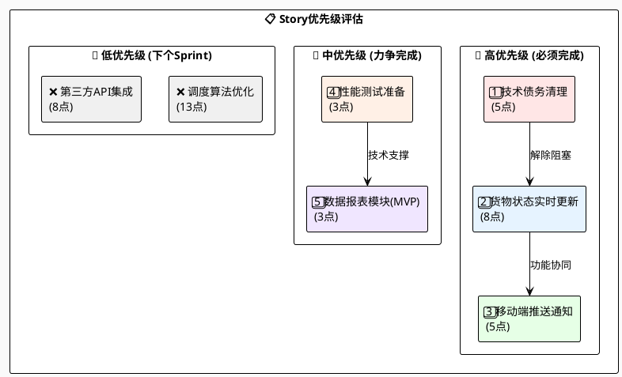

# 敏捷教练指导：航空货运系统Sprint 3规划优化

## 📋 项目背景

**系统名称**：航空货运管理系统  
**Sprint周期**：2周  
**团队配置**：开发团队（具体人数待确认）  
**当前Sprint**：第3个Sprint规划  

### 🎯 当前团队状态分析

| 指标 | Sprint 1 | Sprint 2 | 趋势分析 |
|------|----------|----------|----------|
| **完成故事点** | 32点 | 28点 | ⬇️ 下降12.5% |
| **团队速度** | 稳定 | 略降 | 需关注环境影响 |
| **技术债务** | - | 15点 | 🚨 积累较多 |
| **主要阻碍** | - | 集成环境不稳定 | 💡 需优先解决 |

## 📊 1. Sprint 3容量规划建议

### 🎯 速度分析与容量计算

```
团队速度分析：
┌─────────────────────────────────────┐
│ Sprint历史数据                      │
├─────────────────────────────────────┤
│ • Sprint 1: 32个故事点              │
│ • Sprint 2: 28个故事点              │
│ • 平均速度: 30个故事点              │
│ • 下降趋势: -12.5%                  │
├─────────────────────────────────────┤
│ 影响因素评估                        │
│ • 集成环境不稳定: -20%              │
│ • 技术债务影响: -10%                │
│ • 学习曲线影响: -5%                 │
├─────────────────────────────────────┤
│ 🎯 建议容量: 24个故事点             │
│ 📋 保守策略，确保质量交付           │
└─────────────────────────────────────┘
```

### ⚖️ 容量分配策略

| 类别 | 故事点 | 占比 | 策略说明 |
|------|--------|------|----------|
| **新功能开发** | 16点 | 67% | 聚焦核心业务价值 |
| **技术债务处理** | 5点 | 21% | 改善开发效率 |
| **基础设施改进** | 3点 | 12% | 支撑长期发展 |
| **总计** | **24点** | **100%** | 保守但务实的规划 |

**容量规划原则**：
- 🎯 **质量优先**：在环境不稳定情况下，宁可少做，确保交付质量
- 🔧 **债务优先**：投入资源解决技术债务，为后续Sprint创造条件
- 📈 **渐进改善**：通过小步快跑，逐步提升团队效率

## 🎯 2. Story优先级排序

### 优先级评估矩阵



### 🥇 高优先级Story详解

#### 1️⃣ 技术债务清理 (5点) - 🔥 **最高优先级**

**选择理由**：
- 🎯 **战略价值**：改善团队效率，为其他功能开发扫清障碍
- ⚡ **即时收益**：预期后续开发效率提升15-20%
- 🛡️ **风险缓解**：减少因技术债务导致的不确定性
- 🔧 **环境改善**：部分债务可能与环境不稳定相关

**具体行动**：
```
技术债务清理计划：
• 🔍 代码质量问题修复 (2点)
• 🔧 CI/CD流水线优化 (1.5点)
• 📚 过时依赖库更新 (1点)
• 🧹 测试环境配置清理 (0.5点)
```

#### 2️⃣ 货物状态实时更新功能 (8点)

**选择理由**：
- 💰 **业务价值高**：核心功能，直接影响用户体验
- 🟢 **技术风险低**：相对成熟的技术栈
- 🔗 **协同效应**：与移动端推送功能形成完整体验
- 🎯 **用户反馈**：高优先级用户需求

#### 3️⃣ 移动端推送通知 (5点)

**选择理由**：
- 📱 **用户体验提升**：提高用户粘性和操作便利性
- 🟢 **技术风险低**：成熟的推送服务方案
- 🔗 **功能依赖**：与实时更新功能协同，放大业务价值

### 🥈 中优先级Story

#### 4️⃣ 性能测试准备 (3点)
- **战略价值**：为后续大功能（调度算法）做技术铺垫
- **风险控制**：提前发现性能瓶颈

#### 5️⃣ 数据报表模块MVP (3点)
- **范围调整**：从8点缩减至3点，实现最小可行版本
- **渐进交付**：满足基本需求，后续迭代增强

### 🥉 延迟到Sprint 4的Story

#### ❌ 调度算法优化 (13点) 
**延迟原因**：
- 📏 **Story过大**：需要拆分为多个小Story
- ⚠️ **风险过高**：在环境不稳定时风险不可控
- 🔧 **前置条件**：需要性能测试环境就绪

#### ❌ 第三方API集成 (8点)
**延迟原因**：
- 🌐 **外部依赖**：第三方服务的不确定性
- 📋 **优先级低**：相比核心功能，业务价值较低

## ⚠️ 3. 风险识别和缓解措施

### 🔴 关键风险识别

| 风险等级 | 风险类型 | 风险描述 | 概率 | 影响 | 风险值 |
|---------|----------|----------|------|------|--------|
| 🔴 **高** | 环境风险 | 集成测试环境持续不稳定 | 70% | 高 | 🔥 极高 |
| 🟡 **中** | 技术风险 | 实时更新功能性能不达预期 | 30% | 中 | ⚠️ 中等 |
| 🟡 **中** | 资源风险 | 关键团队成员技能差异 | 40% | 中 | ⚠️ 中等 |
| 🟢 **低** | 进度风险 | 容量估算偏差 | 25% | 低 | ✅ 可控 |

### 🛡️ 风险缓解策略

#### 🔴 环境风险缓解
```
环境稳定性改进计划：
┌─────────────────────────────────────┐
│ 🚨 立即行动项                       │
├─────────────────────────────────────┤
│ ✅ 建立运维团队专项沟通群           │
│ ✅ 制定环境问题升级流程             │
│ ✅ 准备本地Mock环境方案             │
│ ✅ 建立环境状态实时监控             │
├─────────────────────────────────────┤
│ 📊 监控指标                         │
│ • 环境可用率 > 95%                  │
│ • 平均响应时间 < 2秒                │
│ • 错误率 < 1%                       │
│ • 问题解决时间 < 30分钟             │
└─────────────────────────────────────┘
```

#### ⚠️ 技术风险缓解
- **预防措施**：
  - 🧪 提前进行小规模压力测试
  - 📊 建立关键性能指标监控
  - 🔄 准备功能降级方案
- **应急预案**：
  - 🚦 分阶段发布策略
  - 📈 实时性能监控
  - 🔙 快速回滚机制

#### 👥 资源风险缓解
- **技能建设**：
  - 👥 关键功能配对编程
  - 📚 每日技术知识分享
  - 🔄 交叉备份机制
- **协作优化**：
  - 💬 增强Daily Stand-up沟通
  - 📝 完善技术文档
  - 🎯 明确Definition of Done

## 🚀 4. 团队效率提升建议

### 💡 立即行动项 (Sprint开始前48小时内)

#### 🔧 环境稳定性改进
```
环境改进行动清单：
□ 与运维团队召开紧急会议
□ 建立环境监控大屏
□ 准备本地开发环境Mock方案
□ 制定环境故障应急流程
□ 建立问题升级联系人清单
```

#### 📋 Sprint启动优化
```
Sprint启动检查清单：
□ Story详细需求澄清完成
□ 技术方案设计评审通过
□ 测试策略制定完成
□ Definition of Done确认
□ 团队角色分工明确
```

### 🔄 持续改进措施

#### 1️⃣ 每日节奏优化

**优化后的Daily Stand-up议程**：
```
⏰ Daily Stand-up流程 (15分钟)
├── 🌍 环境状态检查 (2分钟)
│   ├── 集成环境可用性
│   ├── 关键服务状态
│   └── 性能指标概览
├── 👥 团队进度同步 (10分钟)
│   ├── 昨日完成情况
│   ├── 今日工作计划
│   └── 遇到的阻碍点
└── 🚨 风险和行动项 (3分钟)
    ├── 新发现的风险
    ├── 需要协助的事项
    └── 决策待确认项
```

#### 2️⃣ 质量内建机制

**代码质量保障**：
- ✅ **强制Code Review**：至少2人审查
- 🧪 **自动化测试**：覆盖率 > 80%
- 🔍 **静态代码分析**：集成到CI流水线
- 📏 **Definition of Done**：严格执行标准

**集成质量保障**：
- 🏗️ **分支策略优化**：feature → develop → main
- 🚀 **持续集成**：每次提交触发自动构建
- 🧪 **冒烟测试**：部署后自动验证
- 📊 **质量度量**：实时监控关键指标

#### 3️⃣ 团队协作增强

**知识分享机制**：
```
📚 知识分享计划：
• 🗓️ 每周三下午技术分享 (30分钟)
• 📖 轮流分享最新技术实践
• 🔧 工具使用技巧交流
• 🏆 最佳实践案例分享
• 📝 会议纪要共享到团队知识库
```

**配对编程策略**：
- 🎯 **关键功能必须配对**：实时更新、推送通知
- 👥 **技能互补搭配**：资深+初级开发者
- 🔄 **定期轮换**：避免知识孤岛
- 📊 **效果跟踪**：记录配对编程的效果

## 📋 Sprint 3最终执行计划

### 🎯 Sprint目标声明

> **Sprint 3目标**：在改善技术债务和环境稳定性的基础上，交付货物状态实时更新和移动端推送通知核心功能，为航空货运系统用户提供更及时、便捷的服务体验。

### 📊 详细Story规划

| 优先级 | Story | 故事点 | 责任人 | 预计完成时间 | 依赖关系 |
|--------|-------|--------|--------|-------------|----------|
| 🔥 P0 | 技术债务清理 | 5 | 全团队 | Week 1前3天 | 无 |
| 🎯 P1 | 货物状态实时更新功能 | 8 | 张三+李四 | Week 1-2 | 技术债务清理 |
| 🎯 P1 | 移动端推送通知 | 5 | 王五+赵六 | Week 2 | 实时更新功能 |
| 📋 P2 | 性能测试准备 | 3 | 李四 | Week 1后2天 | 技术债务清理 |
| 🎖️ P3 | 数据报表模块(MVP) | 3 | 张三 | Week 2 | 如进度允许 |

### 📈 成功标准与验收条件

#### ✅ 技术指标
- **环境稳定性**：可用率 > 95%
- **功能完整性**：所有P0和P1 Story 100%完成
- **代码质量**：测试覆盖率 > 80%，代码审查通过率 100%
- **性能指标**：实时更新延迟 < 5秒，推送到达率 > 95%

#### ✅ 团队指标
- **技术债务减少**：目标债务清理50%以上
- **团队满意度**：Sprint回顾评分 > 8分
- **协作效率**：Daily Stand-up时长 < 15分钟
- **知识分享**：至少1次技术分享会议

#### ✅ 业务指标
- **用户价值交付**：实时更新功能用户验收通过
- **移动体验提升**：推送功能iOS/Android双平台支持
- **系统稳定性**：生产环境故障率 < 1%

### 🔄 Sprint期间检查点

#### Week 1中期检查 (Day 5)
```
📊 中期检查清单：
□ 技术债务清理进度 ≥ 80%
□ 环境稳定性改善效果评估
□ 实时更新功能开发进度 ≥ 50%
□ 团队协作模式运行效果
□ 风险项更新和应对措施调整
```

#### Week 2中期检查 (Day 8)
```
🎯 冲刺阶段检查：
□ P1 Story完成度 ≥ 90%
□ 性能测试准备就绪
□ 用户验收测试计划确认
□ 生产发布准备工作
□ Sprint 4规划前置工作
```

### 📝 Sprint回顾重点议题

#### 🏆 成功要素分析
1. **环境改进效果**：量化分析稳定性提升效果
2. **技术债务收益**：评估清理债务对开发效率的影响
3. **团队协作模式**：总结配对编程和知识分享的效果
4. **质量内建成效**：分析代码质量和缺陷率的变化

#### 🔄 持续改进行动项
1. **下个Sprint容量调整**：基于本Sprint实际表现调整估算
2. **流程优化建议**：识别仍存在的效率瓶颈
3. **技能发展计划**：针对暴露的技能差距制定提升计划
4. **工具和环境改进**：持续优化开发和测试环境

## 🎯 教练总结与建议

### 💡 关键成功要素

1. **务实的容量规划**：在不确定环境下选择保守策略，确保团队信心
2. **债务优先策略**：投资技术债务清理，为长期效率提升创造条件  
3. **风险前置管理**：主动识别和缓解环境风险，避免被动应对
4. **持续改进文化**：通过小步快跑，逐步建立高效协作模式

### 🚀 长期发展方向

- **技术能力建设**：通过配对编程和知识分享提升整体技术水平
- **过程改进**：建立数据驱动的团队效率改进机制
- **质量内建**：将质量保障措施融入到日常开发流程中
- **环境优化**：持续投资基础设施，为高效开发创造条件

### 📞 教练支持

作为敏捷教练，我将在Sprint期间提供以下支持：
- 🗓️ **每周教练会议**：讨论进展和挑战
- 🚨 **问题升级支持**：协助解决团队无法独立解决的问题  
- 📊 **数据分析支持**：提供团队效率和质量数据分析
- 🎯 **持续改进指导**：基于Sprint数据提供下一步优化建议

---

**文档版本**：v1.0  
**创建日期**：2025年9月1日  
**适用团队**：航空货运系统开发团队  
**下次更新**：Sprint 3结束后，基于回顾会议反馈更新
