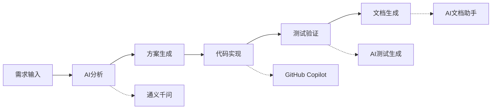

# 演练2-个人AI工具箱组合设计

## 演练概述

**时长**: 20分钟（15分钟设计 + 5分钟展示）  
**目标**: 根据个人工作特点，构建适合国内环境的AI工具组合  
**重点**: 考虑网络环境限制，优先选择国产AI工具和免费方案  
**场景**: 民航凯亚团队成员个性化AI工具配置

---

## 国内AI工具生态现状

### 🌟 **主流国产AI工具**
- **通义千问（阿里云）**: 免费使用，API调用便宜
- **文心一言（百度）**: 免费版功能完整，企业版性价比高  
- **智谱ChatGLM**: 开源模型，本地部署友好
- **DeepSeek**: 编程能力强，免费额度大
- **豆包（抖音）**: 免费使用，集成度高
- **Kimi（月之暗面）**: 长文本处理能力强

### 🚫 **需要翻墙的工具及替代方案**
| 海外工具 | 访问难度 | 国产替代 | 推荐指数 |
|---------|----------|----------|----------|
| ChatGPT | 需要翻墙+付费 | 通义千问、文心一言 | ⭐⭐⭐⭐⭐ |
| Claude | 需要翻墙 | DeepSeek、智谱GLM | ⭐⭐⭐⭐ |
| GitHub Copilot | 企业网络可用 | 通义灵码、百度Comate | ⭐⭐⭐⭐ |
| Cursor | 需要配置代理 | Continue + 国产模型 | ⭐⭐⭐ |

---

## 个人工具箱设计框架

### 第一步：工作角色评估（3分钟）

请根据您的实际工作情况，勾选适合的角色类型：

#### 👨‍💻 **开发工程师**
- [ ] 后端开发（Java/Python/Go等）
- [ ] 前端开发（React/Vue/Angular等）
- [ ] 全栈开发
- [ ] DevOps工程师
- [ ] 数据库工程师

#### 🧪 **测试工程师**
- [ ] 功能测试
- [ ] 自动化测试
- [ ] 性能测试
- [ ] 安全测试

#### 🏗️ **架构师/技术负责人**
- [ ] 系统架构设计
- [ ] 技术选型决策
- [ ] 团队技术指导
- [ ] 代码review

#### 📋 **产品经理/项目经理**
- [ ] 需求分析
- [ ] 产品设计
- [ ] 项目管理
- [ ] 用户研究

#### 🔧 **运维工程师**
- [ ] 系统运维
- [ ] 监控告警
- [ ] 容器化部署
- [ ] 云平台管理

### 第二步：痛点识别（2分钟）

选择您在工作中最常遇到的问题（可多选）：

#### 编程相关
- [ ] 代码编写效率低
- [ ] 调试时间长
- [ ] 不熟悉新技术栈
- [ ] 代码质量不稳定
- [ ] 重复性工作多

#### 文档相关  
- [ ] 技术文档编写耗时
- [ ] 需求文档不够清晰
- [ ] 会议记录整理困难
- [ ] 知识沉淀不足

#### 设计相关
- [ ] 系统架构图绘制复杂
- [ ] 流程图制作费时
- [ ] 原型设计能力不足
- [ ] 演示文稿制作困难

#### 测试相关
- [ ] 测试用例设计不全面
- [ ] 测试数据准备麻烦
- [ ] 回归测试工作量大
- [ ] 测试报告编写繁琐

#### 运维相关
- [ ] 日志分析耗时
- [ ] 故障诊断困难
- [ ] 配置管理复杂
- [ ] 监控规则设置不当

---

## AI工具分类推荐

### 🔧 **编程辅助工具**

#### Tier 1：企业级推荐（网络环境好）
| 工具名称 | 适用场景 | 月费用 | 网络要求 | 推荐指数 |
|---------|----------|--------|----------|----------|
| GitHub Copilot | VS Code集成编程 | $10 | 企业网络可用 | ⭐⭐⭐⭐⭐ |
| 通义灵码 | 阿里云生态开发 | 免费 | 国内直连 | ⭐⭐⭐⭐ |
| 百度Comate | 百度云生态 | 免费 | 国内直连 | ⭐⭐⭐⭐ |

#### Tier 2：开源/免费方案
| 工具名称 | 适用场景 | 配置难度 | 推荐指数 |
|---------|----------|----------|----------|
| Continue + DeepSeek | VS Code本地模型 | 中等 | ⭐⭐⭐⭐ |
| Codeium | 免费代码助手 | 简单 | ⭐⭐⭐ |
| TabNine | 本地代码补全 | 简单 | ⭐⭐⭐ |

**配置示例：Continue + DeepSeek**
```json
// Continue配置文件 (~/.continue/config.json)
{
  "models": [
    {
      "title": "DeepSeek Coder",
      "provider": "openai",
      "model": "deepseek-coder",
      "apiKey": "你的DeepSeek API Key",
      "apiBase": "https://api.deepseek.com"
    }
  ]
}
```

### 📝 **文档处理工具**

#### 主力推荐
| 工具名称 | 核心功能 | 费用 | 推荐场景 |
|---------|----------|------|----------|
| 通义千问 | 文档生成/润色 | 免费 | 技术文档、需求分析 |
| 文心一言 | 内容创作 | 免费 | 项目文档、汇报材料 |
| Kimi | 长文档分析 | 免费 | 文档总结、内容提取 |
| 智谱ChatGLM | 代码文档生成 | 免费 | API文档、注释生成 |

#### 专业工具
| 工具名称 | 特色功能 | 适用人群 |
|---------|----------|----------|
| 钉钉AI助手 | 会议纪要生成 | 项目经理、产品经理 |
| 飞书妙记 | 实时转写记录 | 会议记录、访谈整理 |
| WPS AI | Office文档智能化 | 通用办公场景 |

### 🎨 **设计与可视化工具**

#### 架构图/流程图
| 工具名称 | 特色功能 | 学习成本 | 推荐指数 |
|---------|----------|----------|----------|
| 腾讯智影 | AI生成流程图 | 低 | ⭐⭐⭐⭐ |
| ProcessOn | 在线协作绘图 | 低 | ⭐⭐⭐⭐ |
| 亿图图示 | 专业图表工具 | 中 | ⭐⭐⭐ |
| Draw.io | 免费流程图工具 | 中 | ⭐⭐⭐⭐ |

#### 演示文稿
| 工具名称 | AI能力 | 费用 | 推荐场景 |
|---------|--------|------|----------|
| Gamma（需翻墙）| AI生成PPT | 付费 | 国外客户演示 |
| 美图AI PPT | 国产AI生成 | 免费 | 内部汇报 |
| WPS AI | Office集成 | 部分免费 | 通用演示 |

### 🧪 **测试工具**

#### AI测试生成
| 工具名称 | 功能特点 | 集成方式 | 推荐指数 |
|---------|----------|----------|----------|
| 通义千问 + 测试框架 | 用例生成 | API集成 | ⭐⭐⭐⭐ |
| DeepSeek + pytest | 单元测试生成 | VS Code插件 | ⭐⭐⭐⭐ |
| TestRigor（需翻墙）| 自然语言测试 | 云平台 | ⭐⭐⭐ |

#### 测试数据生成
```python
# 使用通义千问API生成测试数据示例
import requests

def generate_test_data(scenario):
    """使用AI生成测试数据"""
    prompt = f"""
    为以下测试场景生成10条测试数据，返回JSON格式：
    场景：{scenario}
    
    要求：
    1. 包含正常数据、边界数据、异常数据
    2. 数据要符合业务逻辑
    3. JSON格式规范
    """
    
    # 调用通义千问API（示例）
    response = call_qwen_api(prompt)
    return response
```

### 🔍 **运维监控工具**

#### 日志分析
| 工具名称 | AI能力 | 部署方式 | 推荐指数 |
|---------|--------|----------|----------|
| 阿里云日志服务 | 智能异常检测 | 云服务 | ⭐⭐⭐⭐⭐ |
| 腾讯云CLS | AI日志分析 | 云服务 | ⭐⭐⭐⭐ |
| ELK + AI插件 | 自定义分析 | 自建 | ⭐⭐⭐ |

#### 监控告警
```yaml
# 使用AI优化的监控配置示例
apiVersion: v1
kind: ConfigMap
metadata:
  name: ai-monitoring-rules
data:
  rules.yml: |
    groups:
    - name: ai-generated-rules
      rules:
      # 使用AI生成的智能阈值监控规则
      - alert: HighCPUUsage
        expr: cpu_usage_percent > 80
        for: 2m
        annotations:
          description: "AI分析建议：CPU使用率持续高于80%，建议检查以下组件..."
```

---

## 个人工具箱配置模板

### 🎯 **配置步骤**

#### 步骤1：基础工具选择（5分钟）
根据您的角色和痛点，从以下模板中选择：

**📋 开发工程师工具箱**
```yaml
编程辅助:
  主力: GitHub Copilot（如网络允许）或 通义灵码
  备选: Continue + DeepSeek
  配置: VS Code + 相关插件

文档处理:
  主力: 通义千问（技术文档）
  辅助: DeepSeek（代码注释）
  
设计工具:
  架构图: ProcessOn + 通义千问（图表描述）
  流程图: Draw.io
  
测试辅助:
  用例生成: 通义千问 + pytest
  数据生成: Python + AI API
```

**🧪 测试工程师工具箱**
```yaml
测试设计:
  用例生成: 通义千问 + 测试模板
  数据准备: Python脚本 + AI数据生成
  
文档工具:
  测试报告: WPS AI + 模板
  缺陷描述: 文心一言（描述优化）
  
自动化:
  脚本生成: DeepSeek + Selenium
  API测试: Postman + AI生成用例
```

**📋 产品/项目经理工具箱**
```yaml
需求分析:
  需求梳理: Kimi（长文档分析）
  用户故事: 通义千问
  
项目管理:
  计划制定: 钉钉AI助手
  风险评估: 文心一言
  
演示工具:
  PPT制作: 美图AI PPT
  原型设计: ProcessOn + AI描述
```

#### 步骤2：工具安装配置（5分钟）

**优先级1：必装工具**
1. **通义千问**
   - 注册阿里云账号
   - 开通通义千问服务
   - 获取API密钥（可选）

2. **VS Code + AI插件**
   ```bash
   # 推荐插件列表
   - GitHub Copilot（企业环境）
   - 通义灵码（国内备选）
   - Continue（开源方案）
   - Chinese Language Pack
   ```

3. **文档工具**
   - WPS Office（集成AI功能）
   - ProcessOn账号注册
   - 钉钉/飞书（团队协作）

**优先级2：专业工具**
根据具体工作需要选装

#### 步骤3：个人配置优化（3分钟）

**工作流整合示例**


#### 步骤4：效果验证（2分钟）

**验证任务清单**
- [ ] 完成一个简单的编程任务
- [ ] 生成一份技术文档
- [ ] 创建一个流程图
- [ ] 测试AI工具响应速度

---

## 实际配置案例

### 案例1：后端开发工程师（小李）

**工作背景**：Java开发，负责航班管理系统后端API

**痛点**：代码编写效率低，文档编写耗时

**工具配置**：
```yaml
编程环境:
  IDE: IntelliJ IDEA + 通义灵码插件
  代码助手: GitHub Copilot（公司网络支持）
  备选方案: Continue + DeepSeek

开发流程:
  需求分析: 通义千问（理解业务逻辑）
  代码生成: 通义灵码 + 手工优化
  单元测试: AI生成 + 手工review
  API文档: Swagger + AI生成描述

效率提升:
  编码效率: +40%（代码生成）
  文档效率: +60%（自动生成+润色）
  调试时间: -30%（AI辅助分析）
```

### 案例2：测试工程师（小王）

**工作背景**：负责机场系统功能测试和自动化测试

**痛点**：测试用例设计不全面，测试数据准备麻烦

**工具配置**：
```yaml
测试设计:
  用例生成: 通义千问 + Excel模板
  提示词模板: "根据需求PRD，生成完整测试用例，包括正常流程、异常流程、边界条件"
  
测试数据:
  数据生成: Python脚本 + 文心一言API
  场景覆盖: 使用AI分析业务规则生成数据

自动化测试:
  脚本生成: Selenium + DeepSeek（代码生成）
  维护优化: AI辅助脚本重构

效率提升:
  用例设计: +50%（覆盖率提升）
  数据准备: +70%（自动化生成）
  脚本维护: +30%（AI辅助重构）
```

### 案例3：产品经理（小张）

**工作背景**：负责机场管理系统产品规划

**痛点**：需求文档编写耗时，用户研究分析困难

**工具配置**：
```yaml
需求管理:
  需求收集: 飞书妙记（会议转写）
  需求分析: Kimi（长文档分析）
  PRD编写: 通义千问 + Word模板

产品设计:
  用户旅程: ProcessOn + AI流程描述
  原型设计: 墨刀 + AI交互建议
  竞品分析: 通义千问（报告生成）

沟通协作:
  技术方案review: DeepSeek（代码理解）
  项目汇报: 美图AI PPT + 数据可视化

效率提升:
  需求文档: +60%（结构化生成）
  用户研究: +40%（数据分析）
  方案设计: +35%（AI辅助思考）
```

---

## 工具箱展示模板

### 📊 **个人工具箱展示（5分钟/人）**

**展示结构**：
1. **个人背景**（30秒）
   - 工作角色和主要职责
   - 当前面临的主要痛点

2. **工具选择理由**（2分钟）
   - 为什么选择这些工具
   - 如何解决具体问题
   - 网络环境和成本考虑

3. **配置亮点**（1.5分钟）
   - 独特的配置技巧
   - 工作流集成方案
   - 效率提升预期

4. **经验分享**（1分钟）
   - 配置过程中的经验教训
   - 给同事的建议
   - 后续优化计划

**展示工具**：使用ProcessOn制作个人工具箱架构图

---

## 团队工具标准化建议

### 🏢 **企业级工具选择原则**

1. **网络环境友好**：优先选择国产工具，避免访问困难
2. **成本控制合理**：免费工具为主，付费工具精选
3. **安全合规**：数据不出境，符合企业安全要求
4. **团队协作**：工具间能够良好集成
5. **技能培训**：学习成本可控，易于推广

### 📋 **推荐的团队标准配置**

**基础套件**（所有人员）
- 通义千问：通用AI助手
- WPS AI：文档处理
- 钉钉AI：会议协作
- ProcessOn：图表绘制

**开发套件**（技术人员）
- 通义灵码：代码辅助
- Continue + DeepSeek：开源方案
- 阿里云日志服务：运维监控

**管理套件**（管理人员）
- Kimi：长文档分析
- 美图AI PPT：演示制作
- 飞书妙记：会议记录

---

## 常见问题解答

### Q1：GitHub Copilot在国内网络环境下稳定吗？
**A**：企业网络环境下通常可以正常使用，个人网络可能会有访问问题。建议企业用户优先选择，个人用户可以考虑通义灵码等国产替代方案。

### Q2：免费的AI工具功能限制大吗？
**A**：国产AI工具的免费版本功能已经比较完整，能满足大部分日常工作需求。通义千问、文心一言、DeepSeek等都有较高的免费使用额度。

### Q3：如何处理AI工具的数据安全问题？
**A**：
- 优先选择国产工具，数据在国内处理
- 敏感信息不要直接输入AI工具
- 企业级应用建议购买私有化部署方案
- 定期清理AI工具的对话历史

### Q4：AI工具学习成本高吗？
**A**：现代AI工具的交互界面都比较友好，主要学习成本在于：
- 掌握有效的提示词技巧
- 了解不同工具的特长领域
- 建立高效的工作流程

建议从简单任务开始，逐步深入使用。

### Q5：如何评估AI工具的实际效果？
**A**：建议设定具体的量化指标：
- 任务完成时间对比
- 输出质量评分
- 错误率统计
- 团队满意度调查

---

## 课后作业

### 📝 **个人任务**
1. **完成工具安装**：根据个人配置清单，完成所有工具的安装和基础配置
2. **制作使用手册**：为自己的工具箱编写使用说明，包括常用提示词和工作流程
3. **效果跟踪**：连续使用一周，记录效率提升数据

### 👥 **团队任务**
1. **分享交流**：在团队内部分享个人工具箱配置心得
2. **标准制定**：讨论制定团队统一的AI工具规范
3. **培训计划**：为团队其他成员制定AI工具培训计划

### 📊 **评估指标**
- 工具配置完成度
- 使用频率和深度
- 实际效率提升幅度
- 团队推广效果

---

**演练总结**：
通过这个演练，学员将获得：
- ✅ 适合国内环境的AI工具选择能力
- ✅ 个性化工具配置和优化技能  
- ✅ 实际工作场景的AI应用经验
- ✅ 团队协作和标准化的思考能力

这为在实际工作中高效应用AI工具奠定了坚实基础！
