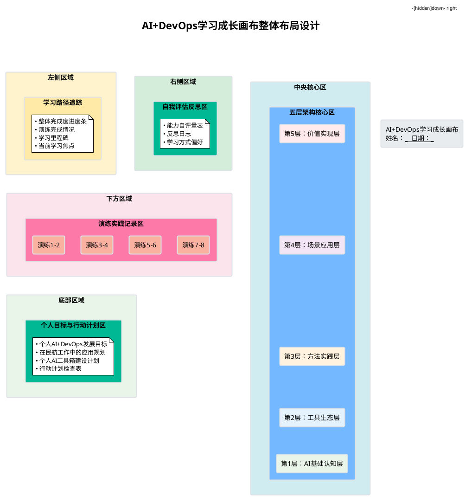
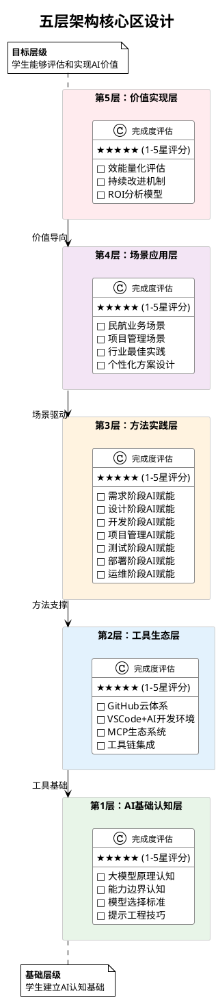
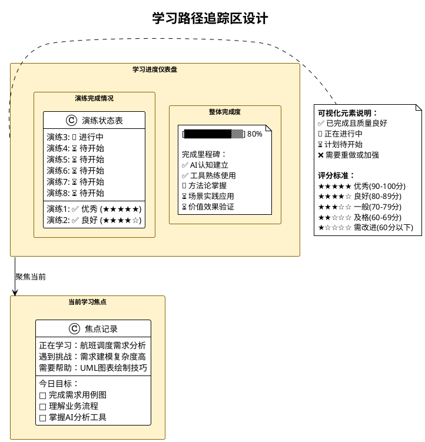
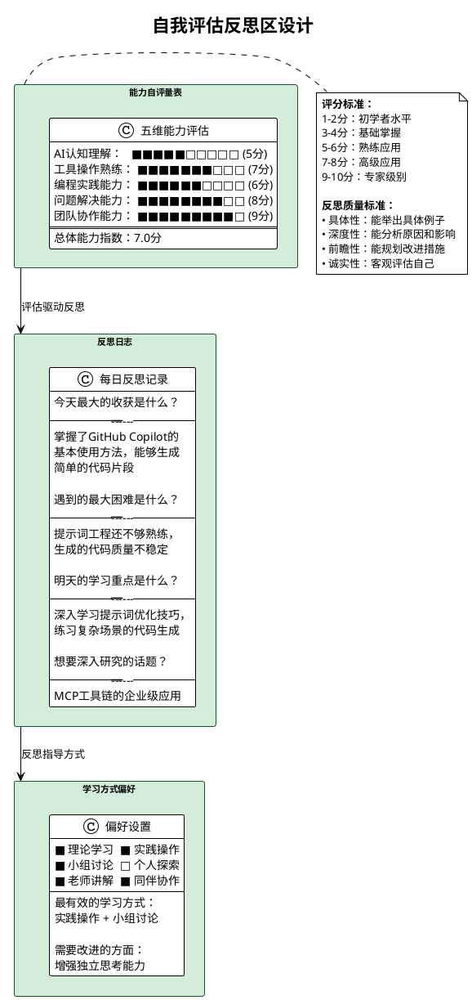
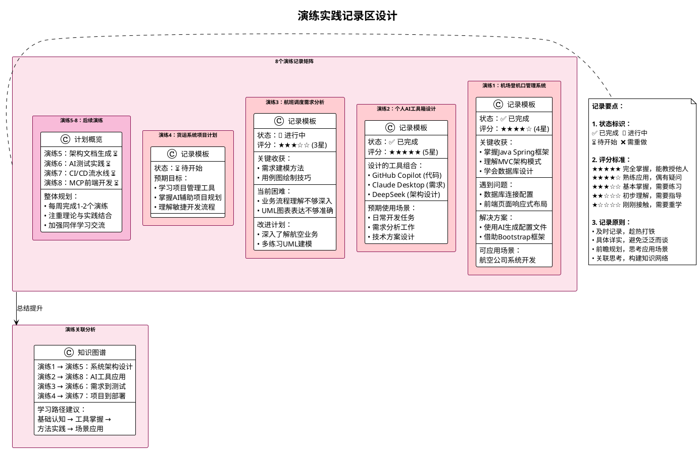
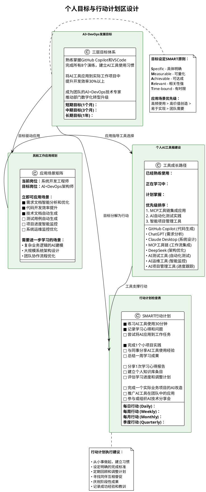

# AI+DevOps学习成长画布设计方案

## 🎯 设计目标

基于民航凯亚AI+DevOps五层架构课程，设计一个可视化学习画布，帮助学生：
- 建立完整的AI+DevOps知识框架认知
- 实时追踪学习进度和掌握程度
- 促进自我反思和持续改进
- 支持课堂互动和小组协作
- 建立个人AI工具箱和应用规划

## 📋 画布整体布局

### 布局尺寸：A1(594×841mm) 或 A0(841×1189mm)
### 整体结构：五区域设计

**整体布局PlantUML图：**

## 🏗️ 各区域详细设计

### 1. 中央核心区：五层架构可视化

采用与您架构图一致的层级结构和颜色方案：

**五层架构核心区PlantUML图：**

### 2. 左侧区域：学习路径追踪

**学习路径追踪区PlantUML图：**

### 3. 右侧区域：自我评估反思区

**自我评估反思区PlantUML图：**

### 4. 下方区域：演练实践记录区

**演练实践记录区PlantUML图：**

### 5. 底部区域：个人目标与行动计划区

**个人目标与行动计划区PlantUML图：**

## 🎨 设计元素说明

### 颜色方案
- 与架构图保持一致的五层颜色
- 进度条使用绿色渐变表示完成度
- 状态标识使用直观的图标（✅❌🔄⏳）

### 交互元素
- **复选框**：用于标记完成状态
- **星级评分**：1-5星评价掌握程度
- **进度条**：可视化完成百分比
- **文本区域**：供学生填写反思和计划

### 材质建议
- **物理版**：250g铜版纸，覆膜处理，可反复书写
- **数字版**：PDF可填写表单，支持保存和分享

## 🛠️ 使用方式

### 课堂使用
1. **课前**：学生填写当前能力自评和学习目标
2. **课中**：实时更新进度，记录关键收获
3. **课后**：完成反思日志，规划下次学习重点

### 小组协作
- 4-6人小组共同讨论填写
- 每人负责不同层级的深度记录
- 定期小组内分享和互评

### 个人发展
- 每日更新学习进度
- 每周回顾和调整目标
- 每月评估整体成长情况

## 📊 效果评估

### 对学生的价值
- 建立系统性知识框架
- 提升自主学习能力
- 增强学习成就感
- 培养反思习惯

### 对教师的价值
- 实时了解学生学习状态
- 识别普遍性问题和困难
- 调整教学策略和重点
- 评估课程效果

### 对企业的价值
- 培养员工AI+DevOps能力
- 建立学习型组织文化
- 提升团队整体效能
- 支持数字化转型目标

## 🚀 实施建议

### 第一阶段：试点使用
- 选择1-2个班级试用
- 收集学生和老师反馈
- 优化设计和使用流程

### 第二阶段：全面推广
- 制作标准化画布模板
- 培训老师使用方法
- 建立使用效果评估机制

### 第三阶段：数字化升级
- 开发在线版本
- 集成学习管理系统
- 增加数据分析功能

这个学习成长画布将成为您AI+DevOps课程的重要教学工具，帮助学生更好地理解、掌握和应用所学知识！
