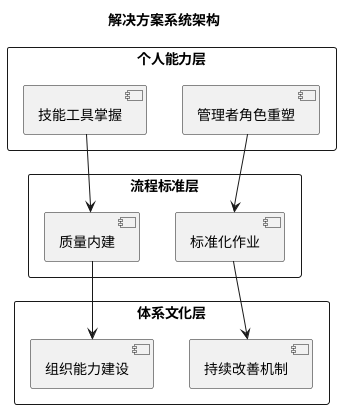
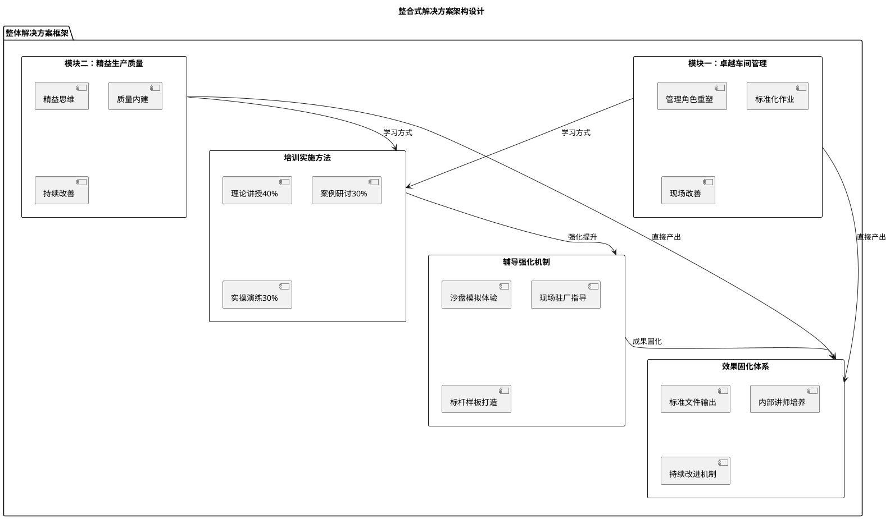
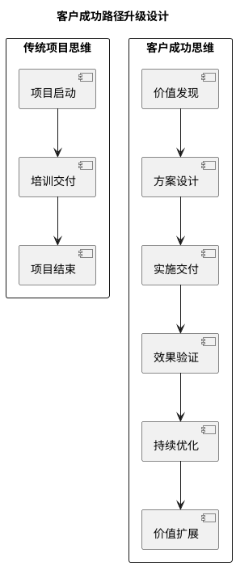
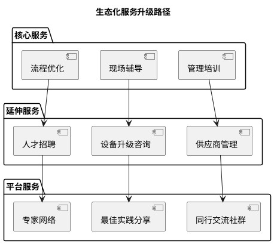

# 服务定制方案文档结构分析

**分析对象：** 马田弹力带(中山)有限公司《生产管理能力提升解决方案》
**分析时间：** 2025年8月5日
**分析维度：** 文档结构、内容特点、设计亮点

---

## 一、文档整体结构分析

### 1.1 层次化信息架构

该方案采用了清晰的**六层级信息架构**：

```
1. 基础信息层 → 项目标识、联系方式
2. 导航层 → 详细目录结构
3. 总述层 → 方案概览、目标设定
4. 分析层 → 问题诊断、需求分析
5. 方案层 → 具体解决方案设计
6. 执行层 → 实施路径、里程碑
```

### 1.2 文档结构树状图

```
马田弹力带生产管理解决方案
├── 基础信息
│   ├── 服务方信息
│   ├── 项目经理
│   └── 联系方式
├── 方案总述
│   ├── 整体定位
│   ├── 核心模块
│   └── 预期目标
├── 方案设计说明
│   ├── 核心挑战分析
│   └── 变革需求识别
├── 整体解决方案框架
│   ├── 模块一：车间管理能力提升
│   └── 模块二：精益生产与质量
├── 培训辅导模式
│   ├── 线下面授
│   ├── 沙盘模拟
│   └── 现场辅导
└── 项目实施路径
    └── 六阶段里程碑
```

## 二、内容设计特点分析

### 2.1 🎯 **目标导向的设计逻辑**

**特点：** 先明确目标，再倒推方案设计

- **宏观目标**：生产效率↑20%、合格率达98%、库存↓30%、浪费↓25%
- **微观目标**：每个模块都有明确的交付物和学习成果
- **过程目标**：六个阶段都有清晰的里程碑验收标准

### 2.2 📊 **数据驱动的问题分析**

**特点：** 用量化指标支撑问题诊断和方案设计

| 分析维度           | 量化表现                           | 设计优势           |
| ------------------ | ---------------------------------- | ------------------ |
| **问题识别** | 明确指出"返工率高"、"库存周转率低" | 避免抽象化问题描述 |
| **目标设定** | 具体数值目标(20%、98%、30%、25%)   | 可衡量、可验证     |
| **时间规划** | 精确到天/周的时间安排              | 项目可控性强       |

### 2.3 🔄 **系统化的解决方案架构**

**特点：** 从点到面，从个人到体系的全覆盖设计



### 2.4 📚 **理论与实践并重的内容设计**

**特点：** 每个模块都包含理论基础+实操工具+现场应用

| 层次               | 理论比重 | 实践比重 | 设计亮点                     |
| ------------------ | -------- | -------- | ---------------------------- |
| **模块一**   | 40%      | 60%      | 重点在建立管理基础和日常标准 |
| **模块二**   | 30%      | 70%      | 重点在精益工具的现场应用     |
| **辅导阶段** | 20%      | 80%      | 重点在现场指导和成果固化     |

## 三、文档设计亮点

### 3.1 ✨ **视觉化信息呈现**

1. **表格化对比分析**

   - 挑战分析表：问题-根源-解决方向三维对比
   - 模块设计表：天数-内容-学习点结构化展示
   - 实施路径表：阶段-时间-产出清晰对应
2. **层次化内容组织**

   - 使用markdown标题层级清晰划分内容
   - 关键信息用**粗体**突出
   - 数字目标用具体数值强化印象

### 3.2 🎨 **专业化语言表达**

1. **术语运用精准**

   - 使用行业专业术语：VSM、TPM、SMED、Kaizen等
   - 管理概念表述规范：PDCA、QC七工具等
2. **逻辑表达严谨**

   - 问题分析采用"现象→根源→对策"逻辑链
   - 方案设计采用"目标→路径→验收"完整闭环

### 3.3 🔧 **实用性工具设计**

**交付物清单设计特点：**

- 每个模块都有明确的可交付成果
- 文档命名规范化(如"V1.0"版本标识)
- 工具包模板化设计，便于复制推广

## 四、文档结构最佳实践总结

### 4.1 📋 **结构设计原则**

1. **漏斗式信息架构**：从宏观到微观，从概念到执行
2. **对称式模块设计**：两大模块结构完全对称，便于理解记忆
3. **闭环式流程设计**：每个环节都有输入、处理、输出

### 4.2 🏆 **内容组织优势**

| 优势维度         | 具体表现                               | 价值体现       |
| ---------------- | -------------------------------------- | -------------- |
| **逻辑性** | 问题分析→方案设计→实施路径的线性逻辑 | 易于理解和接受 |
| **完整性** | 从诊断到交付的全流程覆盖               | 方案可操作性强 |
| **专业性** | 大量专业术语和工具的准确使用           | 提升方案可信度 |
| **实用性** | 每个阶段都有明确的交付物和验收标准     | 便于项目管控   |

### 4.3 💡 **可借鉴的设计模式**

1. **"三段式"核心结构**

   ```
   问题诊断 → 方案设计 → 实施路径
   ```
2. **"双模块"并行设计**

   ```
   基础能力模块 + 专业技能模块
   ```
3. **"六阶段"项目管控**

   ```
   诊断→培训→演练→辅导→固化→跟进
   ```

### 4.4 ⚠️ **结构逻辑问题识别**

**关键问题：模块设计与培训模式的逻辑割裂**

通过深度分析发现，当前方案存在一个**核心结构问题**：

```
现状问题结构：
├── 整体解决方案框架
│   ├── 模块一：车间管理能力提升
│   └── 模块二：精益生产与质量
├── 培训与辅导模式 (割裂)
│   ├── 线下面授培训
│   ├── 沙盘模拟活动  
│   └── 现场作业辅导
```

**问题分析：**

1. **内容与方式分离**：模块内容和培训方式被人为割裂，读者难以理解完整的学习路径
2. **逻辑链条断裂**：无法清楚看出"学什么"与"怎么学"的内在联系
3. **价值传递不清**：培训模式的设计逻辑和价值主张不够突出

**改进方向：整合式解决方案架构**

建议将模块设计与培训模式整合为**"内容+方法+效果"三维一体**的解决方案架构：



**优化后的整合结构应该是：**

```
整合式解决方案框架
├── 核心能力模块设计
│   ├── 模块一：卓越车间管理能力提升
│   │   ├── 学习内容：管理角色+标准作业+现场改善
│   │   ├── 培训方式：理论40%+案例30%+实操30%
│   │   ├── 强化机制：沙盘模拟+现场指导
│   │   └── 预期产出：管理手册+标准流程+改善案例
│   └── 模块二：精益生产与质量内建
│       ├── 学习内容：精益思维+质量内建+改善工具
│       ├── 培训方式：理论30%+案例30%+实操40%
│       ├── 强化机制：价值流分析+现场改善实践
│       └── 预期产出：操作指南+工具包+分析报告
└── 整合交付模式
    ├── 知识输入：系统化理论培训
    ├── 技能转化：沙盘模拟+现场实践  
    ├── 能力固化：标准文件+内部讲师
    └── 持续提升：跟踪辅导+改进机制
```

## 五、文档改进建议（深度分析）

### 5.0 🔧 **结构逻辑整合方案**

**针对核心问题：模块设计与培训模式的逻辑割裂**

#### **问题诊断：**

当前方案将"学什么"（模块内容）和"怎么学"（培训模式）人为分离，导致：

- 读者无法理解完整的学习路径设计逻辑
- 培训方式的针对性和价值主张不够清晰
- 方案的系统性和专业性受到影响

#### **整合方案设计：**

**方案一：能力导向的整合架构**

```
整体解决方案框架
├── 车间管理卓越能力建设方案
│   ├── 能力目标：从"救火队长"到"系统规划师"
│   ├── 学习内容：角色重塑+标准化作业+现场改善
│   ├── 培训设计：理论讲授(1天) + 案例研讨(1天) + 现场实操(1天)
│   ├── 强化机制：沙盘模拟竞争演练 + 现场驻厂辅导
│   └── 成果输出：管理手册+标准流程+改善案例集
└── 精益质量一体化能力建设方案  
    ├── 能力目标：从"检验导向"到"质量内建"
    ├── 学习内容：精益思维+TQM理念+改善工具应用
    ├── 培训设计：理论基础(1天) + 工具实操(2天) + 项目实践(2天)
    ├── 强化机制：价值流分析实战 + 质量问题根因分析
    └── 成果输出：作业指导书+工具包+分析报告
```

**方案二：学习路径的整合架构**

```
"理论-实践-固化"三阶段整合培训体系

第一阶段：理论建构与认知升级(3天)
├── 车间管理模块
│   ├── 管理角色认知：从技术专家到管理专家
│   ├── 培训方式：案例教学+角色扮演+小组讨论
│   └── 即时产出：管理诊断报告+改进计划
└── 精益质量模块
    ├── 精益质量理念：从检验到预防的思维转变
    ├── 培训方式：标杆案例+工具演示+实际操练
    └── 即时产出：现状分析+改善方向识别

第二阶段：实战演练与技能转化(3天)
├── 沙盘模拟：整合两个模块的综合演练
│   ├── 生产计划与执行沙盘：车间管理+质量控制双重角色
│   ├── 质量异常处理情景模拟：快速响应+根本原因分析
│   └── 产出：团队协作案例+最佳实践提炼
└── 现场实操：真实环境下的能力验证
    ├── 现场管理标准化操作：5S+可视化+标准作业
    ├── 质量改善项目实施：问题识别+方案制定+效果评估
    └── 产出：标准化文件+改善项目计划

第三阶段：能力固化与持续提升(3天)
├── 成果固化
│   ├── 标准文件编制：将学习成果转化为企业标准
│   ├── 内部讲师培养：关键岗位人员的教练能力提升
│   └── 改进机制建立：持续改善的制度化和常态化
└── 跟踪辅导
    ├── 定期回访：实施效果评估+问题解决支持
    ├── 标杆打造：优秀案例总结+经验推广复制
    └── 产出：企业内部培训体系+持续改善机制
```

#### **实施建议：**

1. **重新设计文档结构**：用整合式架构替代现有的分离式结构
2. **强化逻辑链条**：明确展示"能力目标→学习内容→培训方式→强化机制→成果产出"的完整链条
3. **突出系统性**：体现两个模块之间的协同关系和整体效应
4. **增强专业性**：通过整合设计展示方案的系统思考和专业水准

### 5.1 🎯 **战略层面改进建议**

#### 5.1.1 价值主张强化

**现状分析：** 当前方案更多聚焦于"做什么"，对"为什么选择我们"的独特价值主张表达不够突出。

**改进建议：**

1. **ROI量化预测模型**

   ```
   投资回报预测：
   - 培训投入：XX万元
   - 效率提升带来年收益：XX万元
   - 质量改善降低成本：XX万元
   - 预计投资回报周期：X个月
   ```
2. **竞争差异化展示**

   - 增加"为什么选择中睿"专章
   - 对比同行服务模式的优劣势分析
   - 展示核心顾问团队的行业背景和成功案例

#### 5.1.2 客户成功路径设计

**改进方向：** 从项目交付思维转向客户成功思维



### 5.2 🔧 **执行层面深度改进**

#### 5.2.1 风险管控体系补强

**关键缺失：** 当前方案缺乏系统性的风险识别和应对机制

**建议增加风险管控矩阵：**

| 风险类别           | 风险描述                       | 概率 | 影响度 | 应对策略                         | 责任方            |
| ------------------ | ------------------------------ | ---- | ------ | -------------------------------- | ----------------- |
| **组织风险** | 高层支持度不足，推进阻力大     | 中   | 高     | 高层深度访谈，建立项目指导委员会 | 项目经理+客户高层 |
| **人员风险** | 关键人员流失，影响项目连续性   | 中   | 中     | 建立知识管理体系，培养内部讲师   | HR+项目组         |
| **技术风险** | 现有设备限制，影响精益工具实施 | 低   | 中     | 分阶段实施，先软件后硬件         | 技术顾问          |
| **文化风险** | 员工接受度低，变革阻力大       | 高   | 高     | 变革管理，激励机制设计           | 全体项目组        |

#### 5.2.2 变更管理机制设计

**现状问题：** 缺乏应对项目过程中需求变更的机制

**建议补充变更管理流程：**

```
变更请求 → 影响评估 → 变更审批 → 方案调整 → 重新确认
```

**具体机制：**

- **轻微变更**（<10%工作量）：项目经理直接批准
- **中等变更**（10-30%工作量）：双方项目负责人协商
- **重大变更**（>30%工作量）：重新签署补充协议

### 5.3 📊 **数据驱动改进建议**

#### 5.3.1 基线数据收集强化

**现状不足：** "诊断调研"阶段缺乏具体的数据收集标准

**建议增加数据收集清单：**

| 数据类别           | 具体指标                      | 收集方法          | 频次      | 责任方    |
| ------------------ | ----------------------------- | ----------------- | --------- | --------- |
| **效率数据** | 设备OEE、人员效率、产能利用率 | 现场观测+历史数据 | 连续7天   | 生产部门  |
| **质量数据** | 一次合格率、返工率、客户投诉  | 质量记录分析      | 近6个月   | 质量部门  |
| **成本数据** | 单位产品成本、浪费成本占比    | 财务数据+现场测算 | 月度数据  | 财务+生产 |
| **库存数据** | 原料/在制品/成品周转率        | ERP系统+实地盘点  | 实时+月末 | 仓储部门  |

#### 5.3.2 效果评估体系升级

**建议设计三层效果评估模型：**

```
第一层：学习效果（Reaction & Learning）
├── 培训满意度调查
├── 知识掌握测试
└── 技能操作考核

第二层：行为改变（Behavior）
├── 现场标准执行率
├── 改善提案数量
└── 管理行为观察

第三层：业务结果（Results）
├── 生产效率指标
├── 质量改善数据
└── 成本降低效果
```

### 5.4 � **创新性增强建议**

#### 5.4.1 数字化工具融入

**现状局限：** 过于依赖传统培训模式，缺乏数字化元素

**创新改进方案：**

1. **移动学习平台**

   - 开发微信小程序或APP
   - 碎片化学习内容推送
   - 现场问题拍照上传，专家在线指导
2. **数字化看板系统**

   - 实时展示关键KPI
   - 异常预警和推送机制
   - 改善成果可视化展示
3. **AR/VR辅助培训**

   - 虚拟现场操作培训
   - 设备维护VR仿真
   - 安全事故场景体验

#### 5.4.2 生态化服务设计

**升级思路：** 从单一项目向生态化服务平台转变



### 5.5 🎨 **表达方式创新建议**

#### 5.5.1 故事化呈现强化

**现状问题：** 过于理性化表达，缺乏感性认知和记忆点

**改进建议：**

1. **客户成功故事**

   ```
   案例：某汽车零部件企业的转型之路
   挑战：产能瓶颈、质量波动、成本压力
   方案：精益改善+人员能力提升
   结果：3个月实现效率提升35%，质量改善40%
   感悟：管理者感言"这不仅是一次培训，更是思维的重塑"
   ```
2. **场景化问题描述**

   - 用具体的工作场景描述问题
   - 通过对话形式展现痛点
   - 用"一天的工作"方式呈现现状

#### 5.5.2 互动式方案设计

**创新点：** 从单向输出向双向互动转变

**建议增加互动元素：**

- **在线需求确认**：客户通过问卷确认具体需求
- **方案共创工作坊**：与客户共同设计实施细节
- **阶段性反馈机制**：定期收集客户反馈并调整方案

### 5.6 📈 **商业模式创新建议**

#### 5.6.1 价值定价模式

**现状局限：** 可能采用传统的时间计费模式

**建议升级为价值定价：**

```
传统模式：培训天数 × 日费率 = 总价
升级模式：基础服务费 + 效果达成奖励 = 总价

具体设计：
- 基础服务费：60-70%
- 效果奖励：30-40%（基于KPI达成情况）
```

#### 5.6.2 长期合作机制

**设计思路：** 从项目型合作向战略伙伴关系转变

**建议增加：**

1. **年度顾问服务**：定期健康检查和优化建议
2. **人才发展合作**：联合培养内部精益专家
3. **最佳实践共享**：成为行业标杆案例

### 5.7 🔍 **质量保证体系强化**

#### 5.7.1 服务质量标准

**建议建立服务交付质量标准：**

| 交付物类别         | 质量标准          | 验收标准          | 质量保证措施      |
| ------------------ | ----------------- | ----------------- | ----------------- |
| **培训课程** | 内容准确性95%以上 | 学员满意度4.5/5.0 | 专家评审+试讲     |
| **现场辅导** | 问题识别覆盖率90% | 改善效果可量化    | 多轮质量检查      |
| **标准文件** | 可操作性100%      | 试运行无重大问题  | 客户验收+专家审核 |

#### 5.7.2 持续改进机制

**建议设立项目复盘机制：**

- **项目中期复盘**：调整优化方案
- **项目结束复盘**：总结经验教训
- **客户回访复盘**：长期效果跟踪

---

通过以上深度分析和改进建议，该服务方案将从一个优秀的项目方案升级为一个**战略级的客户成功解决方案**，不仅能够解决当前问题，更能为客户创造长期价值，为服务提供方建立可持续的竞争优势。

---

## 总结

这份服务定制方案展现了**高度专业化的咨询项目设计水准**，其结构设计逻辑清晰、内容安排合理、实施路径明确。特别是**"问题导向+目标驱动+系统解决"**的设计思路，以及**理论与实践并重的培训模式**，都体现了成熟的咨询方法论。

该文档可作为**B2B服务方案设计的标杆模板**，其结构框架和设计理念对其他行业的定制化解决方案具有很高的参考价值。
