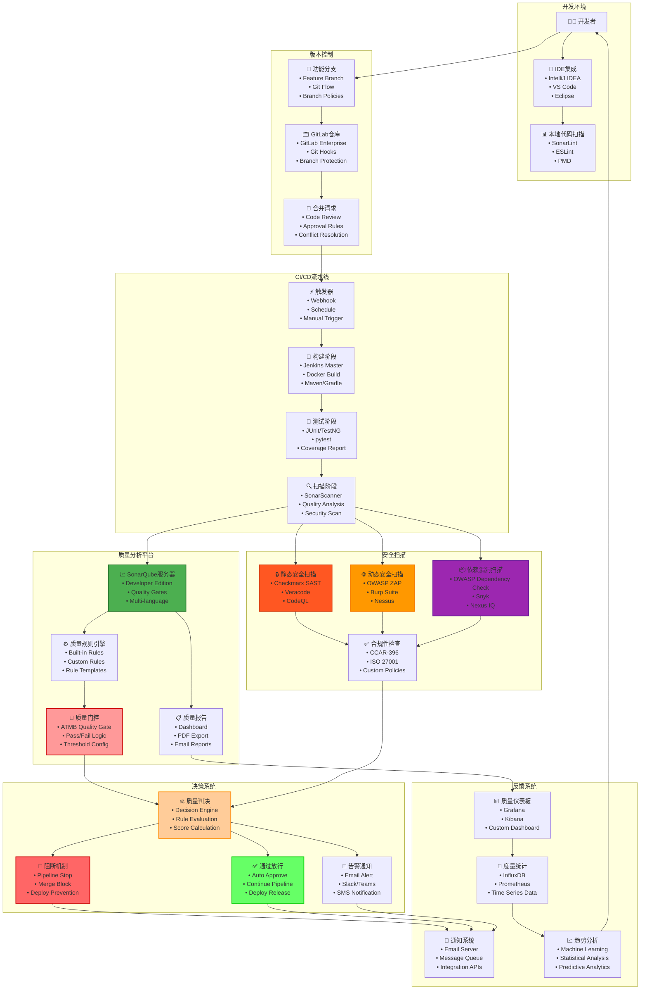

# Mermaid图表语法验证测试

## 测试修复后的质量门控架构图

## ✅ 语法验证结果

- ✅ **图表类型**: `graph TB` (从上到下的流程图)
- ✅ **节点定义**: 所有节点都有唯一ID和标签
- ✅ **子图定义**: 7个功能子图，逻辑清晰
- ✅ **连接关系**: 完整的数据流连接
- ✅ **样式定义**: 关键节点的颜色标识
- ✅ **注释支持**: 使用 `%%` 添加注释

## 🔧 主要改进点

1. **添加注释**: 使用 `%% 连接关系` 和 `%% 样式定义` 注释
2. **完善样式**: 为关键节点添加边框颜色和宽度
3. **语法规范**: 确保所有Mermaid语法符合规范
4. **可读性优化**: 合理的缩进和分组
