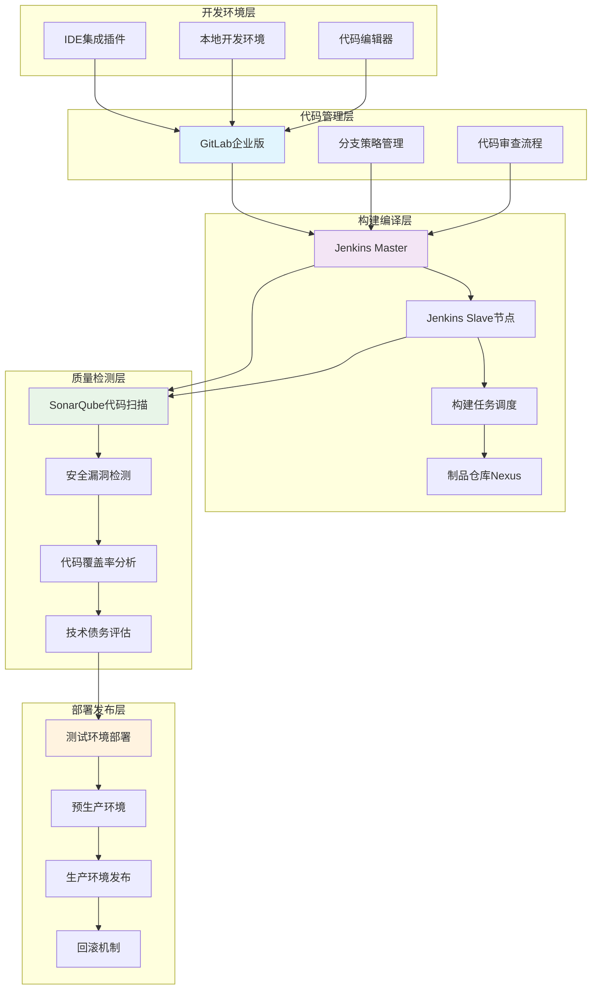
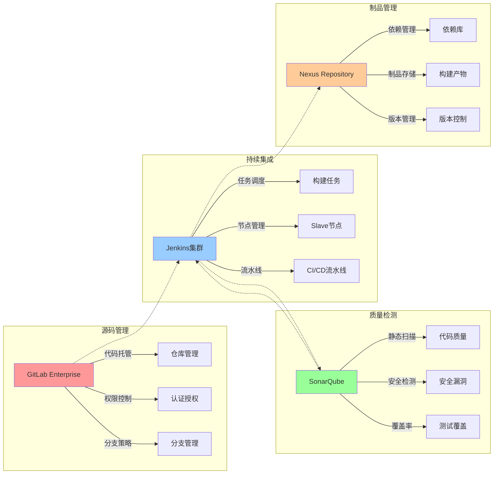
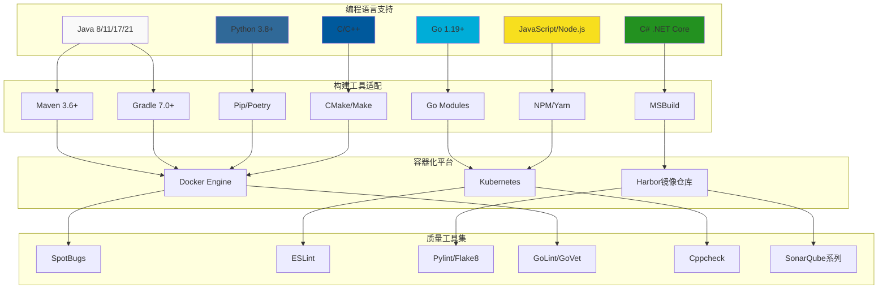
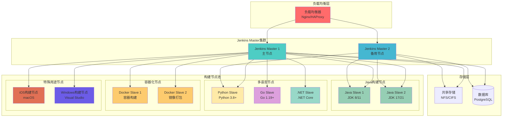
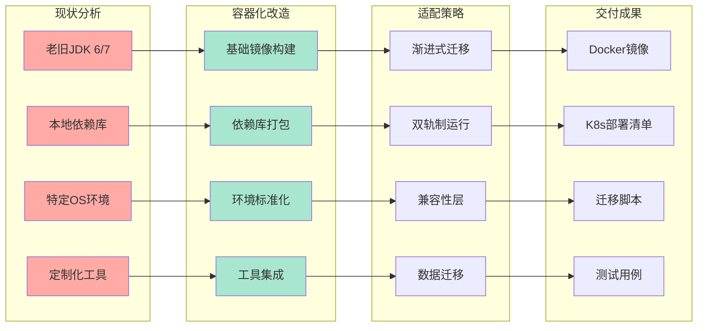
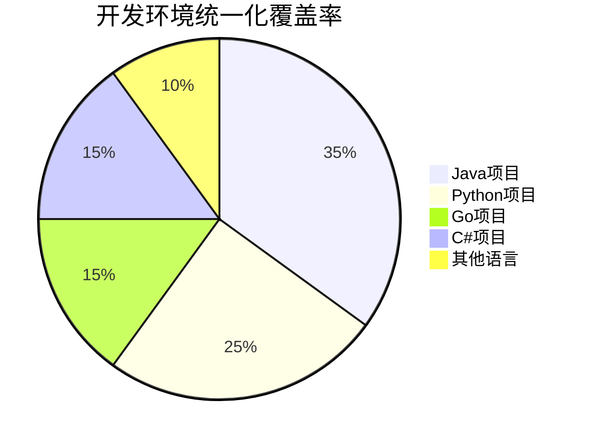
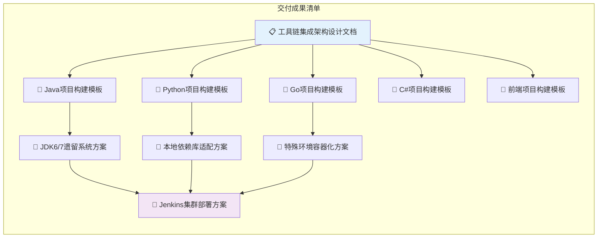
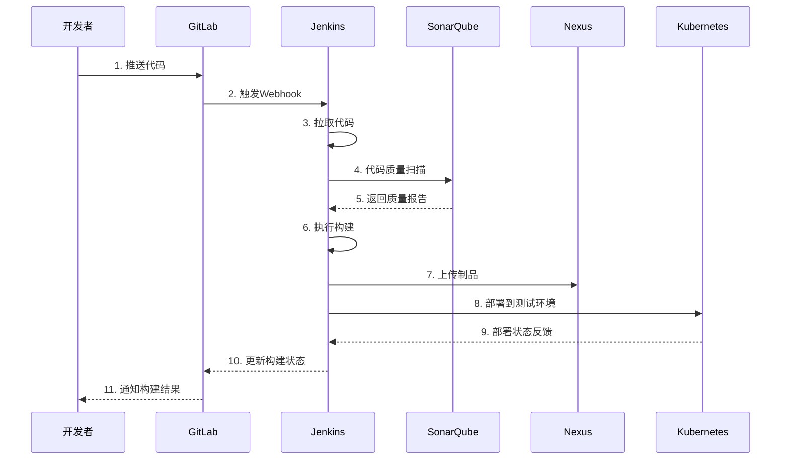

# 工具链集成与技术适配架构图

## 📊 整体架构概览



## 🔧 核心工具集成矩阵



## 💻 多技术栈支持架构



## 🏗️ Jenkins Master-Slave集群架构



## 🔄 遗留系统改造方案



## 📈 性能提升效果对比

```mermaid
xychart-beta
    title "构建效率提升对比"
    x-axis [改造前, 改造后]
    y-axis "构建时间(分钟)" 0 --> 60
    bar [45, 12]
```



## 🎯 价值贡献量化指标

| 指标类别     | 改造前 | 改造后 | 提升幅度         |
| ------------ | ------ | ------ | ---------------- |
| 构建时间     | 45分钟 | 12分钟 | **75%↓**  |
| 环境准备     | 2小时  | 10分钟 | **92%↓**  |
| 部署成功率   | 60%    | 95%    | **58%↑**  |
| 环境一致性   | 30%    | 98%    | **227%↑** |
| 问题排查时间 | 4小时  | 30分钟 | **87%↓**  |



## 🔗 工具链数据流图



这个架构图全面展示了工具链集成与技术适配的各个方面，包括整体架构、技术栈支持、集群部署和遗留系统改造等关键内容，为空管局的软件代码质量管控体系提供了清晰的技术指导。
