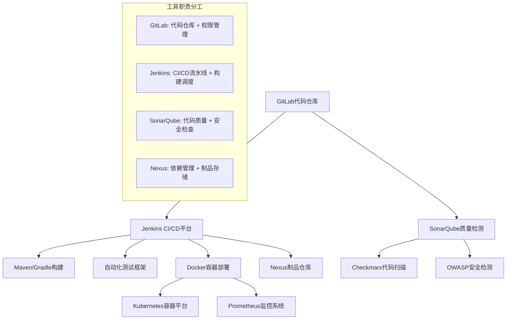
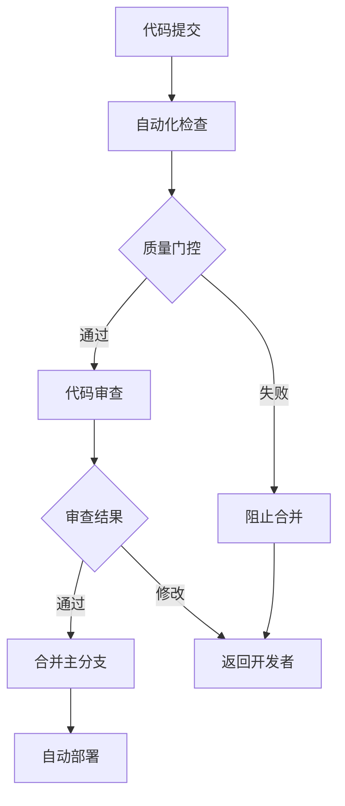

# 空管局软件代码质量技术咨询建议方案

## 📋 项目概述

### 项目背景

空管局作为民航关键基础设施单位，其软件系统的质量和安全性直接关系到航空安全。本方案旨在建立完善的软件代码质量管控体系，提升研发效率和软件质量。

### 核心目标

- 建立标准化的代码质量管控流程
- 实现多技术栈的统一质量管理
- 提升软件安全性和可靠性
- 优化开发和运维效率

### 实施原则

- **安全第一**：民航软件质量要求严格，安全性是首要考虑
- **兼容并包**：适配现有多样化技术栈和遗留系统
- **渐进改进**：分阶段实施，确保业务连续性
- **标准统一**：建立统一的质量标准和流程规范

## 🔧 一、工具链集成与技术适配方案（重要）

### 1.1 多工具兼容性集成架构

#### 架构决策说明

**为什么不采用Jenkins + GitLab CI混合方案？**

很多企业在选择CI/CD工具时容易犯的错误是认为"工具越多越好"，但实际上：

1. **职责重叠问题**：Jenkins和GitLab CI都可以做CI/CD，同时使用会导致：

   - 流水线逻辑分散在两个平台
   - 故障排查困难（不知道问题出在哪个工具）
   - 维护成本翻倍（需要维护两套系统）
2. **数据一致性问题**：

   - 构建状态可能不同步
   - 部署记录分散存储
   - 监控指标难以统一
3. **团队协作问题**：

   - 开发人员需要掌握两套工具
   - 运维人员维护复杂度倍增
   - 新人学习成本高

**正确的工具选择原则：**

- 一个功能领域选择一个最适合的工具
- 工具间通过API集成，而不是功能重叠
- 简化架构，降低复杂度

#### 核心集成方案



**明确的工具职责划分：**

- **GitLab**：专注代码仓库管理、分支策略、权限控制
- **Jenkins**：专注CI/CD流水线、构建调度、部署管理
- **SonarQube**：专注代码质量分析、安全漏洞检测
- **Nexus**：专注依赖管理、制品仓库、版本控制

#### 具体实施建议

**代码仓库集成：**

- **主推方案**：GitLab Enterprise（支持私有化部署）
- **备选方案**：GitHub Enterprise Server
- **集成要点**：
  - 统一权限管理与LDAP/AD集成
  - 分支策略标准化（主分支保护、MR/PR审核）
  - 代码提交规范和自动化检查

**CI引擎选择策略：**

**方案A：Jenkins（推荐）**

- **适用场景**：复杂企业环境，需要高度定制化
- **优势**：
  - 插件生态最丰富（2000+插件）
  - 支持复杂的多分支流水线
  - 强大的Master-Slave分布式构建
  - 与各种工具集成能力强
  - 支持复杂的审批流程和权限控制
- **劣势**：配置相对复杂，需要专业运维
- **推荐指数**：⭐⭐⭐⭐⭐

**方案B：GitLab CI（备选）**

- **适用场景**：以GitLab为核心的轻量级环境
- **优势**：
  - 与GitLab深度集成，配置简单
  - YAML配置文件，版本控制友好
  - 内置Docker支持
  - 界面现代化，学习成本低
- **劣势**：插件生态相对有限，复杂场景支持不足
- **推荐指数**：⭐⭐⭐⭐

**方案C：混合模式（不推荐）**

- 同时使用Jenkins和GitLab CI会增加架构复杂性
- 工具职责重叠，维护成本高
- 容易出现配置冲突和数据不一致

**空管局推荐方案：Jenkins**

```groovy
// Jenkins Pipeline示例配置
pipeline {
    agent any
  
    stages {
        stage('Static Analysis') {
            parallel {
                stage('SonarQube Scan') {
                    steps {
                        withSonarQubeEnv('SonarQube') {
                            sh 'mvn sonar:sonar'
                        }
                    }
                }
                stage('Checkstyle') {
                    steps {
                        sh 'mvn checkstyle:check'
                    }
                }
            }
        }
      
        stage('Test') {
            steps {
                sh 'mvn test'
            }
            post {
                always {
                    junit 'target/surefire-reports/*.xml'
                    publishCoverage adapters: [jacocoAdapter('target/site/jacoco/jacoco.xml')]
                }
            }
        }
      
        stage('Security Scan') {
            steps {
                sh 'mvn dependency-check:check'
            }
        }
      
        stage('Build & Deploy') {
            steps {
                sh 'mvn package'
                archiveArtifacts artifacts: 'target/*.jar'
            }
        }
    }
  
    post {
        always {
            cleanWs()
        }
        failure {
            emailext (
                subject: "Build Failed: ${env.JOB_NAME} - ${env.BUILD_NUMBER}",
                body: "Build failed. Check Jenkins for details.",
                to: "devops@atc.com"
            )
        }
    }
}
```

**构建工具矩阵：**

| 语言       | 构建工具     | 版本管理    | 依赖管理         |
| ---------- | ------------ | ----------- | ---------------- |
| Java       | Maven/Gradle | JDK 8/11/17 | Nexus Repository |
| Python     | pip/poetry   | Python 3.8+ | PyPI Mirror      |
| Go         | go mod       | Go 1.19+    | GOPROXY          |
| C++        | CMake        | GCC/Clang   | Conan            |
| C#         | MSBuild      | .NET 6+     | NuGet            |
| JavaScript | npm/yarn     | Node 16+    | npm Registry     |

### 1.2 技术栈多样性适配方案

#### 多语言项目流水线设计

**Java项目流水线：**

```yaml
java_pipeline:
  image: openjdk:11
  before_script:
    - apt-get update -qy && apt-get install -y maven
  stages:
    - compile:
        script: mvn clean compile
    - test:
        script: mvn test
        coverage: '/Total.*?([0-9]{1,3})%/'
    - quality_gate:
        script: mvn sonar:sonar
    - security_scan:
        script: mvn dependency-check:check
    - package:
        script: mvn package
        artifacts:
          paths: [target/*.jar]
```

**Python项目流水线：**

```yaml
python_pipeline:
  image: python:3.9
  before_script:
    - pip install -r requirements.txt
  stages:
    - lint:
        script: 
          - flake8 .
          - pylint src/
    - test:
        script: 
          - pytest --cov=src tests/
          - coverage xml
    - security:
        script: bandit -r src/
    - package:
        script: python setup.py sdist bdist_wheel
```

#### 框架特定配置

**Spring Boot项目：**

- 集成Spring Boot Actuator健康检查
- 配置JaCoCo代码覆盖率
- 集成Checkstyle代码规范检查

**React/Vue项目：**

- ESLint + Prettier代码格式化
- Jest单元测试 + Cypress E2E测试
- webpack-bundle-analyzer性能分析

### 1.3 遗留系统适配策略

#### 兼容性评估矩阵

| 系统类型       | 技术栈            | 适配难度 | 推荐方案              |
| -------------- | ----------------- | -------- | --------------------- |
| 老旧Java系统   | JDK 6/7           | 高       | 容器化封装 + 渐进升级 |
| C++本地库      | 特定编译环境      | 高       | Docker构建环境        |
| .NET Framework | Windows依赖       | 中       | Windows Container     |
| 数据库存储过程 | Oracle/SQL Server | 中       | 数据库CI/CD工具       |

#### 具体适配方案

**老旧JDK项目适配：**

```dockerfile
# Dockerfile for JDK 7 legacy projects
FROM centos:7
RUN yum install -y java-1.7.0-openjdk-devel
COPY legacy-libs/ /opt/legacy-libs/
ENV JAVA_HOME=/usr/lib/jvm/java-1.7.0-openjdk
ENV CLASSPATH=$CLASSPATH:/opt/legacy-libs/*
```

**本地库依赖管理：**

```yaml
# CI配置示例
legacy_build:
  image: custom/legacy-env:latest
  before_script:
    - cp -r /shared/legacy-libs ./libs/
    - export LD_LIBRARY_PATH=$LD_LIBRARY_PATH:./libs
  script:
    - make clean && make all
  cache:
    paths:
      - libs/
```

## 🛡️ 二、质量与安全管控方案（重要）

### 2.1 自动化测试工具集成

#### 测试策略金字塔

```
        E2E Tests (10%)
    Integration Tests (20%)
    Unit Tests (70%)
```

#### 工具选型矩阵

| 测试类型 | Java           | Python        | JavaScript | C++         | 推荐覆盖率 |
| -------- | -------------- | ------------- | ---------- | ----------- | ---------- |
| 单元测试 | JUnit 5        | pytest        | Jest       | Google Test | ≥80%      |
| 集成测试 | TestContainers | pytest-docker | Supertest  | Catch2      | ≥60%      |
| E2E测试  | Selenium       | Playwright    | Cypress    | -           | ≥30%      |
| 性能测试 | JMeter         | locust        | k6         | -           | 关键接口   |

#### 自动化测试最佳实践

**测试用例覆盖度要求：**

```yaml
coverage_rules:
  line_coverage: 80%
  branch_coverage: 70%
  function_coverage: 90%
  
  critical_modules:
    - flight_control: 95%
    - safety_system: 98%
    - communication: 90%
```

**测试数据管理：**

```python
# 测试数据工厂模式
class FlightDataFactory:
    @staticmethod
    def create_flight_plan():
        return {
            "flight_id": "CA1234",
            "departure": "PEK",
            "arrival": "SHA",
            "altitude": 10000,
            "speed": 450
        }
  
    @staticmethod
    def create_aircraft_status():
        return {
            "aircraft_id": "B-1234",
            "position": {"lat": 39.9, "lng": 116.4},
            "status": "normal"
        }
```

**关键点测试检查清单：**

- [ ] 边界值测试（最大/最小航班数量）
- [ ] 异常情况测试（通信中断、系统故障）
- [ ] 并发测试（多航班同时处理）
- [ ] 安全测试（权限验证、数据加密）
- [ ] 性能测试（响应时间、吞吐量）

### 2.2 代码静态扫描工具集成

#### 多语言静态检查工具配置

**Java项目配置：**

```xml
<!-- SonarQube Maven插件配置 -->
<plugin>
    <groupId>org.sonarsource.scanner.maven</groupId>
    <artifactId>sonar-maven-plugin</artifactId>
    <version>3.9.1.2184</version>
</plugin>

<!-- Checkstyle配置 -->
<plugin>
    <groupId>org.apache.maven.plugins</groupId>
    <artifactId>maven-checkstyle-plugin</artifactId>
    <configuration>
        <configLocation>checkstyle.xml</configLocation>
        <failOnViolation>true</failOnViolation>
    </configuration>
</plugin>
```

**Python项目配置：**

```ini
# .flake8配置
[flake8]
max-line-length = 88
exclude = migrations,venv
ignore = E203,W503

# pylint配置
[MESSAGES CONTROL]
disable = C0111,R0903,R0913
```

**JavaScript项目配置：**

```json
{
  "extends": ["eslint:recommended", "@typescript-eslint/recommended"],
  "rules": {
    "no-unused-vars": "error",
    "no-console": "warn",
    "complexity": ["error", 10]
  }
}
```

#### 质量门控标准

**代码质量指标：**

| 指标       | 新代码要求 | 整体代码要求 | 关键模块要求 |
| ---------- | ---------- | ------------ | ------------ |
| 代码覆盖率 | ≥80%      | ≥70%        | ≥90%        |
| 重复代码率 | ≤3%       | ≤5%         | ≤1%         |
| 技术债务   | ≤1h       | ≤8h         | ≤30min      |
| 代码复杂度 | ≤10       | ≤15         | ≤8          |
| 安全漏洞   | 0个高危    | 0个高危      | 0个中危以上  |

### 2.3 负面清单与工具支撑

#### 代码质量负面清单

**安全类违规（一票否决）：**

- [ ] 硬编码密码、密钥
- [ ] SQL注入风险代码
- [ ] 未验证的外部输入
- [ ] 敏感信息日志输出
- [ ] 弱加密算法使用

**可靠性违规（严重）：**

- [ ] 空指针引用风险
- [ ] 资源泄露（文件、连接未关闭）
- [ ] 线程安全问题
- [ ] 异常处理缺失
- [ ] 关键路径无监控

**可维护性违规（警告）：**

- [ ] 方法行数>50行
- [ ] 类复杂度>15
- [ ] 重复代码>5%
- [ ] 注释覆盖率<20%
- [ ] 命名不规范

#### 工具支撑实现

**SonarQube质量规则配置：**

```json
{
  "quality_profiles": {
    "java": {
      "rules": [
        {"key": "squid:S106", "severity": "BLOCKER"},
        {"key": "squid:S1075", "severity": "CRITICAL"},
        {"key": "squid:S1192", "severity": "MAJOR"}
      ]
    }
  },
  "quality_gates": {
    "conditions": [
      {"metric": "new_coverage", "op": "LT", "error": "80"},
      {"metric": "new_duplicated_lines_density", "op": "GT", "error": "3"},
      {"metric": "new_vulnerabilities", "op": "GT", "error": "0"}
    ]
  }
}
```

**自动化检查脚本：**

```bash
#!/bin/bash
# pre-commit hook
set -e

echo "Running code quality checks..."

# 检查敏感信息
if grep -r "password\|secret\|key" --include="*.java" .; then
    echo "ERROR: Found potential sensitive information"
    exit 1
fi

# 检查代码复杂度
if mvn sonar:sonar -Dsonar.analysis.mode=preview | grep "FAILED"; then
    echo "ERROR: Code quality check failed"
    exit 1
fi

echo "Code quality check passed"
```

### 2.4 质量把控流程实践

#### 质量门控流程图



#### 分层质量控制

**开发阶段：**

1. **IDE集成**：实时代码检查插件
2. **提交前检查**：pre-commit hook验证
3. **本地构建**：开发者本地质量验证

**集成阶段：**

1. **CI自动检查**：全量静态分析
2. **自动化测试**：单元+集成测试
3. **安全扫描**：漏洞和依赖检查

**发布阶段：**

1. **人工审查**：关键代码人工复查
2. **性能测试**：负载和压力测试
3. **验收测试**：业务功能验证

### 2.5 AI编程助手集成方案

#### AI工具选型与部署

**推荐方案：**

- **主选**：GitHub Copilot Enterprise（代码补全）
- **备选**：JetBrains AI Assistant（IDE集成）
- **自建**：CodeGeeX2（支持私有化部署）

**集成策略：**

```yaml
ai_assistant_config:
  enabled: true
  tools:
    - name: "github_copilot"
      scope: ["*.java", "*.py", "*.js"]
      rules:
        - no_sensitive_data_generation
        - code_review_required_for_ai_generated
    - name: "code_review_ai"
      triggers: ["pull_request", "merge_request"]
      checklist:
        - security_vulnerability_check
        - code_quality_assessment
        - best_practice_verification
```

**使用规范：**

1. **代码生成规范**：AI生成代码必须经过人工审查
2. **安全审查**：AI生成代码进行额外安全扫描
3. **质量验证**：AI代码必须通过相同的质量门控
4. **学习反馈**：收集开发者使用反馈，优化配置

### 2.6 安全漏洞检测集成

#### SAST/DAST工具集成架构

**SAST（静态应用安全测试）：**

- **Checkmarx**：商业解决方案，支持多语言
- **SonarQube Security**：开源方案，社区活跃
- **Veracode**：云端服务，易于集成

**DAST（动态应用安全测试）：**

- **OWASP ZAP**：开源动态扫描工具
- **Burp Suite Enterprise**：商业解决方案
- **Nessus**：网络安全扫描

#### 集成配置示例

**Jenkins Pipeline安全检查：**

```groovy
pipeline {
    agent any
    stages {
        stage('SAST Scan') {
            steps {
                script {
                    // Checkmarx扫描
                    step([$class: 'CxScanBuilder',
                        projectName: 'ATC-System',
                        preset: 'Checkmarx Default',
                        vulnerabilityThresholdResult: 'FAILURE',
                        highThreshold: 0,
                        mediumThreshold: 10])
                }
            }
        }
        stage('Dependency Check') {
            steps {
                dependencyCheck additionalArguments: '--format XML', 
                               odcInstallation: 'OWASP-DC'
                dependencyCheckPublisher pattern: 'dependency-check-report.xml'
            }
        }
        stage('DAST Scan') {
            steps {
                script {
                    // ZAP扫描
                    sh 'zap-baseline.py -t http://test-app-url -r zap-report.html'
                }
            }
        }
    }
}
```

**安全扫描报告集成：**

```yaml
security_reports:
  sast:
    tool: "checkmarx"
    report_format: "xml"
    fail_on_high: true
    fail_on_medium: false
  
  dependency_scan:
    tool: "owasp_dependency_check"
    update_database: true
    fail_on_cvss: 7.0
  
  dast:
    tool: "zap"
    target_url: "${TEST_ENVIRONMENT_URL}"
    auth_required: true
```

## 🔧 三、运维与稳定性方案（次要）

### 3.1 CI监控与告警方案

#### 监控指标体系

**构建质量指标：**

| 指标类别   | 具体指标           | 目标值   | 告警阈值 |
| ---------- | ------------------ | -------- | -------- |
| 构建成功率 | 主分支构建成功率   | ≥95%    | <90%     |
| 构建时间   | 平均构建时长       | ≤10分钟 | >15分钟  |
| 测试通过率 | 自动化测试通过率   | ≥98%    | <95%     |
| 部署成功率 | 生产环境部署成功率 | ≥99%    | <95%     |

**资源使用监控：**

```yaml
monitoring_config:
  jenkins_metrics:
    - build_queue_length
    - executor_utilization
    - build_duration_percentiles
    - failed_build_rate
  
  infrastructure_metrics:
    - cpu_utilization
    - memory_usage
    - disk_io_rate
    - network_throughput
  
  alert_rules:
    - name: "high_build_failure_rate"
      condition: "build_failure_rate > 0.1"
      severity: "warning"
      notification: ["devops@atc.com"]
```

#### 告警与通知机制

**多渠道告警配置：**

```json
{
  "notification_channels": [
    {
      "name": "slack_devops",
      "type": "slack",
      "webhook": "https://hooks.slack.com/...",
      "conditions": ["build_failure", "security_alert"]
    },
    {
      "name": "email_managers",
      "type": "email",
      "recipients": ["manager@atc.com"],
      "conditions": ["deployment_failure", "critical_vulnerability"]
    },
    {
      "name": "sms_oncall",
      "type": "sms",
      "recipients": ["+86138****"],
      "conditions": ["production_down", "security_breach"]
    }
  ]
}
```

### 3.2 日常运维方法建议

#### 运维检查清单

**每日检查项目：**

- [ ] Jenkins构建状态检查
- [ ] 磁盘空间使用率（<80%）
- [ ] 依赖库镜像同步状态
- [ ] 安全扫描结果汇总
- [ ] 备份任务执行状态

**每周维护项目：**

- [ ] 清理旧构建产物
- [ ] 更新安全扫描规则
- [ ] 检查并更新依赖库
- [ ] 性能指标趋势分析
- [ ] 用户反馈收集整理

**每月优化项目：**

- [ ] CI/CD流水线性能优化
- [ ] 工具版本升级评估
- [ ] 安全基线检查更新
- [ ] 团队培训和知识分享
- [ ] 容量规划和预测

#### 自动化运维脚本

**构建环境清理脚本：**

```bash
#!/bin/bash
# cleanup_jenkins.sh

echo "Starting Jenkins workspace cleanup..."

# 清理超过7天的构建产物
find /var/lib/jenkins/workspace -type f -mtime +7 -delete

# 清理Docker无用镜像
docker image prune -f
docker container prune -f

# 清理Maven本地仓库缓存
find ~/.m2/repository -name "*.lastUpdated" -delete

# 生成清理报告
df -h > /tmp/disk_usage_$(date +%Y%m%d).log
echo "Cleanup completed at $(date)"
```

**健康检查脚本：**

```python
#!/usr/bin/env python3
# health_check.py

import requests
import json
from datetime import datetime

def check_jenkins_health():
    """检查Jenkins服务健康状态"""
    try:
        response = requests.get('http://jenkins:8080/api/json')
        if response.status_code == 200:
            return {"status": "healthy", "details": response.json()}
        else:
            return {"status": "unhealthy", "error": response.status_code}
    except Exception as e:
        return {"status": "error", "error": str(e)}

def check_sonarqube_health():
    """检查SonarQube服务健康状态"""
    try:
        response = requests.get('http://sonarqube:9000/api/system/health')
        return response.json()
    except Exception as e:
        return {"status": "error", "error": str(e)}

def generate_health_report():
    """生成健康检查报告"""
    report = {
        "timestamp": datetime.now().isoformat(),
        "services": {
            "jenkins": check_jenkins_health(),
            "sonarqube": check_sonarqube_health()
        }
    }
  
    with open(f'health_report_{datetime.now().strftime("%Y%m%d")}.json', 'w') as f:
        json.dump(report, f, indent=2)
  
    return report

if __name__ == "__main__":
    report = generate_health_report()
    print(json.dumps(report, indent=2))
```

## ⚡ 四、性能与资源优化方案（建议）

### 4.1 构建效率优化

#### 依赖管理优化策略

**Maven私有仓库配置：**

```xml
<!-- settings.xml -->
<settings>
    <mirrors>
        <mirror>
            <id>nexus-aliyun</id>
            <mirrorOf>central</mirrorOf>
            <name>Nexus aliyun</name>
            <url>http://maven.aliyun.com/nexus/content/groups/public</url>
        </mirror>
    </mirrors>
  
    <profiles>
        <profile>
            <id>nexus</id>
            <repositories>
                <repository>
                    <id>internal-nexus</id>
                    <url>http://nexus.internal:8081/repository/maven-public/</url>
                    <releases><enabled>true</enabled></releases>
                    <snapshots><enabled>true</enabled></snapshots>
                </repository>
            </repositories>
        </profile>
    </profiles>
</settings>
```

**NPM私有仓库配置：**

```json
{
  "registry": "http://npm.internal:4873/",
  "scripts": {
    "install:offline": "npm install --prefer-offline --no-audit"
  },
  "npmrc": {
    "cache": "/tmp/npm-cache",
    "registry": "http://npm.internal:4873/"
  }
}
```

#### 构建加速技术

**并行构建配置：**

```yaml
# 多阶段并行构建
build_matrix:
  parallel: 4
  strategy:
    matrix:
      java_version: [8, 11, 17]
      os: [ubuntu-latest, windows-latest]
  
build_optimization:
  maven:
    options: "-T 1C" # 并行线程数=CPU核数
    skip_tests: false
    offline_mode: true
  
  gradle:
    daemon: true
    parallel: true
    build_cache: true
```

**增量构建策略：**

```groovy
// Jenkins Pipeline增量构建
pipeline {
    agent any
    options {
        skipStagesAfterUnstable()
        buildDiscarder(logRotator(numToKeepStr: '10'))
    }
  
    stages {
        stage('Checkout') {
            steps {
                checkout scm
                script {
                    // 检测变更文件
                    def changedFiles = sh(
                        script: "git diff --name-only HEAD~1 HEAD",
                        returnStdout: true
                    ).trim().split('\n')
                  
                    env.JAVA_CHANGED = changedFiles.any { it.endsWith('.java') }
                    env.JS_CHANGED = changedFiles.any { it.endsWith('.js') || it.endsWith('.vue') }
                }
            }
        }
      
        stage('Build Java') {
            when { environment name: 'JAVA_CHANGED', value: 'true' }
            steps {
                sh 'mvn clean compile'
            }
        }
      
        stage('Build Frontend') {
            when { environment name: 'JS_CHANGED', value: 'true' }
            steps {
                sh 'npm run build'
            }
        }
    }
}
```

### 4.2 硬件资源配置建议

#### Jenkins主从架构配置

**为什么选择Jenkins而不是GitLab CI？**

| 对比维度   | Jenkins          | GitLab CI      | 空管局需求匹配度                   |
| ---------- | ---------------- | -------------- | ---------------------------------- |
| 插件生态   | 2000+插件        | 内置功能为主   | Jenkins胜出 - 需要集成多种专业工具 |
| 复杂流水线 | 支持复杂逻辑     | 适合标准流程   | Jenkins胜出 - 民航审批流程复杂     |
| 分布式构建 | Master-Slave成熟 | Runner机制     | Jenkins胜出 - 需要大规模并发构建   |
| 权限控制   | 细粒度权限       | 基于GitLab权限 | Jenkins胜出 - 民航安全要求严格     |
| 学习成本   | 较高             | 较低           | GitLab CI优势 - 但可通过培训解决   |
| 运维复杂度 | 较高             | 较低           | GitLab CI优势 - 但专业团队可承担   |

**空管局选择Jenkins的核心原因：**

1. **安全合规要求**：需要细粒度的权限控制和审计日志
2. **工具集成复杂**：需要集成Checkmarx、SonarQube等多种专业工具
3. **构建规模大**：多语言、多项目并发构建需求
4. **流程复杂性**：民航行业的审批和发布流程非常复杂

**Master节点配置（管理节点）：**

```yaml
jenkins_master:
  cpu: 4 cores
  memory: 8GB
  disk: 500GB SSD
  os: Ubuntu 20.04 LTS
  java_opts: "-Xmx4g -Xms2g -XX:+UseG1GC"
  
  plugins:
    - build-pipeline-plugin
    - kubernetes
    - docker-pipeline
    - sonar
    - checkmarx
```

**Slave节点配置（构建节点）：**

```yaml
jenkins_slaves:
  java_build_node:
    count: 3
    cpu: 8 cores
    memory: 16GB
    disk: 1TB SSD
    docker: enabled
    executors: 4
  
  frontend_build_node:
    count: 2
    cpu: 4 cores
    memory: 8GB
    disk: 500GB SSD
    node_version: [14, 16, 18]
    executors: 6
  
  heavy_task_node:
    count: 1
    cpu: 16 cores
    memory: 32GB
    disk: 2TB SSD
    purpose: "security_scan, performance_test"
    executors: 2
```

#### 容器化构建环境

**Docker构建节点配置：**

```yaml
# docker-compose.yml
version: '3.8'
services:
  jenkins-java-agent:
    image: jenkins/inbound-agent:latest-jdk11
    environment:
      - JENKINS_URL=http://jenkins-master:8080
      - JENKINS_SECRET=${AGENT_SECRET}
      - JENKINS_AGENT_NAME=java-agent
    volumes:
      - /var/run/docker.sock:/var/run/docker.sock
      - maven-cache:/root/.m2
    deploy:
      resources:
        limits:
          cpus: '4'
          memory: 8G
        reservations:
          cpus: '2'
          memory: 4G

volumes:
  maven-cache:
  npm-cache:
  docker-cache:
```

**Kubernetes构建Pod模板：**

```yaml
# jenkins-build-pod-template.yaml
apiVersion: v1
kind: Pod
spec:
  containers:
  - name: maven
    image: maven:3.8.6-openjdk-11
    command: ['sleep']
    args: ['99d']
    volumeMounts:
    - name: maven-cache
      mountPath: /root/.m2
    resources:
      requests:
        memory: "2Gi"
        cpu: "1"
      limits:
        memory: "4Gi"
        cpu: "2"
      
  - name: docker
    image: docker:20.10.17-dind
    securityContext:
      privileged: true
    volumeMounts:
    - name: docker-cache
      mountPath: /var/lib/docker
    
  volumes:
  - name: maven-cache
    persistentVolumeClaim:
      claimName: maven-cache-pvc
  - name: docker-cache
    emptyDir: {}
```

### 4.3 缓存策略优化

#### 多层次缓存架构

**依赖缓存策略：**

```yaml
cache_strategy:
  maven:
    local_cache: "/root/.m2/repository"
    shared_cache: "/shared/maven-cache"
    remote_cache: "http://nexus.internal:8081"
    ttl: "7d"
  
  npm:
    local_cache: "/root/.npm"
    shared_cache: "/shared/npm-cache"
    registry_cache: "http://npm.internal:4873"
    ttl: "3d"
  
  docker:
    layer_cache: true
    registry_mirror: "registry.internal:5000"
    cache_size: "50GB"
    cleanup_policy: "LRU"
```

**Gradle构建缓存：**

```groovy
// gradle.properties
org.gradle.caching=true
org.gradle.parallel=true
org.gradle.daemon=true
org.gradle.configureondemand=true

// build.gradle
buildCache {
    local {
        enabled = true
        directory = new File(rootDir, 'build-cache')
        removeUnusedEntriesAfterDays = 30
    }
  
    remote(HttpBuildCache) {
        url = 'http://gradle-cache.internal:8080/cache/'
        push = true
        enabled = true
    }
}
```

**Docker层缓存优化：**

```dockerfile
# 优化的Dockerfile
FROM openjdk:11-jre-slim as base
RUN apt-get update && apt-get install -y curl && rm -rf /var/lib/apt/lists/*

FROM base as dependencies
COPY pom.xml .
COPY src/main/resources/application.properties src/main/resources/
RUN mvn dependency:go-offline -B

FROM dependencies as build
COPY src src
RUN mvn package -DskipTests

FROM base as runtime
COPY --from=build target/app.jar app.jar
EXPOSE 8080
CMD ["java", "-jar", "app.jar"]
```

#### 缓存监控与清理

**缓存使用监控脚本：**

```bash
#!/bin/bash
# cache_monitor.sh

echo "=== Cache Usage Report ==="
echo "Date: $(date)"
echo

# Maven缓存使用情况
echo "Maven Cache:"
du -sh /shared/maven-cache
find /shared/maven-cache -name "*.jar" | wc -l

# NPM缓存使用情况
echo "NPM Cache:"
du -sh /shared/npm-cache
find /shared/npm-cache -name "*.tgz" | wc -l

# Docker缓存使用情况
echo "Docker Cache:"
docker system df

# 生成清理建议
echo "=== Cleanup Recommendations ==="
find /shared/maven-cache -atime +30 -name "*.jar" | wc -l | \
  xargs echo "Old Maven artifacts to clean:"

find /shared/npm-cache -atime +14 -name "*.tgz" | wc -l | \
  xargs echo "Old NPM packages to clean:"
```

## 📊 实施计划与时间安排

### 第一阶段：基础设施搭建（1-2个月）

**第1-2周：环境准备**

- [ ] 硬件资源采购和配置
- [ ] 基础软件安装（Jenkins、GitLab、SonarQube）
- [ ] 网络和安全配置

**第3-4周：工具链集成**

- [ ] CI/CD平台搭建
- [ ] 代码仓库迁移和配置
- [ ] 基础流水线模板创建

**第5-6周：质量工具集成**

- [ ] SonarQube规则配置
- [ ] 安全扫描工具部署
- [ ] 自动化测试框架搭建

**第7-8周：试点项目验证**

- [ ] 选择2-3个试点项目
- [ ] 完整流程验证
- [ ] 问题修复和优化

### 第二阶段：全面推广（2-3个月）

**第9-12周：分批迁移**

- [ ] Java项目批量迁移
- [ ] Python项目迁移
- [ ] 前端项目迁移
- [ ] 遗留系统适配

**第13-16周：深度集成**

- [ ] AI编程助手部署
- [ ] 高级安全扫描配置
- [ ] 性能测试集成
- [ ] 监控告警完善

### 第三阶段：优化提升（持续进行）

**长期优化项目：**

- [ ] 性能调优和资源优化
- [ ] 流程标准化和自动化
- [ ] 团队培训和能力提升
- [ ] 工具升级和技术演进

## 💰 成本预算估算

### 软件许可费用

| 工具                | 许可类型 | 年费用           | 说明                    |
| ------------------- | -------- | ---------------- | ----------------------- |
| GitLab Enterprise   | 商业许可 | 15万元           | 500用户许可（代码仓库） |
| Jenkins             | 开源     | 0元              | 免费开源（CI/CD引擎）   |
| SonarQube Developer | 商业许可 | 8万元            | 无限制LOC（代码质量）   |
| Checkmarx SAST      | 商业许可 | 25万元           | 企业版（安全扫描）      |
| Nexus Repository    | 商业许可 | 5万元            | Pro版本（制品仓库）     |
| **小计**      |          | **53万元** |                         |

**说明：**

- GitLab主要作为代码仓库使用，不使用其CI功能
- Jenkins作为唯一的CI/CD引擎，避免工具冲突
- 总体许可成本保持不变，但架构更加清晰

### 硬件基础设施

| 设备           | 规格       | 数量 | 单价  | 总价             |
| -------------- | ---------- | ---- | ----- | ---------------- |
| Jenkins Master | 4C8G500G   | 2台  | 2万元 | 4万元            |
| Build Slaves   | 8C16G1T    | 6台  | 3万元 | 18万元           |
| 存储设备       | 10TB NAS   | 1台  | 5万元 | 5万元            |
| 网络设备       | 千兆交换机 | 2台  | 1万元 | 2万元            |
| **小计** |            |      |       | **29万元** |

### 人力投入成本

| 角色           | 投入时间 | 人天单价 | 总成本             |
| -------------- | -------- | -------- | ------------------ |
| DevOps工程师   | 120人天  | 1500元   | 18万元             |
| 安全专家       | 40人天   | 2000元   | 8万元              |
| 系统管理员     | 60人天   | 1200元   | 7.2万元            |
| 项目经理       | 80人天   | 1800元   | 14.4万元           |
| **小计** |          |          | **47.6万元** |

### 培训和咨询费用

| 项目           | 费用             | 说明                 |
| -------------- | ---------------- | -------------------- |
| 团队培训       | 15万元           | DevOps和质量管控培训 |
| 技术咨询       | 20万元           | 外部专家咨询服务     |
| 认证考试       | 5万元            | 团队技能认证         |
| **小计** | **40万元** |                      |

### **总预算：169.6万元**

## 📈 预期收益与价值

### 量化收益指标

**研发效率提升：**

- 代码集成时间：从2小时降低到30分钟（75%提升）
- 缺陷发现时间：从测试阶段提前到开发阶段（60%提前）
- 发布频率：从月度发布提升到周度发布（4倍提升）
- 回滚率：从5%降低到1%（80%降低）

**质量指标改善：**

- 生产环境缺陷率：降低70%
- 安全漏洞数量：降低90%
- 代码复用率：提升50%
- 技术债务：减少60%

**成本节约：**

- 人工测试成本：节约40%
- 故障处理成本：节约60%
- 合规审计成本：节约50%
- 培训成本：节约30%

### 风险管控价值

**安全风险降低：**

- 及早发现安全漏洞，避免生产环境安全事故
- 自动化合规检查，确保满足民航安全标准
- 供应链安全管控，降低第三方组件风险

**业务连续性保障：**

- 自动化回滚机制，快速恢复服务
- 全面的监控告警，提前发现问题
- 标准化流程，降低人为操作风险

## 🎯 成功关键因素

### 组织保障

1. **高层支持**：获得管理层的持续支持和资源投入
2. **团队建设**：组建专业的DevOps团队
3. **文化转变**：建立质量优先的组织文化
4. **持续改进**：建立反馈和优化机制

### 技术保障

1. **渐进实施**：分阶段、分模块逐步推进
2. **充分测试**：在非关键系统先行验证
3. **备份方案**：制定应急预案和回退策略
4. **监控保障**：建立全面的监控体系

### 流程保障

1. **标准化**：制定统一的操作规范
2. **自动化**：减少人工干预和操作错误
3. **可追溯**：建立完整的操作审计日志
4. **持续优化**：定期评估和改进流程

---

**本方案为空管局软件代码质量技术咨询的初步建议，具体实施时需要根据实际情况进行调整和细化。建议先进行详细的现状调研，然后制定更加精确的实施计划。**
