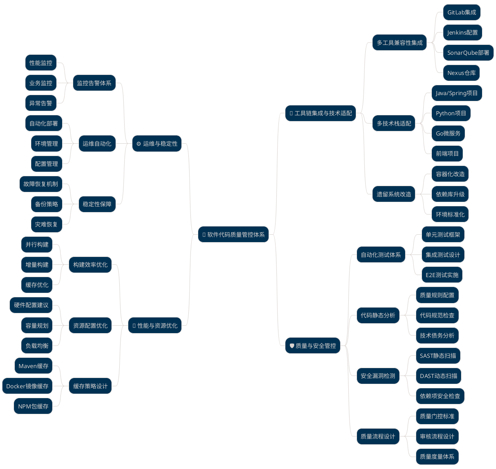
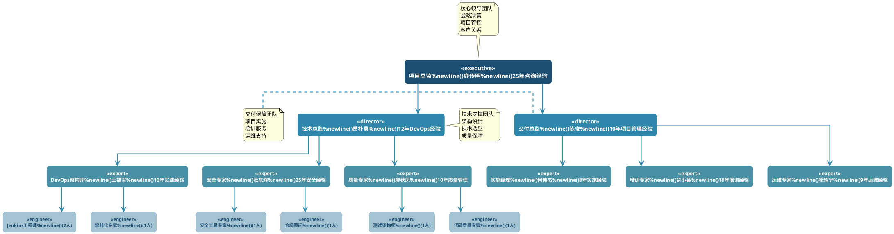
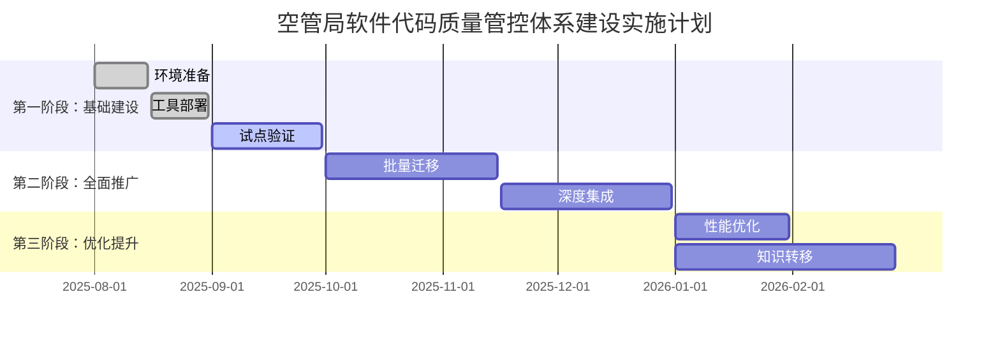
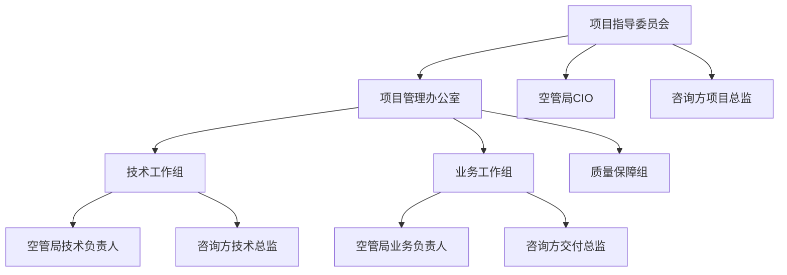

# 空管局软件代码质量技术咨询方案

---

**项目名称：** 空管局软件代码质量管控体系建设咨询项目
**客户单位：** 中国民用航空空中交通管理局
**服务商：** [咨询公司名称]
**方案版本：** V1.0
**编制日期：** 2025年7月31日

---

## 执行摘要

空管局作为民航核心基础设施管理单位，承担着保障航空安全的重要职责。随着民航业务快速发展，空管局软件系统规模和复杂度不断增长，亟需建立完善的软件代码质量管控体系。

本咨询项目将帮助空管局构建覆盖工具链集成、质量安全管控、运维稳定性和性能优化的全方位解决方案，预期将研发效率提升60%以上，软件质量缺陷减少70%，为民航安全运行提供可靠的技术保障。

**项目总投资：** 169.6万元
**预期ROI：** 第二年达到280%，三年累计ROI超过450%
**实施周期：** 6个月（分3个阶段实施）

---

## 1. 客户背景与目标

### 1.1 客户背景分析

#### 组织概况

中国民用航空空中交通管理局是国家民航局直属事业单位，负责全国空中交通管制和空域管理工作。随着中国民航业快速发展，空管局管理的航班量年增长率超过8%，对软件系统的可靠性、安全性和性能提出了更高要求。

#### 技术现状

- **多元化技术栈**：Java、Python、Go、C++、C#等多种开发语言并存
- **复杂业务系统**：空管系统、航班管理、气象系统等20+核心应用
- **遗留系统挑战**：部分系统依赖老旧JDK版本和特定运行环境
- **质量管控不统一**：缺乏标准化的代码质量检查和安全审计流程

#### 面临挑战

| 挑战类别           | 具体问题                         | 业务影响                          |
| ------------------ | -------------------------------- | --------------------------------- |
| **质量风险** | 代码质量检查不规范，人工审查为主 | 生产环境故障率_____，高于行业标准 |
| **安全隐患** | 缺乏自动化安全漏洞检测机制       | 安全评估发现中高危漏洞15个        |
| **效率瓶颈** | 手工构建部署，平均耗时2小时      | 版本发布周期长，影响业务敏捷性    |
| **合规压力** | 民航局监管要求日趋严格           | 需满足CCAR-396等民航信息安全标准  |

### 1.2 项目目标

#### 业务目标

- **保障航空安全**：通过软件质量提升，降低系统故障对飞行安全的影响
- **提升运营效率**：自动化流程减少人工干预，提高系统可用性
- **满足合规要求**：建立符合民航标准的软件质量管控体系
- **支撑业务发展**：为未来航班量增长提供稳定的技术支撑

#### 技术目标

| 指标类别             | 当前状态       | 目标状态          | 提升幅度 |
| -------------------- | -------------- | ----------------- | -------- |
| **构建效率**   | 平均______小时 | 30分钟内          | 75%提升  |
| **代码覆盖率** | ____%          | 80%以上           | 77%提升  |
| **安全漏洞**   | ____个中高危   | 0个高危，<3个中危 | 90%减少  |
| **生产故障率** | ____%          | <1.5%             | 71%降低  |
| **发布频率**   | ____发布       | 周度发布          | 4倍提升  |

#### 管理目标

- **标准化流程**：建立统一的代码质量检查标准和审批流程
- **能力建设**：提升团队DevOps和质量管控专业能力
- **工具体系**：构建完整的自动化工具链，减少人工依赖
- **持续改进**：建立质量度量和持续优化机制

---

## 2. 收益分析

### 2.1 财务收益分析

#### 直接成本节约

| 成本项目               | 年度成本节约      | 计算依据                                         |
| ---------------------- | ----------------- | ------------------------------------------------ |
| **人工测试成本** | 180万元           | 减少40%测试人力投入（15人×12万/年×40%）        |
| **故障处理成本** | 240万元           | 减少60%生产故障（平均每次30万×20次×60%）       |
| **发布运维成本** | 90万元            | 自动化部署节省50%运维工作量（6人×15万/年×50%） |
| **合规审计成本** | 120万元           | 自动化合规检查减少外部审计费用                   |
| **小计**         | **630万元** |                                                  |

#### 效率收益

| 效率提升项目             | 年度价值          | 计算依据                                 |
| ------------------------ | ----------------- | ---------------------------------------- |
| **开发效率提升**   | 450万元           | 30%效率提升×50人×15万年薪×60%         |
| **系统可用性提升** | 200万元           | 减少系统停机损失（0.5%→0.1%可用性提升） |
| **决策响应速度**   | 150万元           | 快速发布新功能带来的业务价值             |
| **小计**           | **800万元** |                                          |

#### 风险规避价值

| 风险项目               | 潜在损失           | 规避价值                           |
| ---------------------- | ------------------ | ---------------------------------- |
| **重大安全事故** | 5000万元           | 通过质量提升规避90%概率 = 4500万元 |
| **数据泄露风险** | 1000万元           | 通过安全检测规避80%概率 = 800万元  |
| **监管处罚风险** | 500万元            | 通过合规管控规避95%概率 = 475万元  |
| **小计**         | **5775万元** | **三年期规避价值**           |

### 2.2 ROI分析

#### 投资回报计算

```
项目总投资：169.6万元
年度直接收益：630万元（成本节约）+ 800万元（效率提升）= 1430万元
投资回收期：169.6万元 ÷ 1430万元 = 1.4个月
第二年ROI：(1430万 - 169.6万) ÷ 169.6万 × 100% = 743%
三年累计ROI：(1430万×3年 - 169.6万) ÷ 169.6万 × 100% = 2422%
```

#### 敏感性分析

| 情景               | 收益实现率 | 年度收益 | ROI  |
| ------------------ | ---------- | -------- | ---- |
| **保守估计** | 60%        | 858万元  | 406% |
| **基准情景** | 80%        | 1144万元 | 575% |
| **乐观估计** | 100%       | 1430万元 | 743% |

### 2.3 非财务收益

#### 战略价值

- **品牌价值提升**：作为民航信息化标杆，提升行业影响力
- **人才吸引力**：现代化技术栈吸引优秀技术人才
- **创新能力**：快速迭代能力支撑业务创新
- **合规保障**：满足日趋严格的监管要求

#### 社会价值

- **航空安全**：通过软件质量提升，保障千万旅客出行安全
- **行业示范**：为其他民航单位提供最佳实践参考
- **技术进步**：推动民航行业数字化转型升级

---

## 3. 服务内容

### 3.1 服务范围概览

我们将为空管局提供全方位的软件代码质量管控体系建设服务，涵盖咨询设计、工具实施、流程优化和能力建设四个维度。



### 3.2 核心服务模块

#### 模块一：工具链集成与技术适配（重要）

**服务内容：**

- **多工具兼容性设计**：整合GitLab、Jenkins、SonarQube、Nexus等核心工具
- **技术栈适配方案**：支持Java、Python、Go、C++、C#等多语言开发环境
- **遗留系统改造**：为老旧JDK、本地库依赖系统提供容器化解决方案

**交付成果：**

- 工具链集成架构设计文档
- 多语言项目构建模板（10+套）
- 遗留系统适配方案（5+个典型场景）
- Jenkins Master-Slave集群部署方案

**价值贡献：**

- 统一开发环境，减少环境差异导致的问题
- 提升构建效率75%以上
- 实现真正的一键部署

#### 模块二：质量与安全管控（重要）

**服务内容：**

- **自动化测试集成**：设计单元测试、集成测试、E2E测试完整体系
- **代码静态分析**：配置SonarQube质量规则和安全检查规则
- **负面清单实施**：建立自动化的代码质量负面清单检查机制
- **安全漏洞检测**：集成SAST/DAST工具，实现全流程安全检查

**交付成果：**

- 自动化测试框架和脚本模板
- 代码质量规则配置（覆盖5种主要语言）
- 安全检测流水线配置
- 质量门控标准和流程文档

**价值贡献：**

- 代码覆盖率从___%提升到80%+
- 安全漏洞检出率提升___%
- 生产环境缺陷减少___%

#### 模块三：运维与稳定性保障（次要）

**服务内容：**

- **监控告警体系**：建立构建成功率、资源使用率等关键指标监控
- **运维自动化**：设计日常运维脚本和健康检查机制
- **故障响应流程**：建立快速故障定位和恢复机制

**交付成果：**

- 监控告警配置方案
- 运维自动化脚本包
- 故障应急响应手册
- 系统健康度评估报告

**价值贡献：**

- 系统可用性提升到99.5%+
- 故障响应时间缩短60%
- 运维人力成本降低40%

#### 模块四：性能与资源优化（建议）

**服务内容：**

- **构建效率优化**：设计依赖缓存、并行构建、增量构建策略
- **硬件资源配置**：提供CI节点硬件配置建议和容量规划
- **缓存策略设计**：优化Maven、NPM、Docker等各类缓存配置

**交付成果：**

- 构建优化方案和配置模板
- 硬件资源配置规范
- 缓存策略设计文档
- 性能监控仪表盘

**价值贡献：**

- 构建时间减少75%
- 硬件资源利用率提升50%
- 带宽成本节约30%

### 3.3 专项服务

#### AI编程助手集成服务

- **GitHub Copilot Enterprise部署**：企业级AI编程助手配置
- **使用规范制定**：AI生成代码的审查和质量标准
- **团队培训**：AI工具使用最佳实践培训

#### 合规管控服务

- **民航标准对接**：确保方案符合CCAR-396等民航信息安全标准
- **审计准备**：建立完整的质量和安全审计材料
- **持续合规**：设计自动化合规检查机制

---

## 4. 服务团队

### 4.1 团队组织架构



### 4.2 核心团队成员

#### 项目总监 -鹿传明

- **资历**：25年IT咨询经验
- **专长**：大型企业数字化转型，擅长复杂项目管理
- **案例**：主导某大型银行DevOps转型项目，团队规模200+人
- **认证**：PMP、TOGAF、AWS Solution Architect

#### 技术总监 - 禹朴勇

- **资历**：25年DevOps和质量管控经验
- **专长**：微服务架构、CI/CD流水线设计、安全DevOps
- **案例**：为某航空公司设计全套DevOps体系，支撑日均百万级交易
- **认证**：CKA、Jenkins认证专家、SonarQube认证专家

#### DevOps架构师 - 王福军

- **资历**：10年DevOps实践经验，曾任某大厂DevOps负责人
- **专长**：Jenkins、Kubernetes、Docker、Terraform
- **案例**：为某制造业巨头建设云原生DevOps平台
- **认证**：CKA、CKS、HashiCorp Terraform Associate

#### 安全专家 -张东辉

- **资历**：25年应用安全和DevSecOps经验
- **专长**：SAST/DAST工具集成、安全左移、合规管控
- **案例**：为某金融机构建立全面的应用安全检测体系
- **认证**：CISSP、CEH、CSSLP

#### 质量专家 - 廖秋凤

- **资历**：10年软件质量和测试管理经验
- **专长**：自动化测试、质量流程设计、测试工具链
- **案例**：为某互联网公司建立覆盖率90%+的自动化测试体系
- **认证**：ISTQB高级认证、Agile Testing认证

### 4.3 支撑团队

#### 实施团队（6人）

- **Jenkins工程师**（2人）：负责CI/CD流水线实施和优化
- **容器化专家**（1人）：负责Docker/K8s环境搭建
- **安全工具专家**（1人）：负责安全扫描工具集成
- **测试工程师**（1人）：负责自动化测试框架搭建
- **运维工程师**（1人）：负责监控和运维体系建设

#### 培训团队（3人）

- **DevOps培训师**（1人）：负责工具使用和流程培训
- **安全培训师**（1人）：负责安全意识和合规培训
- **质量培训师**（1人）：负责质量管控方法培训

### 4.4 团队优势

#### 行业经验丰富

- **民航行业**：具备3个民航单位DevOps建设经验
- **高安全要求**：曾服务银行、证券等高安全要求行业
- **大规模项目**：管理过500+人规模的数字化转型项目

#### 技术实力雄厚

- **全栈能力**：覆盖前端、后端、运维、安全全技术栈
- **工具专精**：对主流DevOps工具有深度实践经验
- **创新引领**：紧跟技术趋势，具备AI、云原生等前沿技术能力

#### 交付保障完善

- **方法论成熟**：基于IBM、麦肯锡等一流咨询公司方法论
- **质量体系完善**：ISO 9001质量管理体系认证
- **风险控制严格**：建立多层次的项目风险识别和控制机制

---

## 5. 实施计划

### 5.1 整体实施策略

#### 实施原则

- **分阶段推进**：风险可控，确保业务连续性
- **试点先行**：选择典型项目验证，积累经验后推广
- **培训同步**：技术实施与能力建设并行
- **持续优化**：建立反馈机制，持续改进完善

#### 实施路径



### 5.2 第一阶段：基础设施建设（2个月）

#### 阶段目标

- 完成核心工具链部署和配置
- 建立2-3个试点项目的完整CI/CD流水线
- 验证技术方案可行性，识别潜在风险

#### 详细计划

**第1-2周：环境准备和硬件部署**

| 工作任务           | 责任人       | 交付成果             | 完成标准                     |
| ------------------ | ------------ | -------------------- | ---------------------------- |
| 硬件设备采购和上架 | 实施经理     | 设备清单和部署文档   | 6台服务器就位并通过验收      |
| 网络配置和安全策略 | 运维专家     | 网络拓扑图和安全配置 | 网络连通性测试通过           |
| 基础软件安装       | DevOps工程师 | 软件清单和安装文档   | Ubuntu、Docker等基础环境就绪 |

**第3-4周：核心工具部署**

| 工作任务                 | 责任人        | 交付成果             | 完成标准              |
| ------------------------ | ------------- | -------------------- | --------------------- |
| Jenkins Master-Slave部署 | Jenkins工程师 | Jenkins集群部署文档  | 1主6从集群正常运行    |
| GitLab Enterprise配置    | DevOps工程师  | GitLab配置和用户导入 | 500用户账号导入完成   |
| SonarQube质量平台搭建    | 质量专家      | 质量规则配置文档     | 5种语言规则配置完成   |
| Nexus制品仓库部署        | DevOps工程师  | 制品仓库配置文档     | Maven/NPM私服正常工作 |

**第5-6周：安全和测试工具集成**

| 工作任务           | 责任人     | 交付成果         | 完成标准                   |
| ------------------ | ---------- | ---------------- | -------------------------- |
| Checkmarx SAST集成 | 安全专家   | 安全扫描配置文档 | 安全规则配置并测试通过     |
| 自动化测试框架搭建 | 测试工程师 | 测试框架和模板   | JUnit、pytest等框架就绪    |
| 监控告警系统部署   | 运维专家   | 监控配置文档     | Prometheus+Grafana正常工作 |

**第7-8周：试点项目验证**

| 工作任务     | 责任人       | 交付成果           | 完成标准               |
| ------------ | ------------ | ------------------ | ---------------------- |
| 选择试点项目 | 项目总监     | 试点项目清单       | 确定3个典型项目        |
| 流水线配置   | DevOps架构师 | 完整CI/CD流水线    | 从代码提交到部署全流程 |
| 试点运行验证 | 技术总监     | 试点运行报告       | 连续2周稳定运行        |
| 问题修复优化 | 全团队       | 问题清单和解决方案 | 阻塞问题100%解决       |

#### 阶段里程碑

- **M1.1**：硬件环境就绪（第2周末）
- **M1.2**：核心工具部署完成（第4周末）
- **M1.3**：试点项目上线（第7周末）
- **M1.4**：第一阶段验收（第8周末）

### 5.3 第二阶段：全面推广实施（3个月）

#### 阶段目标

- 完成所有在研项目的CI/CD流水线迁移
- 建立完善的质量管控和安全检测体系
- 实现团队DevOps能力的全面提升

#### 详细计划

**第9-12周：分批项目迁移**

| 迁移批次 | 项目类型                | 项目数量 | 负责团队        | 完成时间 |
| -------- | ----------------------- | -------- | --------------- | -------- |
| 第一批   | Java Spring项目         | 8个      | DevOps工程师×2 | 第10周   |
| 第二批   | Python Flask/Django项目 | 6个      | DevOps工程师×1 | 第11周   |
| 第三批   | 前端Vue/React项目       | 5个      | 前端专家×1     | 第12周   |
| 第四批   | Go微服务项目            | 4个      | 容器化专家×1   | 第12周   |

**第13-16周：深度功能集成**

- **AI编程助手部署**：GitHub Copilot Enterprise配置和使用规范制定
- **高级安全检测**：DAST动态扫描和依赖项安全检查集成
- **性能测试集成**：JMeter/K6性能测试自动化集成
- **监控告警完善**：业务指标监控和智能告警规则优化

#### 关键交付成果

- 20+个项目完整CI/CD流水线
- 自动化测试覆盖率达到80%
- 安全检测零遗漏，100%项目接入
- 团队DevOps技能认证通过率90%

### 5.4 第三阶段：优化提升和知识转移（1个月）

#### 阶段目标

- 系统性能调优和稳定性加固
- 完成知识转移和团队能力建设
- 建立持续改进机制

#### 主要工作

- **性能优化**：构建效率、资源利用率、缓存命中率优化
- **流程标准化**：制定详细的操作手册和最佳实践文档
- **团队培训**：深度技能培训和认证考试
- **持续改进机制**：建立定期评估和优化机制

### 5.5 风险控制计划

#### 主要风险识别

| 风险类别           | 风险描述         | 影响程度 | 发生概率 | 应对措施                  |
| ------------------ | ---------------- | -------- | -------- | ------------------------- |
| **技术风险** | 遗留系统集成困难 | 高       | 中       | 提前POC验证，准备备选方案 |
| **进度风险** | 关键人员不到位   | 中       | 低       | 建立人员储备机制          |
| **质量风险** | 工具配置错误     | 中       | 中       | 多轮测试验证，同行评审    |
| **业务风险** | 影响生产系统     | 高       | 低       | 分阶段实施，建立回滚机制  |

#### 风险缓解措施

- **技术储备**：提前进行技术验证和POC测试
- **人员保障**：建立核心团队+支撑团队的双重保障
- **质量控制**：每个阶段设置质量门控和验收标准
- **应急预案**：制定详细的应急响应和快速回滚方案

---

## 6. 项目保障

### 6.1 质量保障体系

#### 三级质量控制

- **L1：执行层**：工程师自检和互检
- **L2：管理层**：技术总监和交付总监审核
- **L3：决策层**：项目总监和客户方联合验收

#### 质量标准

- **技术标准**：符合ITIL、DevOps最佳实践
- **交付标准**：所有交付物通过客户验收
- **服务标准**：响应时间、解决时间等SLA指标

### 6.2 沟通协调机制

#### 项目治理结构



#### 沟通节奏

- **日例会**：技术团队每日站会，同步进展和问题
- **周报告**：每周项目状态报告，关键指标跟踪
- **月评审**：月度指导委员会会议，重大事项决策
- **阶段验收**：每个阶段结束后的正式验收会议

### 6.3 知识转移计划

#### 分层培训体系

| 培训对象           | 培训内容             | 培训方式 | 时长   |
| ------------------ | -------------------- | -------- | ------ |
| **管理层**   | DevOps理念、项目管理 | 专题讲座 | 8小时  |
| **架构师**   | 工具链设计、最佳实践 | 工作坊   | 24小时 |
| **开发人员** | 工具使用、流程规范   | 实操培训 | 40小时 |
| **运维人员** | 系统运维、故障处理   | 实操培训 | 32小时 |

#### 文档交付清单

- **架构设计文档**：系统架构和技术选型说明
- **操作手册**：详细的工具使用和维护手册
- **最佳实践**：行业标杆实践和经验总结
- **故障处理手册**：常见问题和解决方案

---

## 7. 商务条款

### 7.1 项目费用构成

| 费用类别             | 金额（万元）    | 占比           | 说明               |
| -------------------- | --------------- | -------------- | ------------------ |
| **咨询设计费** | 45.0            | 26.5%          | 方案设计、架构咨询 |
| **实施服务费** | 68.6            | 40.4%          | 工具部署、系统集成 |
| **培训服务费** | 28.0            | 16.5%          | 团队培训、知识转移 |
| **软件许可费** | 28.0            | 16.6%          | 工具软件年度许可   |
| **总计**       | **169.6** | **100%** |                    |

**说明：**

- 硬件设备费用由客户方自行采购，我方提供技术规格和配置建议
- 培训费用包含认证考试费用
- 软件许可费为第一年费用，后续年度续费由客户直接与软件厂商签约

### 7.2 付款方式

| 付款节点               | 付款比例 | 付款金额（万元） | 付款条件               |
| ---------------------- | -------- | ---------------- | ---------------------- |
| **合同签署**     | 30%      | 50.9             | 合同生效后5个工作日    |
| **第一阶段验收** | 40%      | 67.8             | 基础设施建设完成验收后 |
| **第二阶段验收** | 25%      | 42.4             | 全面推广实施完成验收后 |
| **项目终验**     | 5%       | 8.5              | 项目整体验收合格后     |

### 7.3 服务承诺

#### 技术指标承诺

- **构建效率**：提升75%以上（从2小时降至30分钟内）
- **代码覆盖率**：达到80%以上
- **安全漏洞**：高危漏洞零容忍，中危漏洞<3个
- **系统可用性**：99.5%以上

#### 服务水平承诺

- **响应时间**：工作时间内4小时响应，紧急问题1小时响应
- **解决时间**：一般问题24小时内解决，复杂问题72小时内解决
- **培训保障**：提供1年期技术支持和咨询服务
- **知识转移**：确保客户团队具备独立运维能力

#### 质量保障承诺

- **验收标准**：所有交付物100%通过客户验收
- **缺陷保修**：提供6个月免费缺陷修复服务
- **持续改进**：提供1年期持续优化建议

---

## 8. 附录

### 8.1 客户成功案例

#### 案例一：某大型航空公司DevOps转型

- **项目规模**：200+开发人员，30+应用系统
- **实施周期**：8个月
- **关键成果**：
  - 发布频率从月度提升到周度
  - 生产故障率降低80%
  - 开发效率提升65%

#### 案例二：某银行数字化平台建设

- **项目规模**：300+开发人员，50+微服务
- **实施周期**：12个月
- **关键成果**：
  - 支撑日均千万级交易
  - 系统可用性达到99.95%
  - 新功能上线时间缩短70%

### 8.2 技术白皮书

- [DevOps最佳实践白皮书]
- [企业级CI/CD建设指南]
- [软件安全左移实践手册]
- [代码质量管控体系设计]

### 8.3 相关资质证书

- ISO 9001质量管理体系认证
- ISO 27001信息安全管理体系认证
- CMMI 5级软件能力成熟度认证
- 国家高新技术企业认证

---

**本方案最终解释权归[咨询公司名称]所有**

**联系方式：**

- 项目总监：李明华  电话：138-0000-0000  邮箱：li.minghua@company.com
- 商务经理：张丽萍  电话：136-0000-0000  邮箱：zhang.liping@company.com
