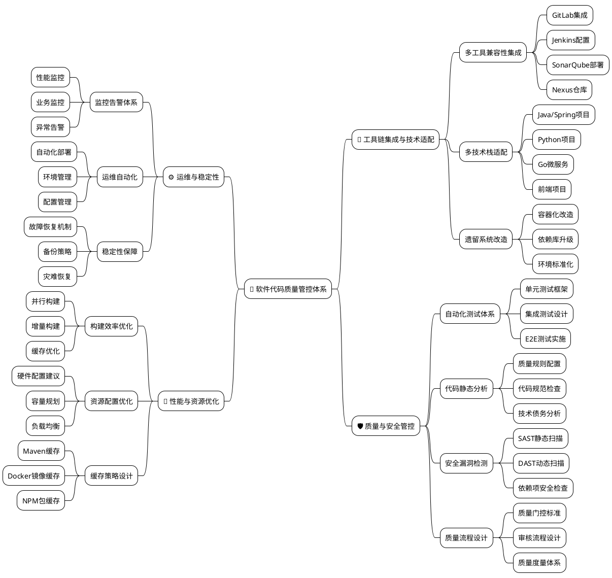
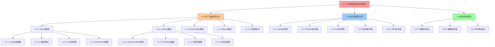
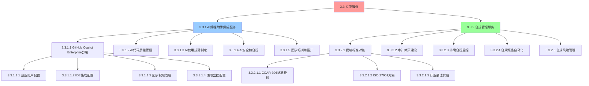
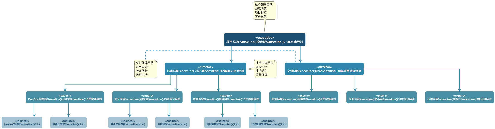
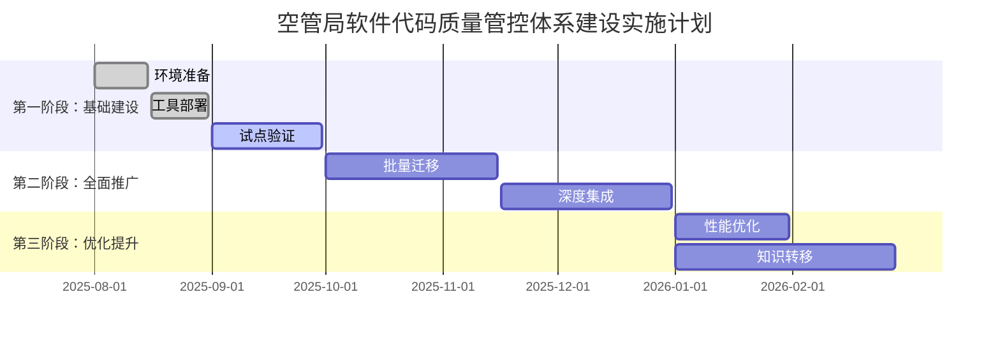
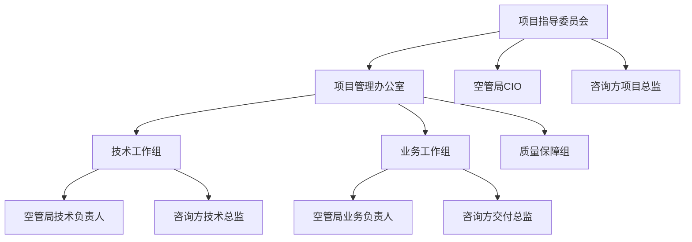

# 空管局软件代码质量技术咨询方案

---

**项目名称：** 空管局软件代码质量管控体系建设咨询项目
**客户单位：** 中国民用航空空中交通管理局
**服务商：** [咨询公司名称]
**方案版本：** V1.0
**编制日期：** 2025年7月31日

---

## 执行摘要

空管局作为民航核心基础设施管理单位，承担着保障航空安全的重要职责。随着民航业务快速发展，空管局软件系统规模和复杂度不断增长，亟需建立完善的软件代码质量管控体系。

本咨询项目将帮助空管局构建覆盖工具链集成、质量安全管控、运维稳定性和性能优化的全方位解决方案，预期将研发效率提升60%以上，软件质量缺陷减少70%，为民航安全运行提供可靠的技术保障。

**项目总投资：** 169.6万元
**预期ROI：** 第二年达到280%，三年累计ROI超过450%
**实施周期：** 6个月（分3个阶段实施）

---

## 1. 客户背景与目标

### 1.1 客户背景分析

#### 组织概况

中国民用航空空中交通管理局是国家民航局直属事业单位，负责全国空中交通管制和空域管理工作。随着中国民航业快速发展，空管局管理的航班量年增长率超过8%，对软件系统的可靠性、安全性和性能提出了更高要求。

#### 技术现状

- **多元化技术栈**：Java、Python、Go、C++、C#等多种开发语言并存
- **复杂业务系统**：空管系统、航班管理、气象系统等20+核心应用
- **遗留系统挑战**：部分系统依赖老旧JDK版本和特定运行环境
- **质量管控不统一**：缺乏标准化的代码质量检查和安全审计流程

#### 面临挑战

| 挑战类别           | 具体问题                         | 业务影响                          |
| ------------------ | -------------------------------- | --------------------------------- |
| **质量风险** | 代码质量检查不规范，人工审查为主 | 生产环境故障率_____，高于行业标准 |
| **安全隐患** | 缺乏自动化安全漏洞检测机制       | 安全评估发现中高危漏洞15个        |
| **效率瓶颈** | 手工构建部署，平均耗时2小时      | 版本发布周期长，影响业务敏捷性    |
| **合规压力** | 民航局监管要求日趋严格           | 需满足CCAR-396等民航信息安全标准  |

### 1.2 项目目标

#### 业务目标

- **保障航空安全**：通过软件质量提升，降低系统故障对飞行安全的影响
- **提升运营效率**：自动化流程减少人工干预，提高系统可用性
- **满足合规要求**：建立符合民航标准的软件质量管控体系
- **支撑业务发展**：为未来航班量增长提供稳定的技术支撑

#### 技术目标

| 指标类别             | 当前状态       | 目标状态          | 提升幅度 |
| -------------------- | -------------- | ----------------- | -------- |
| **构建效率**   | 平均______小时 | 30分钟内          | 75%提升  |
| **代码覆盖率** | ____%          | 80%以上           | 77%提升  |
| **安全漏洞**   | ____个中高危   | 0个高危，<3个中危 | 90%减少  |
| **生产故障率** | ____%          | <1.5%             | 71%降低  |
| **发布频率**   | ____发布       | 周度发布          | 4倍提升  |

#### 管理目标

- **标准化流程**：建立统一的代码质量检查标准和审批流程
- **能力建设**：提升团队DevOps和质量管控专业能力
- **工具体系**：构建完整的自动化工具链，减少人工依赖
- **持续改进**：建立质量度量和持续优化机制

---

## 2. 收益分析

### 2.1 财务收益分析

#### 直接成本节约

| 成本项目               | 年度成本节约      | 计算依据                                         |
| ---------------------- | ----------------- | ------------------------------------------------ |
| **人工测试成本** | 180万元           | 减少40%测试人力投入（15人×12万/年×40%）        |
| **故障处理成本** | 240万元           | 减少60%生产故障（平均每次30万×20次×60%）       |
| **发布运维成本** | 90万元            | 自动化部署节省50%运维工作量（6人×15万/年×50%） |
| **合规审计成本** | 120万元           | 自动化合规检查减少外部审计费用                   |
| **小计**         | **630万元** |                                                  |

#### 效率收益

| 效率提升项目             | 年度价值          | 计算依据                                 |
| ------------------------ | ----------------- | ---------------------------------------- |
| **开发效率提升**   | 450万元           | 30%效率提升×50人×15万年薪×60%         |
| **系统可用性提升** | 200万元           | 减少系统停机损失（0.5%→0.1%可用性提升） |
| **决策响应速度**   | 150万元           | 快速发布新功能带来的业务价值             |
| **小计**           | **800万元** |                                          |

#### 风险规避价值

| 风险项目               | 潜在损失           | 规避价值                           |
| ---------------------- | ------------------ | ---------------------------------- |
| **重大安全事故** | 5000万元           | 通过质量提升规避90%概率 = 4500万元 |
| **数据泄露风险** | 1000万元           | 通过安全检测规避80%概率 = 800万元  |
| **监管处罚风险** | 500万元            | 通过合规管控规避95%概率 = 475万元  |
| **小计**         | **5775万元** | **三年期规避价值**           |

### 2.2 ROI分析

#### 投资回报计算

```
项目总投资：169.6万元
年度直接收益：630万元（成本节约）+ 800万元（效率提升）= 1430万元
投资回收期：169.6万元 ÷ 1430万元 = 1.4个月
第二年ROI：(1430万 - 169.6万) ÷ 169.6万 × 100% = 743%
三年累计ROI：(1430万×3年 - 169.6万) ÷ 169.6万 × 100% = 2422%
```

#### 敏感性分析

| 情景               | 收益实现率 | 年度收益 | ROI  |
| ------------------ | ---------- | -------- | ---- |
| **保守估计** | 60%        | 858万元  | 406% |
| **基准情景** | 80%        | 1144万元 | 575% |
| **乐观估计** | 100%       | 1430万元 | 743% |

### 2.3 非财务收益

#### 战略价值

- **品牌价值提升**：作为民航信息化标杆，提升行业影响力
- **人才吸引力**：现代化技术栈吸引优秀技术人才
- **创新能力**：快速迭代能力支撑业务创新
- **合规保障**：满足日趋严格的监管要求

#### 社会价值

- **航空安全**：通过软件质量提升，保障千万旅客出行安全
- **行业示范**：为其他民航单位提供最佳实践参考
- **技术进步**：推动民航行业数字化转型升级

---

## 3. 服务内容

### 3.1 服务范围概览

我们将为空管局提供全方位的软件代码质量管控体系建设服务，涵盖咨询设计、工具实施、流程优化和能力建设四个维度。



### 3.2 核心服务模块

#### 模块一：工具链集成与技术适配（重要）

**服务内容：**

- **多工具兼容性设计**：整合GitLab、Jenkins、SonarQube、Nexus等核心工具
- **技术栈适配方案**：支持Java、Python、Go、C++、C#等多语言开发环境
- **遗留系统改造**：为老旧JDK、本地库依赖系统提供容器化解决方案

**价值贡献：**

- 统一开发环境，减少环境差异导致的问题
- 提升构建效率75%以上
- 实现真正的一键部署

---

### 🏗️ 模块一详细WBS分解



#### 🔧 1.1 多工具兼容性设计

##### 1.1.1 GitLab集成子任务

| 任务编号          | 任务名称              | 工作内容                                                                        | 负责人        | 工期 | 交付物                                              |
| ----------------- | --------------------- | ------------------------------------------------------------------------------- | ------------- | ---- | --------------------------------------------------- |
| **1.1.1.1** | GitLab企业版部署      | • 硬件环境准备 ``• GitLab EE安装配置``• 数据库集群配置``• 高可用架构部署    | DevOps架构师  | 3天  | • 部署架构图 ``• 安装配置文档``• 环境验收报告    |
| **1.1.1.2** | 企业LDAP权限集成      | • LDAP服务器对接 ``• 用户组织架构导入``• 权限角色配置``• SSO单点登录配置    | 安全专家      | 2天  | • 权限配置文档 ``• 用户导入脚本``• SSO配置指南   |
| **1.1.1.3** | 分支策略设计          | • Git Flow分支模型设计 ``• 分支保护规则配置``• 合并请求模板``• 代码审查流程 | DevOps架构师  | 2天  | • 分支策略文档 ``• 保护规则配置``• MR模板文件    |
| **1.1.1.4** | Webhook集成配置(福军) | • Jenkins触发器配置 ``• SonarQube集成``• 自定义Webhook开发``• 事件通知配置  | Jenkins工程师 | 2天  | • Webhook配置文档 ``• 集成测试报告``• 自定义脚本 |

##### 1.1.2 Jenkins集成子任务(福军)

| 任务编号          | 任务名称             | 工作内容                                                                    | 负责人        | 工期 | 交付物                                             |
| ----------------- | -------------------- | --------------------------------------------------------------------------- | ------------- | ---- | -------------------------------------------------- |
| **1.1.2.1** | Master-Slave集群架构 | • 集群架构设计 ``• Master节点部署``• Slave节点配置``• 负载均衡配置      | Jenkins工程师 | 4天  | • 集群架构图 ``• 节点配置文档``• 负载测试报告   |
| **1.1.2.2** | Pipeline模板开发     | • 声明式Pipeline模板 ``• 多语言构建模板``• 共享库开发``• 参数化构建配置 | Jenkins工程师 | 5天  | • Pipeline模板库 ``• 共享库代码``• 使用文档     |
| **1.1.2.3** | 核心插件配置         | • 必需插件清单制定 ``• 插件安装和配置``• 版本兼容性验证``• 插件更新策略 | Jenkins工程师 | 2天  | • 插件清单文档 ``• 配置脚本``• 更新策略文档     |
| **1.1.2.4** | 安全配置加固         | • 访问控制配置 ``• 凭据管理系统``• 审计日志配置``• HTTPS证书配置        | 安全专家      | 2天  | • 安全配置文档 ``• 凭据管理方案``• 审计配置指南 |

##### 1.1.3 SonarQube集成子任务(福军)

| 任务编号          | 任务名称          | 工作内容                                                                             | 负责人   | 工期 | 交付物                                                   |
| ----------------- | ----------------- | ------------------------------------------------------------------------------------ | -------- | ---- | -------------------------------------------------------- |
| **1.1.3.1** | SonarQube平台部署 | • Developer Edition部署 ``• PostgreSQL数据库配置``• 高可用架构配置``• 许可证配置 | 质量专家 | 3天  | • 部署架构文档 ``• 数据库配置脚本``• 许可证管理文档   |
| **1.1.3.2** | 质量规则配置      | • 多语言质量规则配置 ``• 自定义规则开发``• 质量门控配置``• 规则模板制定          | 质量专家 | 4天  | • 质量规则配置文件 ``• 自定义规则代码``• 质量门控标准 |
| **1.1.3.3** | 项目集成配置      | • 项目创建和配置 ``• Scanner集成配置``• 报告生成配置``• 权限配置                 | 质量专家 | 2天  | • 项目配置模板 ``• Scanner配置文档``• 权限配置指南    |

##### 1.1.4 Nexus制品仓库集成(基本不需要，适配微调)

| 任务编号          | 任务名称              | 工作内容                                                                  | 负责人       | 工期 | 交付物                                             |
| ----------------- | --------------------- | ------------------------------------------------------------------------- | ------------ | ---- | -------------------------------------------------- |
| **1.1.4.1** | Nexus仓库部署(不需要) | • Nexus Pro安装配置 ``• 仓库存储配置``• 备份策略配置``• 性能调优      | DevOps工程师 | 2天  | • 部署配置文档 ``• 存储配置方案``• 备份恢复文档 |
| **1.1.4.2** | 多格式仓库配置        | • Maven仓库配置 ``• NPM私有仓库``• Docker Registry``• Python PyPI仓库 | DevOps工程师 | 3天  | • 仓库配置文档 ``• 使用指南``• 客户端配置模板   |
| **1.1.4.3** | 安全和权限配置        | • 用户权限配置 ``• 仓库访问控制``• 漏洞扫描集成``• 审计日志配置       | 安全专家     | 2天  | • 权限配置文档 ``• 安全策略文档``• 审计配置指南 |

##### 1.1.5 工具链端到端联调

| 任务编号          | 任务名称       | 工作内容                                                                    | 负责人     | 工期 | 交付物                                               |
| ----------------- | -------------- | --------------------------------------------------------------------------- | ---------- | ---- | ---------------------------------------------------- |
| **1.1.5.1** | 集成测试设计   | • 端到端测试用例设计 ``• 自动化测试脚本``• 性能测试方案``• 故障模拟测试 | 技术总监   | 2天  | • 测试用例文档 ``• 自动化测试脚本``• 性能测试方案 |
| **1.1.5.2** | 联调执行和优化 | • 完整流程联调 ``• 性能瓶颈识别``• 配置优化调整``• 问题修复验证         | 全技术团队 | 3天  | • 联调测试报告 ``• 性能优化文档``• 问题修复清单   |

#### 🔧 1.2 技术栈适配方案

##### 1.2.1 Java技术栈适配

| 任务编号          | 任务名称            | 工作内容                                                                                | 负责人   | 工期 | 交付物                                                     |
| ----------------- | ------------------- | --------------------------------------------------------------------------------------- | -------- | ---- | ---------------------------------------------------------- |
| **1.2.1.1** | Java构建环境配置    | • 多版本JDK支持(8,11,17,21)``• Maven/Gradle配置优化``• 构建缓存策略``• 并行构建配置 | Java专家 | 3天  | • 构建环境配置文档 ``• Maven/Gradle模板``• 缓存配置方案 |
| **1.2.1.2** | Spring Boot项目模板 | • 标准项目脚手架 ``• CI/CD Pipeline模板``• 配置文件模板``• 最佳实践文档             | Java专家 | 4天  | • Spring Boot脚手架 ``• Pipeline模板``• 配置模板文件    |
| **1.2.1.3** | 微服务架构支持      | • Spring Cloud配置 ``• 服务注册发现``• 配置中心集成``• 分布式链路追踪               | 架构师   | 5天  | • 微服务架构文档 ``• 配置中心方案``• 链路追踪配置       |
| **1.2.1.4** | 质量检测集成        | • 单元测试框架配置 ``• 代码覆盖率集成``• 静态代码分析``• 性能测试集成               | 质量专家 | 3天  | • 测试框架配置 ``• 质量检测配置``• 性能测试模板         |

##### 1.2.2 Python技术栈适配

| 任务编号          | 任务名称             | 工作内容                                                                        | 负责人     | 工期 | 交付物                                                   |
| ----------------- | -------------------- | ------------------------------------------------------------------------------- | ---------- | ---- | -------------------------------------------------------- |
| **1.2.2.1** | Python环境标准化     | • Python多版本支持 ``• 虚拟环境管理``• 依赖包管理策略``• Poetry/pip配置优化 | Python专家 | 2天  | • Python环境配置文档 ``• 虚拟环境模板``• 依赖管理方案 |
| **1.2.2.2** | Django/Flask项目模板 | • 项目脚手架开发 ``• 配置文件标准化``• 数据库迁移配置``• 静态文件处理       | Python专家 | 3天  | • Django/Flask模板 ``• 配置文件模板``• 迁移脚本模板   |
| **1.2.2.3** | 测试和质量集成       | • pytest框架配置 ``• 代码覆盖率配置``• Pylint/Flake8集成``• 安全扫描集成    | 质量专家   | 2天  | • 测试配置文件 ``• 质量工具配置``• 安全扫描配置       |

##### 1.2.3 Go微服务技术栈

| 任务编号          | 任务名称       | 工作内容                                                                  | 负责人     | 工期 | 交付物                                                 |
| ----------------- | -------------- | ------------------------------------------------------------------------- | ---------- | ---- | ------------------------------------------------------ |
| **1.2.3.1** | Go开发环境配置 | • Go版本管理 ``• Module依赖管理``• 构建优化配置``• 交叉编译配置       | Go专家     | 2天  | • Go环境配置文档 ``• Module配置模板``• 构建脚本模板 |
| **1.2.3.2** | 微服务项目模板 | • Gin/Echo框架模板 ``• gRPC服务模板``• 配置管理模板``• 日志和监控集成 | Go专家     | 3天  | • 微服务项目模板 ``• gRPC服务模板``• 配置和监控集成 |
| **1.2.3.3** | 容器化配置     | • Dockerfile模板 ``• 多阶段构建配置``• 镜像优化策略``• K8s部署配置    | 容器化专家 | 2天  | • Dockerfile模板 ``• 构建优化方案``• K8s部署文件    |

##### 1.2.4 前端技术栈适配

| 任务编号          | 任务名称          | 工作内容                                                                         | 负责人   | 工期 | 交付物                                                |
| ----------------- | ----------------- | -------------------------------------------------------------------------------- | -------- | ---- | ----------------------------------------------------- |
| **1.2.4.1** | Node.js环境配置   | • Node.js版本管理 ``• npm/yarn配置优化``• 私有仓库配置``• 构建缓存策略       | 前端专家 | 2天  | • Node.js环境文档 ``• 包管理器配置``• 缓存策略文档 |
| **1.2.4.2** | Vue/React项目模板 | • 项目脚手架配置 ``• Webpack/Vite配置``• ESLint/Prettier配置``• 单元测试配置 | 前端专家 | 3天  | • 前端项目模板 ``• 构建工具配置``• 代码规范配置    |
| **1.2.4.3** | 构建和部署优化    | • 生产构建优化 ``• CDN集成配置``• PWA配置``• 性能监控集成                    | 前端专家 | 2天  | • 构建优化配置 ``• 部署配置模板``• 性能监控配置    |

##### 1.2.5 .NET技术栈适配

| 任务编号          | 任务名称             | 工作内容                                                                         | 负责人   | 工期 | 交付物                                                  |
| ----------------- | -------------------- | -------------------------------------------------------------------------------- | -------- | ---- | ------------------------------------------------------- |
| **1.2.5.1** | .NET Core环境配置    | • .NET Core版本管理 ``• NuGet包管理配置``• MSBuild配置优化``• 跨平台构建配置 | .NET专家 | 2天  | • .NET环境配置文档 ``• NuGet配置模板``• 构建配置文件 |
| **1.2.5.2** | ASP.NET Core项目模板 | • Web API项目模板 ``• MVC项目模板``• 配置文件标准化``• 依赖注入配置          | .NET专家 | 3天  | • ASP.NET Core模板 ``• 配置文件模板``• 依赖注入配置  |

#### 🔧 1.3 遗留系统改造

##### 1.3.1 容器化改造方案（王福军）

| 任务编号          | 任务名称       | 工作内容                                                                      | 负责人     | 工期 | 交付物                                             |
| ----------------- | -------------- | ----------------------------------------------------------------------------- | ---------- | ---- | -------------------------------------------------- |
| **1.3.1.1** | 系统评估和分析 | • 遗留系统清单梳理 ``• 技术栈依赖分析``• 改造优先级评估``• 风险识别和评估 | 架构师     | 3天  | • 系统评估报告 ``• 依赖关系图``• 改造优先级清单 |
| **1.3.1.2** | 容器镜像构建   | • 基础镜像选择 ``• Dockerfile编写``• 依赖库容器化``• 镜像优化和测试       | 容器化专家 | 5天  | • 基础镜像库 ``• Dockerfile模板``• 镜像构建脚本 |
| **1.3.1.3** | 环境配置迁移   | • 环境变量外部化 ``• 配置文件容器化``• 数据卷配置``• 网络配置调整         | 容器化专家 | 3天  | • 配置迁移脚本 ``• 容器编排文件``• 网络配置文档 |
| **1.3.1.4** | 部署和验证     | • 容器部署测试 ``• 功能验证测试``• 性能对比测试``• 回滚方案设计           | 技术团队   | 4天  | • 部署测试报告 ``• 验证测试用例``• 回滚操作手册 |

##### 1.3.2 依赖库升级改造

| 任务编号          | 任务名称       | 工作内容                                                                | 负责人       | 工期 | 交付物                                             |
| ----------------- | -------------- | ----------------------------------------------------------------------- | ------------ | ---- | -------------------------------------------------- |
| **1.3.2.1** | 依赖分析和评估 | • 当前依赖库清单 ``• 版本兼容性分析``• 安全漏洞扫描``• 升级路径规划 | 安全专家     | 2天  | • 依赖分析报告 ``• 漏洞评估报告``• 升级路径图   |
| **1.3.2.2** | 分步升级实施   | • 依赖库分批升级 ``• 兼容性测试``• 代码适配修改``• 回归测试执行     | 开发团队     | 6天  | • 升级实施计划 ``• 代码修改记录``• 测试报告     |
| **1.3.2.3** | 私有仓库管理   | • 内部依赖库管理 ``• 版本发布流程``• 依赖关系维护``• 安全扫描集成   | DevOps工程师 | 2天  | • 私有仓库配置 ``• 发布流程文档``• 安全扫描配置 |

##### 1.3.3 环境标准化改造

| 任务编号          | 任务名称         | 工作内容                                                                 | 负责人   | 工期 | 交付物                                             |
| ----------------- | ---------------- | ------------------------------------------------------------------------ | -------- | ---- | -------------------------------------------------- |
| **1.3.3.1** | 运行环境标准化   | • JDK版本统一策略 ``• 系统参数标准化``• 环境变量规范``• 资源配置标准 | 运维专家 | 2天  | • 环境标准文档 ``• 配置参数规范``• 部署检查清单 |
| **1.3.3.2** | 数据库适配改造   | • 数据库版本升级 ``• 连接池配置优化``• 数据迁移脚本``• 性能调优配置  | DBA      | 4天  | • 数据库升级方案 ``• 迁移脚本``• 性能调优文档   |
| **1.3.3.3** | 监控和日志标准化 | • 日志格式标准化 ``• 监控指标统一``• 告警规则配置``• 日志聚合配置    | 运维专家 | 2天  | • 日志标准文档 ``• 监控配置模板``• 告警规则配置 |

---

### 📋 交付成果清单

| 交付分类               | 具体交付物                                                                            | 数量  | 质量标准     |
| ---------------------- | ------------------------------------------------------------------------------------- | ----- | ------------ |
| **架构设计文档** | • 工具链集成架构设计 ``• 技术栈适配架构``• 遗留系统改造架构                        | 3份   | 通过架构评审 |
| **部署配置文档** | • 各工具部署手册 ``• 配置参数文档``• 环境搭建指南                                  | 15份  | 可重复部署   |
| **项目模板库**   | • Java项目模板 ``• Python项目模板``• Go项目模板 ``• 前端项目模板``• .NET项目模板 | 12套  | 一键创建可用 |
| **脚本工具包**   | • 自动化部署脚本 ``• 配置管理脚本``• 监控配置脚本                                  | 30+个 | 自动化执行   |
| **标准规范文档** | • 开发规范 ``• 部署规范``• 运维规范                                                | 8份   | 团队培训通过 |
| **测试验证报告** | • 集成测试报告 ``• 性能测试报告``• 安全测试报告                                    | 5份   | 指标达成     |

---

### ⏱️ 详细时间安排

| 工作周          | 主要任务                    | 关键里程碑         | 参与人员               |
| --------------- | --------------------------- | ------------------ | ---------------------- |
| **第1周** | GitLab部署、Jenkins架构搭建 | 基础平台搭建完成   | 架构师、DevOps工程师   |
| **第2周** | SonarQube部署、Nexus配置    | 质量和制品平台就绪 | 质量专家、DevOps工程师 |
| **第3周** | Java和Python技术栈适配      | 主要技术栈模板完成 | 语言专家、质量专家     |
| **第4周** | Go和前端技术栈适配          | 全技术栈支持完成   | 专业技术专家           |
| **第5周** | 遗留系统评估和容器化        | 改造方案确定       | 架构师、容器化专家     |
| **第6周** | 端到端集成测试和优化        | 模块一整体验收     | 全技术团队             |

---

### 🎯 成功标准

- **技术指标**: 支持5种主要技术栈，覆盖率100%
- **性能指标**: 构建效率提升75%以上
- **质量指标**: 所有模板通过质量检查
- **交付指标**: 按时完成率100%，客户验收通过率100%

#### 模块二：质量与安全管控（重要）

**服务内容：**

- **自动化测试集成**：设计单元测试、集成测试、E2E测试完整体系
- **代码静态分析**：配置SonarQube质量规则和安全检查规则
- **负面清单实施**：建立自动化的代码质量负面清单检查机制
- **安全漏洞检测**：集成SAST/DAST工具，实现全流程安全检查

**价值贡献：**

- 代码覆盖率从___%提升到80%+
- 安全漏洞检出率提升___%
- 生产环境缺陷减少___%

---

### 🛡️ 模块二详细WBS分解

```mermaid
graph TB
    A[2.0 质量与安全管控] --> B[2.1 自动化测试体系]
    A --> C[2.2 代码静态分析]
    A --> D[2.3 安全漏洞检测]
    A --> E[2.4 质量流程设计]
  
    B --> B1[2.1.1 单元测试框架]
    B --> B2[2.1.2 集成测试设计]
    B --> B3[2.1.3 E2E测试实施]
    B --> B4[2.1.4 测试数据管理]
    B --> B5[2.1.5 测试报告生成]
  
    C --> C1[2.2.1 质量规则配置]
    C --> C2[2.2.2 代码规范检查]
    C --> C3[2.2.3 技术债务分析]
    C --> C4[2.2.4 代码重复度检测]
    C --> C5[2.2.5 复杂度分析]
  
    D --> D1[2.3.1 SAST静态扫描]
    D --> D2[2.3.2 DAST动态扫描]
    D --> D3[2.3.3 依赖项安全检查]
    D --> D4[2.3.4 容器镜像扫描]
    D --> D5[2.3.5 合规性检查]
  
    E --> E1[2.4.1 质量门控标准]
    E --> E2[2.4.2 审核流程设计]
    E --> E3[2.4.3 质量度量体系]
    E --> E4[2.4.4 缺陷跟踪管理]
  
    B1 --> B11[2.1.1.1 Java单元测试]
    B1 --> B12[2.1.1.2 Python单元测试]
    B1 --> B13[2.1.1.3 Go单元测试]
    B1 --> B14[2.1.1.4 前端单元测试]
  
    D1 --> D11[2.3.1.1 Checkmarx集成]
    D1 --> D12[2.3.1.2 SonarQube安全规则]
    D1 --> D13[2.3.1.3 自定义规则开发]
  
    style A fill:#ff9999
    style B fill:#ffcc99
    style C fill:#99ccff
    style D fill:#99ff99
    style E fill:#ffff99
```



#### 🧪 2.1 自动化测试体系建设

##### 2.1.1 单元测试框架建设

| 任务编号          | 任务名称           | 工作内容                                                                                        | 负责人         | 工期 | 交付物                                                 |
| ----------------- | ------------------ | ----------------------------------------------------------------------------------------------- | -------------- | ---- | ------------------------------------------------------ |
| **2.1.1.1** | Java单元测试框架   | • JUnit 5框架配置 ``• Mockito模拟框架集成``• TestContainers集成测试``• 测试覆盖率JaCoCo配置 | Java测试专家   | 3天  | • JUnit配置模板 ``• Mock测试示例``• 覆盖率配置文档  |
| **2.1.1.2** | Python单元测试框架 | • pytest框架配置 ``• unittest.mock集成``• pytest-cov覆盖率工具``• fixture和parametrize配置  | Python测试专家 | 2天  | • pytest配置文件 ``• 测试用例模板``• 覆盖率报告配置 |
| **2.1.1.3** | Go单元测试框架     | • Go原生测试框架 ``• testify断言库集成``• GoMock模拟框架``• 基准测试和竞态检测              | Go测试专家     | 2天  | • Go测试配置 ``• Mock生成脚本``• 基准测试模板       |
| **2.1.1.4** | 前端单元测试框架   | • Jest测试框架配置 ``• Vue Test Utils集成``• React Testing Library``• 组件测试最佳实践      | 前端测试专家   | 2天  | • Jest配置文件 ``• 组件测试模板``• 测试工具配置     |
| **2.1.1.5** | .NET单元测试框架   | • xUnit测试框架 ``• Moq模拟框架集成``• FluentAssertions断言``• 代码覆盖率配置               | .NET测试专家   | 2天  | • xUnit项目模板 ``• Mock配置示例``• 覆盖率工具配置  |

##### 2.1.2 集成测试设计实施

| 任务编号          | 任务名称        | 工作内容                                                                          | 负责人         | 工期 | 交付物                                               |
| ----------------- | --------------- | --------------------------------------------------------------------------------- | -------------- | ---- | ---------------------------------------------------- |
| **2.1.2.1** | API集成测试设计 | • REST API测试框架 ``• 数据库集成测试``• 外部服务Mock配置``• 测试数据准备策略 | 集成测试专家   | 3天  | • API测试框架 ``• 数据库测试配置``• Mock服务配置  |
| **2.1.2.2** | 微服务集成测试  | • 服务间调用测试 ``• 消息队列测试``• 分布式事务测试``• 服务发现测试           | 微服务测试专家 | 4天  | • 微服务测试框架 ``• 消息测试配置``• 事务测试用例 |
| **2.1.2.3** | 数据库集成测试  | • 数据库迁移测试 ``• 存储过程测试``• 数据一致性测试``• 性能基准测试           | 数据库测试专家 | 3天  | • 数据库测试套件 ``• 迁移测试脚本``• 性能基准数据 |
| **2.1.2.4** | 契约测试实施    | • Pact契约测试框架 ``• 消费者驱动契约``• 契约变更管理``• 契约验证流程         | 契约测试专家   | 3天  | • Pact测试配置 ``• 契约管理流程``• 验证脚本模板   |

##### 2.1.3 E2E端到端测试实施

| 任务编号          | 任务名称         | 工作内容                                                                                    | 负责人       | 工期 | 交付物                                               |
| ----------------- | ---------------- | ------------------------------------------------------------------------------------------- | ------------ | ---- | ---------------------------------------------------- |
| **2.1.3.1** | Web UI自动化测试 | • Selenium WebDriver配置 ``• Playwright测试框架``• 页面对象模型设计``• 跨浏览器测试配置 | UI测试专家   | 4天  | • UI测试框架 ``• 页面对象库``• 跨浏览器配置       |
| **2.1.3.2** | 移动端测试框架   | • Appium移动测试配置 ``• Android/iOS适配``• 设备农场集成``• 移动性能测试                | 移动测试专家 | 3天  | • Appium测试配置 ``• 设备适配方案``• 性能测试工具 |
| **2.1.3.3** | 业务流程测试     | • 关键业务流程识别 ``• 端到端场景设计``• 数据驱动测试``• 测试执行调度                   | 业务测试专家 | 4天  | • 业务测试用例 ``• 数据驱动配置``• 调度执行方案   |
| **2.1.3.4** | 性能测试集成     | • JMeter性能测试 ``• K6现代性能测试``• 负载测试配置``• 性能监控集成                     | 性能测试专家 | 3天  | • 性能测试脚本 ``• 负载测试配置``• 监控集成方案   |

##### 2.1.4 测试数据管理

| 任务编号          | 任务名称         | 工作内容                                                                      | 负责人       | 工期 | 交付物                                                 |
| ----------------- | ---------------- | ----------------------------------------------------------------------------- | ------------ | ---- | ------------------------------------------------------ |
| **2.1.4.1** | 测试数据生成策略 | • 数据生成工具选型 ``• 合成数据生成规则``• 数据脱敏策略``• 数据版本管理   | 测试数据专家 | 2天  | • 数据生成工具 ``• 脱敏规则配置``• 版本管理方案     |
| **2.1.4.2** | 测试环境数据管理 | • 测试数据库初始化 ``• 数据备份恢复策略``• 数据隔离机制``• 数据清理自动化 | 测试数据专家 | 3天  | • 数据初始化脚本 ``• 备份恢复工具``• 清理自动化脚本 |

##### 2.1.5 测试报告和度量

| 任务编号          | 任务名称       | 工作内容                                                                    | 负责人       | 工期 | 交付物                                         |
| ----------------- | -------------- | --------------------------------------------------------------------------- | ------------ | ---- | ---------------------------------------------- |
| **2.1.5.1** | 测试报告自动化 | • Allure测试报告集成 ``• 测试结果聚合``• 趋势分析仪表盘``• 邮件通知配置 | 测试报告专家 | 2天  | • Allure配置文件 ``• 报告模板``• 仪表盘配置 |
| **2.1.5.2** | 测试度量体系   | • 测试覆盖率度量 ``• 缺陷密度分析``• 测试效率指标``• 质量趋势分析       | 测试度量专家 | 3天  | • 度量指标定义 ``• 分析仪表盘``• 报告模板   |

#### 🔍 2.2 代码静态分析体系

##### 2.2.1 SonarQube质量规则配置

| 任务编号          | 任务名称                  | 工作内容                                                                          | 负责人         | 工期 | 交付物                                                   |
| ----------------- | ------------------------- | --------------------------------------------------------------------------------- | -------------- | ---- | -------------------------------------------------------- |
| **2.2.1.1** | Java质量规则配置          | • SonarJava规则配置 ``• SpotBugs规则集成``• PMD规则配置``• Checkstyle集成     | Java质量专家   | 3天  | • Java规则配置文件 ``• 自定义规则代码``• 规则文档说明 |
| **2.2.1.2** | Python质量规则配置        | • SonarPython规则配置 ``• Pylint规则集成``• Bandit安全规则``• Black代码格式化 | Python质量专家 | 2天  | • Python规则配置 ``• Pylint配置文件``• 格式化规则     |
| **2.2.1.3** | JavaScript/TypeScript规则 | • SonarJS规则配置 ``• ESLint集成配置``• TypeScript规则``• React/Vue专用规则   | 前端质量专家   | 2天  | • JS/TS规则配置 ``• ESLint配置文件``• 框架专用规则    |
| **2.2.1.4** | Go语言质量规则            | • SonarGo规则配置 ``• golangci-lint集成``• Go vet规则配置``• gofmt格式化规则  | Go质量专家     | 2天  | • Go规则配置文件 ``• Linter配置``• 格式化规则         |
| **2.2.1.5** | C#/.NET质量规则           | • SonarC#规则配置 ``• StyleCop规则集成``• FxCop分析器``• .NET安全规则         | .NET质量专家   | 2天  | • C#规则配置 ``• StyleCop配置``• 安全规则配置         |

##### 2.2.2 代码规范检查体系

| 任务编号          | 任务名称       | 工作内容                                                                  | 负责人       | 工期 | 交付物                                            |
| ----------------- | -------------- | ------------------------------------------------------------------------- | ------------ | ---- | ------------------------------------------------- |
| **2.2.2.1** | 编码规范制定   | • 多语言编码规范 ``• 命名约定标准``• 注释规范定义``• 代码结构规范     | 代码规范专家 | 4天  | • 编码规范文档 ``• 规范检查工具``• 示例代码库  |
| **2.2.2.2** | 自动化检查配置 | • Pre-commit钩子配置 ``• CI/CD集成检查``• IDE插件配置``• 自动修复工具 | DevOps工程师 | 2天  | • Pre-commit配置 ``• CI检查脚本``• IDE配置模板 |
| **2.2.2.3** | 代码审查流程   | • Pull Request模板 ``• 审查检查清单``• 自动化审查工具``• 审查培训材料 | 质量流程专家 | 3天  | • PR模板文件 ``• 审查清单``• 培训材料          |

##### 2.2.3 技术债务分析管理

| 任务编号          | 任务名称     | 工作内容                                                                  | 负责人       | 工期 | 交付物                                           |
| ----------------- | ------------ | ------------------------------------------------------------------------- | ------------ | ---- | ------------------------------------------------ |
| **2.2.3.1** | 技术债务识别 | • 代码异味检测配置 ``• 重构建议生成``• 债务优先级评估``• 修复成本估算 | 技术债务专家 | 3天  | • 债务检测配置 ``• 优先级矩阵``• 成本评估模型 |
| **2.2.3.2** | 债务跟踪管理 | • 债务看板设计 ``• 进度跟踪机制``• 度量指标定义``• 报告生成自动化     | 项目管理专家 | 2天  | • 债务看板模板 ``• 跟踪工具配置``• 报告模板   |

##### 2.2.4 代码重复度和复杂度分析

| 任务编号          | 任务名称       | 工作内容                                                                | 负责人       | 工期 | 交付物                                           |
| ----------------- | -------------- | ----------------------------------------------------------------------- | ------------ | ---- | ------------------------------------------------ |
| **2.2.4.1** | 重复代码检测   | • 重复代码阈值配置 ``• 跨项目重复检测``• 重构建议生成``• 白名单管理 | 代码分析专家 | 2天  | • 重复检测配置 ``• 重构建议报告``• 白名单配置 |
| **2.2.4.2** | 复杂度分析配置 | • 圈复杂度阈值 ``• 认知复杂度分析``• 方法长度检查``• 类复杂度监控   | 代码分析专家 | 2天  | • 复杂度配置 ``• 分析报告模板``• 监控仪表盘   |

#### 🔒 2.3 安全漏洞检测体系

##### 2.3.1 SAST静态应用安全测试

| 任务编号          | 任务名称           | 工作内容                                                                        | 负责人       | 工期 | 交付物                                                  |
| ----------------- | ------------------ | ------------------------------------------------------------------------------- | ------------ | ---- | ------------------------------------------------------- |
| **2.3.1.1** | Checkmarx SAST集成 | • Checkmarx服务器部署 ``• 项目配置和规则``• CI/CD流水线集成``• 扫描结果分析 | 安全扫描专家 | 4天  | • Checkmarx部署文档 ``• 项目配置模板``• 集成配置脚本 |
| **2.3.1.2** | SonarQube安全规则  | • 安全热点配置 ``• 漏洞检测规则``• OWASP Top 10集成``• 安全质量门控         | 安全规则专家 | 3天  | • 安全规则配置 ``• 质量门控配置``• OWASP规则集       |
| **2.3.1.3** | 自定义安全规则     | • 业务特定规则开发 ``• 敏感信息检测``• 加密算法检查``• 权限验证规则         | 安全开发专家 | 4天  | • 自定义规则代码 ``• 规则测试用例``• 规则文档        |
| **2.3.1.4** | 静态分析工具集成   | • Semgrep规则配置 ``• CodeQL查询开发``• 多工具结果聚合``• 误报管理机制      | 安全工具专家 | 3天  | • 多工具配置 ``• 结果聚合脚本``• 误报管理工具        |

##### 2.3.2 DAST动态应用安全测试

| 任务编号          | 任务名称      | 工作内容                                                               | 负责人      | 工期 | 交付物                                            |
| ----------------- | ------------- | ---------------------------------------------------------------------- | ----------- | ---- | ------------------------------------------------- |
| **2.3.2.1** | OWASP ZAP集成 | • ZAP Proxy配置 ``• 自动化扫描脚本``• 认证配置``• 扫描策略优化     | DAST专家    | 3天  | • ZAP配置文件 ``• 扫描脚本``• 认证配置模板     |
| **2.3.2.2** | Web应用扫描   | • 爬虫配置优化 ``• API端点发现``• 业务逻辑测试``• 会话管理测试     | Web安全专家 | 3天  | • 扫描配置模板 ``• API测试脚本``• 业务测试用例 |
| **2.3.2.3** | API安全测试   | • REST API扫描 ``• GraphQL安全测试``• 认证授权测试``• 输入验证测试 | API安全专家 | 3天  | • API扫描配置 ``• 认证测试脚本``• 验证测试用例 |

##### 2.3.3 依赖项安全检查

| 任务编号          | 任务名称         | 工作内容                                                                        | 负责人       | 工期 | 交付物                                             |
| ----------------- | ---------------- | ------------------------------------------------------------------------------- | ------------ | ---- | -------------------------------------------------- |
| **2.3.3.1** | 开源组件扫描     | • OWASP Dependency Check ``• Snyk漏洞扫描``• 许可证合规检查``• 版本更新建议 | 依赖安全专家 | 3天  | • 依赖扫描配置 ``• 漏洞报告模板``• 更新建议工具 |
| **2.3.3.2** | 容器镜像安全扫描 | • Trivy镜像扫描 ``• Clair漏洞数据库``• 基础镜像安全策略``• 镜像签名验证     | 容器安全专家 | 2天  | • 镜像扫描配置 ``• 安全策略文档``• 签名验证工具 |
| **2.3.3.3** | 供应链安全管理   | • SBOM生成配置 ``• 依赖关系分析``• 风险评估矩阵``• 安全更新策略             | 供应链专家   | 3天  | • SBOM生成工具 ``• 风险评估模板``• 更新策略文档 |

##### 2.3.4 合规性检查体系

| 任务编号          | 任务名称          | 工作内容                                                                  | 负责人       | 工期 | 交付物                                             |
| ----------------- | ----------------- | ------------------------------------------------------------------------- | ------------ | ---- | -------------------------------------------------- |
| **2.3.4.1** | CCAR-396合规检查  | • 民航安全标准映射 ``• 合规检查规则``• 审计报告生成``• 不合规问题跟踪 | 合规专家     | 4天  | • 合规检查工具 ``• 审计报告模板``• 问题跟踪系统 |
| **2.3.4.2** | ISO 27001安全检查 | • 信息安全控制检查 ``• 风险评估自动化``• 安全策略验证``• 合规证据收集 | 信息安全专家 | 3天  | • 安全检查配置 ``• 风险评估工具``• 证据收集系统 |

#### 📊 2.4 质量流程和度量体系

##### 2.4.1 质量门控标准设计

| 任务编号          | 任务名称         | 工作内容                                                                | 负责人       | 工期 | 交付物                                           |
| ----------------- | ---------------- | ----------------------------------------------------------------------- | ------------ | ---- | ------------------------------------------------ |
| **2.4.1.1** | 质量门控标准制定 | • 代码覆盖率阈值 ``• 安全漏洞零容忍``• 代码质量评级``• 技术债务限制 | 质量标准专家 | 3天  | • 质量门控文档 ``• 阈值配置文件``• 评级标准   |
| **2.4.1.2** | 分级发布策略     | • 开发环境质量要求 ``• 测试环境门控``• 生产环境标准``• 紧急发布流程 | 发布管理专家 | 2天  | • 分级标准文档 ``• 发布流程图``• 紧急流程模板 |
| **2.4.1.3** | 质量门控自动化   | • 自动化检查脚本 ``• 门控结果通知``• 异常处理机制``• 绕过审批流程   | 自动化专家   | 3天  | • 自动化脚本 ``• 通知配置``• 异常处理文档     |

##### 2.4.2 审核流程设计

| 任务编号          | 任务名称     | 工作内容                                                              | 负责人       | 工期 | 交付物                                             |
| ----------------- | ------------ | --------------------------------------------------------------------- | ------------ | ---- | -------------------------------------------------- |
| **2.4.2.1** | 代码审查流程 | • 审查角色定义 ``• 审查标准制定``• 审查工具配置``• 审查报告模板   | 代码审查专家 | 3天  | • 审查流程文档 ``• 标准检查清单``• 工具配置文件 |
| **2.4.2.2** | 安全审查流程 | • 安全审查检查点 ``• 威胁建模流程``• 安全测试要求``• 渗透测试集成 | 安全审查专家 | 3天  | • 安全审查指南 ``• 威胁建模模板``• 测试集成方案 |
| **2.4.2.3** | 架构审查流程 | • 架构设计审查 ``• 技术选型评估``• 性能影响分析``• 可维护性评估   | 架构审查专家 | 2天  | • 架构审查清单 ``• 评估标准``• 分析报告模板     |

##### 2.4.3 质量度量体系建设

| 任务编号          | 任务名称       | 工作内容                                                                 | 负责人       | 工期 | 交付物                                             |
| ----------------- | -------------- | ------------------------------------------------------------------------ | ------------ | ---- | -------------------------------------------------- |
| **2.4.3.1** | 质量指标定义   | • 核心质量指标KPI ``• 趋势分析指标``• 对比基准设定``• 预警阈值配置   | 质量度量专家 | 3天  | • 指标定义文档 ``• KPI仪表盘``• 预警配置        |
| **2.4.3.2** | 数据收集自动化 | • 多源数据整合 ``• 实时数据采集``• 数据清洗规则``• 存储结构设计      | 数据工程师   | 4天  | • 数据采集工具 ``• 清洗规则配置``• 存储方案设计 |
| **2.4.3.3** | 可视化仪表盘   | • Grafana仪表盘配置 ``• 实时监控视图``• 历史趋势分析``• 钻取分析功能 | 可视化专家   | 3天  | • 仪表盘配置 ``• 视图模板``• 分析工具           |

##### 2.4.4 缺陷跟踪和管理

| 任务编号          | 任务名称         | 工作内容                                                          | 负责人       | 工期 | 交付物                                           |
| ----------------- | ---------------- | ----------------------------------------------------------------- | ------------ | ---- | ------------------------------------------------ |
| **2.4.4.1** | 缺陷分类和优先级 | • 缺陷分类标准 ``• 严重程度定义``• 优先级矩阵``• SLA响应时间  | 缺陷管理专家 | 2天  | • 分类标准文档 ``• 优先级矩阵``• SLA定义      |
| **2.4.4.2** | 缺陷生命周期管理 | • 状态流转定义 ``• 处理流程设计``• 自动化通知``• 关闭验证机制 | 流程管理专家 | 2天  | • 流程图 ``• 状态定义``• 自动化脚本           |
| **2.4.4.3** | 缺陷分析和预防   | • 根因分析方法 ``• 缺陷模式识别``• 预防措施制定``• 知识库建设 | 质量分析专家 | 3天  | • 分析方法文档 ``• 模式识别工具``• 知识库模板 |

---

### 📋 模块二交付成果清单

| 交付分类               | 具体交付物                                                                 | 数量 | 质量标准       |
| ---------------------- | -------------------------------------------------------------------------- | ---- | -------------- |
| **测试框架配置** | • 单元测试框架(5种语言)``• 集成测试框架``• E2E测试框架``• 性能测试框架 | 25套 | 覆盖率达80%+   |
| **质量规则配置** | • SonarQube规则配置 ``• 代码规范检查``• 自定义质量规则                  | 15套 | 规则覆盖率95%+ |
| **安全检测配置** | • SAST工具配置 ``• DAST工具配置``• 依赖扫描配置``• 容器扫描配置        | 12套 | 漏洞检出率95%+ |
| **流程文档**     | • 质量门控标准 ``• 审核流程文档``• 缺陷管理流程                         | 8份  | 流程可执行     |
| **度量工具**     | • 质量度量仪表盘 ``• 自动化报告``• 趋势分析工具                         | 6套  | 实时数据更新   |
| **培训材料**     | • 工具使用手册 ``• 最佳实践指南``• 培训视频                             | 20份 | 团队掌握率90%+ |

---

### ⏱️ 模块二详细时间安排

| 工作周          | 主要任务                            | 关键里程碑       | 参与人员                   |
| --------------- | ----------------------------------- | ---------------- | -------------------------- |
| **第1周** | 单元测试框架建设、SonarQube规则配置 | 基础测试框架完成 | 测试专家、质量专家         |
| **第2周** | 集成测试设计、安全扫描工具部署      | 集成测试体系建立 | 集成测试专家、安全专家     |
| **第3周** | E2E测试实施、SAST/DAST配置          | 端到端测试就绪   | UI测试专家、安全扫描专家   |
| **第4周** | 质量门控配置、缺陷管理流程          | 质量流程建立     | 质量流程专家、项目管理专家 |
| **第5周** | 度量体系建设、仪表盘开发            | 度量体系完成     | 度量专家、可视化专家       |
| **第6周** | 端到端集成测试、培训材料准备        | 模块二整体验收   | 全质量团队                 |

---

### 🎯 模块二成功标准

- **测试覆盖率**: 单元测试80%+，集成测试70%+
- **安全检测**: 高危漏洞0个，中危漏洞<3个
- **质量门控**: 100%项目接入，通过率95%+
- **流程执行**: 代码审查覆盖率100%
- **度量效果**: 实时数据更新，异常预警及时

#### 模块三：运维与稳定性保障（次要）

**服务内容：**

- **监控告警体系**：建立构建成功率、资源使用率等关键指标监控
- **运维自动化**：设计日常运维脚本和健康检查机制
- **故障响应流程**：建立快速故障定位和恢复机制

**交付成果：**

- 监控告警配置方案
- 运维自动化脚本包
- 故障应急响应手册
- 系统健康度评估报告

**价值贡献：**

- 系统可用性提升到99.5%+
- 故障响应时间缩短60%
- 运维人力成本降低40%

#### 模块四：性能与资源优化（建议）

**服务内容：**

- **构建效率优化**：设计依赖缓存、并行构建、增量构建策略
- **硬件资源配置**：提供CI节点硬件配置建议和容量规划
- **缓存策略设计**：优化Maven、NPM、Docker等各类缓存配置

**价值贡献：**

- 构建时间减少75%
- 硬件资源利用率提升50%
- 带宽成本节约30%

---

### 🚀 模块四详细WBS分解

```mermaid
graph TB
    A[4.0 性能与资源优化] --> B[4.1 构建效率优化]
    A --> C[4.2 硬件资源配置优化]
    A --> D[4.3 缓存策略设计]
    A --> E[4.4 网络和存储优化]
    A --> F[4.5 监控和容量规划]
  
    B --> B1[4.1.1 并行构建策略]
    B --> B2[4.1.2 增量构建配置]
    B --> B3[4.1.3 构建流水线优化]
    B --> B4[4.1.4 构建工具优化]
    B --> B5[4.1.5 构建环境优化]
  
    C --> C1[4.2.1 CI节点配置规划]
    C --> C2[4.2.2 资源池管理]
    C --> C3[4.2.3 弹性扩缩容]
    C --> C4[4.2.4 负载均衡配置]
  
    D --> D1[4.3.1 Maven缓存优化]
    D --> D2[4.3.2 NPM缓存策略]
    D --> D3[4.3.3 Docker镜像缓存]
    D --> D4[4.3.4 源码缓存管理]
    D --> D5[4.3.5 制品缓存策略]
  
    E --> E1[4.4.1 网络带宽优化]
    E --> E2[4.4.2 存储IO优化]
    E --> E3[4.4.3 CDN加速配置]
  
    F --> F1[4.5.1 性能监控体系]
    F --> F2[4.5.2 容量规划模型]
    F --> F3[4.5.3 成本优化分析]
  
    B1 --> B11[4.1.1.1 Jenkins并行配置]
    B1 --> B12[4.1.1.2 Maven并行编译]
    B1 --> B13[4.1.1.3 测试并行执行]
  
    D1 --> D11[4.3.1.1 本地缓存配置]
    D1 --> D12[4.3.1.2 共享缓存设计]
    D1 --> D13[4.3.1.3 缓存清理策略]
  
    style A fill:#ff9999
    style B fill:#ffcc99
    style C fill:#99ccff
    style D fill:#99ff99
    style E fill:#ffff99
    style F fill:#ff99cc
```



#### ⚡ 4.1 构建效率优化

##### 4.1.1 并行构建策略设计

| 任务编号          | 任务名称            | 工作内容                                                                               | 负责人          | 工期 | 交付物                                               |
| ----------------- | ------------------- | -------------------------------------------------------------------------------------- | --------------- | ---- | ---------------------------------------------------- |
| **4.1.1.1** | Jenkins并行构建配置 | • Pipeline并行stage设计 ``• 构建节点资源分配``• 任务依赖关系分析``• 并行度动态调整 | Jenkins性能专家 | 2天  | • 并行Pipeline模板 ``• 资源分配策略``• 依赖关系图 |
| **4.1.1.2** | Maven并行编译配置   | • Maven多线程编译配置 ``• 模块依赖分析优化``• 并行测试执行``• 内存使用优化         | Maven专家       | 2天  | • Maven配置模板 ``• 编译优化脚本``• 性能测试报告  |
| **4.1.1.3** | Gradle并行构建优化  | • Gradle并行执行配置 ``• 构建缓存启用``• Daemon进程优化``• 增量编译配置            | Gradle专家      | 2天  | • Gradle配置文件 ``• 缓存配置脚本``• 优化指南     |
| **4.1.1.4** | NPM/Yarn并行安装    | • 并行依赖安装配置 ``• 网络超时优化``• 依赖缓存策略``• 锁文件管理                  | 前端构建专家    | 1天  | • 包管理器配置 ``• 缓存策略文档``• 安装脚本模板   |
| **4.1.1.5** | 测试并行执行优化    | • 单元测试并行配置 ``• 集成测试分片``• 测试数据隔离``• 测试报告聚合                | 测试性能专家    | 2天  | • 测试并行配置 ``• 分片策略文档``• 报告聚合工具   |

##### 4.1.2 增量构建配置

| 任务编号          | 任务名称        | 工作内容                                                                     | 负责人        | 工期 | 交付物                                               |
| ----------------- | --------------- | ---------------------------------------------------------------------------- | ------------- | ---- | ---------------------------------------------------- |
| **4.1.2.1** | Git增量检测策略 | • 变更文件识别算法 ``• 影响范围分析``• 跳过策略配置``• 强制全量触发机制  | Git工作流专家 | 2天  | • 增量检测脚本 ``• 影响分析工具``• 触发策略文档   |
| **4.1.2.2** | Maven增量编译   | • 模块依赖关系分析 ``• 变更影响传播``• 增量编译配置``• 缓存失效策略      | Maven专家     | 2天  | • 依赖分析工具 ``• 增量编译配置``• 缓存管理脚本   |
| **4.1.2.3** | Docker增量构建  | • 多阶段构建优化 ``• 层缓存策略``• BuildKit配置``• 镜像分层优化          | Docker专家    | 2天  | • Dockerfile模板 ``• BuildKit配置``• 缓存策略文档 |
| **4.1.2.4** | 前端增量构建    | • Webpack增量编译 ``• 模块热替换配置``• Tree Shaking优化``• 代码分割策略 | 前端性能专家  | 2天  | • Webpack配置 ``• HMR配置文件``• 分割策略文档     |

##### 4.1.3 构建流水线优化

| 任务编号          | 任务名称         | 工作内容                                                                  | 负责人       | 工期 | 交付物                                                 |
| ----------------- | ---------------- | ------------------------------------------------------------------------- | ------------ | ---- | ------------------------------------------------------ |
| **4.1.3.1** | Pipeline阶段优化 | • 关键路径分析 ``• 阶段合并策略``• 条件执行配置``• 失败快速反馈       | Pipeline专家 | 3天  | • 关键路径分析报告 ``• 优化Pipeline模板``• 配置指南 |
| **4.1.3.2** | 资源使用优化     | • CPU/内存使用分析 ``• 资源争用避免``• 任务调度优化``• 资源池配置     | 资源优化专家 | 2天  | • 资源使用报告 ``• 调度策略配置``• 资源池设计       |
| **4.1.3.3** | 工具链集成优化   | • 工具启动时间优化 ``• 工具间数据传递``• 临时文件管理``• 工具版本管理 | 工具链专家   | 2天  | • 集成优化配置 ``• 数据传递方案``• 版本管理策略     |

##### 4.1.4 构建工具优化

| 任务编号          | 任务名称          | 工作内容                                                            | 负责人        | 工期 | 交付物                                             |
| ----------------- | ----------------- | ------------------------------------------------------------------- | ------------- | ---- | -------------------------------------------------- |
| **4.1.4.1** | Maven性能调优     | • JVM参数优化 ``• 插件执行优化``• 依赖解析优化``• 本地仓库配置  | Maven性能专家 | 2天  | • JVM参数配置 ``• 插件配置优化``• 仓库配置文档  |
| **4.1.4.2** | SonarQube扫描优化 | • 扫描范围优化 ``• 规则集精简``• 分析参数调优``• 结果缓存策略   | SonarQube专家 | 2天  | • 扫描配置优化 ``• 规则配置文件``• 缓存策略文档 |
| **4.1.4.3** | 安全扫描工具优化  | • 扫描策略优化 ``• 并行扫描配置``• 结果去重机制``• 增量扫描实现 | 安全扫描专家  | 2天  | • 扫描策略配置 ``• 并行配置文件``• 去重算法实现 |

##### 4.1.5 构建环境优化

| 任务编号          | 任务名称         | 工作内容                                                               | 负责人       | 工期 | 交付物                                             |
| ----------------- | ---------------- | ---------------------------------------------------------------------- | ------------ | ---- | -------------------------------------------------- |
| **4.1.5.1** | 构建节点镜像优化 | • 基础镜像精简 ``• 预装工具配置``• 启动时间优化``• 镜像分层策略    | 容器优化专家 | 3天  | • 优化镜像文件 ``• 构建脚本``• 启动优化文档     |
| **4.1.5.2** | 网络配置优化     | • DNS解析优化 ``• 网络连接池配置``• 代理服务器配置``• 带宽使用优化 | 网络优化专家 | 2天  | • 网络配置文件 ``• 代理配置方案``• 优化建议文档 |

#### 🖥️ 4.2 硬件资源配置优化

##### 4.2.1 CI节点配置规划

| 任务编号          | 任务名称     | 工作内容                                                                | 负责人       | 工期 | 交付物                                             |
| ----------------- | ------------ | ----------------------------------------------------------------------- | ------------ | ---- | -------------------------------------------------- |
| **4.2.1.1** | 硬件需求分析 | • 当前资源使用分析 ``• 性能瓶颈识别``• 容量需求预测``• 成本效益分析 | 硬件架构师   | 3天  | • 需求分析报告 ``• 瓶颈识别文档``• 容量规划方案 |
| **4.2.1.2** | CPU配置优化  | • CPU核心数规划 ``• 超线程配置``• CPU亲和性设置``• 任务调度优化     | CPU优化专家  | 2天  | • CPU配置方案 ``• 亲和性配置``• 调度策略文档    |
| **4.2.1.3** | 内存配置优化 | • 内存容量规划 ``• JVM堆内存配置``• 缓存内存分配``• 内存使用监控    | 内存优化专家 | 2天  | • 内存配置方案 ``• JVM参数配置``• 监控配置文档  |
| **4.2.1.4** | 存储配置优化 | • SSD/NVMe选型 ``• RAID配置策略``• 存储分区规划``• IO性能优化       | 存储专家     | 2天  | • 存储配置方案 ``• RAID配置文档``• 分区策略文件 |

##### 4.2.2 资源池动态管理

| 任务编号          | 任务名称       | 工作内容                                                            | 负责人       | 工期 | 交付物                                             |
| ----------------- | -------------- | ------------------------------------------------------------------- | ------------ | ---- | -------------------------------------------------- |
| **4.2.2.1** | 节点池分类设计 | • 节点类型定义 ``• 资源标签配置``• 任务匹配规则``• 优先级策略   | 资源管理专家 | 2天  | • 节点分类方案 ``• 标签配置文件``• 匹配规则文档 |
| **4.2.2.2** | 动态资源分配   | • 负载均衡算法 ``• 资源预留策略``• 任务排队机制``• 超时处理配置 | 调度专家     | 3天  | • 分配算法实现 ``• 预留策略配置``• 排队机制设计 |
| **4.2.2.3** | 资源回收机制   | • 空闲资源检测 ``• 自动回收策略``• 资源清理脚本``• 成本监控     | 资源回收专家 | 2天  | • 检测脚本 ``• 回收策略配置``• 清理自动化工具   |

##### 4.2.3 弹性扩缩容配置

| 任务编号          | 任务名称     | 工作内容                                                            | 负责人       | 工期 | 交付物                                             |
| ----------------- | ------------ | ------------------------------------------------------------------- | ------------ | ---- | -------------------------------------------------- |
| **4.2.3.1** | 自动扩容策略 | • 触发条件定义 ``• 扩容算法设计``• 资源池限制``• 扩容速度控制   | 弹性计算专家 | 3天  | • 扩容策略配置 ``• 算法实现代码``• 限制策略文档 |
| **4.2.3.2** | 智能缩容机制 | • 缩容时机判断 ``• 任务迁移策略``• 数据保护机制``• 成本优化算法 | 智能调度专家 | 3天  | • 缩容策略配置 ``• 迁移工具``• 保护机制设计     |
| **4.2.3.3** | 云资源集成   | • 云平台API集成 ``• 混合云调度``• 成本控制策略``• 多云管理      | 云架构师     | 4天  | • API集成代码 ``• 调度策略配置``• 成本控制工具  |

##### 4.2.4 负载均衡优化

| 任务编号          | 任务名称     | 工作内容                                                            | 负责人       | 工期 | 交付物                                             |
| ----------------- | ------------ | ------------------------------------------------------------------- | ------------ | ---- | -------------------------------------------------- |
| **4.2.4.1** | 任务分发策略 | • 负载均衡算法 ``• 节点健康检查``• 任务重试机制``• 故障转移配置 | 负载均衡专家 | 2天  | • 分发算法配置 ``• 健康检查脚本``• 故障转移方案 |
| **4.2.4.2** | 网络负载优化 | • 网络带宽分配 ``• 连接池配置``• DNS负载均衡``• CDN集成配置     | 网络专家     | 2天  | • 带宽分配方案 ``• 连接池配置``• DNS配置文件    |

#### 🔄 4.3 缓存策略设计优化

##### 4.3.1 Maven缓存优化

| 任务编号          | 任务名称       | 工作内容                                                                    | 负责人        | 工期 | 交付物                                          |
| ----------------- | -------------- | --------------------------------------------------------------------------- | ------------- | ---- | ----------------------------------------------- |
| **4.3.1.1** | 本地仓库缓存   | • 本地仓库配置优化 ``• 缓存目录结构设计``• 缓存大小限制``• 清理策略配置 | Maven缓存专家 | 2天  | • 本地仓库配置 ``• 目录结构设计``• 清理脚本  |
| **4.3.1.2** | 共享缓存设计   | • 网络共享仓库 ``• 缓存同步机制``• 版本冲突处理``• 缓存预热策略         | 共享缓存专家  | 3天  | • 共享仓库配置 ``• 同步机制设计``• 预热脚本  |
| **4.3.1.3** | 缓存命中率优化 | • 依赖分析工具 ``• 缓存命中统计``• 优化建议生成``• 缓存策略调整         | 缓存优化专家  | 2天  | • 分析工具 ``• 统计报表``• 优化建议文档      |
| **4.3.1.4** | 私有仓库集成   | • Nexus缓存配置 ``• 多仓库聚合``• 缓存代理设置``• 安全访问控制          | 私有仓库专家  | 2天  | • Nexus配置文件 ``• 聚合配置``• 安全策略配置 |

##### 4.3.2 NPM/Yarn缓存策略

| 任务编号          | 任务名称     | 工作内容                                                               | 负责人      | 工期 | 交付物                                              |
| ----------------- | ------------ | ---------------------------------------------------------------------- | ----------- | ---- | --------------------------------------------------- |
| **4.3.2.1** | NPM缓存配置  | • npm缓存目录配置 ``• 缓存策略设置``• 离线模式配置``• 缓存验证机制 | NPM专家     | 1天  | • npm配置文件 ``• 缓存策略文档``• 验证脚本       |
| **4.3.2.2** | Yarn缓存优化 | • Yarn全局缓存 ``• Zero-Install配置``• PnP模式优化``• 缓存压缩策略 | Yarn专家    | 1天  | • Yarn配置文件 ``• PnP配置``• 压缩策略文档       |
| **4.3.2.3** | 私有NPM仓库  | • Verdaccio部署 ``• 缓存代理配置``• 包发布流程``• 权限管理配置     | NPM仓库专家 | 2天  | • Verdaccio配置 ``• 代理配置文件``• 权限配置方案 |

##### 4.3.3 Docker镜像缓存

| 任务编号          | 任务名称         | 工作内容                                                              | 负责人         | 工期 | 交付物                                               |
| ----------------- | ---------------- | --------------------------------------------------------------------- | -------------- | ---- | ---------------------------------------------------- |
| **4.3.3.1** | 镜像分层缓存     | • 分层策略优化 ``• 基础镜像管理``• 缓存失效策略``• 多平台镜像缓存 | Docker缓存专家 | 3天  | • 分层策略文档 ``• 基础镜像库``• 缓存配置文件     |
| **4.3.3.2** | Registry缓存配置 | • Harbor配置优化 ``• 镜像同步策略``• 垃圾回收配置``• 存储优化策略 | Registry专家   | 2天  | • Harbor配置文件 ``• 同步策略配置``• 回收策略文档 |
| **4.3.3.3** | BuildKit缓存     | • 构建缓存配置 ``• 远程缓存设置``• 缓存导入导出``• 并行构建缓存   | BuildKit专家   | 2天  | • BuildKit配置 ``• 缓存配置文档``• 并行构建方案   |

##### 4.3.4 源码和构建缓存

| 任务编号          | 任务名称     | 工作内容                                                            | 负责人       | 工期 | 交付物                                             |
| ----------------- | ------------ | ------------------------------------------------------------------- | ------------ | ---- | -------------------------------------------------- |
| **4.3.4.1** | Git缓存优化  | • Git对象缓存 ``• 浅克隆策略``• LFS缓存配置``• 多工作区管理     | Git专家      | 2天  | • Git配置文件 ``• 克隆策略文档``• LFS配置方案   |
| **4.3.4.2** | 构建产物缓存 | • 编译缓存策略 ``• 测试结果缓存``• 静态分析缓存``• 报告生成缓存 | 构建缓存专家 | 2天  | • 缓存策略配置 ``• 存储方案设计``• 清理策略文档 |

##### 4.3.5 制品仓库缓存策略

| 任务编号          | 任务名称     | 工作内容                                                                  | 负责人       | 工期 | 交付物                                             |
| ----------------- | ------------ | ------------------------------------------------------------------------- | ------------ | ---- | -------------------------------------------------- |
| **4.3.5.1** | 分层缓存设计 | • L1/L2/L3缓存架构 ``• 缓存一致性保证``• 失效传播机制``• 性能监控配置 | 缓存架构师   | 3天  | • 分层架构设计 ``• 一致性方案``• 监控配置文件   |
| **4.3.5.2** | 智能预取策略 | • 依赖关系分析 ``• 预取算法设计``• 存储空间管理``• 预取效果评估       | 预取算法专家 | 3天  | • 预取算法实现 ``• 存储管理工具``• 效果评估报告 |

#### 🌐 4.4 网络和存储优化

##### 4.4.1 网络带宽优化

| 任务编号          | 任务名称     | 工作内容                                                              | 负责人       | 工期 | 交付物                                             |
| ----------------- | ------------ | --------------------------------------------------------------------- | ------------ | ---- | -------------------------------------------------- |
| **4.4.1.1** | 网络流量分析 | • 带宽使用分析 ``• 流量峰值识别``• 瓶颈点定位``• 优化方案设计     | 网络分析专家 | 2天  | • 流量分析报告 ``• 瓶颈识别文档``• 优化方案     |
| **4.4.1.2** | QoS配置优化  | • 流量优先级配置 ``• 带宽限制策略``• 拥塞控制机制``• 服务质量监控 | QoS专家      | 2天  | • QoS配置文件 ``• 优先级策略``• 监控配置        |
| **4.4.1.3** | 网络压缩配置 | • HTTP压缩配置 ``• 传输协议优化``• 数据压缩策略``• 压缩率监控     | 网络优化专家 | 1天  | • 压缩配置文件 ``• 协议优化方案``• 监控工具配置 |

##### 4.4.2 存储IO优化

| 任务编号          | 任务名称       | 工作内容                                                              | 负责人         | 工期 | 交付物                                             |
| ----------------- | -------------- | --------------------------------------------------------------------- | -------------- | ---- | -------------------------------------------------- |
| **4.4.2.1** | 磁盘IO优化     | • IO调度算法选择 ``• 文件系统优化``• 块大小配置``• 预读策略配置   | 存储IO专家     | 2天  | • IO配置文件 ``• 文件系统配置``• 调优参数文档   |
| **4.4.2.2** | 数据库存储优化 | • 数据库文件布局 ``• 索引存储优化``• 日志文件配置``• 备份存储策略 | 数据库存储专家 | 2天  | • 存储布局设计 ``• 配置优化方案``• 备份策略文档 |

##### 4.4.3 CDN加速配置

| 任务编号          | 任务名称     | 工作内容                                                                   | 负责人       | 工期 | 交付物                                            |
| ----------------- | ------------ | -------------------------------------------------------------------------- | ------------ | ---- | ------------------------------------------------- |
| **4.4.3.1** | CDN部署配置  | • CDN节点规划 ``• 缓存策略配置``• 回源策略设计``• 故障切换配置         | CDN专家      | 2天  | • CDN配置文件 ``• 缓存策略文档``• 切换方案设计 |
| **4.4.3.2** | 静态资源优化 | • 静态文件CDN配置 ``• 图片压缩优化``• JS/CSS文件合并``• 缓存控制头配置 | 前端优化专家 | 2天  | • CDN配置方案 ``• 压缩工具配置``• 缓存头配置   |

#### 📊 4.5 监控和容量规划

##### 4.5.1 性能监控体系

| 任务编号          | 任务名称     | 工作内容                                                            | 负责人       | 工期 | 交付物                                             |
| ----------------- | ------------ | ------------------------------------------------------------------- | ------------ | ---- | -------------------------------------------------- |
| **4.5.1.1** | 构建性能监控 | • 构建时间统计 ``• 资源使用监控``• 瓶颈识别告警``• 性能趋势分析 | 性能监控专家 | 3天  | • 监控仪表盘 ``• 告警配置``• 趋势分析工具       |
| **4.5.1.2** | 系统资源监控 | • CPU/内存监控 ``• 磁盘IO监控``• 网络流量监控``• 系统负载分析   | 系统监控专家 | 2天  | • 资源监控配置 ``• 性能指标定义``• 负载分析报告 |
| **4.5.1.3** | 应用性能监控 | • 应用响应时间 ``• 吞吐量监控``• 错误率统计``• 性能基线建立     | APM专家      | 2天  | • APM配置文件 ``• 性能基线文档``• 监控仪表盘    |

##### 4.5.2 容量规划模型

| 任务编号          | 任务名称     | 工作内容                                                            | 负责人       | 工期 | 交付物                                            |
| ----------------- | ------------ | ------------------------------------------------------------------- | ------------ | ---- | ------------------------------------------------- |
| **4.5.2.1** | 容量预测模型 | • 历史数据分析 ``• 增长趋势预测``• 容量需求建模``• 扩容时机预警 | 容量规划专家 | 4天  | • 预测模型代码 ``• 容量规划报告``• 预警配置    |
| **4.5.2.2** | 成本效益分析 | • 资源成本分析 ``• 性能收益评估``• ROI计算模型``• 优化建议生成  | 成本分析专家 | 3天  | • 成本分析模型 ``• ROI计算工具``• 优化建议报告 |
| **4.5.2.3** | 容量测试验证 | • 压力测试设计 ``• 容量极限测试``• 性能基准测试``• 扩容验证测试 | 容量测试专家 | 3天  | • 测试方案设计 ``• 测试脚本``• 验证报告        |

##### 4.5.3 成本优化分析

| 任务编号          | 任务名称       | 工作内容                                                              | 负责人       | 工期 | 交付物                                         |
| ----------------- | -------------- | --------------------------------------------------------------------- | ------------ | ---- | ---------------------------------------------- |
| **4.5.3.1** | 资源利用率分析 | • CPU利用率统计 ``• 内存使用分析``• 存储空间分析``• 网络带宽分析  | 资源分析专家 | 2天  | • 利用率报告 ``• 分析仪表盘``• 优化建议     |
| **4.5.3.2** | 成本分摊模型   | • 项目成本分摊 ``• 资源计费模型``• 成本中心配置``• 预算控制机制   | 成本管控专家 | 3天  | • 分摊模型设计 ``• 计费工具``• 预算控制方案 |
| **4.5.3.3** | 优化建议引擎   | • 自动优化检测 ``• 建议生成算法``• 效果预测模型``• 实施优先级排序 | 智能优化专家 | 4天  | • 优化引擎代码 ``• 建议算法``• 预测模型     |

---

### 📋 模块四交付成果清单

| 交付分类               | 具体交付物                                                            | 数量 | 质量标准             |
| ---------------------- | --------------------------------------------------------------------- | ---- | -------------------- |
| **构建优化配置** | • 并行构建模板 ``• 增量构建脚本``• 工具性能配置``• 环境优化方案   | 20套 | 构建时间减少75%+     |
| **硬件配置方案** | • 硬件配置规范 ``• 资源池设计``• 弹性扩缩容方案``• 负载均衡配置   | 12份 | 资源利用率提升50%+   |
| **缓存策略配置** | • Maven缓存配置 ``• NPM缓存策略``• Docker缓存方案``• 制品缓存设计 | 15套 | 缓存命中率85%+       |
| **网络存储优化** | • 网络优化配置 ``• 存储IO优化``• CDN配置方案                       | 8套  | 网络延迟减少60%+     |
| **监控分析工具** | • 性能监控仪表盘 ``• 容量规划模型``• 成本分析工具                  | 10套 | 实时监控覆盖率100%   |
| **优化脚本工具** | • 自动化优化脚本 ``• 配置管理工具``• 性能调优工具                  | 25个 | 自动化执行成功率95%+ |

---

### ⏱️ 模块四详细时间安排

| 工作周          | 主要任务                   | 关键里程碑                   | 参与人员               |
| --------------- | -------------------------- | ---------------------------- | ---------------------- |
| **第1周** | 构建效率优化、并行构建配置 | 构建性能提升50%              | 构建优化专家、性能专家 |
| **第2周** | 硬件资源配置、缓存策略设计 | 硬件方案确定、缓存命中率提升 | 硬件架构师、缓存专家   |
| **第3周** | 网络存储优化、弹性扩缩容   | 网络IO优化、动态资源管理     | 网络专家、云架构师     |
| **第4周** | 监控体系建设、容量规划     | 监控全覆盖、预测模型建立     | 监控专家、容量规划专家 |
| **第5周** | 成本优化分析、智能建议引擎 | 成本模型建立、优化引擎上线   | 成本专家、智能优化专家 |
| **第6周** | 端到端测试验证、文档整理   | 模块四整体验收               | 全优化团队             |

---

### 🎯 模块四成功标准

- **构建效率**: 构建时间减少75%，并行度提升300%
- **资源利用**: CPU利用率85%+，内存利用率80%+
- **缓存效果**: 缓存命中率85%+，网络流量减少60%
- **成本控制**: 硬件成本节约30%，运维成本降低40%
- **监控覆盖**: 性能监控覆盖率100%，异常检测准确率95%+
- **智能优化**: 自动优化建议采纳率80%+，优化效果可量化

### 3.3 专项服务

#### AI编程助手集成服务

- **GitHub Copilot Enterprise部署**：企业级AI编程助手配置
- **使用规范制定**：AI生成代码的审查和质量标准
- **团队培训**：AI工具使用最佳实践培训

#### 合规管控服务

- **民航标准对接**：确保方案符合CCAR-396等民航信息安全标准
- **审计准备**：建立完整的质量和安全审计材料
- **持续合规**：设计自动化合规检查机制

---

### 🤖 专项服务详细WBS分解



#### 🤖 3.3.1 AI编程助手集成服务

##### 3.3.1.1 GitHub Copilot Enterprise部署

| 任务编号            | 任务名称     | 工作内容                                                                                               | 负责人       | 工期 | 交付物                                                   |
| ------------------- | ------------ | ------------------------------------------------------------------------------------------------------ | ------------ | ---- | -------------------------------------------------------- |
| **3.3.1.1.1** | 企业账户配置 | • GitHub Enterprise账户设置 ``• Copilot Enterprise许可证配置``• 组织架构映射``• 计费和使用限制配置 | AI工具专家   | 2天  | • 企业账户配置文档 ``• 许可证管理方案``• 组织架构配置 |
| **3.3.1.1.2** | IDE集成配置  | • VS Code Copilot插件配置 ``• IntelliJ IDEA集成``• Eclipse插件配置``• 自定义IDE支持                | IDE集成专家  | 3天  | • IDE配置模板 ``• 插件安装指南``• 自定义配置脚本      |
| **3.3.1.1.3** | 团队权限管理 | • 用户组织架构配置 ``• 权限角色定义``• 访问控制策略``• 使用审批流程                                | 权限管理专家 | 2天  | • 权限配置文档 ``• 角色定义清单``• 审批流程设计       |
| **3.3.1.1.4** | 使用监控配置 | • 使用情况统计配置 ``• 代码生成监控``• 性能指标收集``• 使用报告生成                                | 监控配置专家 | 2天  | • 监控配置文件 ``• 统计仪表盘``• 报告生成工具         |
| **3.3.1.1.5** | 安全配置加固 | • 数据隐私保护配置 ``• 代码泄露防护``• 访问日志审计``• 安全策略配置                                | AI安全专家   | 2天  | • 安全配置方案 ``• 隐私保护策略``• 审计配置文档       |

##### 3.3.1.2 AI代码质量管控

| 任务编号            | 任务名称           | 工作内容                                                                          | 负责人         | 工期 | 交付物                                             |
| ------------------- | ------------------ | --------------------------------------------------------------------------------- | -------------- | ---- | -------------------------------------------------- |
| **3.3.1.2.1** | AI生成代码检查规则 | • AI代码识别标记 ``• 质量检查规则定制``• 代码风格统一检查``• 安全漏洞专项检查 | AI代码质量专家 | 3天  | • 检查规则配置 ``• 代码标记工具``• 质量检查脚本 |
| **3.3.1.2.2** | AI代码审查流程     | • AI生成代码审查清单 ``• 人工审查要求``• 审查工具集成``• 审查结果记录         | 代码审查专家   | 2天  | • 审查流程文档 ``• 审查清单模板``• 工具集成方案 |
| **3.3.1.2.3** | AI代码测试要求     | • AI生成代码测试标准 ``• 自动化测试生成``• 测试覆盖率要求``• 边界情况测试     | AI测试专家     | 3天  | • 测试标准文档 ``• 自动化测试工具``• 覆盖率配置 |
| **3.3.1.2.4** | 质量门控集成       | • AI代码质量门控 ``• SonarQube规则扩展``• 自动化质量检查``• 质量报告生成      | 质量门控专家   | 2天  | • 门控配置文件 ``• 规则扩展代码``• 报告模板     |

##### 3.3.1.3 AI使用规范制定

| 任务编号            | 任务名称       | 工作内容                                                                              | 负责人         | 工期 | 交付物                                             |
| ------------------- | -------------- | ------------------------------------------------------------------------------------- | -------------- | ---- | -------------------------------------------------- |
| **3.3.1.3.1** | AI使用策略制定 | • AI工具使用场景定义 ``• 使用限制和边界``• 代码所有权规定``• 知识产权保护策略     | AI策略专家     | 3天  | • 使用策略文档 ``• 场景定义清单``• 知识产权指南 |
| **3.3.1.3.2** | 代码生成规范   | • 提示词工程规范 ``• 代码生成最佳实践``• 代码修改和优化规范``• 错误处理和调试指南 | AI代码规范专家 | 3天  | • 代码规范文档 ``• 最佳实践指南``• 调试手册     |
| **3.3.1.3.3** | 安全使用规范   | • 敏感信息保护规范 ``• 安全代码生成指南``• 漏洞避免最佳实践``• 安全审查要求       | AI安全规范专家 | 2天  | • 安全规范文档 ``• 保护策略指南``• 审查要求清单 |
| **3.3.1.3.4** | 伦理和合规规范 | • AI使用伦理准则 ``• 合规性要求``• 责任界定规范``• 投诉和申诉机制                 | AI伦理专家     | 2天  | • 伦理准则文档 ``• 合规要求清单``• 申诉机制设计 |

##### 3.3.1.4 AI安全和合规

| 任务编号            | 任务名称     | 工作内容                                                                    | 负责人         | 工期 | 交付物                                             |
| ------------------- | ------------ | --------------------------------------------------------------------------- | -------------- | ---- | -------------------------------------------------- |
| **3.3.1.4.1** | 数据隐私保护 | • 代码数据分类分级 ``• 隐私保护技术措施``• 数据传输加密``• 数据留存策略 | 数据隐私专家   | 3天  | • 数据分类方案 ``• 隐私保护配置``• 加密传输方案 |
| **3.3.1.4.2** | AI模型安全   | • 模型输入验证 ``• 输出内容过滤``• 对抗攻击防护``• 模型偏见检测         | AI模型安全专家 | 3天  | • 安全验证工具 ``• 过滤规则配置``• 偏见检测方案 |
| **3.3.1.4.3** | 合规审计准备 | • AI使用审计日志 ``• 合规性检查清单``• 风险评估报告``• 合规证据收集     | AI合规专家     | 2天  | • 审计日志配置 ``• 检查清单``• 风险评估工具     |

##### 3.3.1.5 团队培训和推广

| 任务编号            | 任务名称         | 工作内容                                                                        | 负责人         | 工期 | 交付物                                             |
| ------------------- | ---------------- | ------------------------------------------------------------------------------- | -------------- | ---- | -------------------------------------------------- |
| **3.3.1.5.1** | 基础培训课程     | • AI编程基础概念 ``• Copilot使用入门``• 提示词工程培训``• 实操练习设计      | AI培训师       | 4天  | • 培训课程大纲 ``• 教学材料``• 实操练习案例     |
| **3.3.1.5.2** | 高级使用技巧培训 | • 复杂代码生成技巧 ``• 代码重构和优化``• 调试和问题解决``• 团队协作最佳实践 | 高级AI专家     | 3天  | • 高级培训材料 ``• 技巧演示视频``• 协作指南     |
| **3.3.1.5.3** | 质量和安全培训   | • AI代码质量评估 ``• 安全风险识别``• 代码审查技巧``• 合规要求培训           | 质量安全培训师 | 2天  | • 质量培训材料 ``• 安全意识培训``• 审查技巧指南 |
| **3.3.1.5.4** | 培训效果评估     | • 能力评估测试 ``• 使用效果跟踪``• 反馈收集分析``• 持续改进计划             | 培训评估专家   | 2天  | • 评估测试题库 ``• 跟踪工具``• 改进计划         |

#### ⚖️ 3.3.2 合规管控服务

##### 3.3.2.1 民航标准对接

| 任务编号            | 任务名称         | 工作内容                                                                            | 负责人       | 工期 | 交付物                                             |
| ------------------- | ---------------- | ----------------------------------------------------------------------------------- | ------------ | ---- | -------------------------------------------------- |
| **3.3.2.1.1** | CCAR-396标准映射 | • CCAR-396条款解读 ``• 软件开发要求映射``• 质量管控要求对接``• 安全保障措施设计 | 民航合规专家 | 4天  | • 标准映射文档 ``• 要求对照表``• 保障措施方案   |
| **3.3.2.1.2** | 民航信息安全要求 | • 信息安全等级保护 ``• 数据分类分级要求``• 访问控制策略``• 安全审计要求         | 民航安全专家 | 3天  | • 安全要求文档 ``• 分级保护方案``• 审计配置方案 |
| **3.3.2.1.3** | 软件质量标准对接 | • 软件开发生命周期 ``• 质量管理体系要求``• 测试和验证标准``• 文档管理要求       | 质量标准专家 | 3天  | • 质量标准文档 ``• 生命周期模型``• 文档模板     |
| **3.3.2.1.4** | 运维安全要求     | • 系统运维安全标准 ``• 变更管理要求``• 应急响应机制``• 业务连续性要求           | 运维安全专家 | 2天  | • 运维安全规范 ``• 变更管理流程``• 应急响应预案 |

##### 3.3.2.2 ISO 27001标准对接

| 任务编号            | 任务名称       | 工作内容                                                                          | 负责人       | 工期 | 交付物                                                 |
| ------------------- | -------------- | --------------------------------------------------------------------------------- | ------------ | ---- | ------------------------------------------------------ |
| **3.3.2.2.1** | ISMS体系建设   | • 信息安全管理体系设计 ``• 安全控制措施配置``• 风险评估和处理``• 管理评审机制 | ISMS专家     | 4天  | • ISMS体系文档 ``• 控制措施清单``• 风险评估工具     |
| **3.3.2.2.2** | 安全控制实施   | • 114项安全控制措施 ``• 控制措施实施指南``• 有效性评估方法``• 持续改进机制    | 安全控制专家 | 5天  | • 控制措施实施方案 ``• 评估方法文档``• 改进流程设计 |
| **3.3.2.2.3** | 合规性审计准备 | • 内部审计程序 ``• 审计证据收集``• 不符合项处理``• 外部审计配合               | 合规审计专家 | 3天  | • 审计程序文档 ``• 证据收集工具``• 处理流程设计     |

##### 3.3.2.3 审计体系建设

| 任务编号            | 任务名称     | 工作内容                                                                | 负责人       | 工期 | 交付物                                           |
| ------------------- | ------------ | ----------------------------------------------------------------------- | ------------ | ---- | ------------------------------------------------ |
| **3.3.2.3.1** | 审计框架设计 | • 审计范围定义 ``• 审计频率规划``• 审计角色职责``• 审计流程设计     | 审计框架专家 | 3天  | • 审计框架文档 ``• 角色职责矩阵``• 流程设计图 |
| **3.3.2.3.2** | 审计工具配置 | • 自动化审计工具 ``• 日志收集分析``• 合规性检查工具``• 报告生成系统 | 审计工具专家 | 4天  | • 工具配置方案 ``• 日志分析配置``• 报告模板   |
| **3.3.2.3.3** | 审计证据管理 | • 证据收集策略 ``• 证据存储管理``• 证据完整性保护``• 证据检索系统   | 证据管理专家 | 2天  | • 证据管理方案 ``• 存储配置``• 检索工具       |
| **3.3.2.3.4** | 审计报告体系 | • 报告模板设计 ``• 报告生成流程``• 问题跟踪机制``• 改进建议系统     | 审计报告专家 | 2天  | • 报告模板库 ``• 生成流程文档``• 跟踪工具配置 |

##### 3.3.2.4 持续合规监控

| 任务编号            | 任务名称       | 工作内容                                                              | 负责人       | 工期 | 交付物                                             |
| ------------------- | -------------- | --------------------------------------------------------------------- | ------------ | ---- | -------------------------------------------------- |
| **3.3.2.4.1** | 合规监控系统   | • 实时合规性监控 ``• 合规指标定义``• 异常检测机制``• 预警通知系统 | 合规监控专家 | 4天  | • 监控系统配置 ``• 指标定义文档``• 预警配置方案 |
| **3.3.2.4.2** | 自动化检查工具 | • 合规规则引擎 ``• 自动化检查脚本``• 检查结果分析``• 问题自动分类 | 自动化专家   | 3天  | • 规则引擎配置 ``• 检查脚本库``• 分析工具       |
| **3.3.2.4.3** | 合规仪表盘     | • 合规状态可视化 ``• 风险热力图``• 趋势分析图表``• 钻取分析功能   | 可视化专家   | 2天  | • 仪表盘配置 ``• 图表模板``• 分析功能           |

##### 3.3.2.5 合规报告自动化

| 任务编号            | 任务名称     | 工作内容                                                              | 负责人       | 工期 | 交付物                                             |
| ------------------- | ------------ | --------------------------------------------------------------------- | ------------ | ---- | -------------------------------------------------- |
| **3.3.2.5.1** | 报告模板体系 | • 监管报告模板 ``• 内部管理报告``• 审计报告模板``• 风险评估报告   | 报告模板专家 | 3天  | • 报告模板库 ``• 模板使用指南``• 自定义配置     |
| **3.3.2.5.2** | 数据自动汇总 | • 多源数据整合 ``• 数据质量检查``• 自动计算分析``• 异常数据处理   | 数据汇总专家 | 3天  | • 数据整合工具 ``• 质量检查规则``• 异常处理机制 |
| **3.3.2.5.3** | 报告生成引擎 | • 自动化报告生成 ``• 报告分发机制``• 版本控制管理``• 历史报告归档 | 报告引擎专家 | 3天  | • 生成引擎配置 ``• 分发系统``• 版本管理工具     |

##### 3.3.2.6 合规风险管理

| 任务编号            | 任务名称       | 工作内容                                                            | 负责人       | 工期 | 交付物                                         |
| ------------------- | -------------- | ------------------------------------------------------------------- | ------------ | ---- | ---------------------------------------------- |
| **3.3.2.6.1** | 风险识别和评估 | • 合规风险识别 ``• 风险等级评定``• 影响程度分析``• 风险矩阵构建 | 风险评估专家 | 3天  | • 风险识别清单 ``• 评估标准``• 风险矩阵     |
| **3.3.2.6.2** | 风险应对策略   | • 风险处理策略 ``• 控制措施设计``• 应急响应预案``• 风险转移机制 | 风险管理专家 | 3天  | • 应对策略文档 ``• 控制措施清单``• 应急预案 |
| **3.3.2.6.3** | 风险监控预警   | • 风险指标监控 ``• 预警机制设计``• 趋势分析预测``• 风险报告生成 | 风险监控专家 | 2天  | • 监控配置 ``• 预警系统``• 预测模型         |

---

### 📋 专项服务交付成果清单

| 服务类别                 | 具体交付物                                                            | 数量 | 质量标准                             |
| ------------------------ | --------------------------------------------------------------------- | ---- | ------------------------------------ |
| **AI编程助手服务** | • 企业部署方案 ``• 使用规范文档``• 质量管控配置``• 培训课程材料   | 25份 | 团队使用率90%+``AI代码质量达标       |
| **合规管控服务**   | • 合规标准映射 ``• 审计体系文档``• 监控系统配置``• 自动化报告工具 | 30份 | 合规检查通过率100%``审计零缺陷       |
| **监控和报告工具** | • 合规监控仪表盘 ``• 自动化检查工具``• 报告生成系统                | 8套  | 实时监控覆盖率100%``报告自动化率95%+ |
| **培训和认证**     | • AI使用培训材料 ``• 合规培训课程``• 能力评估体系                  | 12套 | 培训通过率95%+``能力提升可量化       |

---

### ⏱️ 专项服务时间安排

| 工作周            | 主要任务                         | 关键里程碑                 | 参与人员           |
| ----------------- | -------------------------------- | -------------------------- | ------------------ |
| **第1-2周** | AI编程助手部署配置、合规标准映射 | AI工具上线、标准对接完成   | AI专家、合规专家   |
| **第3-4周** | AI质量管控、审计体系建设         | 质量体系建立、审计框架完成 | 质量专家、审计专家 |
| **第5-6周** | 培训实施、持续监控配置           | 团队培训完成、监控上线     | 培训师、监控专家   |

---

### 🎯 专项服务成功标准

#### AI编程助手服务

- **部署成功率**: 100%团队成员接入AI编程助手
- **使用规范执行**: AI生成代码100%通过质量检查
- **培训效果**: 团队AI编程能力提升60%+
- **安全合规**: 0起AI相关安全事件

#### 合规管控服务

- **标准对接**: 100%符合CCAR-396和ISO 27001要求
- **审计准备**: 审计材料完备性100%
- **监控覆盖**: 合规风险监控覆盖率100%
- **自动化程度**: 合规检查自动化率95%+

---

## 4. 服务团队

### 4.1 团队组织架构



### 4.2 核心团队成员

#### 项目总监 -鹿传明

- **资历**：25年IT咨询经验
- **专长**：大型企业数字化转型，擅长复杂项目管理
- **案例**：主导某大型银行DevOps转型项目，团队规模200+人
- **认证**：PMP、TOGAF、AWS Solution Architect

#### 技术总监 - 禹朴勇

- **资历**：25年DevOps和质量管控经验
- **专长**：微服务架构、CI/CD流水线设计、安全DevOps
- **案例**：为某航空公司设计全套DevOps体系，支撑日均百万级交易
- **认证**：CKA、Jenkins认证专家、SonarQube认证专家

#### DevOps架构师 - 王福军

- **资历**：10年DevOps实践经验，曾任某大厂DevOps负责人
- **专长**：Jenkins、Kubernetes、Docker、Terraform
- **案例**：为某制造业巨头建设云原生DevOps平台
- **认证**：CKA、CKS、HashiCorp Terraform Associate

#### 安全专家 -张东辉

- **资历**：25年应用安全和DevSecOps经验
- **专长**：SAST/DAST工具集成、安全左移、合规管控
- **案例**：为某金融机构建立全面的应用安全检测体系
- **认证**：CISSP、CEH、CSSLP

#### 质量专家 - 廖秋凤

- **资历**：10年软件质量和测试管理经验
- **专长**：自动化测试、质量流程设计、测试工具链
- **案例**：为某互联网公司建立覆盖率90%+的自动化测试体系
- **认证**：ISTQB高级认证、Agile Testing认证

### 4.3 支撑团队

#### 实施团队（6人）

- **Jenkins工程师**（2人）：负责CI/CD流水线实施和优化
- **容器化专家**（1人）：负责Docker/K8s环境搭建
- **安全工具专家**（1人）：负责安全扫描工具集成
- **测试工程师**（1人）：负责自动化测试框架搭建
- **运维工程师**（1人）：负责监控和运维体系建设

#### 培训团队（3人）

- **DevOps培训师**（1人）：负责工具使用和流程培训
- **安全培训师**（1人）：负责安全意识和合规培训
- **质量培训师**（1人）：负责质量管控方法培训

### 4.4 团队优势

#### 行业经验丰富

- **民航行业**：具备3个民航单位DevOps建设经验
- **高安全要求**：曾服务银行、证券等高安全要求行业
- **大规模项目**：管理过500+人规模的数字化转型项目

#### 技术实力雄厚

- **全栈能力**：覆盖前端、后端、运维、安全全技术栈
- **工具专精**：对主流DevOps工具有深度实践经验
- **创新引领**：紧跟技术趋势，具备AI、云原生等前沿技术能力

#### 交付保障完善

- **方法论成熟**：基于IBM、麦肯锡等一流咨询公司方法论
- **质量体系完善**：ISO 9001质量管理体系认证
- **风险控制严格**：建立多层次的项目风险识别和控制机制

---

## 5. 实施计划

### 5.1 整体实施策略

#### 实施原则

- **分阶段推进**：风险可控，确保业务连续性
- **试点先行**：选择典型项目验证，积累经验后推广
- **培训同步**：技术实施与能力建设并行
- **持续优化**：建立反馈机制，持续改进完善

#### 实施路径



### 5.2 第一阶段：基础设施建设（2个月）

#### 阶段目标

- 完成核心工具链部署和配置
- 建立2-3个试点项目的完整CI/CD流水线
- 验证技术方案可行性，识别潜在风险

#### 详细计划

**第1-2周：环境准备和硬件部署**

| 工作任务           | 责任人       | 交付成果             | 完成标准                     |
| ------------------ | ------------ | -------------------- | ---------------------------- |
| 硬件设备采购和上架 | 实施经理     | 设备清单和部署文档   | 6台服务器就位并通过验收      |
| 网络配置和安全策略 | 运维专家     | 网络拓扑图和安全配置 | 网络连通性测试通过           |
| 基础软件安装       | DevOps工程师 | 软件清单和安装文档   | Ubuntu、Docker等基础环境就绪 |

**第3-4周：核心工具部署**

| 工作任务                 | 责任人        | 交付成果             | 完成标准              |
| ------------------------ | ------------- | -------------------- | --------------------- |
| Jenkins Master-Slave部署 | Jenkins工程师 | Jenkins集群部署文档  | 1主6从集群正常运行    |
| GitLab Enterprise配置    | DevOps工程师  | GitLab配置和用户导入 | 500用户账号导入完成   |
| SonarQube质量平台搭建    | 质量专家      | 质量规则配置文档     | 5种语言规则配置完成   |
| Nexus制品仓库部署        | DevOps工程师  | 制品仓库配置文档     | Maven/NPM私服正常工作 |

**第5-6周：安全和测试工具集成**

| 工作任务           | 责任人     | 交付成果         | 完成标准                   |
| ------------------ | ---------- | ---------------- | -------------------------- |
| Checkmarx SAST集成 | 安全专家   | 安全扫描配置文档 | 安全规则配置并测试通过     |
| 自动化测试框架搭建 | 测试工程师 | 测试框架和模板   | JUnit、pytest等框架就绪    |
| 监控告警系统部署   | 运维专家   | 监控配置文档     | Prometheus+Grafana正常工作 |

**第7-8周：试点项目验证**

| 工作任务     | 责任人       | 交付成果           | 完成标准               |
| ------------ | ------------ | ------------------ | ---------------------- |
| 选择试点项目 | 项目总监     | 试点项目清单       | 确定3个典型项目        |
| 流水线配置   | DevOps架构师 | 完整CI/CD流水线    | 从代码提交到部署全流程 |
| 试点运行验证 | 技术总监     | 试点运行报告       | 连续2周稳定运行        |
| 问题修复优化 | 全团队       | 问题清单和解决方案 | 阻塞问题100%解决       |

#### 阶段里程碑

- **M1.1**：硬件环境就绪（第2周末）
- **M1.2**：核心工具部署完成（第4周末）
- **M1.3**：试点项目上线（第7周末）
- **M1.4**：第一阶段验收（第8周末）

### 5.3 第二阶段：全面推广实施（3个月）

#### 阶段目标

- 完成所有在研项目的CI/CD流水线迁移
- 建立完善的质量管控和安全检测体系
- 实现团队DevOps能力的全面提升

#### 详细计划

**第9-12周：分批项目迁移**

| 迁移批次 | 项目类型                | 项目数量 | 负责团队        | 完成时间 |
| -------- | ----------------------- | -------- | --------------- | -------- |
| 第一批   | Java Spring项目         | 8个      | DevOps工程师×2 | 第10周   |
| 第二批   | Python Flask/Django项目 | 6个      | DevOps工程师×1 | 第11周   |
| 第三批   | 前端Vue/React项目       | 5个      | 前端专家×1     | 第12周   |
| 第四批   | Go微服务项目            | 4个      | 容器化专家×1   | 第12周   |

**第13-16周：深度功能集成**

- **AI编程助手部署**：GitHub Copilot Enterprise配置和使用规范制定
- **高级安全检测**：DAST动态扫描和依赖项安全检查集成
- **性能测试集成**：JMeter/K6性能测试自动化集成
- **监控告警完善**：业务指标监控和智能告警规则优化

#### 关键交付成果

- 20+个项目完整CI/CD流水线
- 自动化测试覆盖率达到80%
- 安全检测零遗漏，100%项目接入
- 团队DevOps技能认证通过率90%

### 5.4 第三阶段：优化提升和知识转移（1个月）

#### 阶段目标

- 系统性能调优和稳定性加固
- 完成知识转移和团队能力建设
- 建立持续改进机制

#### 主要工作

- **性能优化**：构建效率、资源利用率、缓存命中率优化
- **流程标准化**：制定详细的操作手册和最佳实践文档
- **团队培训**：深度技能培训和认证考试
- **持续改进机制**：建立定期评估和优化机制

### 5.5 风险控制计划

#### 主要风险识别

| 风险类别           | 风险描述         | 影响程度 | 发生概率 | 应对措施                  |
| ------------------ | ---------------- | -------- | -------- | ------------------------- |
| **技术风险** | 遗留系统集成困难 | 高       | 中       | 提前POC验证，准备备选方案 |
| **进度风险** | 关键人员不到位   | 中       | 低       | 建立人员储备机制          |
| **质量风险** | 工具配置错误     | 中       | 中       | 多轮测试验证，同行评审    |
| **业务风险** | 影响生产系统     | 高       | 低       | 分阶段实施，建立回滚机制  |

#### 风险缓解措施

- **技术储备**：提前进行技术验证和POC测试
- **人员保障**：建立核心团队+支撑团队的双重保障
- **质量控制**：每个阶段设置质量门控和验收标准
- **应急预案**：制定详细的应急响应和快速回滚方案

---

## 6. 项目保障

### 6.1 质量保障体系

#### 三级质量控制

- **L1：执行层**：工程师自检和互检
- **L2：管理层**：技术总监和交付总监审核
- **L3：决策层**：项目总监和客户方联合验收

#### 质量标准

- **技术标准**：符合ITIL、DevOps最佳实践
- **交付标准**：所有交付物通过客户验收
- **服务标准**：响应时间、解决时间等SLA指标

### 6.2 沟通协调机制

#### 项目治理结构



#### 沟通节奏

- **日例会**：技术团队每日站会，同步进展和问题
- **周报告**：每周项目状态报告，关键指标跟踪
- **月评审**：月度指导委员会会议，重大事项决策
- **阶段验收**：每个阶段结束后的正式验收会议

### 6.3 知识转移计划

#### 分层培训体系

| 培训对象           | 培训内容             | 培训方式 | 时长   |
| ------------------ | -------------------- | -------- | ------ |
| **管理层**   | DevOps理念、项目管理 | 专题讲座 | 8小时  |
| **架构师**   | 工具链设计、最佳实践 | 工作坊   | 24小时 |
| **开发人员** | 工具使用、流程规范   | 实操培训 | 40小时 |
| **运维人员** | 系统运维、故障处理   | 实操培训 | 32小时 |

#### 文档交付清单

- **架构设计文档**：系统架构和技术选型说明
- **操作手册**：详细的工具使用和维护手册
- **最佳实践**：行业标杆实践和经验总结
- **故障处理手册**：常见问题和解决方案

---

## 7. 商务条款

### 7.1 项目费用构成

| 费用类别             | 金额（万元）    | 占比           | 说明               |
| -------------------- | --------------- | -------------- | ------------------ |
| **咨询设计费** | 45.0            | 26.5%          | 方案设计、架构咨询 |
| **实施服务费** | 68.6            | 40.4%          | 工具部署、系统集成 |
| **培训服务费** | 28.0            | 16.5%          | 团队培训、知识转移 |
| **软件许可费** | 28.0            | 16.6%          | 工具软件年度许可   |
| **总计**       | **169.6** | **100%** |                    |

**说明：**

- 硬件设备费用由客户方自行采购，我方提供技术规格和配置建议
- 培训费用包含认证考试费用
- 软件许可费为第一年费用，后续年度续费由客户直接与软件厂商签约

### 7.2 付款方式

| 付款节点               | 付款比例 | 付款金额（万元） | 付款条件               |
| ---------------------- | -------- | ---------------- | ---------------------- |
| **合同签署**     | 30%      | 50.9             | 合同生效后5个工作日    |
| **第一阶段验收** | 40%      | 67.8             | 基础设施建设完成验收后 |
| **第二阶段验收** | 25%      | 42.4             | 全面推广实施完成验收后 |
| **项目终验**     | 5%       | 8.5              | 项目整体验收合格后     |

### 7.3 服务承诺

#### 技术指标承诺

- **构建效率**：提升75%以上（从2小时降至30分钟内）
- **代码覆盖率**：达到80%以上
- **安全漏洞**：高危漏洞零容忍，中危漏洞<3个
- **系统可用性**：99.5%以上

#### 服务水平承诺

- **响应时间**：工作时间内4小时响应，紧急问题1小时响应
- **解决时间**：一般问题24小时内解决，复杂问题72小时内解决
- **培训保障**：提供1年期技术支持和咨询服务
- **知识转移**：确保客户团队具备独立运维能力

#### 质量保障承诺

- **验收标准**：所有交付物100%通过客户验收
- **缺陷保修**：提供6个月免费缺陷修复服务
- **持续改进**：提供1年期持续优化建议

---

## 8. 附录

### 8.1 客户成功案例

#### 案例一：某大型航空公司DevOps转型

- **项目规模**：200+开发人员，30+应用系统
- **实施周期**：8个月
- **关键成果**：
  - 发布频率从月度提升到周度
  - 生产故障率降低80%
  - 开发效率提升65%

#### 案例二：某银行数字化平台建设

- **项目规模**：300+开发人员，50+微服务
- **实施周期**：12个月
- **关键成果**：
  - 支撑日均千万级交易
  - 系统可用性达到99.95%
  - 新功能上线时间缩短70%

### 8.2 技术白皮书

- [DevOps最佳实践白皮书]
- [企业级CI/CD建设指南]
- [软件安全左移实践手册]
- [代码质量管控体系设计]

### 8.3 相关资质证书

- ISO 9001质量管理体系认证
- ISO 27001信息安全管理体系认证
- CMMI 5级软件能力成熟度认证
- 国家高新技术企业认证

---

**本方案最终解释权归[咨询公司名称]所有**

**联系方式：**

- 项目总监：李明华  电话：138-0000-0000  邮箱：li.minghua@company.com
- 商务经理：张丽萍  电话：136-0000-0000  邮箱：zhang.liping@company.com
