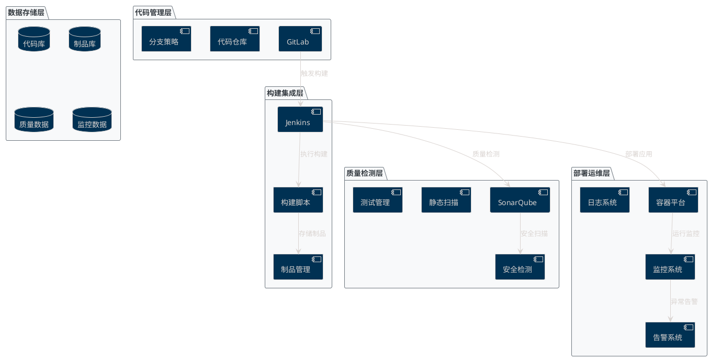

# 空管局软件代码质量管控体系技术建议书

## 文档信息

- **项目名称**: 空管局软件代码质量管控体系建设
- **文档版本**: V1.0
- **编制日期**: 2025年7月31日
- **适用范围**: 民航空管系统软件开发质量管控
- **密级**: 内部

## 目录

1. [总体技术架构](#1-总体技术架构)
2. [工具链集成与技术适配](#2-工具链集成与技术适配)
3. [质量与安全管控](#3-质量与安全管控)
4. [运维与稳定性](#4-运维与稳定性)
5. [性能与资源优化](#5-性能与资源优化)
6. [实施路线图](#6-实施路线图)
7. [风险评估与应对](#7-风险评估与应对)

---

## 1. 总体技术架构

### 1.1 架构设计原则

#### 1.1.1 安全性原则
- **信息安全合规**: 严格遵循民航信息安全标准（CCAR-396）
- **网络隔离**: 内外网环境严格分离，关键系统采用物理隔离
- **访问控制**: 基于RBAC的细粒度权限管理
- **审计追踪**: 全流程操作日志记录和审计

#### 1.1.2 可靠性原则
- **高可用设计**: 系统可用性≥99.9%，支持7×24小时运行
- **容错机制**: 关键组件采用主备或集群部署
- **故障恢复**: 自动故障检测和快速恢复能力
- **数据保护**: 多层次数据备份和恢复策略

#### 1.1.3 扩展性原则
- **微服务架构**: 服务解耦，支持独立扩展
- **容器化部署**: 基于Docker/Kubernetes的容器编排
- **弹性伸缩**: 根据负载自动调整资源配置
- **技术栈兼容**: 支持多语言、多框架项目

#### 1.1.4 标准化原则
- **统一规范**: 代码规范、构建流程、部署标准统一化
- **工具标准化**: 核心工具链标准化配置和管理
- **流程标准化**: 质量门控、审核流程标准化
- **文档标准化**: 技术文档、操作手册标准化

### 1.2 整体架构设计

#### 1.2.1 逻辑架构图



#### 1.2.2 物理架构设计

##### 网络架构
```
┌─────────────────────────────────────────────────────────────┐
│                        外网环境                              │
│  ┌─────────────┐    ┌─────────────┐    ┌─────────────┐      │
│  │   开发环境   │    │   测试环境   │    │   预生产环境 │      │
│  │  Dev Env    │    │  Test Env   │    │  Pre-Prod   │      │
│  └─────────────┘    └─────────────┘    └─────────────┘      │
└─────────────────────┬───────────────────────────────────────┘
                      │ 防火墙/网闸
┌─────────────────────┴───────────────────────────────────────┐
│                        内网环境                              │
│  ┌─────────────┐    ┌─────────────┐    ┌─────────────┐      │
│  │   生产环境   │    │  质量平台   │    │  运维监控   │      │
│  │  Prod Env   │    │ Quality Hub │    │ Ops Monitor │      │
│  └─────────────┘    └─────────────┘    └─────────────┘      │
└─────────────────────────────────────────────────────────────┘
```

##### 服务器配置标准

| 环境类型 | 服务器角色 | 硬件配置 | 部署组件 |
|----------|------------|----------|----------|
| 生产环境 | Jenkins Master | 16C/32G/500G SSD | Jenkins主节点 |
| 生产环境 | Jenkins Slave | 8C/16G/200G SSD | 构建执行节点 |
| 生产环境 | SonarQube服务器 | 8C/16G/500G SSD | 代码质量分析 |
| 生产环境 | GitLab服务器 | 16C/32G/1T SSD | 代码仓库管理 |
| 生产环境 | 监控服务器 | 8C/16G/200G SSD | Prometheus/Grafana |
| 生产环境 | 数据库服务器 | 16C/64G/2T SSD | PostgreSQL集群 |

### 1.3 核心技术组件

#### 1.3.1 代码管理平台 - GitLab Enterprise

**选型依据**:
- 支持企业级权限管理和审计
- 内置CI/CD功能，便于集成
- 支持代码审查和合并请求工作流
- 符合民航安全要求的部署模式

**版本建议**: GitLab Enterprise Edition 16.3+

**核心配置**:
```yaml
# gitlab.yml核心配置
production: &base
  gitlab:
    host: gitlab.atmb.local
    port: 443
    https: true
    
  # 数据库配置
  databases:
    main:
      adapter: postgresql
      encoding: unicode
      host: postgres-cluster.local
      port: 5432
      
  # Redis配置  
  redis:
    host: redis-cluster.local
    port: 6379
    
  # 备份配置
  backup:
    path: "/var/opt/gitlab/backups"
    archive_permissions: 0644
    pg_schema: public
    keep_time: 604800  # 7天
```

#### 1.3.2 持续集成平台 - Jenkins

**选型依据**:
- 成熟稳定的CI/CD解决方案
- 丰富的插件生态系统
- 支持分布式构建
- 强大的Pipeline能力

**版本建议**: Jenkins LTS 2.414.3+

**关键插件清单**:
```
核心插件:
- Pipeline (workflow-aggregator) 2.6+
- Git (git) 4.8+
- GitLab (gitlab-plugin) 1.7+
- SonarQube Scanner (sonar) 2.15+

质量插件:
- Checkstyle (checkstyle) 5.0+
- JUnit (junit) 1.62+
- Jacoco (jacoco) 3.3+
- OWASP Dependency Check (dependency-check-jenkins-plugin) 5.4+

部署插件:
- Kubernetes (kubernetes) 3900+
- Docker Pipeline (docker-workflow) 1.29+
- Ansible (ansible) 1.1+

监控插件:
- Prometheus (prometheus) 2.0+
- Build Monitor (build-monitor-plugin) 1.13+
```

#### 1.3.3 代码质量平台 - SonarQube

**选型依据**:
- 支持多语言静态代码分析
- 丰富的质量规则和度量指标
- 良好的CI/CD集成能力
- 企业级权限和项目管理

**版本建议**: SonarQube Developer Edition 10.2+

**语言支持配置**:
```properties
# sonar.properties配置
sonar.web.host=0.0.0.0
sonar.web.port=9000
sonar.jdbc.url=jdbc:postgresql://postgres-cluster.local:5432/sonarqube
sonar.jdbc.username=sonarqube
sonar.path.data=/opt/sonarqube/data
sonar.path.temp=/opt/sonarqube/temp

# 支持的语言插件
# Java: 内置支持
# Python: sonar-python-plugin
# JavaScript/TypeScript: sonar-javascript-plugin  
# Go: sonar-go-plugin
# C#: sonar-csharp-plugin
# C/C++: sonar-cfamily-plugin
```

### 1.4 网络和安全架构

#### 1.4.1 网络分区设计

```
Internet
    │
    ▼
┌─────────────────────────────┐
│       DMZ区域               │
│  ┌─────────────────────┐    │
│  │    反向代理/WAF      │    │
│  │   (Nginx/F5)        │    │
│  └─────────────────────┘    │
└──────────────┬──────────────┘
               │ 防火墙
               ▼
┌─────────────────────────────┐
│      应用服务区              │
│  ┌─────────┐ ┌─────────┐    │
│  │GitLab   │ │Jenkins  │    │
│  │Web UI   │ │Web UI   │    │
│  └─────────┘ └─────────┘    │
└──────────────┬──────────────┘
               │ 防火墙
               ▼
┌─────────────────────────────┐
│      核心服务区              │
│  ┌─────────┐ ┌─────────┐    │
│  │SonarQube│ │Nexus    │    │
│  │Server   │ │Repository│    │
│  └─────────┘ └─────────┘    │
└──────────────┬──────────────┘
               │ 防火墙
               ▼
┌─────────────────────────────┐
│      数据存储区              │
│  ┌─────────┐ ┌─────────┐    │
│  │PostgreSQL│ │Redis    │    │
│  │Cluster  │ │Cluster  │    │
│  └─────────┘ └─────────┘    │
└─────────────────────────────┘
```

#### 1.4.2 安全控制措施

##### 身份认证与授权
```yaml
# LDAP集成配置示例
ldap:
  enabled: true
  host: ldap.atmb.local
  port: 636
  encryption: simple_tls
  base: 'DC=atmb,DC=local'
  uid: 'sAMAccountName'
  method: 'plain'
  bind_dn: 'CN=gitlab,OU=Service Accounts,DC=atmb,DC=local'
  password: '${LDAP_PASSWORD}'
  
  # 用户映射
  attributes:
    username: ['uid', 'userid', 'sAMAccountName']
    email: ['mail', 'email', 'userPrincipalName']
    name: 'cn'
    first_name: 'givenName'
    last_name: 'sn'
```

##### 数据加密配置
```bash
# SSL/TLS证书配置
openssl req -new -newkey rsa:4096 -days 365 -nodes -x509 \
  -subj "/C=CN/ST=Beijing/L=Beijing/O=ATMB/CN=*.atmb.local" \
  -keyout atmb.key -out atmb.crt

# 数据库连接加密
export PGPASSWORD='your_secure_password'
psql "host=postgres-cluster.local port=5432 dbname=gitlab user=gitlab sslmode=require"
```

---

## 2. 工具链集成与技术适配

### 2.1 多工具兼容性集成

#### 2.1.1 GitLab集成配置

##### GitLab企业版部署
```bash
#!/bin/bash
# GitLab企业版安装脚本

# 1. 系统准备
yum update -y
yum install -y curl policycoreutils openssh-server perl

# 2. 安装GitLab企业版
curl https://packages.gitlab.com/install/repositories/gitlab/gitlab-ee/script.rpm.sh | sudo bash
yum install -y gitlab-ee=16.3.0-ee.0.el8

# 3. 配置GitLab
cat > /etc/gitlab/gitlab.rb << EOF
external_url 'https://gitlab.atmb.local'
nginx['listen_port'] = 443
nginx['listen_https'] = true
nginx['ssl_certificate'] = "/etc/gitlab/ssl/gitlab.crt"
nginx['ssl_certificate_key'] = "/etc/gitlab/ssl/gitlab.key"

# 数据库配置
postgresql['enable'] = false
gitlab_rails['db_adapter'] = 'postgresql'
gitlab_rails['db_encoding'] = 'unicode'
gitlab_rails['db_host'] = 'postgres-cluster.local'
gitlab_rails['db_port'] = 5432
gitlab_rails['db_database'] = 'gitlab_production'
gitlab_rails['db_username'] = 'gitlab'
gitlab_rails['db_password'] = '${GITLAB_DB_PASSWORD}'

# Redis配置
redis['enable'] = false
gitlab_rails['redis_host'] = 'redis-cluster.local'
gitlab_rails['redis_port'] = 6379
gitlab_rails['redis_password'] = '${REDIS_PASSWORD}'

# LDAP集成
gitlab_rails['ldap_enabled'] = true
gitlab_rails['ldap_servers'] = YAML.load <<-'EOS'
  main:
    label: 'LDAP'
    host: 'ldap.atmb.local'
    port: 636
    uid: 'sAMAccountName'
    encryption: 'simple_tls'
    bind_dn: 'CN=gitlab,OU=Service Accounts,DC=atmb,DC=local'
    password: '${LDAP_PASSWORD}'
    base: 'DC=atmb,DC=local'
    user_filter: ''
    attributes:
      username: ['uid', 'userid', 'sAMAccountName']
      email: ['mail', 'email', 'userPrincipalName']
      name: 'cn'
      first_name: 'givenName'
      last_name: 'sn'
EOS

# 备份配置
gitlab_rails['backup_path'] = "/var/opt/gitlab/backups"
gitlab_rails['backup_keep_time'] = 604800
gitlab_rails['backup_archive_permissions'] = 0644

# 监控配置
prometheus['enable'] = true
prometheus['listen_address'] = '0.0.0.0:9090'
EOF

# 4. 启动GitLab
gitlab-ctl reconfigure
gitlab-ctl start
```

##### GitLab项目模板配置
```yaml
# .gitlab-ci.yml模板 - Java项目
stages:
  - validate
  - build
  - test
  - quality
  - security
  - package
  - deploy

variables:
  MAVEN_OPTS: "-Dmaven.repo.local=$CI_PROJECT_DIR/.m2/repository"
  MAVEN_CLI_OPTS: "--batch-mode --errors --fail-at-end --show-version"

cache:
  paths:
    - .m2/repository/
    - target/

before_script:
  - echo "CI开始执行..."
  - java -version
  - mvn --version

validate:
  stage: validate
  script:
    - mvn $MAVEN_CLI_OPTS validate
  only:
    - merge_requests
    - master
    - develop

compile:
  stage: build
  script:
    - mvn $MAVEN_CLI_OPTS clean compile
  artifacts:
    paths:
      - target/classes/
    expire_in: 1 hour

unit_test:
  stage: test
  script:
    - mvn $MAVEN_CLI_OPTS test
  artifacts:
    when: always
    reports:
      junit:
        - target/surefire-reports/TEST-*.xml
    paths:
      - target/surefire-reports/
      - target/site/jacoco/
    expire_in: 30 days
  coverage: '/Total.*?([0-9]{1,3})%/'

sonarqube_scan:
  stage: quality
  script:
    - mvn $MAVEN_CLI_OPTS sonar:sonar
      -Dsonar.projectKey=$CI_PROJECT_PATH_SLUG
      -Dsonar.host.url=$SONAR_HOST_URL
      -Dsonar.login=$SONAR_TOKEN
  only:
    - merge_requests
    - master
    - develop

dependency_scan:
  stage: security
  script:
    - mvn org.owasp:dependency-check-maven:check
  artifacts:
    reports:
      dependency_scanning: dependency-check-report.json
    paths:
      - target/dependency-check-report.html
    expire_in: 30 days

package:
  stage: package
  script:
    - mvn $MAVEN_CLI_OPTS package -DskipTests
  artifacts:
    paths:
      - target/*.jar
    expire_in: 1 week
  only:
    - master
    - develop
```

#### 2.1.2 Jenkins集成配置

##### Jenkins Master节点配置
```groovy
// jenkins.yaml - JCasC配置
jenkins:
  systemMessage: "空管局代码质量管控平台 - Jenkins CI/CD"
  numExecutors: 0
  mode: EXCLUSIVE
  
  securityRealm:
    ldap:
      configurations:
        - server: "ldaps://ldap.atmb.local:636"
          rootDN: "DC=atmb,DC=local"
          inhibitInferRootDN: false
          userSearchBase: "OU=Users"
          userSearch: "sAMAccountName={0}"
          groupSearchBase: "OU=Groups"
          groupSearchFilter: "member={0}"
          managerDN: "CN=jenkins,OU=Service Accounts,DC=atmb,DC=local"
          managerPasswordSecret: "ldap-password"
          
  authorizationStrategy:
    projectMatrix:
      permissions:
        - "Overall/Administer:ATMB\\jenkins-admins"
        - "Overall/Read:ATMB\\developers"
        - "Job/Build:ATMB\\developers"
        - "Job/Read:ATMB\\developers"

  clouds:
    - kubernetes:
        name: "k8s-cluster"
        serverUrl: "https://k8s-api.atmb.local:6443"
        namespace: "jenkins"
        jenkinsUrl: "https://jenkins.atmb.local"
        jenkinsTunnel: "jenkins-agent.jenkins.svc.cluster.local:50000"
        
        templates:
          - name: "maven-agent"
            label: "maven java"
            nodeUsageMode: EXCLUSIVE
            containers:
              - name: "maven"
                image: "maven:3.8.6-openjdk-11"
                ttyEnabled: true
                command: "/bin/bash"
                workingDir: "/home/jenkins/agent"
                resourceRequestMemory: "1Gi"
                resourceRequestCpu: "500m"
                resourceLimitMemory: "2Gi"
                resourceLimitCpu: "1000m"
                
          - name: "python-agent"
            label: "python"
            nodeUsageMode: EXCLUSIVE
            containers:
              - name: "python"
                image: "python:3.9-slim"
                ttyEnabled: true
                command: "/bin/bash"
                workingDir: "/home/jenkins/agent"
                resourceRequestMemory: "512Mi"
                resourceRequestCpu: "250m"
                resourceLimitMemory: "1Gi"
                resourceLimitCpu: "500m"

tool:
  git:
    installations:
      - name: "Default"
        home: "/usr/bin/git"
        
  maven:
    installations:
      - name: "Maven-3.8.6"
        home: "/opt/maven"
        
  jdk:
    installations:
      - name: "OpenJDK-11"
        home: "/usr/lib/jvm/java-11-openjdk"
      - name: "OpenJDK-8"
        home: "/usr/lib/jvm/java-8-openjdk"

unclassified:
  sonarGlobalConfiguration:
    installations:
      - name: "SonarQube"
        serverUrl: "https://sonar.atmb.local"
        credentialsId: "sonar-token"
        
  gitLabConnectionConfig:
    connections:
      - name: "GitLab"
        url: "https://gitlab.atmb.local"
        credentialsId: "gitlab-token"
        ignoreCertificateErrors: false
```

##### Jenkins Pipeline库配置
```groovy
// vars/standardPipeline.groovy - 标准流水线库
def call(Map config) {
    pipeline {
        agent {
            label config.agent ?: 'maven'
        }
        
        options {
            buildDiscarder(logRotator(numToKeepStr: '10'))
            timeout(time: 30, unit: 'MINUTES')
            skipStagesAfterUnstable()
        }
        
        environment {
            SONAR_TOKEN = credentials('sonar-token')
            GITLAB_TOKEN = credentials('gitlab-token')
        }
        
        stages {
            stage('Checkout') {
                steps {
                    checkout scm
                    script {
                        env.GIT_COMMIT_SHORT = sh(
                            script: "git rev-parse --short HEAD",
                            returnStdout: true
                        ).trim()
                    }
                }
            }
            
            stage('Build') {
                steps {
                    script {
                        if (config.buildType == 'maven') {
                            sh 'mvn clean compile'
                        } else if (config.buildType == 'gradle') {
                            sh './gradlew clean build'
                        } else if (config.buildType == 'python') {
                            sh '''
                                python -m venv venv
                                source venv/bin/activate
                                pip install -r requirements.txt
                            '''
                        }
                    }
                }
            }
            
            stage('Test') {
                parallel {
                    stage('Unit Tests') {
                        steps {
                            script {
                                if (config.buildType == 'maven') {
                                    sh 'mvn test'
                                } else if (config.buildType == 'python') {
                                    sh '''
                                        source venv/bin/activate
                                        python -m pytest tests/ --junitxml=test-results.xml --cov=src --cov-report=xml
                                    '''
                                }
                            }
                        }
                        post {
                            always {
                                publishTestResults testResultsPattern: '**/test-*.xml'
                                publishCoverage adapters: [
                                    jacocoAdapter('target/site/jacoco/jacoco.xml'),
                                    coberturaAdapter('coverage.xml')
                                ]
                            }
                        }
                    }
                    
                    stage('Integration Tests') {
                        when {
                            expression { config.runIntegrationTests == true }
                        }
                        steps {
                            script {
                                if (config.buildType == 'maven') {
                                    sh 'mvn integration-test'
                                }
                            }
                        }
                    }
                }
            }
            
            stage('Code Quality') {
                parallel {
                    stage('SonarQube Analysis') {
                        steps {
                            withSonarQubeEnv('SonarQube') {
                                script {
                                    if (config.buildType == 'maven') {
                                        sh 'mvn sonar:sonar'
                                    } else if (config.buildType == 'python') {
                                        sh '''
                                            sonar-scanner \
                                                -Dsonar.projectKey=${JOB_NAME} \
                                                -Dsonar.sources=src \
                                                -Dsonar.tests=tests \
                                                -Dsonar.python.coverage.reportPaths=coverage.xml \
                                                -Dsonar.python.xunit.reportPath=test-results.xml
                                        '''
                                    }
                                }
                            }
                        }
                    }
                    
                    stage('Security Scan') {
                        steps {
                            script {
                                if (config.buildType == 'maven') {
                                    sh 'mvn org.owasp:dependency-check-maven:check'
                                } else if (config.buildType == 'python') {
                                    sh '''
                                        source venv/bin/activate
                                        safety check --json --output safety-report.json
                                        bandit -r src -f json -o bandit-report.json
                                    '''
                                }
                            }
                        }
                        post {
                            always {
                                archiveArtifacts artifacts: '**/dependency-check-report.html, **/*-report.json', allowEmptyArchive: true
                            }
                        }
                    }
                }
            }
            
            stage('Quality Gate') {
                steps {
                    timeout(time: 5, unit: 'MINUTES') {
                        waitForQualityGate abortPipeline: true
                    }
                }
            }
            
            stage('Package') {
                when {
                    anyOf {
                        branch 'master'
                        branch 'develop'
                        branch 'release/*'
                    }
                }
                steps {
                    script {
                        if (config.buildType == 'maven') {
                            sh 'mvn package -DskipTests'
                        } else if (config.buildType == 'python') {
                            sh '''
                                source venv/bin/activate
                                python setup.py sdist bdist_wheel
                            '''
                        }
                    }
                }
                post {
                    success {
                        archiveArtifacts artifacts: '**/target/*.jar, **/dist/*', allowEmptyArchive: true
                    }
                }
            }
        }
        
        post {
            always {
                cleanWs()
            }
            failure {
                emailext (
                    subject: "构建失败: ${env.JOB_NAME} - ${env.BUILD_NUMBER}",
                    body: """
                        项目: ${env.JOB_NAME}
                        构建号: ${env.BUILD_NUMBER}
                        分支: ${env.BRANCH_NAME}
                        提交: ${env.GIT_COMMIT_SHORT}
                        
                        构建失败，请检查日志: ${env.BUILD_URL}
                    """,
                    to: "${config.notificationEmails}"
                )
            }
        }
    }
}
```

#### 2.1.3 SonarQube集成配置

##### SonarQube服务器配置
```properties
# sonar.properties完整配置
# 服务器配置
sonar.web.host=0.0.0.0
sonar.web.port=9000
sonar.web.context=/
sonar.web.systemPasscode=${SONAR_SYSTEM_PASSCODE}

# 数据库配置
sonar.jdbc.username=sonarqube
sonar.jdbc.password=${SONAR_DB_PASSWORD}
sonar.jdbc.url=jdbc:postgresql://postgres-cluster.local:5432/sonarqube?currentSchema=public

# 搜索配置
sonar.search.host=elasticsearch-cluster.local
sonar.search.port=9300

# 身份验证配置
sonar.security.realm=LDAP
ldap.url=ldaps://ldap.atmb.local:636
ldap.bindDn=CN=sonarqube,OU=Service Accounts,DC=atmb,DC=local
ldap.bindPassword=${LDAP_PASSWORD}
ldap.user.baseDn=OU=Users,DC=atmb,DC=local
ldap.user.request=(&(objectClass=user)(sAMAccountName={login}))
ldap.user.realNameAttribute=cn
ldap.user.emailAttribute=mail
ldap.group.baseDn=OU=Groups,DC=atmb,DC=local
ldap.group.request=(&(objectClass=group)(member={dn}))

# 质量门禁配置
sonar.qualitygate.wait.timeout=300

# 插件配置
sonar.plugins.risk.consent=ACCEPTED

# 日志配置
sonar.log.level=INFO
sonar.path.logs=/opt/sonarqube/logs
```

##### 质量规则配置
```xml
<!-- quality-profiles/java-rules.xml -->
<profile>
    <name>ATMB Java Quality Profile</name>
    <language>java</language>
    <rules>
        <!-- 严重问题 -->
        <rule>
            <repositoryKey>java</repositoryKey>
            <key>S2095</key>
            <priority>BLOCKER</priority>
            <parameters>
                <parameter>
                    <key>excludedTypes</key>
                    <value>java.io.ByteArrayOutputStream,java.io.ByteArrayInputStream</value>
                </parameter>
            </parameters>
        </rule>
        
        <!-- 安全漏洞 -->
        <rule>
            <repositoryKey>java</repositoryKey>
            <key>S2083</key>
            <priority>BLOCKER</priority>
        </rule>
        
        <!-- 代码异味 -->
        <rule>
            <repositoryKey>java</repositoryKey>
            <key>S1192</key>
            <priority>MAJOR</priority>
            <parameters>
                <parameter>
                    <key>threshold</key>
                    <value>3</value>
                </parameter>
            </parameters>
        </rule>
        
        <!-- 覆盖率要求 -->
        <rule>
            <repositoryKey>common-java</repositoryKey>
            <key>InsufficientLineCoverage</key>
            <priority>MAJOR</priority>
            <parameters>
                <parameter>
                    <key>minimumLineCoverageRatio</key>
                    <value>80.0</value>
                </parameter>
            </parameters>
        </rule>
    </rules>
</profile>
```

#### 2.1.4 Nexus仓库集成

##### Nexus安装配置
```bash
#!/bin/bash
# Nexus Repository Manager安装脚本

# 1. 创建nexus用户
useradd -d /opt/nexus -s /bin/bash nexus

# 2. 下载安装Nexus
cd /opt
wget https://download.sonatype.com/nexus/3/nexus-3.41.1-01-unix.tar.gz
tar -xzf nexus-3.41.1-01-unix.tar.gz
ln -s nexus-3.41.1-01 nexus
chown -R nexus:nexus /opt/nexus*

# 3. 配置Nexus
cat > /opt/nexus/bin/nexus.vmoptions << EOF
-Xms2g
-Xmx2g
-XX:MaxDirectMemorySize=3g
-XX:+UnlockExperimentalVMOptions
-XX:+UseCGroupMemoryLimitForHeap
-Djava.util.prefs.userRoot=/opt/nexus-data/javaprefs
-Dkaraf.home=/opt/nexus
-Dkaraf.base=/opt/nexus
-Dkaraf.etc=/opt/nexus/etc/karaf
-Djava.io.tmpdir=/opt/nexus-data/tmp
-Dkaraf.data=/opt/nexus-data
-Dkaraf.log=/opt/nexus-data/log
-Djava.util.logging.config.file=/opt/nexus/etc/karaf/java.util.logging.properties
EOF

# 4. 配置systemd服务
cat > /etc/systemd/system/nexus.service << EOF
[Unit]
Description=nexus service
After=network.target

[Service]
Type=forking
LimitNOFILE=65536
ExecStart=/opt/nexus/bin/nexus start
ExecStop=/opt/nexus/bin/nexus stop
User=nexus
Restart=on-abort
TimeoutSec=600

[Install]
WantedBy=multi-user.target
EOF

systemctl daemon-reload
systemctl enable nexus
systemctl start nexus
```

##### Maven配置文件
```xml
<!-- settings.xml - Maven配置 -->
<settings>
    <servers>
        <server>
            <id>nexus-releases</id>
            <username>${env.NEXUS_USERNAME}</username>
            <password>${env.NEXUS_PASSWORD}</password>
        </server>
        <server>
            <id>nexus-snapshots</id>
            <username>${env.NEXUS_USERNAME}</username>
            <password>${env.NEXUS_PASSWORD}</password>
        </server>
    </servers>
    
    <mirrors>
        <mirror>
            <id>nexus-central</id>
            <name>Nexus Central</name>
            <url>https://nexus.atmb.local/repository/maven-public/</url>
            <mirrorOf>central</mirrorOf>
        </mirror>
    </mirrors>
    
    <profiles>
        <profile>
            <id>nexus</id>
            <repositories>
                <repository>
                    <id>nexus-public</id>
                    <url>https://nexus.atmb.local/repository/maven-public/</url>
                    <releases><enabled>true</enabled></releases>
                    <snapshots><enabled>true</enabled></snapshots>
                </repository>
            </repositories>
            <pluginRepositories>
                <pluginRepository>
                    <id>nexus-public</id>
                    <url>https://nexus.atmb.local/repository/maven-public/</url>
                    <releases><enabled>true</enabled></releases>
                    <snapshots><enabled>true</enabled></snapshots>
                </pluginRepository>
            </pluginRepositories>
        </profile>
    </profiles>
    
    <activeProfiles>
        <activeProfile>nexus</activeProfile>
    </activeProfiles>
</settings>
```

### 2.2 多技术栈适配配置

#### 2.2.1 Java/Spring项目配置

##### Maven项目标准POM配置
```xml
<!-- pom.xml模板 -->
<project>
    <modelVersion>4.0.0</modelVersion>
    
    <groupId>com.atmb</groupId>
    <artifactId>atmb-project-template</artifactId>
    <version>1.0.0-SNAPSHOT</version>
    <packaging>jar</packaging>
    
    <properties>
        <maven.compiler.source>11</maven.compiler.source>
        <maven.compiler.target>11</maven.compiler.target>
        <project.build.sourceEncoding>UTF-8</project.build.sourceEncoding>
        
        <!-- 依赖版本 -->
        <spring.boot.version>2.7.14</spring.boot.version>
        <junit.version>5.9.3</junit.version>
        <mockito.version>4.11.0</mockito.version>
        
        <!-- 插件版本 -->
        <maven.surefire.version>3.0.0</maven.surefire.version>
        <jacoco.version>0.8.8</jacoco.version>
        <sonar.version>3.9.1.2184</sonar.version>
        <dependency.check.version>8.4.0</dependency.check.version>
        
        <!-- SonarQube配置 -->
        <sonar.coverage.exclusions>
            **/config/**,
            **/dto/**,
            **/entity/**,
            **/exception/**,
            **/*Application.java
        </sonar.coverage.exclusions>
        <sonar.cpd.exclusions>
            **/dto/**,
            **/entity/**
        </sonar.cpd.exclusions>
        <sonar.junit.reportPaths>target/surefire-reports</sonar.junit.reportPaths>
        <sonar.jacoco.reportPaths>target/site/jacoco/jacoco.xml</sonar.jacoco.reportPaths>
    </properties>
    
    <dependencyManagement>
        <dependencies>
            <dependency>
                <groupId>org.springframework.boot</groupId>
                <artifactId>spring-boot-dependencies</artifactId>
                <version>${spring.boot.version}</version>
                <type>pom</type>
                <scope>import</scope>
            </dependency>
        </dependencies>
    </dependencyManagement>
    
    <dependencies>
        <!-- Spring Boot -->
        <dependency>
            <groupId>org.springframework.boot</groupId>
            <artifactId>spring-boot-starter-web</artifactId>
        </dependency>
        
        <!-- 测试依赖 -->
        <dependency>
            <groupId>org.springframework.boot</groupId>
            <artifactId>spring-boot-starter-test</artifactId>
            <scope>test</scope>
        </dependency>
    </dependencies>
    
    <build>
        <plugins>
            <!-- Spring Boot插件 -->
            <plugin>
                <groupId>org.springframework.boot</groupId>
                <artifactId>spring-boot-maven-plugin</artifactId>
                <version>${spring.boot.version}</version>
            </plugin>
            
            <!-- 测试插件 -->
            <plugin>
                <groupId>org.apache.maven.plugins</groupId>
                <artifactId>maven-surefire-plugin</artifactId>
                <version>${maven.surefire.version}</version>
                <configuration>
                    <includes>
                        <include>**/*Test.java</include>
                        <include>**/*Tests.java</include>
                    </includes>
                    <excludes>
                        <exclude>**/*IT.java</exclude>
                    </excludes>
                </configuration>
            </plugin>
            
            <!-- 代码覆盖率 -->
            <plugin>
                <groupId>org.jacoco</groupId>
                <artifactId>jacoco-maven-plugin</artifactId>
                <version>${jacoco.version}</version>
                <executions>
                    <execution>
                        <goals>
                            <goal>prepare-agent</goal>
                        </goals>
                    </execution>
                    <execution>
                        <id>report</id>
                        <phase>test</phase>
                        <goals>
                            <goal>report</goal>
                        </goals>
                    </execution>
                </executions>
            </plugin>
            
            <!-- SonarQube分析 -->
            <plugin>
                <groupId>org.sonarsource.scanner.maven</groupId>
                <artifactId>sonar-maven-plugin</artifactId>
                <version>${sonar.version}</version>
            </plugin>
            
            <!-- 安全扫描 -->
            <plugin>
                <groupId>org.owasp</groupId>
                <artifactId>dependency-check-maven</artifactId>
                <version>${dependency.check.version}</version>
                <configuration>
                    <format>ALL</format>
                    <suppressionFile>owasp-suppression.xml</suppressionFile>
                </configuration>
            </plugin>
        </plugins>
    </build>
    
    <distributionManagement>
        <repository>
            <id>nexus-releases</id>
            <url>https://nexus.atmb.local/repository/maven-releases/</url>
        </repository>
        <snapshotRepository>
            <id>nexus-snapshots</id>
            <url>https://nexus.atmb.local/repository/maven-snapshots/</url>
        </snapshotRepository>
    </distributionManagement>
</project>
```

#### 2.2.2 Python项目配置

##### Python项目结构模板
```
python-project/
├── src/
│   └── atmb_project/
│       ├── __init__.py
│       ├── main.py
│       └── utils/
├── tests/
│   ├── __init__.py
│   ├── test_main.py
│   └── conftest.py
├── requirements.txt
├── requirements-dev.txt
├── setup.py
├── tox.ini
├── .flake8
├── .bandit
├── pytest.ini
└── sonar-project.properties
```

##### requirements配置
```python
# requirements.txt
fastapi==0.103.1
uvicorn[standard]==0.23.2
pydantic==2.3.0
sqlalchemy==2.0.20
alembic==1.12.0

# requirements-dev.txt
pytest==7.4.2
pytest-cov==4.1.0
pytest-asyncio==0.21.1
black==23.7.0
flake8==6.1.0
mypy==1.5.1
bandit==1.7.5
safety==2.3.5
```

##### Python构建配置
```python
# setup.py
from setuptools import setup, find_packages

setup(
    name="atmb-project",
    version="1.0.0",
    packages=find_packages(where="src"),
    package_dir={"": "src"},
    python_requires=">=3.8",
    install_requires=[
        "fastapi>=0.100.0",
        "uvicorn[standard]>=0.20.0",
        "pydantic>=2.0.0",
    ],
    extras_require={
        "dev": [
            "pytest>=7.0.0",
            "pytest-cov>=4.0.0",
            "black>=23.0.0",
            "flake8>=6.0.0",
            "mypy>=1.0.0",
        ]
    },
)
```

```ini
# tox.ini
[tox]
envlist = py38, py39, py310, py311, flake8, mypy, safety

[testenv]
deps = 
    pytest
    pytest-cov
    -r{toxinidir}/requirements.txt
commands = 
    pytest tests/ --cov=src --cov-report=xml --cov-report=term-missing

[testenv:flake8]
deps = flake8
commands = flake8 src tests

[testenv:mypy]
deps = 
    mypy
    -r{toxinidir}/requirements.txt
commands = mypy src

[testenv:safety]
deps = safety
commands = safety check

[testenv:bandit]
deps = bandit
commands = bandit -r src
```

#### 2.2.3 Go微服务配置

##### Go项目结构
```
go-service/
├── cmd/
│   └── server/
│       └── main.go
├── internal/
│   ├── config/
│   ├── handler/
│   ├── service/
│   └── repository/
├── pkg/
├── api/
├── scripts/
├── deployments/
├── go.mod
├── go.sum
├── Makefile
├── Dockerfile
└── sonar-project.properties
```

##### Go构建配置
```makefile
# Makefile
.PHONY: build test clean lint security-scan

# 变量定义
BINARY_NAME=atmb-service
MAIN_PATH=./cmd/server
BUILD_DIR=./bin
COVERAGE_FILE=coverage.out

# 默认目标
all: clean lint test build

# 构建
build:
	@echo "Building $(BINARY_NAME)..."
	@mkdir -p $(BUILD_DIR)
	CGO_ENABLED=0 GOOS=linux go build -a -installsuffix cgo -o $(BUILD_DIR)/$(BINARY_NAME) $(MAIN_PATH)

# 测试
test:
	@echo "Running tests..."
	go test -v -race -coverprofile=$(COVERAGE_FILE) -covermode=atomic ./...
	go tool cover -html=$(COVERAGE_FILE) -o coverage.html

# 代码格式化
fmt:
	@echo "Formatting code..."
	go fmt ./...

# 代码检查
lint:
	@echo "Running linters..."
	golangci-lint run ./...

# 安全扫描
security-scan:
	@echo "Running security scan..."
	gosec ./...

# 依赖更新
deps:
	@echo "Downloading dependencies..."
	go mod download
	go mod tidy

# 清理
clean:
	@echo "Cleaning..."
	@rm -rf $(BUILD_DIR)
	@rm -f $(COVERAGE_FILE) coverage.html

# Docker构建
docker-build:
	docker build -t $(BINARY_NAME):latest .

# 本地运行
run:
	go run $(MAIN_PATH)
```

### 2.3 遗留系统适配方案

#### 2.3.1 老旧JDK适配

##### JDK版本管理脚本
```bash
#!/bin/bash
# jdk-manager.sh - JDK版本管理脚本

JDK_BASE_DIR="/opt/jdk"
CURRENT_LINK="/opt/jdk/current"

# 安装JDK函数
install_jdk() {
    local version=$1
    local download_url=$2
    
    echo "安装JDK ${version}..."
    
    # 创建安装目录
    mkdir -p "${JDK_BASE_DIR}/${version}"
    
    # 下载并解压JDK
    cd /tmp
    wget "${download_url}" -O "jdk-${version}.tar.gz"
    tar -xzf "jdk-${version}.tar.gz" -C "${JDK_BASE_DIR}/${version}" --strip-components=1
    
    # 设置权限
    chown -R jenkins:jenkins "${JDK_BASE_DIR}/${version}"
    chmod -R 755 "${JDK_BASE_DIR}/${version}"
    
    echo "JDK ${version} 安装完成"
}

# 切换JDK版本
switch_jdk() {
    local version=$1
    
    if [ ! -d "${JDK_BASE_DIR}/${version}" ]; then
        echo "错误: JDK ${version} 未安装"
        exit 1
    fi
    
    # 更新符号链接
    rm -f "${CURRENT_LINK}"
    ln -sf "${JDK_BASE_DIR}/${version}" "${CURRENT_LINK}"
    
    # 更新环境变量
    export JAVA_HOME="${CURRENT_LINK}"
    export PATH="${JAVA_HOME}/bin:${PATH}"
    
    echo "已切换到 JDK ${version}"
    java -version
}

# 列出已安装的JDK
list_jdk() {
    echo "已安装的JDK版本:"
    ls -la "${JDK_BASE_DIR}" | grep "^d" | awk '{print $9}' | grep -v "^\.$\|^\.\.$\|^current$"
    
    if [ -L "${CURRENT_LINK}" ]; then
        echo "当前使用: $(readlink ${CURRENT_LINK} | xargs basename)"
    fi
}

# 主函数
case "$1" in
    install)
        if [ $# -ne 3 ]; then
            echo "用法: $0 install <version> <download_url>"
            exit 1
        fi
        install_jdk "$2" "$3"
        ;;
    switch)
        if [ $# -ne 2 ]; then
            echo "用法: $0 switch <version>"
            exit 1
        fi
        switch_jdk "$2"
        ;;
    list)
        list_jdk
        ;;
    *)
        echo "用法: $0 {install|switch|list}"
        echo "  install <version> <url> - 安装JDK版本"
        echo "  switch <version>        - 切换JDK版本"
        echo "  list                    - 列出已安装版本"
        exit 1
        ;;
esac
```

##### Jenkins中的JDK版本选择
```groovy
// Jenkinsfile - 多JDK版本支持
pipeline {
    agent any
    
    parameters {
        choice(
            name: 'JDK_VERSION',
            choices: ['8', '11', '17'],
            description: '选择JDK版本'
        )
    }
    
    environment {
        JAVA_HOME = "${getJavaHome(params.JDK_VERSION)}"
        PATH = "${env.JAVA_HOME}/bin:${env.PATH}"
    }
    
    stages {
        stage('Setup JDK') {
            steps {
                script {
                    sh '''
                        echo "使用JDK版本: ${JDK_VERSION}"
                        java -version
                        javac -version
                        echo "JAVA_HOME: ${JAVA_HOME}"
                    '''
                }
            }
        }
        
        stage('Build') {
            steps {
                script {
                    if (params.JDK_VERSION == '8') {
                        // JDK 8特殊处理
                        sh 'mvn clean compile -Dmaven.compiler.source=8 -Dmaven.compiler.target=8'
                    } else {
                        // JDK 11/17处理
                        sh 'mvn clean compile'
                    }
                }
            }
        }
    }
}

// 获取JDK安装路径的函数
def getJavaHome(version) {
    switch(version) {
        case '8':
            return '/opt/jdk/jdk8'
        case '11':
            return '/opt/jdk/jdk11'
        case '17':
            return '/opt/jdk/jdk17'
        default:
            return '/opt/jdk/jdk11'
    }
}
```

#### 2.3.2 本地库依赖处理

##### 本地Maven仓库管理
```bash
#!/bin/bash
# local-repo-manager.sh - 本地库依赖管理

LOCAL_REPO_DIR="/opt/maven/local-repository"
NEXUS_URL="https://nexus.atmb.local"

# 扫描本地JAR文件并上传到Nexus
upload_local_jars() {
    local jar_dir=$1
    
    if [ ! -d "$jar_dir" ]; then
        echo "错误: 目录 $jar_dir 不存在"
        exit 1
    fi
    
    find "$jar_dir" -name "*.jar" | while read jar_file; do
        echo "处理: $jar_file"
        
        # 提取JAR信息
        jar_name=$(basename "$jar_file" .jar)
        group_id="com.atmb.legacy"
        artifact_id="$jar_name"
        version="1.0.0"
        
        # 上传到Nexus
        mvn deploy:deploy-file \
            -DgroupId="$group_id" \
            -DartifactId="$artifact_id" \
            -Dversion="$version" \
            -Dpackaging=jar \
            -Dfile="$jar_file" \
            -DrepositoryId=nexus-releases \
            -Durl="$NEXUS_URL/repository/maven-releases/"
        
        if [ $? -eq 0 ]; then
            echo "✓ 上传成功: $artifact_id"
        else
            echo "✗ 上传失败: $artifact_id"
        fi
    done
}

# 生成依赖配置
generate_dependency_config() {
    local jar_dir=$1
    local output_file="legacy-dependencies.xml"
    
    echo "<!-- 遗留系统依赖配置 -->" > "$output_file"
    echo "<dependencies>" >> "$output_file"
    
    find "$jar_dir" -name "*.jar" | while read jar_file; do
        jar_name=$(basename "$jar_file" .jar)
        cat >> "$output_file" << EOF
    <dependency>
        <groupId>com.atmb.legacy</groupId>
        <artifactId>$jar_name</artifactId>
        <version>1.0.0</version>
    </dependency>
EOF
    done
    
    echo "</dependencies>" >> "$output_file"
    echo "依赖配置已生成: $output_file"
}

# 创建本地仓库
create_local_repo() {
    local jar_dir=$1
    local repo_dir="$LOCAL_REPO_DIR"
    
    mkdir -p "$repo_dir"
    
    find "$jar_dir" -name "*.jar" | while read jar_file; do
        jar_name=$(basename "$jar_file" .jar)
        group_path="com/atmb/legacy"
        artifact_dir="$repo_dir/$group_path/$jar_name/1.0.0"
        
        mkdir -p "$artifact_dir"
        cp "$jar_file" "$artifact_dir/${jar_name}-1.0.0.jar"
        
        # 生成POM文件
        cat > "$artifact_dir/${jar_name}-1.0.0.pom" << EOF
<?xml version="1.0" encoding="UTF-8"?>
<project>
    <modelVersion>4.0.0</modelVersion>
    <groupId>com.atmb.legacy</groupId>
    <artifactId>$jar_name</artifactId>
    <version>1.0.0</version>
    <description>Legacy library from ATMB</description>
</project>
EOF
    done
    
    echo "本地仓库已创建: $repo_dir"
}

# 主函数
case "$1" in
    upload)
        if [ $# -ne 2 ]; then
            echo "用法: $0 upload <jar_directory>"
            exit 1
        fi
        upload_local_jars "$2"
        ;;
    generate-config)
        if [ $# -ne 2 ]; then
            echo "用法: $0 generate-config <jar_directory>"
            exit 1
        fi
        generate_dependency_config "$2"
        ;;
    create-repo)
        if [ $# -ne 2 ]; then
            echo "用法: $0 create-repo <jar_directory>"
            exit 1
        fi
        create_local_repo "$2"
        ;;
    *)
        echo "用法: $0 {upload|generate-config|create-repo}"
        echo "  upload <dir>         - 上传JAR到Nexus"
        echo "  generate-config <dir> - 生成Maven依赖配置"
        echo "  create-repo <dir>    - 创建本地Maven仓库"
        exit 1
        ;;
esac
```

---

## 3. 质量与安全管控

### 3.1 自动化测试体系

#### 3.1.1 测试策略架构

##### 测试金字塔模型
```
              ┌─────────────────┐
              │   E2E Tests     │  10%
              │   (UI/API)      │
              ├─────────────────┤
              │ Integration     │  20%
              │   Tests         │
              ├─────────────────┤
              │   Unit Tests    │  70%
              │  (Fast & Many)  │
              └─────────────────┘
```

##### 测试覆盖率要求
| 测试类型 | 覆盖率目标 | 质量门控 | 工具推荐 |
|----------|------------|----------|----------|
| 单元测试 | ≥80% | 阻断发布 | JUnit5, pytest, Go test |
| 集成测试 | ≥60% | 警告 | TestContainers, postman |
| E2E测试 | 核心流程100% | 阻断发布 | Selenium, Cypress |
| 接口测试 | ≥90% | 阻断发布 | RestAssured, requests |

#### 3.1.2 Java项目测试配置

##### JUnit 5测试配置
```xml
<!-- pom.xml - 测试依赖配置 -->
<dependencies>
    <!-- JUnit 5 -->
    <dependency>
        <groupId>org.junit.jupiter</groupId>
        <artifactId>junit-jupiter</artifactId>
        <version>5.9.3</version>
        <scope>test</scope>
    </dependency>
    
    <!-- Mockito -->
    <dependency>
        <groupId>org.mockito</groupId>
        <artifactId>mockito-core</artifactId>
        <version>5.4.0</version>
        <scope>test</scope>
    </dependency>
    
    <!-- TestContainers -->
    <dependency>
        <groupId>org.testcontainers</groupId>
        <artifactId>junit-jupiter</artifactId>
        <version>1.18.3</version>
        <scope>test</scope>
    </dependency>
    
    <!-- Spring Boot测试 -->
    <dependency>
        <groupId>org.springframework.boot</groupId>
        <artifactId>spring-boot-starter-test</artifactId>
        <scope>test</scope>
    </dependency>
    
    <!-- WireMock -->
    <dependency>
        <groupId>com.github.tomakehurst</groupId>
        <artifactId>wiremock-jre8</artifactId>
        <version>2.35.0</version>
        <scope>test</scope>
    </dependency>
</dependencies>

<build>
    <plugins>
        <!-- Surefire插件 - 单元测试 -->
        <plugin>
            <groupId>org.apache.maven.plugins</groupId>
            <artifactId>maven-surefire-plugin</artifactId>
            <version>3.1.2</version>
            <configuration>
                <includes>
                    <include>**/*Test.java</include>
                    <include>**/*Tests.java</include>
                </includes>
                <excludes>
                    <exclude>**/*IT.java</exclude>
                    <exclude>**/*IntegrationTest.java</exclude>
                </excludes>
                <systemPropertyVariables>
                    <spring.profiles.active>test</spring.profiles.active>
                </systemPropertyVariables>
            </configuration>
        </plugin>
        
        <!-- Failsafe插件 - 集成测试 -->
        <plugin>
            <groupId>org.apache.maven.plugins</groupId>
            <artifactId>maven-failsafe-plugin</artifactId>
            <version>3.1.2</version>
            <configuration>
                <includes>
                    <include>**/*IT.java</include>
                    <include>**/*IntegrationTest.java</include>
                </includes>
            </configuration>
            <executions>
                <execution>
                    <goals>
                        <goal>integration-test</goal>
                        <goal>verify</goal>
                    </goals>
                </execution>
            </executions>
        </plugin>
        
        <!-- JaCoCo代码覆盖率 -->
        <plugin>
            <groupId>org.jacoco</groupId>
            <artifactId>jacoco-maven-plugin</artifactId>
            <version>0.8.10</version>
            <executions>
                <execution>
                    <goals>
                        <goal>prepare-agent</goal>
                    </goals>
                </execution>
                <execution>
                    <id>report</id>
                    <phase>test</phase>
                    <goals>
                        <goal>report</goal>
                    </goals>
                </execution>
                <execution>
                    <id>check</id>
                    <goals>
                        <goal>check</goal>
                    </goals>
                    <configuration>
                        <rules>
                            <rule>
                                <element>BUNDLE</element>
                                <limits>
                                    <limit>
                                        <counter>LINE</counter>
                                        <value>COVEREDRATIO</value>
                                        <minimum>0.80</minimum>
                                    </limit>
                                    <limit>
                                        <counter>BRANCH</counter>
                                        <value>COVEREDRATIO</value>
                                        <minimum>0.70</minimum>
                                    </limit>
                                </limits>
                            </rule>
                        </rules>
                    </configuration>
                </execution>
            </executions>
        </plugin>
    </plugins>
</build>
```

##### 测试基类和工具类
```java
// BaseTest.java - 测试基类
@ExtendWith(MockitoExtension.class)
@TestPropertySource(locations = "classpath:application-test.properties")
public abstract class BaseTest {
    
    @Mock
    protected UserRepository userRepository;
    
    @Mock
    protected EmailService emailService;
    
    @BeforeEach
    void setUp() {
        MockitoAnnotations.openMocks(this);
    }
    
    @AfterEach
    void tearDown() {
        Mockito.reset(userRepository, emailService);
    }
    
    // 通用测试工具方法
    protected User createTestUser() {
        return User.builder()
                .id(1L)
                .username("testuser")
                .email("test@atmb.local")
                .build();
    }
}

// BaseIntegrationTest.java - 集成测试基类
@SpringBootTest(webEnvironment = SpringBootTest.WebEnvironment.RANDOM_PORT)
@Testcontainers
@Transactional
@Rollback
public abstract class BaseIntegrationTest {
    
    @Container
    static PostgreSQLContainer<?> postgres = new PostgreSQLContainer<>("postgres:13")
            .withDatabaseName("atmb_test")
            .withUsername("test")
            .withPassword("test");
            
    @Container
    static GenericContainer<?> redis = new GenericContainer<>("redis:6.2")
            .withExposedPorts(6379);
    
    @Autowired
    protected TestRestTemplate restTemplate;
    
    @Autowired
    protected TestEntityManager entityManager;
    
    @DynamicPropertySource
    static void configureProperties(DynamicPropertyRegistry registry) {
        registry.add("spring.datasource.url", postgres::getJdbcUrl);
        registry.add("spring.datasource.username", postgres::getUsername);
        registry.add("spring.datasource.password", postgres::getPassword);
        registry.add("spring.redis.host", redis::getHost);
        registry.add("spring.redis.port", () -> redis.getMappedPort(6379));
    }
}

// TestDataFactory.java - 测试数据工厂
@Component
public class TestDataFactory {
    
    public static UserCreateRequest buildUserCreateRequest() {
        return UserCreateRequest.builder()
                .username("testuser")
                .email("test@atmb.local")
                .password("Test123!")
                .build();
    }
    
    public static User buildUser() {
        return User.builder()
                .id(1L)
                .username("testuser")
                .email("test@atmb.local")
                .status(UserStatus.ACTIVE)
                .createdAt(LocalDateTime.now())
                .build();
    }
    
    // 批量创建测试数据
    public static List<User> buildUsers(int count) {
        return IntStream.range(0, count)
                .mapToObj(i -> User.builder()
                        .id((long) i)
                        .username("user" + i)
                        .email("user" + i + "@atmb.local")
                        .build())
                .collect(Collectors.toList());
    }
}
```

#### 3.1.3 Python项目测试配置

##### pytest配置
```ini
# pytest.ini
[tool:pytest]
testpaths = tests
python_files = test_*.py *_test.py
python_classes = Test*
python_functions = test_*
addopts = 
    --strict-markers
    --disable-warnings
    --cov=src
    --cov-report=xml
    --cov-report=html
    --cov-report=term-missing
    --cov-fail-under=80
    --junitxml=test-results.xml
markers =
    unit: marks tests as unit tests
    integration: marks tests as integration tests
    slow: marks tests as slow tests
    external: marks tests that require external resources
```

##### 测试依赖配置
```python
# conftest.py - pytest配置
import pytest
import asyncio
from unittest.mock import AsyncMock, MagicMock
from httpx import AsyncClient
from fastapi.testclient import TestClient
from sqlalchemy import create_engine
from sqlalchemy.orm import sessionmaker
from testcontainers.postgres import PostgresContainer
from testcontainers.redis import RedisContainer

from src.main import app
from src.database import get_db
from src.models import Base

# 测试数据库设置
@pytest.fixture(scope="session")
def postgres_container():
    with PostgresContainer("postgres:13") as postgres:
        yield postgres

@pytest.fixture(scope="session")
def redis_container():
    with RedisContainer("redis:6.2") as redis:
        yield redis

@pytest.fixture(scope="session")
def test_engine(postgres_container):
    engine = create_engine(postgres_container.get_connection_url())
    Base.metadata.create_all(bind=engine)
    yield engine
    Base.metadata.drop_all(bind=engine)

@pytest.fixture
def test_db(test_engine):
    TestingSessionLocal = sessionmaker(
        autocommit=False, 
        autoflush=False, 
        bind=test_engine
    )
    
    def override_get_db():
        try:
            db = TestingSessionLocal()
            yield db
        finally:
            db.close()
    
    app.dependency_overrides[get_db] = override_get_db
    yield
    app.dependency_overrides.clear()

@pytest.fixture
def client(test_db):
    return TestClient(app)

@pytest.fixture
async def async_client(test_db):
    async with AsyncClient(app=app, base_url="http://test") as ac:
        yield ac

# 测试数据工厂
@pytest.fixture
def user_factory():
    def _create_user(**kwargs):
        default_data = {
            "username": "testuser",
            "email": "test@atmb.local",
            "password": "Test123!"
        }
        default_data.update(kwargs)
        return default_data
    return _create_user

# Mock服务
@pytest.fixture
def mock_email_service():
    return AsyncMock()

@pytest.fixture
def mock_redis_client():
    return MagicMock()
```

##### Python测试示例
```python
# test_user_service.py
import pytest
from unittest.mock import AsyncMock, patch
from src.services.user_service import UserService
from src.models.user import User
from src.exceptions import UserNotFoundError

class TestUserService:
    
    @pytest.fixture
    def user_service(self, mock_user_repository, mock_email_service):
        return UserService(
            user_repository=mock_user_repository,
            email_service=mock_email_service
        )
    
    @pytest.fixture
    def mock_user_repository(self):
        return AsyncMock()
    
    @pytest.mark.unit
    async def test_create_user_success(self, user_service, user_factory, mock_user_repository):
        # Arrange
        user_data = user_factory()
        expected_user = User(**user_data, id=1)
        mock_user_repository.create.return_value = expected_user
        
        # Act
        result = await user_service.create_user(user_data)
        
        # Assert
        assert result.id == 1
        assert result.username == user_data["username"]
        mock_user_repository.create.assert_called_once_with(user_data)
    
    @pytest.mark.unit
    async def test_get_user_not_found(self, user_service, mock_user_repository):
        # Arrange
        user_id = 999
        mock_user_repository.get_by_id.return_value = None
        
        # Act & Assert
        with pytest.raises(UserNotFoundError):
            await user_service.get_user(user_id)
    
    @pytest.mark.integration
    async def test_user_creation_flow(self, async_client, user_factory):
        # Arrange
        user_data = user_factory()
        
        # Act
        response = await async_client.post("/users", json=user_data)
        
        # Assert
        assert response.status_code == 201
        created_user = response.json()
        assert created_user["username"] == user_data["username"]
        assert created_user["email"] == user_data["email"]
        assert "id" in created_user
    
    @pytest.mark.slow
    @pytest.mark.external
    async def test_email_notification(self, user_service, user_factory):
        # 需要真实邮件服务的测试
        with patch('src.services.email_service.EmailService.send_email') as mock_send:
            user_data = user_factory()
            await user_service.create_user_with_notification(user_data)
            mock_send.assert_called_once()
```

#### 3.1.4 E2E测试配置

##### Selenium WebDriver配置
```java
// SeleniumConfig.java
@Configuration
@Profile("e2e")
public class SeleniumConfig {
    
    @Value("${selenium.grid.url:http://selenium-hub:4444/wd/hub}")
    private String seleniumGridUrl;
    
    @Value("${app.base.url:http://localhost:8080}")
    private String appBaseUrl;
    
    @Bean
    @Scope("prototype")
    public WebDriver chromeDriver() {
        ChromeOptions options = new ChromeOptions();
        options.addArguments("--headless");
        options.addArguments("--no-sandbox");
        options.addArguments("--disable-dev-shm-usage");
        options.addArguments("--window-size=1920,1080");
        
        return new RemoteWebDriver(
            URI.create(seleniumGridUrl).toURL(),
            options
        );
    }
    
    @Bean
    public WebDriverWait webDriverWait(WebDriver webDriver) {
        return new WebDriverWait(webDriver, Duration.ofSeconds(10));
    }
}

// BasePage.java - 页面对象基类
public abstract class BasePage {
    protected WebDriver driver;
    protected WebDriverWait wait;
    
    public BasePage(WebDriver driver) {
        this.driver = driver;
        this.wait = new WebDriverWait(driver, Duration.ofSeconds(10));
        PageFactory.initElements(driver, this);
    }
    
    protected void waitForElement(WebElement element) {
        wait.until(ExpectedConditions.visibilityOf(element));
    }
    
    protected void waitForElementToBeClickable(WebElement element) {
        wait.until(ExpectedConditions.elementToBeClickable(element));
    }
    
    protected void type(WebElement element, String text) {
        waitForElement(element);
        element.clear();
        element.sendKeys(text);
    }
    
    protected void click(WebElement element) {
        waitForElementToBeClickable(element);
        element.click();
    }
}

// LoginPage.java - 登录页面对象
public class LoginPage extends BasePage {
    
    @FindBy(id = "username")
    private WebElement usernameField;
    
    @FindBy(id = "password")
    private WebElement passwordField;
    
    @FindBy(id = "loginButton")
    private WebElement loginButton;
    
    @FindBy(css = ".error-message")
    private WebElement errorMessage;
    
    public LoginPage(WebDriver driver) {
        super(driver);
    }
    
    public void open() {
        driver.get(appBaseUrl + "/login");
    }
    
    public DashboardPage login(String username, String password) {
        type(usernameField, username);
        type(passwordField, password);
        click(loginButton);
        return new DashboardPage(driver);
    }
    
    public boolean isErrorDisplayed() {
        try {
            waitForElement(errorMessage);
            return true;
        } catch (TimeoutException e) {
            return false;
        }
    }
    
    public String getErrorMessage() {
        waitForElement(errorMessage);
        return errorMessage.getText();
    }
}
```

### 3.2 代码静态分析

#### 3.2.1 SonarQube质量规则配置

##### Java质量规则详细配置
```xml
<!-- sonar-quality-profiles/java-atmb-profile.xml -->
<profile>
    <name>ATMB Java质量规范</name>
    <language>java</language>
    <rules>
        <!-- 阻断级别 - 严重错误 -->
        <rule>
            <repositoryKey>java</repositoryKey>
            <key>S2095</key> <!-- 资源应该关闭 -->
            <priority>BLOCKER</priority>
        </rule>
        
        <rule>
            <repositoryKey>java</repositoryKey>
            <key>S2259</key> <!-- 空指针解引用 -->
            <priority>BLOCKER</priority>
        </rule>
        
        <rule>
            <repositoryKey>java</repositoryKey>
            <key>S1656</key> <!-- 变量不应自赋值 -->
            <priority>BLOCKER</priority>
        </rule>
        
        <!-- 严重级别 - 重要问题 -->
        <rule>
            <repositoryKey>java</repositoryKey>
            <key>S1192</key> <!-- 字符串文字不应重复 -->
            <priority>CRITICAL</priority>
            <parameters>
                <parameter>
                    <key>threshold</key>
                    <value>3</value>
                </parameter>
            </parameters>
        </rule>
        
        <rule>
            <repositoryKey>java</repositoryKey>
            <key>S1172</key> <!-- 未使用的方法参数 -->
            <priority>CRITICAL</priority>
        </rule>
        
        <rule>
            <repositoryKey>java</repositoryKey>
            <key>S1186</key> <!-- 方法不应为空 -->
            <priority>CRITICAL</priority>
        </rule>
        
        <!-- 主要级别 - 代码质量 -->
        <rule>
            <repositoryKey>java</repositoryKey>
            <key>S1118</key> <!-- 工具类应该只有私有构造函数 -->
            <priority>MAJOR</priority>
        </rule>
        
        <rule>
            <repositoryKey>java</repositoryKey>
            <key>S1104</key> <!-- 类变量可见性 -->
            <priority>MAJOR</priority>
        </rule>
        
        <rule>
            <repositoryKey>java</repositoryKey>
            <key>S1134</key> <!-- FIXME标签处理 -->
            <priority>MAJOR</priority>
        </rule>
        
        <!-- 次要级别 - 代码风格 -->
        <rule>
            <repositoryKey>java</repositoryKey>
            <key>S1481</key> <!-- 未使用的局部变量 -->
            <priority>MINOR</priority>
        </rule>
        
        <rule>
            <repositoryKey>java</repositoryKey>
            <key>S1488</key> <!-- 局部变量不应遮蔽类字段 -->
            <priority>MINOR</priority>
        </rule>
        
        <!-- 安全规则 -->
        <rule>
            <repositoryKey>java</repositoryKey>
            <key>S2083</key> <!-- 路径遍历 -->
            <priority>BLOCKER</priority>
        </rule>
        
        <rule>
            <repositoryKey>java</repositoryKey>
            <key>S2076</key> <!-- OS命令注入 -->
            <priority>BLOCKER</priority>
        </rule>
        
        <rule>
            <repositoryKey>java</repositoryKey>
            <key>S3649</key> <!-- SQL注入 -->
            <priority>BLOCKER</priority>
        </rule>
        
        <!-- 性能规则 -->
        <rule>
            <repositoryKey>java</repositoryKey>
            <key>S1643</key> <!-- 字符串拼接性能 -->
            <priority>MAJOR</priority>
        </rule>
        
        <rule>
            <repositoryKey>java</repositoryKey>
            <key>S1155</key> <!-- Collection.isEmpty()使用 -->
            <priority>MINOR</priority>
        </rule>
    </rules>
</profile>
```

##### 质量门控配置
```json
{
  "name": "ATMB Quality Gate",
  "conditions": [
    {
      "metric": "new_coverage",
      "operator": "LT",
      "threshold": "80",
      "onLeakPeriod": true
    },
    {
      "metric": "new_duplicated_lines_density",
      "operator": "GT",
      "threshold": "3",
      "onLeakPeriod": true
    },
    {
      "metric": "new_maintainability_rating",
      "operator": "GT",
      "threshold": "1",
      "onLeakPeriod": true
    },
    {
      "metric": "new_reliability_rating",
      "operator": "GT",
      "threshold": "1",
      "onLeakPeriod": true
    },
    {
      "metric": "new_security_rating",
      "operator": "GT",
      "threshold": "1",
      "onLeakPeriod": true
    },
    {
      "metric": "new_security_hotspots_reviewed",
      "operator": "LT",
      "threshold": "100",
      "onLeakPeriod": true
    }
  ]
}
```

#### 3.2.2 Python代码质量检查

##### Python质量工具配置
```ini
# setup.cfg - Python代码质量配置
[flake8]
max-line-length = 88
extend-ignore = E203, W503
exclude = 
    .git,
    __pycache__,
    .venv,
    venv,
    .eggs,
    *.egg,
    build,
    dist
per-file-ignores =
    __init__.py:F401
    tests/*:S101,S106

[mypy]
python_version = 3.9
warn_return_any = True
warn_unused_configs = True
disallow_untyped_defs = True
check_untyped_defs = True
warn_redundant_casts = True
warn_unused_ignores = True
show_error_codes = True
namespace_packages = True
exclude = tests/

[tool:isort]
profile = black
multi_line_output = 3
line_length = 88

[coverage:run]
source = src
omit = 
    */tests/*
    */test_*
    */__init__.py
    */migrations/*

[coverage:report]
exclude_lines =
    pragma: no cover
    def __repr__
    raise AssertionError
    raise NotImplementedError
    if __name__ == .__main__.:
    class .*\(Protocol\):
    @(abc\.)?abstractmethod
```

##### Python静态检查脚本
```bash
#!/bin/bash
# python-quality-check.sh - Python代码质量检查脚本

set -e

PROJECT_DIR=$(pwd)
SRC_DIR="src"
TESTS_DIR="tests"

echo "开始Python代码质量检查..."

# 1. 代码格式化检查
echo "1. 检查代码格式..."
black --check --diff $SRC_DIR $TESTS_DIR
if [ $? -ne 0 ]; then
    echo "❌ 代码格式不符合规范，请运行: black $SRC_DIR $TESTS_DIR"
    exit 1
fi

# 2. import排序检查
echo "2. 检查import排序..."
isort --check-only --diff $SRC_DIR $TESTS_DIR
if [ $? -ne 0 ]; then
    echo "❌ import排序不正确，请运行: isort $SRC_DIR $TESTS_DIR"
    exit 1
fi

# 3. 代码风格检查
echo "3. 检查代码风格..."
flake8 $SRC_DIR $TESTS_DIR
if [ $? -ne 0 ]; then
    echo "❌ 代码风格检查失败"
    exit 1
fi

# 4. 类型检查
echo "4. 进行类型检查..."
mypy $SRC_DIR
if [ $? -ne 0 ]; then
    echo "❌ 类型检查失败"
    exit 1
fi

# 5. 安全扫描
echo "5. 进行安全扫描..."
bandit -r $SRC_DIR -f json -o bandit-report.json
if [ $? -ne 0 ]; then
    echo "❌ 安全扫描发现问题"
    exit 1
fi

# 6. 依赖安全检查
echo "6. 检查依赖安全..."
safety check --json --output safety-report.json
if [ $? -ne 0 ]; then
    echo "❌ 发现不安全的依赖"
    exit 1
fi

# 7. 复杂度检查
echo "7. 检查代码复杂度..."
radon cc $SRC_DIR --min B --json > complexity-report.json
radon mi $SRC_DIR --min B --json > maintainability-report.json

# 8. 生成质量报告
echo "8. 生成质量报告..."
cat > quality-summary.json << EOF
{
    "timestamp": "$(date -Iseconds)",
    "project": "$PROJECT_DIR",
    "checks": {
        "formatting": "✓ 通过",
        "imports": "✓ 通过", 
        "style": "✓ 通过",
        "types": "✓ 通过",
        "security": "✓ 通过",
        "dependencies": "✓ 通过"
    },
    "reports": {
        "bandit": "bandit-report.json",
        "safety": "safety-report.json",
        "complexity": "complexity-report.json",
        "maintainability": "maintainability-report.json"
    }
}
EOF

echo "✅ 所有代码质量检查通过！"
```

### 3.3 安全漏洞检测

#### 3.3.1 SAST静态安全扫描

##### OWASP Dependency Check配置
```xml
<!-- dependency-check-maven配置 -->
<plugin>
    <groupId>org.owasp</groupId>
    <artifactId>dependency-check-maven</artifactId>
    <version>8.4.0</version>
    <configuration>
        <format>ALL</format>
        <outputDirectory>target/dependency-check</outputDirectory>
        <suppressionFile>owasp-suppression.xml</suppressionFile>
        <failBuildOnCVSS>7</failBuildOnCVSS>
        <assemblyAnalyzerEnabled>false</assemblyAnalyzerEnabled>
        <nuspecAnalyzerEnabled>false</nuspecAnalyzerEnabled>
        <nodeAuditAnalyzerEnabled>false</nodeAuditAnalyzerEnabled>
        <yarnAuditAnalyzerEnabled>false</yarnAuditAnalyzerEnabled>
        <retireJsAnalyzerEnabled>false</retireJsAnalyzerEnabled>
        <nvdApiKey>${env.NVD_API_KEY}</nvdApiKey>
        <nvdMaxRetryCount>10</nvdMaxRetryCount>
        <nvdValidForHours>24</nvdValidForHours>
    </configuration>
    <executions>
        <execution>
            <goals>
                <goal>check</goal>
            </goals>
        </execution>
    </executions>
</plugin>
```

##### 漏洞抑制配置
```xml
<!-- owasp-suppression.xml -->
<?xml version="1.0" encoding="UTF-8"?>
<suppressions xmlns="https://jeremylong.github.io/DependencyCheck/dependency-suppression.1.3.xsd">
    
    <!-- 抑制已知的误报 -->
    <suppress>
        <notes>
            <![CDATA[
            Spring Boot内部组件，已通过其他方式验证安全性
            ]]>
        </notes>
        <packageUrl regex="true">^pkg:maven/org\.springframework\.boot/spring\-boot\-.*@.*$</packageUrl>
        <cve>CVE-2016-1000027</cve>
    </suppress>
    
    <!-- 抑制测试依赖的漏洞 -->
    <suppress>
        <notes>
            <![CDATA[
            测试环境使用，不影响生产安全
            ]]>
        </notes>
        <gav regex="true">.*:.*:.*:test</gav>
    </suppress>
    
    <!-- 抑制特定版本的已修复漏洞 -->
    <suppress until="2024-12-31">
        <notes>
            <![CDATA[
            临时抑制，等待依赖更新
            ]]>
        </notes>
        <packageUrl regex="true">^pkg:maven/com\.fasterxml\.jackson\.core/jackson\-databind@2\.13\..*$</packageUrl>
        <vulnerabilityName>CVE-2020-25649</vulnerabilityName>
    </suppress>
</suppressions>
```

##### SonarQube安全规则配置
```bash
#!/bin/bash
# security-rules-setup.sh - 安全规则配置脚本

SONAR_URL="https://sonar.atmb.local"
SONAR_TOKEN="your_admin_token"

# 1. 激活安全相关规则
echo "配置Java安全规则..."

# SQL注入防护
curl -X POST "$SONAR_URL/api/qualityprofiles/activate_rule" \
  -H "Authorization: Basic $(echo -n $SONAR_TOKEN: | base64)" \
  -d "key=java:S3649&profile_key=java-atmb-profile"

# 路径遍历防护
curl -X POST "$SONAR_URL/api/qualityprofiles/activate_rule" \
  -H "Authorization: Basic $(echo -n $SONAR_TOKEN: | base64)" \
  -d "key=java:S2083&profile_key=java-atmb-profile"

# 命令注入防护
curl -X POST "$SONAR_URL/api/qualityprofiles/activate_rule" \
  -H "Authorization: Basic $(echo -n $SONAR_TOKEN: | base64)" \
  -d "key=java:S2076&profile_key=java-atmb-profile"

# XSS防护
curl -X POST "$SONAR_URL/api/qualityprofiles/activate_rule" \
  -H "Authorization: Basic $(echo -n $SONAR_TOKEN: | base64)" \
  -d "key=java:S5131&profile_key=java-atmb-profile"

# 密码硬编码检查
curl -X POST "$SONAR_URL/api/qualityprofiles/activate_rule" \
  -H "Authorization: Basic $(echo -n $SONAR_TOKEN: | base64)" \
  -d "key=java:S2068&profile_key=java-atmb-profile"

# 弱加密算法检查
curl -X POST "$SONAR_URL/api/qualityprofiles/activate_rule" \
  -H "Authorization: Basic $(echo -n $SONAR_TOKEN: | base64)" \
  -d "key=java:S4790&profile_key=java-atmb-profile"

echo "安全规则配置完成"
```

#### 3.3.2 DAST动态安全扫描

##### OWASP ZAP集成配置
```bash
#!/bin/bash
# zap-scan.sh - OWASP ZAP动态扫描脚本

ZAP_HOME="/opt/zaproxy"
ZAP_PORT="8080"
TARGET_URL="http://localhost:8080"
SCAN_TIMEOUT="600"
REPORT_DIR="./security-reports"

mkdir -p $REPORT_DIR

echo "启动OWASP ZAP..."

# 1. 启动ZAP代理
$ZAP_HOME/zap.sh -daemon -host 0.0.0.0 -port $ZAP_PORT -config api.disablekey=true &
ZAP_PID=$!

# 等待ZAP启动
sleep 30

echo "开始安全扫描: $TARGET_URL"

# 2. 开始被动扫描
curl "http://localhost:$ZAP_PORT/JSON/core/action/accessUrl/?url=$TARGET_URL"

# 3. 等待被动扫描完成
echo "等待被动扫描完成..."
while [ $(curl -s "http://localhost:$ZAP_PORT/JSON/pscan/view/recordsToScan/" | jq '.recordsToScan') != "0" ]; do
    sleep 5
done

# 4. 开始主动扫描
echo "开始主动扫描..."
SCAN_ID=$(curl -s "http://localhost:$ZAP_PORT/JSON/ascan/action/scan/?url=$TARGET_URL" | jq '.scan')

# 5. 等待主动扫描完成
while [ $(curl -s "http://localhost:$ZAP_PORT/JSON/ascan/view/status/?scanId=$SCAN_ID" | jq '.status') != "100" ]; do
    PROGRESS=$(curl -s "http://localhost:$ZAP_PORT/JSON/ascan/view/status/?scanId=$SCAN_ID" | jq '.status')
    echo "扫描进度: $PROGRESS%"
    sleep 10
done

echo "扫描完成，生成报告..."

# 6. 生成HTML报告
curl "http://localhost:$ZAP_PORT/OTHER/core/other/htmlreport/" > "$REPORT_DIR/zap-report.html"

# 7. 生成JSON报告
curl "http://localhost:$ZAP_PORT/JSON/core/view/alerts/" > "$REPORT_DIR/zap-alerts.json"

# 8. 生成XML报告
curl "http://localhost:$ZAP_PORT/OTHER/core/other/xmlreport/" > "$REPORT_DIR/zap-report.xml"

# 9. 停止ZAP
kill $ZAP_PID

echo "安全扫描报告生成完成: $REPORT_DIR"

# 10. 检查高危漏洞
HIGH_RISK_COUNT=$(jq '[.alerts[] | select(.risk == "High")] | length' "$REPORT_DIR/zap-alerts.json")
MEDIUM_RISK_COUNT=$(jq '[.alerts[] | select(.risk == "Medium")] | length' "$REPORT_DIR/zap-alerts.json")

echo "扫描结果:"
echo "高危漏洞: $HIGH_RISK_COUNT"
echo "中危漏洞: $MEDIUM_RISK_COUNT"

if [ $HIGH_RISK_COUNT -gt 0 ]; then
    echo "❌ 发现高危漏洞，构建失败"
    exit 1
else
    echo "✅ 未发现高危漏洞"
fi
```

### 3.4 质量流程设计

#### 3.4.1 质量门控标准

##### 代码提交质量门控
```yaml
# .gitlab-ci.yml - 质量门控流水线
stages:
  - pre-commit
  - build
  - test
  - quality-gate
  - security-gate
  - package
  - deploy

variables:
  QUALITY_GATE_TIMEOUT: "300"
  SECURITY_SCAN_TIMEOUT: "600"

# 预提交检查
pre-commit-check:
  stage: pre-commit
  script:
    - echo "执行预提交检查..."
    - mvn validate
    - mvn compile
  rules:
    - if: $CI_PIPELINE_SOURCE == "merge_request_event"

# 构建阶段
build:
  stage: build
  script:
    - mvn clean compile
  artifacts:
    paths:
      - target/classes/
    expire_in: 1 hour

# 测试阶段
unit-test:
  stage: test
  script:
    - mvn test
  coverage: '/Total.*?([0-9]{1,3})%/'
  artifacts:
    reports:
      junit: target/surefire-reports/TEST-*.xml
      coverage_report:
        coverage_format: jacoco
        path: target/site/jacoco/jacoco.xml
    paths:
      - target/surefire-reports/
      - target/site/jacoco/
    expire_in: 30 days

integration-test:
  stage: test
  script:
    - mvn integration-test
  artifacts:
    reports:
      junit: target/failsafe-reports/TEST-*.xml
    expire_in: 30 days

# 质量门控
sonarqube-scan:
  stage: quality-gate
  script:
    - mvn sonar:sonar
      -Dsonar.projectKey=$CI_PROJECT_PATH_SLUG
      -Dsonar.host.url=$SONAR_HOST_URL
      -Dsonar.login=$SONAR_TOKEN
  allow_failure: false

quality-gate-check:
  stage: quality-gate
  script:
    - |
      timeout $QUALITY_GATE_TIMEOUT bash -c '
        while true; do
          STATUS=$(curl -s -u $SONAR_TOKEN: "$SONAR_HOST_URL/api/qualitygates/project_status?projectKey=$CI_PROJECT_PATH_SLUG" | jq -r .projectStatus.status)
          echo "质量门控状态: $STATUS"
          
          if [ "$STATUS" = "OK" ]; then
            echo "✅ 质量门控通过"
            exit 0
          elif [ "$STATUS" = "ERROR" ]; then
            echo "❌ 质量门控失败"
            exit 1
          elif [ "$STATUS" = "null" ]; then
            echo "等待SonarQube分析完成..."
          fi
          
          sleep 10
        done
      '
  dependencies:
    - sonarqube-scan
  allow_failure: false

# 安全门控
dependency-check:
  stage: security-gate
  script:
    - mvn org.owasp:dependency-check-maven:check
  artifacts:
    reports:
      dependency_scanning: target/dependency-check-report.json
    paths:
      - target/dependency-check-report.html
    expire_in: 30 days
  allow_failure: false

security-scan:
  stage: security-gate
  script:
    - |
      # 启动应用用于DAST扫描
      mvn spring-boot:run &
      APP_PID=$!
      
      # 等待应用启动
      sleep 60
      
      # 执行DAST扫描
      bash ./scripts/zap-scan.sh
      
      # 停止应用
      kill $APP_PID
  artifacts:
    paths:
      - security-reports/
    expire_in: 30 days
  allow_failure: false
  timeout: 30 minutes

# 打包部署
package:
  stage: package
  script:
    - mvn package -DskipTests
  artifacts:
    paths:
      - target/*.jar
    expire_in: 1 week
  rules:
    - if: $CI_COMMIT_BRANCH == $CI_DEFAULT_BRANCH
    - if: $CI_COMMIT_BRANCH =~ /^release\/.*$/
  dependencies:
    - quality-gate-check
    - security-scan
```

#### 3.4.2 代码审查流程

##### GitLab合并请求模板
```markdown
<!-- .gitlab/merge_request_templates/default.md -->
## 合并请求检查清单

### 📋 变更描述
- [ ] 简要描述此次变更的目的和影响范围
- [ ] 关联的需求或缺陷票号: #

### 🧪 测试验证
- [ ] 单元测试覆盖率 ≥ 80%
- [ ] 集成测试通过
- [ ] 手工测试验证完成
- [ ] 性能测试通过（如适用）

### 🔍 代码质量
- [ ] SonarQube质量门控通过
- [ ] 代码符合团队编码规范
- [ ] 无新增安全漏洞
- [ ] 依赖安全检查通过

### 📚 文档更新
- [ ] API文档已更新（如适用）
- [ ] 用户文档已更新（如适用）
- [ ] 技术文档已更新（如适用）
- [ ] 变更日志已更新

### 🚀 部署考虑
- [ ] 数据库变更脚本已准备（如适用）
- [ ] 配置变更已记录（如适用）
- [ ] 回滚方案已制定（如适用）
- [ ] 发布说明已准备（如适用）

### 👥 审查要求
- [ ] 至少2名开发人员审查通过
- [ ] 架构师审查通过（重大变更）
- [ ] 安全专家审查通过（安全相关变更）

### 🎯 验收标准
- [ ] 功能需求完全实现
- [ ] 非功能需求满足要求
- [ ] 无阻断性问题
- [ ] 代码质量符合标准

## 补充说明
<!-- 请在此处添加任何额外的说明信息 -->
```

##### 代码审查规范
```bash
#!/bin/bash
# code-review-check.sh - 代码审查自动检查脚本

MR_IID=$1
PROJECT_ID=$2
GITLAB_TOKEN=$3
GITLAB_URL="https://gitlab.atmb.local"

if [ -z "$MR_IID" ] || [ -z "$PROJECT_ID" ] || [ -z "$GITLAB_TOKEN" ]; then
    echo "用法: $0 <MR_IID> <PROJECT_ID> <GITLAB_TOKEN>"
    exit 1
fi

echo "开始代码审查检查..."

# 1. 获取MR信息
MR_INFO=$(curl -s --header "PRIVATE-TOKEN: $GITLAB_TOKEN" \
  "$GITLAB_URL/api/v4/projects/$PROJECT_ID/merge_requests/$MR_IID")

SOURCE_BRANCH=$(echo $MR_INFO | jq -r '.source_branch')
TARGET_BRANCH=$(echo $MR_INFO | jq -r '.target_branch')
AUTHOR=$(echo $MR_INFO | jq -r '.author.username')

echo "MR信息: $SOURCE_BRANCH -> $TARGET_BRANCH (作者: $AUTHOR)"

# 2. 检查分支命名规范
echo "检查分支命名规范..."
if [[ ! $SOURCE_BRANCH =~ ^(feature|bugfix|hotfix|release)\/[a-z0-9-]+$ ]]; then
    echo "❌ 分支命名不符合规范: $SOURCE_BRANCH"
    echo "应该遵循: feature/xxx, bugfix/xxx, hotfix/xxx, release/xxx"
    exit 1
fi

# 3. 检查提交信息规范
echo "检查提交信息规范..."
COMMITS=$(curl -s --header "PRIVATE-TOKEN: $GITLAB_TOKEN" \
  "$GITLAB_URL/api/v4/projects/$PROJECT_ID/merge_requests/$MR_IID/commits")

echo $COMMITS | jq -r '.[].message' | while read commit_msg; do
    if [[ ! $commit_msg =~ ^(feat|fix|docs|style|refactor|test|chore)(\(.+\))?: .+ ]]; then
        echo "❌ 提交信息不符合规范: $commit_msg"
        echo "应该遵循: type(scope): description"
        exit 1
    fi
done

# 4. 检查文件变更规模
echo "检查文件变更规模..."
CHANGES=$(curl -s --header "PRIVATE-TOKEN: $GITLAB_TOKEN" \
  "$GITLAB_URL/api/v4/projects/$PROJECT_ID/merge_requests/$MR_IID/changes")

ADDITIONS=$(echo $CHANGES | jq '.changes[].diff' | grep -c "^+[^+]" || echo 0)
DELETIONS=$(echo $CHANGES | jq '.changes[].diff' | grep -c "^-[^-]" || echo 0)
FILES_CHANGED=$(echo $CHANGES | jq '.changes | length')

echo "变更统计: +$ADDITIONS -$DELETIONS 文件数: $FILES_CHANGED"

if [ $FILES_CHANGED -gt 20 ]; then
    echo "⚠️  变更文件数量较多($FILES_CHANGED)，建议拆分MR"
fi

if [ $ADDITIONS -gt 500 ]; then
    echo "⚠️  新增代码行数较多($ADDITIONS)，请确保充分测试"
fi

# 5. 检查必要文件
echo "检查必要文件..."
CHANGED_FILES=$(echo $CHANGES | jq -r '.changes[].new_path')

# 检查是否有测试文件
if echo $CHANGED_FILES | grep -E "\.(java|py|go)$" > /dev/null; then
    if ! echo $CHANGED_FILES | grep -E "(test|spec)" > /dev/null; then
        echo "⚠️  发现代码变更但无测试文件，请添加相应测试"
    fi
fi

# 检查是否需要更新文档
if echo $CHANGED_FILES | grep -E "(api|controller|service)" > /dev/null; then
    if ! echo $CHANGED_FILES | grep -E "\.(md|adoc)$" > /dev/null; then
        echo "⚠️  API相关变更可能需要更新文档"
    fi
fi

# 6. 检查审查状态
echo "检查审查状态..."
APPROVALS=$(curl -s --header "PRIVATE-TOKEN: $GITLAB_TOKEN" \
  "$GITLAB_URL/api/v4/projects/$PROJECT_ID/merge_requests/$MR_IID/approvals")

APPROVED_BY=$(echo $APPROVALS | jq -r '.approved_by[].user.username')
APPROVALS_COUNT=$(echo $APPROVALS | jq '.approved_by | length')

echo "已审查人员: $APPROVED_BY"
echo "审查数量: $APPROVALS_COUNT"

if [ $APPROVALS_COUNT -lt 2 ]; then
    echo "❌ 需要至少2人审查通过"
    exit 1
fi

# 7. 检查流水线状态
echo "检查流水线状态..."
PIPELINE_STATUS=$(echo $MR_INFO | jq -r '.head_pipeline.status')

if [ "$PIPELINE_STATUS" != "success" ]; then
    echo "❌ 流水线状态异常: $PIPELINE_STATUS"
    exit 1
fi

echo "✅ 代码审查检查通过"
```

---

## 4. 运维与稳定性

### 4.1 监控告警体系

#### 4.1.1 监控架构设计

##### 分层监控模型
```
┌─────────────────────────────────────────────────────────┐
│                   业务监控层                             │
│  ┌─────────────┐ ┌─────────────┐ ┌─────────────┐      │
│  │   SLA监控   │ │  用户体验   │ │  业务指标   │      │
│  └─────────────┘ └─────────────┘ └─────────────┘      │
└─────────────────────────────────────────────────────────┘
┌─────────────────────────────────────────────────────────┐
│                   应用监控层                             │
│  ┌─────────────┐ ┌─────────────┐ ┌─────────────┐      │
│  │  应用性能   │ │   JVM监控   │ │  接口监控   │      │
│  └─────────────┘ └─────────────┘ └─────────────┘      │
└─────────────────────────────────────────────────────────┘
┌─────────────────────────────────────────────────────────┐
│                   基础设施监控层                          │
│  ┌─────────────┐ ┌─────────────┐ ┌─────────────┐      │
│  │  系统资源   │ │  网络监控   │ │  存储监控   │      │
│  └─────────────┘ └─────────────┘ └─────────────┘      │
└─────────────────────────────────────────────────────────┘
```

##### 监控技术栈
| 监控类型 | 工具选择 | 版本要求 | 主要职责 |
|----------|----------|----------|----------|
| 指标收集 | Prometheus | 2.45+ | 时序数据存储 |
| 可视化 | Grafana | 10.0+ | 监控面板展示 |
| 告警管理 | AlertManager | 0.25+ | 告警规则管理 |
| 日志收集 | ELK Stack | 8.8+ | 日志聚合分析 |
| 链路追踪 | Jaeger | 1.46+ | 分布式追踪 |
| 应用监控 | Micrometer | 1.11+ | 应用指标采集 |

#### 4.1.2 Prometheus监控配置

##### Prometheus主配置
```yaml
# prometheus.yml
global:
  scrape_interval: 15s
  evaluation_interval: 15s
  external_labels:
    cluster: 'atmb-production'
    datacenter: 'dc1'

rule_files:
  - "/etc/prometheus/rules/*.yml"

alerting:
  alertmanagers:
    - static_configs:
        - targets:
          - alertmanager:9093

scrape_configs:
  # Prometheus自监控
  - job_name: 'prometheus'
    static_configs:
      - targets: ['localhost:9090']

  # 节点监控
  - job_name: 'node-exporter'
    static_configs:
      - targets:
        - 'node1:9100'
        - 'node2:9100'
        - 'node3:9100'
    relabel_configs:
      - source_labels: [__address__]
        target_label: instance
        regex: '([^:]+):.*'
        replacement: '${1}'

  # Jenkins监控
  - job_name: 'jenkins'
    static_configs:
      - targets: ['jenkins.atmb.local:8080']
    metrics_path: '/prometheus/'
    params:
      format: ['prometheus']

  # GitLab监控
  - job_name: 'gitlab'
    static_configs:
      - targets: ['gitlab.atmb.local:9168']

  # SonarQube监控
  - job_name: 'sonarqube'
    static_configs:
      - targets: ['sonar.atmb.local:9000']
    metrics_path: '/api/monitoring/metrics'

  # 应用监控 - 服务发现
  - job_name: 'spring-boot-apps'
    kubernetes_sd_configs:
      - role: pod
        namespaces:
          names:
            - production
            - staging
    relabel_configs:
      - source_labels: [__meta_kubernetes_pod_annotation_prometheus_io_scrape]
        action: keep
        regex: true
      - source_labels: [__meta_kubernetes_pod_annotation_prometheus_io_path]
        action: replace
        target_label: __metrics_path__
        regex: (.+)
      - source_labels: [__address__, __meta_kubernetes_pod_annotation_prometheus_io_port]
        action: replace
        regex: ([^:]+)(?::\d+)?;(\d+)
        replacement: $1:$2
        target_label: __address__

  # 数据库监控
  - job_name: 'postgres-exporter'
    static_configs:
      - targets: ['postgres-exporter:9187']

  - job_name: 'redis-exporter'
    static_configs:
      - targets: ['redis-exporter:9121']
```

##### 告警规则配置
```yaml
# /etc/prometheus/rules/atmb-alerts.yml
groups:
  - name: infrastructure.rules
    rules:
      # 节点宕机
      - alert: NodeDown
        expr: up{job="node-exporter"} == 0
        for: 1m
        labels:
          severity: critical
          team: infrastructure
        annotations:
          summary: "节点 {{ $labels.instance }} 已宕机"
          description: "节点 {{ $labels.instance }} 在过去1分钟内无响应"

      # CPU使用率过高
      - alert: HighCPUUsage
        expr: 100 - (avg by(instance) (irate(node_cpu_seconds_total{mode="idle"}[5m])) * 100) > 85
        for: 5m
        labels:
          severity: warning
          team: infrastructure
        annotations:
          summary: "节点 {{ $labels.instance }} CPU使用率过高"
          description: "节点 {{ $labels.instance }} CPU使用率已超过85%，当前值: {{ $value }}%"

      # 内存使用率过高
      - alert: HighMemoryUsage
        expr: (1 - (node_memory_MemAvailable_bytes / node_memory_MemTotal_bytes)) * 100 > 90
        for: 5m
        labels:
          severity: warning
          team: infrastructure
        annotations:
          summary: "节点 {{ $labels.instance }} 内存使用率过高"
          description: "节点 {{ $labels.instance }} 内存使用率已超过90%，当前值: {{ $value }}%"

      # 磁盘空间不足
      - alert: DiskSpaceLow
        expr: (1 - (node_filesystem_avail_bytes{fstype!="tmpfs"} / node_filesystem_size_bytes{fstype!="tmpfs"})) * 100 > 85
        for: 5m
        labels:
          severity: warning
          team: infrastructure
        annotations:
          summary: "节点 {{ $labels.instance }} 磁盘空间不足"
          description: "节点 {{ $labels.instance }} 挂载点 {{ $labels.mountpoint }} 磁盘使用率已超过85%"

  - name: application.rules
    rules:
      # 应用服务宕机
      - alert: ServiceDown
        expr: up{job=~"spring-boot-apps|jenkins|gitlab|sonarqube"} == 0
        for: 2m
        labels:
          severity: critical
          team: development
        annotations:
          summary: "服务 {{ $labels.job }} 在 {{ $labels.instance }} 上已宕机"
          description: "服务 {{ $labels.job }} 在过去2分钟内无响应"

      # HTTP错误率过高
      - alert: HighErrorRate
        expr: rate(http_requests_total{status=~"5.."}[5m]) / rate(http_requests_total[5m]) * 100 > 5
        for: 5m
        labels:
          severity: warning
          team: development
        annotations:
          summary: "服务 {{ $labels.job }} HTTP错误率过高"
          description: "服务 {{ $labels.job }} 5xx错误率已超过5%，当前值: {{ $value }}%"

      # 响应时间过长
      - alert: HighResponseTime
        expr: histogram_quantile(0.95, rate(http_request_duration_seconds_bucket[5m])) > 2
        for: 5m
        labels:
          severity: warning
          team: development
        annotations:
          summary: "服务 {{ $labels.job }} 响应时间过长"
          description: "服务 {{ $labels.job }} 95%分位响应时间超过2秒，当前值: {{ $value }}s"

  - name: jenkins.rules
    rules:
      # Jenkins构建失败率过高
      - alert: JenkinsBuildFailureRate
        expr: rate(jenkins_builds_failure_total[10m]) / rate(jenkins_builds_total[10m]) * 100 > 20
        for: 10m
        labels:
          severity: warning
          team: devops
        annotations:
          summary: "Jenkins构建失败率过高"
          description: "Jenkins构建失败率已超过20%，当前值: {{ $value }}%"

      # Jenkins队列堆积
      - alert: JenkinsQueueBacklog
        expr: jenkins_queue_size > 10
        for: 5m
        labels:
          severity: warning
          team: devops
        annotations:
          summary: "Jenkins构建队列堆积"
          description: "Jenkins构建队列中有{{ $value }}个任务等待执行"

  - name: database.rules
    rules:
      # 数据库连接数过多
      - alert: PostgreSQLConnectionsHigh
        expr: pg_stat_database_numbackends / pg_settings_max_connections * 100 > 80
        for: 5m
        labels:
          severity: warning
          team: database
        annotations:
          summary: "PostgreSQL连接数过多"
          description: "数据库 {{ $labels.datname }} 连接数使用率已超过80%"

      # 数据库慢查询
      - alert: PostgreSQLSlowQueries
        expr: increase(pg_stat_database_tup_fetched[5m]) / increase(pg_stat_database_tup_returned[5m]) > 100
        for: 5m
        labels:
          severity: warning
          team: database
        annotations:
          summary: "PostgreSQL出现慢查询"
          description: "数据库 {{ $labels.datname }} 可能存在慢查询问题"
```

#### 4.1.3 AlertManager告警配置

##### AlertManager配置
```yaml
# alertmanager.yml
global:
  smtp_smarthost: 'smtp.atmb.local:587'
  smtp_from: 'alertmanager@atmb.local'
  smtp_auth_username: 'alertmanager@atmb.local'
  smtp_auth_password: 'password'

templates:
  - '/etc/alertmanager/templates/*.tmpl'

route:
  group_by: ['alertname', 'cluster', 'service']
  group_wait: 10s
  group_interval: 10s
  repeat_interval: 1h
  receiver: 'default'
  routes:
    # 基础设施告警
    - match:
        team: infrastructure
      receiver: 'infrastructure-team'
      group_by: ['alertname', 'instance']
      
    # 应用告警
    - match:
        team: development
      receiver: 'development-team'
      group_by: ['alertname', 'job']
      
    # 数据库告警
    - match:
        team: database
      receiver: 'database-team'
      
    # 严重告警直接发送
    - match:
        severity: critical
      receiver: 'critical-alerts'
      group_wait: 0s
      repeat_interval: 5m

inhibit_rules:
  # 节点宕机时抑制其他相关告警
  - source_match:
      alertname: 'NodeDown'
    target_match_re:
      alertname: 'HighCPUUsage|HighMemoryUsage|DiskSpaceLow'
    equal: ['instance']

receivers:
  - name: 'default'
    email_configs:
      - to: 'ops@atmb.local'
        subject: '[{{ .Status | toUpper }}] {{ range .Alerts }}{{ .Annotations.summary }}{{ end }}'
        body: |
          {{ range .Alerts }}
          告警: {{ .Annotations.summary }}
          描述: {{ .Annotations.description }}
          时间: {{ .StartsAt.Format "2006-01-02 15:04:05" }}
          标签: {{ range .Labels.SortedPairs }}{{ .Name }}={{ .Value }} {{ end }}
          {{ end }}

  - name: 'infrastructure-team'
    email_configs:
      - to: 'infrastructure@atmb.local'
        subject: '[基础设施告警] {{ .GroupLabels.alertname }}'
    webhook_configs:
      - url: 'http://dingtalk-webhook:8080/infrastructure'

  - name: 'development-team'
    email_configs:
      - to: 'developers@atmb.local'
        subject: '[应用告警] {{ .GroupLabels.alertname }}'
    webhook_configs:
      - url: 'http://dingtalk-webhook:8080/development'

  - name: 'database-team'
    email_configs:
      - to: 'dba@atmb.local'
        subject: '[数据库告警] {{ .GroupLabels.alertname }}'

  - name: 'critical-alerts'
    email_configs:
      - to: 'emergency@atmb.local'
        subject: '[紧急告警] {{ range .Alerts }}{{ .Annotations.summary }}{{ end }}'
    webhook_configs:
      - url: 'http://sms-gateway:8080/emergency'
```

#### 4.1.4 Grafana仪表板配置

##### 系统监控仪表板配置
```json
{
  "dashboard": {
    "id": null,
    "title": "ATMB系统监控概览",
    "description": "空管局代码质量平台系统监控",
    "tags": ["atmb", "infrastructure"],
    "timezone": "Asia/Shanghai",
    "refresh": "30s",
    "time": {
      "from": "now-1h",
      "to": "now"
    },
    "panels": [
      {
        "title": "系统概览",
        "type": "stat",
        "targets": [
          {
            "expr": "count(up{job=\"node-exporter\"} == 1)",
            "legendFormat": "在线节点"
          },
          {
            "expr": "count(up{job=~\"spring-boot-apps|jenkins|gitlab|sonarqube\"} == 1)",
            "legendFormat": "在线服务"
          }
        ],
        "gridPos": {"h": 8, "w": 12, "x": 0, "y": 0}
      },
      {
        "title": "CPU使用率",
        "type": "graph",
        "targets": [
          {
            "expr": "100 - (avg by(instance) (irate(node_cpu_seconds_total{mode=\"idle\"}[5m])) * 100)",
            "legendFormat": "{{ instance }}"
          }
        ],
        "yAxes": [
          {
            "min": 0,
            "max": 100,
            "unit": "percent"
          }
        ],
        "gridPos": {"h": 8, "w": 12, "x": 12, "y": 0}
      },
      {
        "title": "内存使用率",
        "type": "graph",
        "targets": [
          {
            "expr": "(1 - (node_memory_MemAvailable_bytes / node_memory_MemTotal_bytes)) * 100",
            "legendFormat": "{{ instance }}"
          }
        ],
        "yAxes": [
          {
            "min": 0,
            "max": 100,
            "unit": "percent"
          }
        ],
        "gridPos": {"h": 8, "w": 12, "x": 0, "y": 8}
      },
      {
        "title": "磁盘使用率",
        "type": "graph",
        "targets": [
          {
            "expr": "(1 - (node_filesystem_avail_bytes{fstype!=\"tmpfs\"} / node_filesystem_size_bytes{fstype!=\"tmpfs\"})) * 100",
            "legendFormat": "{{ instance }}:{{ mountpoint }}"
          }
        ],
        "yAxes": [
          {
            "min": 0,
            "max": 100,
            "unit": "percent"
          }
        ],
        "gridPos": {"h": 8, "w": 12, "x": 12, "y": 8}
      }
    ]
  }
}
```

### 4.2 运维自动化

#### 4.2.1 自动化部署配置

##### Ansible自动化部署
```yaml
# deploy-playbook.yml
---
- name: ATMB代码质量平台部署
  hosts: all
  become: yes
  vars:
    app_name: "{{ application_name }}"
    app_version: "{{ version }}"
    deploy_env: "{{ environment }}"
    app_port: "{{ port | default(8080) }}"
    jvm_opts: "{{ java_opts | default('-Xms512m -Xmx1g') }}"
    
  tasks:
    - name: 创建应用目录
      file:
        path: "/opt/{{ app_name }}"
        state: directory
        owner: app
        group: app
        mode: '0755'

    - name: 停止现有服务
      systemd:
        name: "{{ app_name }}"
        state: stopped
      ignore_errors: yes

    - name: 备份当前版本
      command: |
        if [ -f /opt/{{ app_name }}/{{ app_name }}.jar ]; then
          mv /opt/{{ app_name }}/{{ app_name }}.jar /opt/{{ app_name }}/{{ app_name }}.jar.bak.$(date +%Y%m%d_%H%M%S)
        fi
      ignore_errors: yes

    - name: 下载新版本
      get_url:
        url: "https://nexus.atmb.local/repository/maven-releases/com/atmb/{{ app_name }}/{{ app_version }}/{{ app_name }}-{{ app_version }}.jar"
        dest: "/opt/{{ app_name }}/{{ app_name }}.jar"
        owner: app
        group: app
        mode: '0644'
        timeout: 300

    - name: 创建应用配置文件
      template:
        src: application-{{ deploy_env }}.yml.j2
        dest: "/opt/{{ app_name }}/application.yml"
        owner: app
        group: app
        mode: '0644'

    - name: 创建systemd服务文件
      template:
        src: app.service.j2
        dest: "/etc/systemd/system/{{ app_name }}.service"
        mode: '0644'
      notify:
        - reload systemd
        - restart application

    - name: 启动应用服务
      systemd:
        name: "{{ app_name }}"
        state: started
        enabled: yes
        daemon_reload: yes

    - name: 等待应用启动
      wait_for:
        port: "{{ app_port }}"
        host: "{{ ansible_default_ipv4.address }}"
        delay: 30
        timeout: 300

    - name: 健康检查
      uri:
        url: "http://{{ ansible_default_ipv4.address }}:{{ app_port }}/actuator/health"
        method: GET
        status_code: 200
      retries: 5
      delay: 10

  handlers:
    - name: reload systemd
      systemd:
        daemon_reload: yes

    - name: restart application
      systemd:
        name: "{{ app_name }}"
        state: restarted
```

##### 应用服务模板
```jinja2
# templates/app.service.j2
[Unit]
Description={{ app_name }} Application
After=network.target

[Service]
Type=simple
User=app
Group=app
WorkingDirectory=/opt/{{ app_name }}
ExecStart=/usr/bin/java {{ jvm_opts }} \
  -Dspring.profiles.active={{ deploy_env }} \
  -Dserver.port={{ app_port }} \
  -Dlogging.config=/opt/{{ app_name }}/logback-spring.xml \
  -jar /opt/{{ app_name }}/{{ app_name }}.jar
ExecStop=/bin/kill -TERM $MAINPID
Restart=always
RestartSec=10
StandardOutput=journal
StandardError=journal
SyslogIdentifier={{ app_name }}
KillMode=mixed
KillSignal=TERM
TimeoutStopSec=30

# 资源限制
LimitNOFILE=65536
LimitNPROC=32768
LimitCORE=0

# 安全设置
NoNewPrivileges=yes
PrivateTmp=yes
ProtectSystem=strict
ProtectHome=yes
ReadWritePaths=/opt/{{ app_name }}/logs /tmp

[Install]
WantedBy=multi-user.target
```

#### 4.2.2 环境管理脚本

##### 环境初始化脚本
```bash
#!/bin/bash
# env-setup.sh - 环境初始化脚本

set -e

ENVIRONMENT=$1
if [ -z "$ENVIRONMENT" ]; then
    echo "用法: $0 <environment> [dev|test|staging|prod]"
    exit 1
fi

SCRIPT_DIR="$(cd "$(dirname "${BASH_SOURCE[0]}")" && pwd)"
CONFIG_DIR="$SCRIPT_DIR/config"
ANSIBLE_DIR="$SCRIPT_DIR/ansible"

echo "开始初始化 $ENVIRONMENT 环境..."

# 1. 验证环境配置
if [ ! -f "$CONFIG_DIR/$ENVIRONMENT.yml" ]; then
    echo "错误: 环境配置文件不存在: $CONFIG_DIR/$ENVIRONMENT.yml"
    exit 1
fi

# 2. 加载环境变量
source "$CONFIG_DIR/$ENVIRONMENT.env"

# 3. 验证必要的环境变量
REQUIRED_VARS=(
    "DB_HOST" "DB_NAME" "DB_USER" "DB_PASSWORD"
    "REDIS_HOST" "REDIS_PORT"
    "GITLAB_URL" "JENKINS_URL" "SONAR_URL"
)

for var in "${REQUIRED_VARS[@]}"; do
    if [ -z "${!var}" ]; then
        echo "错误: 环境变量 $var 未设置"
        exit 1
    fi
done

# 4. 初始化数据库
echo "初始化数据库..."
psql -h "$DB_HOST" -U "$DB_USER" -d "$DB_NAME" -f "$SCRIPT_DIR/sql/init-schema.sql"

# 5. 创建应用用户和目录
echo "创建应用用户和目录..."
ansible-playbook -i "$ANSIBLE_DIR/inventory/$ENVIRONMENT" \
    "$ANSIBLE_DIR/setup-users.yml" \
    -e "environment=$ENVIRONMENT"

# 6. 安装基础软件
echo "安装基础软件..."
ansible-playbook -i "$ANSIBLE_DIR/inventory/$ENVIRONMENT" \
    "$ANSIBLE_DIR/install-base.yml" \
    -e "environment=$ENVIRONMENT"

# 7. 配置监控
echo "配置监控组件..."
ansible-playbook -i "$ANSIBLE_DIR/inventory/$ENVIRONMENT" \
    "$ANSIBLE_DIR/setup-monitoring.yml" \
    -e "environment=$ENVIRONMENT"

# 8. 配置日志收集
echo "配置日志收集..."
ansible-playbook -i "$ANSIBLE_DIR/inventory/$ENVIRONMENT" \
    "$ANSIBLE_DIR/setup-logging.yml" \
    -e "environment=$ENVIRONMENT"

# 9. 验证环境
echo "验证环境配置..."
bash "$SCRIPT_DIR/verify-environment.sh" "$ENVIRONMENT"

echo "✅ $ENVIRONMENT 环境初始化完成"
```

##### 环境验证脚本
```bash
#!/bin/bash
# verify-environment.sh - 环境验证脚本

ENVIRONMENT=$1
CONFIG_DIR="$(dirname "$0")/config"

if [ -z "$ENVIRONMENT" ]; then
    echo "用法: $0 <environment>"
    exit 1
fi

# 加载环境配置
source "$CONFIG_DIR/$ENVIRONMENT.env"

echo "验证 $ENVIRONMENT 环境..."

# 验证数据库连接
echo "验证数据库连接..."
pg_isready -h "$DB_HOST" -p "${DB_PORT:-5432}" -U "$DB_USER"
if [ $? -eq 0 ]; then
    echo "✅ 数据库连接正常"
else
    echo "❌ 数据库连接失败"
    exit 1
fi

# 验证Redis连接
echo "验证Redis连接..."
redis-cli -h "$REDIS_HOST" -p "$REDIS_PORT" ping > /dev/null
if [ $? -eq 0 ]; then
    echo "✅ Redis连接正常"
else
    echo "❌ Redis连接失败"
    exit 1
fi

# 验证服务端点
SERVICES=(
    "$GITLAB_URL:GitLab"
    "$JENKINS_URL:Jenkins"
    "$SONAR_URL:SonarQube"
    "$NEXUS_URL:Nexus"
)

for service in "${SERVICES[@]}"; do
    url=$(echo $service | cut -d: -f1)
    name=$(echo $service | cut -d: -f2)
    
    echo "验证 $name 服务..."
    curl -s --connect-timeout 10 "$url" > /dev/null
    if [ $? -eq 0 ]; then
        echo "✅ $name 服务正常"
    else
        echo "❌ $name 服务异常"
        exit 1
    fi
done

# 验证监控组件
echo "验证监控组件..."
MONITORING_SERVICES=(
    "http://prometheus:9090/-/healthy:Prometheus"
    "http://grafana:3000/api/health:Grafana"
    "http://alertmanager:9093/-/healthy:AlertManager"
)

for service in "${MONITORING_SERVICES[@]}"; do
    url=$(echo $service | cut -d: -f1-3)
    name=$(echo $service | cut -d: -f4)
    
    echo "验证 $name..."
    curl -s "$url" > /dev/null
    if [ $? -eq 0 ]; then
        echo "✅ $name 正常"
    else
        echo "⚠️  $name 可能未启动"
    fi
done

echo "✅ 环境验证完成"
```

### 4.3 配置管理

#### 4.3.1 配置中心化管理

##### Spring Cloud Config配置
```yaml
# config-server application.yml
server:
  port: 8888

spring:
  application:
    name: config-server
  profiles:
    active: native
  cloud:
    config:
      server:
        native:
          search-locations: classpath:/config,file:///opt/config
        git:
          uri: https://gitlab.atmb.local/config/app-configs.git
          username: ${GIT_USERNAME}
          password: ${GIT_PASSWORD}
          default-label: master
          clone-on-start: true
        encrypt:
          enabled: true
  security:
    user:
      name: config-admin
      password: ${CONFIG_SERVER_PASSWORD}

management:
  endpoints:
    web:
      exposure:
        include: '*'
  endpoint:
    health:
      show-details: always

logging:
  level:
    org.springframework.cloud.config: DEBUG
```

##### 应用配置模板
```yaml
# config-repo/application-common.yml
spring:
  datasource:
    hikari:
      minimum-idle: 5
      maximum-pool-size: 20
      idle-timeout: 300000
      max-lifetime: 1200000
      connection-timeout: 20000
      validation-timeout: 3000
      leak-detection-threshold: 60000
  
  jpa:
    hibernate:
      ddl-auto: validate
    show-sql: false
    properties:
      hibernate:
        dialect: org.hibernate.dialect.PostgreSQLDialect
        format_sql: true
        use_sql_comments: true
        jdbc:
          batch_size: 25
          order_inserts: true
          order_updates: true
          
  redis:
    timeout: 3000ms
    lettuce:
      pool:
        max-active: 8
        max-idle: 8
        min-idle: 2
        max-wait: 3000ms

management:
  endpoints:
    web:
      exposure:
        include: health,info,metrics,prometheus
  endpoint:
    health:
      show-details: when-authorized
  metrics:
    export:
      prometheus:
        enabled: true

logging:
  level:
    com.atmb: INFO
    org.springframework.security: DEBUG
  pattern:
    file: '%d{yyyy-MM-dd HH:mm:ss.SSS} [%thread] %-5level %logger{36} - %msg%n'
    console: '%d{HH:mm:ss.SSS} [%thread] %-5level %logger{36} - %msg%n'
```

#### 4.3.2 配置加密管理

##### 敏感信息加密配置
```bash
#!/bin/bash
# encrypt-config.sh - 配置加密脚本

CONFIG_SERVER_URL="http://config-server:8888"
CONFIG_USER="config-admin"
CONFIG_PASSWORD="password"

# 加密函数
encrypt_value() {
    local value=$1
    local encrypted=$(curl -s -u "$CONFIG_USER:$CONFIG_PASSWORD" \
        -X POST "$CONFIG_SERVER_URL/encrypt" \
        -H "Content-Type: text/plain" \
        -d "$value")
    echo "{cipher}$encrypted"
}

# 批量加密敏感配置
echo "开始加密敏感配置..."

# 数据库密码
DB_PASSWORD=$(encrypt_value "your_db_password")
echo "数据库密码: $DB_PASSWORD"

# Redis密码
REDIS_PASSWORD=$(encrypt_value "your_redis_password")
echo "Redis密码: $REDIS_PASSWORD"

# JWT密钥
JWT_SECRET=$(encrypt_value "your_jwt_secret_key")
echo "JWT密钥: $JWT_SECRET"

# API密钥
API_KEY=$(encrypt_value "your_api_key")
echo "API密钥: $API_KEY"

# 生成加密后的配置文件
cat > encrypted-config.yml << EOF
spring:
  datasource:
    password: '$DB_PASSWORD'
  redis:
    password: '$REDIS_PASSWORD'

jwt:
  secret: '$JWT_SECRET'

external:
  api:
    key: '$API_KEY'
EOF

echo "加密配置已生成: encrypted-config.yml"
```

### 4.4 稳定性保障

#### 4.4.1 故障恢复机制

##### 自动故障恢复脚本
```bash
#!/bin/bash
# auto-recovery.sh - 自动故障恢复脚本

SCRIPT_DIR="$(cd "$(dirname "${BASH_SOURCE[0]}")" && pwd)"
LOG_FILE="/var/log/auto-recovery.log"

# 日志函数
log() {
    echo "[$(date '+%Y-%m-%d %H:%M:%S')] $1" | tee -a "$LOG_FILE"
}

# 检查服务状态
check_service() {
    local service_name=$1
    local health_url=$2
    local timeout=${3:-10}
    
    log "检查服务: $service_name"
    
    if curl -s --connect-timeout "$timeout" --max-time "$timeout" "$health_url" > /dev/null 2>&1; then
        log "✅ 服务 $service_name 正常"
        return 0
    else
        log "❌ 服务 $service_name 异常"
        return 1
    fi
}

# 重启服务
restart_service() {
    local service_name=$1
    
    log "重启服务: $service_name"
    
    systemctl restart "$service_name"
    sleep 30
    
    if systemctl is-active --quiet "$service_name"; then
        log "✅ 服务 $service_name 重启成功"
        return 0
    else
        log "❌ 服务 $service_name 重启失败"
        return 1
    fi
}

# 发送告警
send_alert() {
    local message=$1
    local severity=${2:-warning}
    
    # 发送邮件告警
    echo "$message" | mail -s "[$severity] 自动恢复告警" ops@atmb.local
    
    # 发送钉钉告警
    curl -X POST "http://dingtalk-webhook:8080/alert" \
        -H "Content-Type: application/json" \
        -d "{\"message\": \"$message\", \"severity\": \"$severity\"}"
}

# 主恢复逻辑
main() {
    log "开始自动恢复检查..."
    
    # 定义关键服务
    declare -A SERVICES=(
        ["jenkins"]="http://jenkins.atmb.local:8080/login"
        ["gitlab"]="http://gitlab.atmb.local/-/health"
        ["sonarqube"]="http://sonar.atmb.local:9000/api/system/status"
        ["nexus"]="http://nexus.atmb.local:8081/service/rest/v1/status"
        ["prometheus"]="http://prometheus.atmb.local:9090/-/healthy"
        ["grafana"]="http://grafana.atmb.local:3000/api/health"
    )
    
    for service in "${!SERVICES[@]}"; do
        health_url=${SERVICES[$service]}
        
        if ! check_service "$service" "$health_url"; then
            log "尝试恢复服务: $service"
            
            # 第一次重启尝试
            if restart_service "$service"; then
                # 等待服务完全启动
                sleep 60
                
                # 再次检查
                if check_service "$service" "$health_url"; then
                    send_alert "服务 $service 自动恢复成功" "info"
                else
                    log "服务 $service 第一次恢复失败，尝试第二次"
                    
                    # 第二次重启尝试
                    if restart_service "$service"; then
                        sleep 60
                        
                        if check_service "$service" "$health_url"; then
                            send_alert "服务 $service 第二次尝试恢复成功" "warning"
                        else
                            send_alert "服务 $service 自动恢复失败，需要人工干预" "critical"
                        fi
                    else
                        send_alert "服务 $service 重启失败，需要人工干预" "critical"
                    fi
                fi
            else
                send_alert "服务 $service 重启失败，需要人工干预" "critical"
            fi
        fi
    done
    
    log "自动恢复检查完成"
}

# 执行主逻辑
main "$@"
```

#### 4.4.2 备份策略

##### 数据库备份脚本
```bash
#!/bin/bash
# db-backup.sh - 数据库备份脚本

set -e

# 配置参数
BACKUP_DIR="/backup/postgres"
RETENTION_DAYS=30
DB_HOST="postgres-cluster.local"
DB_PORT="5432"
DB_USER="backup_user"
DB_PASSWORD="${POSTGRES_BACKUP_PASSWORD}"
COMPRESS=true
ENCRYPT=true
GPG_RECIPIENT="backup@atmb.local"

# 创建备份目录
mkdir -p "$BACKUP_DIR"

# 获取要备份的数据库列表
DATABASES=(
    "gitlab_production"
    "sonarqube"
    "jenkins"
    "nexus"
)

# 备份函数
backup_database() {
    local db_name=$1
    local timestamp=$(date +%Y%m%d_%H%M%S)
    local backup_file="$BACKUP_DIR/${db_name}_${timestamp}.sql"
    
    echo "开始备份数据库: $db_name"
    
    # 执行备份
    PGPASSWORD="$DB_PASSWORD" pg_dump \
        -h "$DB_HOST" \
        -p "$DB_PORT" \
        -U "$DB_USER" \
        -d "$db_name" \
        --verbose \
        --no-password \
        --format=custom \
        --compress=9 \
        --file="$backup_file"
    
    if [ $? -eq 0 ]; then
        echo "✅ 数据库 $db_name 备份完成: $backup_file"
        
        # 压缩备份文件
        if [ "$COMPRESS" = true ]; then
            gzip "$backup_file"
            backup_file="${backup_file}.gz"
            echo "✅ 备份文件已压缩"
        fi
        
        # 加密备份文件
        if [ "$ENCRYPT" = true ]; then
            gpg --trust-model always --encrypt -r "$GPG_RECIPIENT" "$backup_file"
            rm "$backup_file"
            backup_file="${backup_file}.gpg"
            echo "✅ 备份文件已加密"
        fi
        
        # 计算校验和
        md5sum "$backup_file" > "${backup_file}.md5"
        
    else
        echo "❌ 数据库 $db_name 备份失败"
        exit 1
    fi
}

# 清理旧备份
cleanup_old_backups() {
    echo "清理 $RETENTION_DAYS 天前的备份文件..."
    find "$BACKUP_DIR" -type f -mtime +$RETENTION_DAYS -delete
    echo "✅ 旧备份文件清理完成"
}

# 备份验证
verify_backup() {
    local backup_file=$1
    
    echo "验证备份文件: $backup_file"
    
    # 验证校验和
    if md5sum -c "${backup_file}.md5" > /dev/null 2>&1; then
        echo "✅ 备份文件校验和正确"
        return 0
    else
        echo "❌ 备份文件校验和错误"
        return 1
    fi
}

# 主执行逻辑
main() {
    echo "开始数据库备份任务: $(date)"
    
    for db in "${DATABASES[@]}"; do
        backup_database "$db"
    done
    
    cleanup_old_backups
    
    # 发送备份完成通知
    echo "数据库备份任务完成: $(date)" | \
        mail -s "数据库备份完成 - $(date +%Y-%m-%d)" backup@atmb.local
    
    echo "✅ 所有数据库备份任务完成"
}

# 执行主逻辑
main "$@"
```

##### 应用数据备份脚本
```bash
#!/bin/bash
# app-data-backup.sh - 应用数据备份脚本

BACKUP_DIR="/backup/apps"
RETENTION_DAYS=7
S3_BUCKET="atmb-backups"
TIMESTAMP=$(date +%Y%m%d_%H%M%S)

mkdir -p "$BACKUP_DIR"

echo "开始应用数据备份..."

# 1. GitLab数据备份
echo "备份GitLab数据..."
gitlab-backup create BACKUP="gitlab_${TIMESTAMP}"
cp /var/opt/gitlab/backups/gitlab_${TIMESTAMP}_gitlab_backup.tar "$BACKUP_DIR/"

# 2. Jenkins数据备份
echo "备份Jenkins数据..."
tar -czf "$BACKUP_DIR/jenkins_${TIMESTAMP}.tar.gz" \
    --exclude='*/workspace/*' \
    --exclude='*/builds/*/archive' \
    /var/lib/jenkins/

# 3. SonarQube数据备份
echo "备份SonarQube数据..."
tar -czf "$BACKUP_DIR/sonarqube_${TIMESTAMP}.tar.gz" \
    /opt/sonarqube/data/ \
    /opt/sonarqube/conf/

# 4. Nexus数据备份
echo "备份Nexus数据..."
tar -czf "$BACKUP_DIR/nexus_${TIMESTAMP}.tar.gz" \
    /opt/nexus-data/

# 5. 配置文件备份
echo "备份配置文件..."
tar -czf "$BACKUP_DIR/configs_${TIMESTAMP}.tar.gz" \
    /etc/gitlab/ \
    /etc/jenkins/ \
    /etc/prometheus/ \
    /etc/grafana/

# 6. 上传到S3
echo "上传备份到S3..."
aws s3 sync "$BACKUP_DIR" "s3://$S3_BUCKET/$(date +%Y/%m/%d)/"

# 7. 清理本地旧备份
find "$BACKUP_DIR" -type f -mtime +$RETENTION_DAYS -delete

echo "✅ 应用数据备份完成"
```

---

## 5. 性能与资源优化

### 5.1 构建效率优化

#### 5.1.1 并行构建配置

##### Maven并行构建优化
```xml
<!-- pom.xml - Maven并行构建配置 -->
<properties>
    <!-- 并行构建线程数 -->
    <maven.compile.parallel>true</maven.compile.parallel>
    <maven.compile.threads>4</maven.compile.threads>
    
    <!-- 测试并行执行 -->
    <maven.test.parallel>true</maven.test.parallel>
    <maven.test.threads>2</maven.test.threads>
    
    <!-- 依赖下载优化 -->
    <maven.resolver.transport>wagon</maven.resolver.transport>
    <maven.wagon.httpconnectionManager.maxPerRoute>10</maven.wagon.httpconnectionManager.maxPerRoute>
    <maven.wagon.httpconnectionManager.maxTotal>50</maven.wagon.httpconnectionManager.maxTotal>
</properties>

<build>
    <plugins>
        <!-- 编译插件优化 -->
        <plugin>
            <groupId>org.apache.maven.plugins</groupId>
            <artifactId>maven-compiler-plugin</artifactId>
            <version>3.11.0</version>
            <configuration>
                <source>11</source>
                <target>11</target>
                <compilerArgs>
                    <arg>-Xlint:unchecked</arg>
                    <arg>-Xlint:deprecation</arg>
                </compilerArgs>
                <!-- 增量编译 -->
                <useIncrementalCompilation>true</useIncrementalCompilation>
                <!-- 并行编译 -->
                <fork>true</fork>
                <meminitial>512m</meminitial>
                <maxmem>2048m</maxmem>
            </configuration>
        </plugin>
        
        <!-- 测试插件优化 -->
        <plugin>
            <groupId>org.apache.maven.plugins</groupId>
            <artifactId>maven-surefire-plugin</artifactId>
            <version>3.1.2</version>
            <configuration>
                <!-- 并行测试 -->
                <parallel>methods</parallel>
                <threadCount>4</threadCount>
                <perCoreThreadCount>true</perCoreThreadCount>
                <!-- JVM参数优化 -->
                <argLine>
                    -Xmx2048m
                    -XX:+UseG1GC
                    -XX:+UseStringDeduplication
                    -XX:MaxGCPauseMillis=200
                </argLine>
                <!-- 测试结果复用 -->
                <reuseForks>true</reuseForks>
                <forkCount>2</forkCount>
            </configuration>
        </plugin>
        
        <!-- 依赖解析优化 -->
        <plugin>
            <groupId>org.apache.maven.plugins</groupId>
            <artifactId>maven-dependency-plugin</artifactId>
            <version>3.6.0</version>
            <configuration>
                <threads>8</threads>
            </configuration>
        </plugin>
    </plugins>
</build>
```

##### Jenkins并行构建Pipeline
```groovy
// Jenkinsfile - 并行构建优化
pipeline {
    agent {
        kubernetes {
            yaml """
apiVersion: v1
kind: Pod
spec:
  containers:
  - name: maven
    image: maven:3.8.6-openjdk-11
    command:
    - cat
    tty: true
    resources:
      requests:
        memory: "2Gi"
        cpu: "1000m"
      limits:
        memory: "4Gi"
        cpu: "2000m"
    env:
    - name: MAVEN_OPTS
      value: "-Xmx3g -XX:+UseG1GC -XX:+UseStringDeduplication"
  - name: docker
    image: docker:20.10-dind
    securityContext:
      privileged: true
    resources:
      requests:
        memory: "1Gi"
        cpu: "500m"
      limits:
        memory: "2Gi"
        cpu: "1000m"
"""
        }
    }
    
    environment {
        MAVEN_OPTS = "-Xmx3g -XX:+UseG1GC -XX:+UseStringDeduplication"
        MAVEN_CLI_OPTS = "--batch-mode --errors --fail-at-end --show-version"
    }
    
    stages {
        stage('并行构建阶段') {
            parallel {
                stage('代码编译') {
                    steps {
                        container('maven') {
                            sh """
                                mvn ${MAVEN_CLI_OPTS} clean compile -T 4 \
                                    -Dmaven.compile.fork=true \
                                    -Dmaven.compile.meminitial=512m \
                                    -Dmaven.compile.maxmem=2048m
                            """
                        }
                    }
                }
                
                stage('依赖检查') {
                    steps {
                        container('maven') {
                            sh """
                                mvn ${MAVEN_CLI_OPTS} dependency:resolve-sources \
                                    dependency:resolve-javadoc -T 8
                            """
                        }
                    }
                }
                
                stage('代码分析') {
                    steps {
                        container('maven') {
                            sh """
                                mvn ${MAVEN_CLI_OPTS} spotbugs:check \
                                    checkstyle:check -T 2
                            """
                        }
                    }
                }
            }
        }
        
        stage('并行测试阶段') {
            parallel {
                stage('单元测试') {
                    steps {
                        container('maven') {
                            sh """
                                mvn ${MAVEN_CLI_OPTS} test \
                                    -Dsurefire.parallel=methods \
                                    -Dsurefire.threadCount=4 \
                                    -Dsurefire.perCoreThreadCount=true
                            """
                        }
                    }
                    post {
                        always {
                            publishTestResults testResultsPattern: 'target/surefire-reports/TEST-*.xml'
                        }
                    }
                }
                
                stage('集成测试') {
                    steps {
                        container('maven') {
                            sh """
                                mvn ${MAVEN_CLI_OPTS} integration-test \
                                    -Dfailsafe.parallel=methods \
                                    -Dfailsafe.threadCount=2
                            """
                        }
                    }
                }
                
                stage('容器构建') {
                    steps {
                        container('docker') {
                            sh '''
                                # 多阶段并行构建
                                docker build --target dependencies -t app:deps .
                                docker build --target runtime -t app:runtime .
                                docker build --target final -t app:latest .
                            '''
                        }
                    }
                }
            }
        }
    }
    
    post {
        always {
            script {
                // 构建时间分析
                def buildDuration = currentBuild.duration / 1000
                echo "构建总耗时: ${buildDuration}秒"
                
                // 发送性能报告
                if (buildDuration > 600) { // 超过10分钟
                    emailext (
                        subject: "构建耗时告警: ${env.JOB_NAME}",
                        body: "构建耗时: ${buildDuration}秒，请检查构建性能",
                        to: "devops@atmb.local"
                    )
                }
            }
        }
    }
}
```

#### 5.1.2 增量构建策略

##### Maven增量构建配置
```bash
#!/bin/bash
# incremental-build.sh - 增量构建脚本

set -e

BUILD_DIR="target"
CACHE_DIR=".build-cache"
CHECKSUM_FILE="$CACHE_DIR/checksums.txt"

# 创建缓存目录
mkdir -p "$CACHE_DIR"

# 计算源代码校验和
calculate_checksums() {
    echo "计算源代码校验和..."
    find src -type f -name "*.java" -o -name "*.xml" -o -name "*.properties" | \
        sort | xargs md5sum > "$CHECKSUM_FILE.new"
}

# 检查是否需要重新构建
need_rebuild() {
    if [ ! -f "$CHECKSUM_FILE" ]; then
        echo "首次构建，需要完整构建"
        return 0
    fi
    
    if ! diff -q "$CHECKSUM_FILE" "$CHECKSUM_FILE.new" > /dev/null 2>&1; then
        echo "检测到源代码变更，需要重新构建"
        return 0
    else
        echo "源代码无变更，跳过构建"
        return 1
    fi
}

# 执行增量构建
incremental_build() {
    local changed_modules=""
    
    # 检测变更的模块
    if [ -f "$CHECKSUM_FILE" ]; then
        changed_modules=$(diff "$CHECKSUM_FILE" "$CHECKSUM_FILE.new" 2>/dev/null | \
            grep "^>" | awk '{print $2}' | \
            cut -d'/' -f2 | sort -u | tr '\n' ',' | sed 's/,$//')
    fi
    
    if [ -n "$changed_modules" ]; then
        echo "检测到变更的模块: $changed_modules"
        mvn clean compile -pl "$changed_modules" -am -T 4
    else
        echo "执行完整构建"
        mvn clean compile -T 4
    fi
}

# 主执行逻辑
main() {
    echo "开始增量构建检查..."
    
    calculate_checksums
    
    if need_rebuild; then
        incremental_build
        
        # 更新校验和文件
        mv "$CHECKSUM_FILE.new" "$CHECKSUM_FILE"
        
        echo "✅ 构建完成"
    else
        echo "✅ 无需构建"
        rm -f "$CHECKSUM_FILE.new"
    fi
}

main "$@"
```

##### Gradle增量构建配置
```gradle
// build.gradle - Gradle增量构建优化
plugins {
    id 'java'
    id 'org.springframework.boot' version '2.7.14'
    id 'io.spring.dependency-management' version '1.0.15.RELEASE'
    id 'org.gradle.build-cache' version '3.0'
}

// 构建缓存配置
buildCache {
    local {
        enabled = true
        directory = file('.gradle/build-cache')
        removeUnusedEntriesAfterDays = 7
    }
    
    remote(HttpBuildCache) {
        url = 'http://gradle-cache.atmb.local/'
        push = true
        enabled = true
        credentials {
            username = project.findProperty('buildCacheUsername') ?: System.getenv('BUILD_CACHE_USERNAME')
            password = project.findProperty('buildCachePassword') ?: System.getenv('BUILD_CACHE_PASSWORD')
        }
    }
}

// 编译优化
tasks.withType(JavaCompile) {
    options.incremental = true
    options.fork = true
    options.forkOptions.jvmArgs = ['-Xmx2g']
    
    // 增量编译注解处理器
    options.annotationProcessorPath = configurations.annotationProcessor
}

// 测试优化
test {
    useJUnitPlatform()
    
    // 并行测试
    maxParallelForks = Runtime.runtime.availableProcessors().intdiv(2) ?: 1
    
    // JVM参数
    jvmArgs '-Xmx2g', '-XX:+UseG1GC'
    
    // 增量测试
    inputs.property('version', version)
    outputs.upToDateWhen { true }
}

// 依赖配置优化
configurations.all {
    // 依赖缓存
    resolutionStrategy.cacheChangingModulesFor 0, 'seconds'
    resolutionStrategy.cacheDynamicVersionsFor 0, 'seconds'
}

// 并行构建
gradle.startParameter.parallelProjectExecutionEnabled = true
gradle.startParameter.buildCacheEnabled = true
```

### 5.2 资源配置优化

#### 5.2.1 硬件资源配置建议

##### CI/CD节点硬件配置
```yaml
# 硬件配置标准
ci_nodes:
  master_node:
    role: "Jenkins Master"
    cpu: "16 vCPU"
    memory: "32 GB"
    storage: "500 GB SSD"
    network: "1 Gbps"
    os: "Ubuntu 20.04 LTS"
    
  build_nodes:
    java_builder:
      role: "Java项目构建"
      cpu: "8 vCPU"
      memory: "16 GB"
      storage: "200 GB SSD"
      instances: 3
      
    python_builder:
      role: "Python项目构建"
      cpu: "4 vCPU"
      memory: "8 GB"
      storage: "100 GB SSD"
      instances: 2
      
    docker_builder:
      role: "容器镜像构建"
      cpu: "8 vCPU"
      memory: "16 GB"
      storage: "500 GB SSD"
      instances: 2
      
  quality_nodes:
    sonarqube:
      role: "代码质量分析"
      cpu: "8 vCPU"
      memory: "16 GB"
      storage: "200 GB SSD"
      instances: 1
      
    security_scanner:
      role: "安全扫描"
      cpu: "4 vCPU"
      memory: "8 GB"
      storage: "100 GB SSD"
      instances: 1

storage_nodes:
  gitlab:
    role: "代码仓库"
    cpu: "16 vCPU"
    memory: "32 GB"
    storage: "1 TB SSD"
    backup_storage: "2 TB HDD"
    
  nexus:
    role: "制品仓库"
    cpu: "8 vCPU"
    memory: "16 GB"
    storage: "1 TB SSD"
    
  database:
    role: "数据库集群"
    cpu: "16 vCPU"
    memory: "64 GB"
    storage: "1 TB NVMe SSD"
    instances: 3
```

##### 容量规划计算器
```python
# capacity-calculator.py - 容量规划计算器
import json
import math

class CapacityCalculator:
    def __init__(self):
        self.base_requirements = {
            'jenkins_master': {'cpu': 4, 'memory': 8, 'storage': 50},
            'jenkins_slave': {'cpu': 2, 'memory': 4, 'storage': 20},
            'gitlab': {'cpu': 4, 'memory': 8, 'storage': 100},
            'sonarqube': {'cpu': 2, 'memory': 4, 'storage': 50},
            'nexus': {'cpu': 2, 'memory': 4, 'storage': 100},
            'database': {'cpu': 4, 'memory': 16, 'storage': 200},
            'monitoring': {'cpu': 2, 'memory': 4, 'storage': 50}
        }
        
    def calculate_project_load(self, project_count, avg_builds_per_day, 
                              avg_build_time_minutes, concurrent_builds):
        """计算项目负载"""
        return {
            'daily_build_hours': (project_count * avg_builds_per_day * avg_build_time_minutes) / 60,
            'peak_concurrent_builds': concurrent_builds,
            'storage_growth_gb_monthly': project_count * 2  # 每个项目每月增长2GB
        }
    
    def calculate_jenkins_slaves(self, concurrent_builds, build_time_minutes):
        """计算Jenkins slave节点数量"""
        # 考虑20%的缓冲
        required_slaves = math.ceil(concurrent_builds * 1.2)
        return {
            'min_slaves': required_slaves,
            'recommended_slaves': required_slaves + 2,  # 额外2个节点作为备用
            'cpu_per_slave': 4,
            'memory_per_slave': 8,
            'storage_per_slave': 50
        }
    
    def calculate_storage_requirements(self, projects, retention_days=30):
        """计算存储需求"""
        storage_req = {
            'gitlab_repos': projects * 0.5,  # 每个项目平均500MB
            'build_artifacts': projects * 2 * (retention_days / 30),  # 每个项目每月2GB制品
            'docker_images': projects * 1 * (retention_days / 30),  # 每个项目每月1GB镜像
            'logs': projects * 0.1 * (retention_days / 30),  # 每个项目每月100MB日志
            'backups': 0,  # 将在下面计算
        }
        
        total_data = sum(storage_req.values())
        storage_req['backups'] = total_data * 0.3  # 30%用于备份
        storage_req['total'] = total_data + storage_req['backups']
        
        return storage_req
    
    def generate_recommendation(self, team_size, project_count, 
                               concurrent_builds, environment='production'):
        """生成硬件配置建议"""
        
        # 计算基础需求
        jenkins_slaves = self.calculate_jenkins_slaves(concurrent_builds, 20)
        storage = self.calculate_storage_requirements(project_count)
        
        # 环境系数
        env_factor = {
            'development': 0.7,
            'testing': 0.8,
            'staging': 0.9,
            'production': 1.2
        }.get(environment, 1.0)
        
        recommendation = {
            'environment': environment,
            'team_size': team_size,
            'project_count': project_count,
            'hardware_config': {
                'jenkins_master': {
                    'count': 1,
                    'cpu': math.ceil(self.base_requirements['jenkins_master']['cpu'] * env_factor),
                    'memory': math.ceil(self.base_requirements['jenkins_master']['memory'] * env_factor),
                    'storage': math.ceil(self.base_requirements['jenkins_master']['storage'] * env_factor)
                },
                'jenkins_slaves': {
                    'count': jenkins_slaves['recommended_slaves'],
                    'cpu': jenkins_slaves['cpu_per_slave'],
                    'memory': jenkins_slaves['memory_per_slave'],
                    'storage': jenkins_slaves['storage_per_slave']
                },
                'gitlab': {
                    'count': 1,
                    'cpu': math.ceil(self.base_requirements['gitlab']['cpu'] * env_factor),
                    'memory': math.ceil(self.base_requirements['gitlab']['memory'] * env_factor),
                    'storage': math.ceil(storage['gitlab_repos'] * env_factor)
                },
                'database': {
                    'count': 1 if environment != 'production' else 3,
                    'cpu': math.ceil(self.base_requirements['database']['cpu'] * env_factor),
                    'memory': math.ceil(self.base_requirements['database']['memory'] * env_factor),
                    'storage': math.ceil(storage['total'] * 0.4)  # 40%的存储用于数据库
                }
            },
            'storage_breakdown': storage,
            'estimated_monthly_cost': self._calculate_cost(recommendation['hardware_config'] if 'recommendation' in locals() else {}),
            'scaling_recommendations': self._generate_scaling_advice(team_size, project_count)
        }
        
        return recommendation
    
    def _calculate_cost(self, config):
        """估算月度成本（基于阿里云价格）"""
        costs = {
            'cpu_per_core_monthly': 50,  # 每核心每月50元
            'memory_per_gb_monthly': 20,  # 每GB内存每月20元
            'storage_per_gb_monthly': 2   # 每GB存储每月2元
        }
        
        total_cost = 0
        for component, spec in config.items():
            if isinstance(spec, dict) and 'count' in spec:
                total_cost += (
                    spec['count'] * spec['cpu'] * costs['cpu_per_core_monthly'] +
                    spec['count'] * spec['memory'] * costs['memory_per_gb_monthly'] +
                    spec['count'] * spec['storage'] * costs['storage_per_gb_monthly']
                )
        
        return total_cost
    
    def _generate_scaling_advice(self, team_size, project_count):
        """生成扩容建议"""
        advice = []
        
        if team_size > 50:
            advice.append("考虑增加Jenkins slave节点以支持更多并发构建")
        
        if project_count > 100:
            advice.append("考虑分布式GitLab部署以提高性能")
            advice.append("建议使用对象存储作为制品仓库后端")
        
        if team_size > 20 and project_count > 50:
            advice.append("建议部署专用的代码质量分析集群")
        
        return advice

# 使用示例
if __name__ == "__main__":
    calculator = CapacityCalculator()
    
    # 生成空管局环境配置建议
    recommendation = calculator.generate_recommendation(
        team_size=30,
        project_count=80,
        concurrent_builds=10,
        environment='production'
    )
    
    print(json.dumps(recommendation, indent=2, ensure_ascii=False))
```

#### 5.2.2 负载均衡配置

##### Nginx负载均衡配置
```nginx
# nginx.conf - 负载均衡配置
upstream jenkins_cluster {
    server jenkins1.atmb.local:8080 max_fails=3 fail_timeout=30s;
    server jenkins2.atmb.local:8080 max_fails=3 fail_timeout=30s backup;
    
    # 会话粘性（基于IP）
    ip_hash;
    
    # 健康检查
    check interval=3000 rise=2 fall=5 timeout=1000 type=http;
    check_http_send "HEAD /login HTTP/1.0\r\n\r\n";
    check_http_expect_alive http_2xx http_3xx;
}

upstream gitlab_cluster {
    server gitlab1.atmb.local:80 weight=3;
    server gitlab2.atmb.local:80 weight=2;
    server gitlab3.atmb.local:80 weight=1 backup;
    
    # 最少连接算法
    least_conn;
}

upstream sonarqube_cluster {
    server sonar1.atmb.local:9000;
    server sonar2.atmb.local:9000;
    
    # 加权轮询
    keepalive 32;
}

# Jenkins负载均衡
server {
    listen 443 ssl http2;
    server_name jenkins.atmb.local;
    
    # SSL配置
    ssl_certificate /etc/ssl/certs/atmb.crt;
    ssl_certificate_key /etc/ssl/private/atmb.key;
    ssl_protocols TLSv1.2 TLSv1.3;
    ssl_ciphers ECDHE-RSA-AES128-GCM-SHA256:ECDHE-RSA-AES256-GCM-SHA384;
    ssl_prefer_server_ciphers on;
    
    # 安全头
    add_header Strict-Transport-Security "max-age=31536000; includeSubDomains" always;
    add_header X-Frame-Options DENY always;
    add_header X-Content-Type-Options nosniff always;
    
    # 代理配置
    location / {
        proxy_pass http://jenkins_cluster;
        proxy_set_header Host $host;
        proxy_set_header X-Real-IP $remote_addr;
        proxy_set_header X-Forwarded-For $proxy_add_x_forwarded_for;
        proxy_set_header X-Forwarded-Proto https;
        
        # 长连接支持
        proxy_http_version 1.1;
        proxy_set_header Connection "";
        
        # 超时配置
        proxy_connect_timeout 30s;
        proxy_send_timeout 60s;
        proxy_read_timeout 60s;
        
        # 缓冲配置
        proxy_buffering on;
        proxy_buffer_size 8k;
        proxy_buffers 32 8k;
        proxy_busy_buffers_size 16k;
    }
    
    # WebSocket支持（Jenkins CLI）
    location /cli {
        proxy_pass http://jenkins_cluster;
        proxy_http_version 1.1;
        proxy_set_header Upgrade $http_upgrade;
        proxy_set_header Connection "upgrade";
        proxy_set_header Host $host;
        proxy_read_timeout 86400;
    }
    
    # 健康检查端点
    location /nginx-health {
        access_log off;
        return 200 "healthy\n";
        add_header Content-Type text/plain;
    }
}

# GitLab负载均衡
server {
    listen 443 ssl http2;
    server_name gitlab.atmb.local;
    
    # 上传大小限制
    client_max_body_size 250m;
    
    location / {
        proxy_pass http://gitlab_cluster;
        proxy_set_header Host $host;
        proxy_set_header X-Real-IP $remote_addr;
        proxy_set_header X-Forwarded-For $proxy_add_x_forwarded_for;
        proxy_set_header X-Forwarded-Proto https;
        
        # Git操作优化
        proxy_request_buffering off;
        proxy_buffering off;
        
        # 超时配置（Git操作可能很长）
        proxy_connect_timeout 300s;
        proxy_send_timeout 300s;
        proxy_read_timeout 300s;
    }
}

# 全局配置
http {
    # 连接池
    upstream_keepalive_connections 32;
    upstream_keepalive_requests 100;
    upstream_keepalive_timeout 60s;
    
    # 速率限制
    limit_req_zone $binary_remote_addr zone=api:10m rate=10r/s;
    limit_req_zone $binary_remote_addr zone=login:10m rate=1r/s;
    
    # 应用速率限制
    location /api/ {
        limit_req zone=api burst=20 nodelay;
        proxy_pass http://jenkins_cluster;
    }
    
    location /login {
        limit_req zone=login burst=5 nodelay;
        proxy_pass http://jenkins_cluster;
    }
}
```

### 5.3 缓存策略设计

#### 5.3.1 Maven缓存优化

##### 本地缓存配置
```xml
<!-- settings.xml - Maven缓存配置 -->
<settings>
    <!-- 本地仓库位置 -->
    <localRepository>/opt/maven/repository</localRepository>
    
    <!-- 镜像配置 -->
    <mirrors>
        <mirror>
            <id>nexus-central</id>
            <name>Nexus Central Mirror</name>
            <url>http://nexus.atmb.local:8081/repository/maven-public/</url>
            <mirrorOf>central</mirrorOf>
        </mirror>
    </mirrors>
    
    <profiles>
        <profile>
            <id>cache-optimization</id>
            <properties>
                <!-- 依赖下载线程数 -->
                <maven.artifact.threads>10</maven.artifact.threads>
                
                <!-- 并行下载 -->
                <maven.resolver.transport>wagon</maven.resolver.transport>
                <maven.wagon.httpconnectionManager.maxPerRoute>10</maven.wagon.httpconnectionManager.maxPerRoute>
                <maven.wagon.httpconnectionManager.maxTotal>50</maven.wagon.httpconnectionManager.maxTotal>
                
                <!-- 缓存策略 -->
                <maven.resolver.updateCheckManager.sessionState>bypass</maven.resolver.updateCheckManager.sessionState>
            </properties>
        </profile>
    </profiles>
    
    <activeProfiles>
        <activeProfile>cache-optimization</activeProfile>
    </activeProfiles>
</settings>
```

##### 分布式Maven缓存
```bash
#!/bin/bash
# maven-cache-sync.sh - Maven缓存同步脚本

CACHE_DIR="/opt/maven/repository"
BACKUP_CACHE_DIR="/backup/maven-cache"
CACHE_SERVERS=("cache1.atmb.local" "cache2.atmb.local" "cache3.atmb.local")
RSYNC_OPTS="-avz --delete --compress-level=6"

# 同步到备份缓存
sync_to_backup() {
    echo "同步Maven缓存到备份位置..."
    rsync $RSYNC_OPTS "$CACHE_DIR/" "$BACKUP_CACHE_DIR/"
    echo "✅ 缓存备份完成"
}

# 同步到其他缓存服务器
sync_to_cluster() {
    echo "同步Maven缓存到集群..."
    
    for server in "${CACHE_SERVERS[@]}"; do
        echo "同步到服务器: $server"
        rsync $RSYNC_OPTS "$CACHE_DIR/" "maven@$server:$CACHE_DIR/" || {
            echo "⚠️  同步到 $server 失败"
            continue
        }
        echo "✅ 同步到 $server 完成"
    done
}

# 清理旧缓存
cleanup_old_cache() {
    echo "清理旧的Maven缓存..."
    
    # 删除30天前的SNAPSHOT版本
    find "$CACHE_DIR" -name "*SNAPSHOT*" -type d -mtime +30 -exec rm -rf {} + 2>/dev/null
    
    # 删除下载失败的临时文件
    find "$CACHE_DIR" -name "*.tmp" -type f -mtime +1 -delete
    find "$CACHE_DIR" -name "*.part" -type f -mtime +1 -delete
    
    # 清理空目录
    find "$CACHE_DIR" -type d -empty -delete 2>/dev/null
    
    echo "✅ 缓存清理完成"
}

# 缓存预热
warm_cache() {
    echo "开始缓存预热..."
    
    # 常用依赖列表
    COMMON_DEPENDENCIES=(
        "org.springframework:spring-core:5.3.23"
        "org.springframework.boot:spring-boot-starter-web:2.7.14"
        "junit:junit:4.13.2"
        "org.mockito:mockito-core:4.11.0"
        "org.slf4j:slf4j-api:1.7.36"
        "ch.qos.logback:logback-classic:1.2.12"
        "com.fasterxml.jackson.core:jackson-core:2.13.5"
        "org.apache.commons:commons-lang3:3.12.0"
        "org.hibernate:hibernate-core:5.6.15.Final"
        "org.postgresql:postgresql:42.5.4"
    )
    
    for dep in "${COMMON_DEPENDENCIES[@]}"; do
        IFS=':' read -r groupId artifactId version <<< "$dep"
        echo "预热依赖: $dep"
        
        # 下载依赖
        mvn dependency:get \
            -DgroupId="$groupId" \
            -DartifactId="$artifactId" \
            -Dversion="$version" \
            -Dtransitive=false > /dev/null 2>&1
    done
    
    echo "✅ 缓存预热完成"
}

# 缓存统计
cache_stats() {
    echo "Maven缓存统计："
    echo "缓存目录: $CACHE_DIR"
    echo "总大小: $(du -sh $CACHE_DIR | cut -f1)"
    echo "文件数量: $(find $CACHE_DIR -type f | wc -l)"
    echo "最近更新: $(find $CACHE_DIR -type f -printf '%T@ %p\n' | sort -n | tail -1 | cut -d' ' -f2-)"
}

# 主函数
main() {
    case "${1:-stats}" in
        "backup")
            sync_to_backup
            ;;
        "sync")
            sync_to_cluster
            ;;
        "cleanup")
            cleanup_old_cache
            ;;
        "warm")
            warm_cache
            ;;
        "stats")
            cache_stats
            ;;
        "all")
            cleanup_old_cache
            warm_cache
            sync_to_backup
            sync_to_cluster
            cache_stats
            ;;
        *)
            echo "用法: $0 {backup|sync|cleanup|warm|stats|all}"
            exit 1
            ;;
    esac
}

main "$@"
```

#### 5.3.2 Docker镜像缓存

##### Docker Registry缓存配置
```yaml
# docker-registry-config.yml
version: 0.1
log:
  fields:
    service: registry
    
storage:
  cache:
    blobdescriptor: redis
  filesystem:
    rootdirectory: /var/lib/registry
    
  # 存储驱动优化
  delete:
    enabled: true
  redirect:
    disable: false
    
  # 缓存配置
  maintenance:
    uploadpurging:
      enabled: true
      age: 168h
      interval: 24h
      dryrun: false
    readonly:
      enabled: false

# Redis缓存配置
redis:
  addr: redis-cluster.atmb.local:6379
  password: ${REDIS_PASSWORD}
  db: 0
  pool:
    maxidle: 16
    maxactive: 64
    idletimeout: 300s
  dialtimeout: 10ms
  readtimeout: 10ms
  writetimeout: 10ms

# 代理配置（用于缓存上游镜像）
proxy:
  remoteurl: https://registry-1.docker.io
  username: ${DOCKERHUB_USERNAME}
  password: ${DOCKERHUB_PASSWORD}
  
# HTTP配置
http:
  addr: :5000
  secret: ${REGISTRY_SECRET}
  debug:
    addr: :5001
    prometheus:
      enabled: true
      path: /metrics
  headers:
    X-Content-Type-Options: [nosniff]
  http2:
    disabled: false

# 健康检查
health:
  storagedriver:
    enabled: true
    interval: 10s
    threshold: 3
```

##### Docker构建缓存优化
```dockerfile
# Dockerfile.optimized - 优化的Dockerfile
# 多阶段构建优化镜像大小和构建速度

# 基础镜像层（很少变化）
FROM openjdk:11-jre-slim as base
RUN apt-get update && apt-get install -y \
    curl \
    && rm -rf /var/lib/apt/lists/* \
    && apt-get clean

# 依赖层（变化较少）
FROM maven:3.8.6-openjdk-11-slim as dependencies
WORKDIR /app
COPY pom.xml .
COPY src/main/resources ./src/main/resources/
# 只下载依赖，利用Docker层缓存
RUN mvn dependency:go-offline -B

# 构建层（源码变化频繁）
FROM dependencies as builder
COPY src ./src/
# 跳过测试以加速构建（测试在CI中已经执行）
RUN mvn package -DskipTests -B

# 运行时层（最小化）
FROM base as runtime
WORKDIR /app

# 创建非root用户
RUN groupadd -r appuser && useradd -r -g appuser appuser

# 复制应用文件
COPY --from=builder /app/target/*.jar app.jar
COPY docker-entrypoint.sh /usr/local/bin/
RUN chmod +x /usr/local/bin/docker-entrypoint.sh

# 设置权限
RUN chown -R appuser:appuser /app
USER appuser

# 健康检查
HEALTHCHECK --interval=30s --timeout=3s --start-period=40s --retries=3 \
  CMD curl -f http://localhost:8080/actuator/health || exit 1

EXPOSE 8080
ENTRYPOINT ["docker-entrypoint.sh"]
CMD ["java", "-jar", "app.jar"]

# .dockerignore 文件内容
# target/
# .git/
# .idea/
# *.iml
# *.log
# .DS_Store
# node_modules/
# .env
# .env.local
```

##### Docker构建缓存管理脚本
```bash
#!/bin/bash
# docker-cache-manager.sh - Docker缓存管理脚本

REGISTRY_URL="registry.atmb.local:5000"
CACHE_DIR="/var/lib/docker"
BUILDX_CACHE_DIR="/tmp/buildx-cache"

# Docker层缓存清理
cleanup_layers() {
    echo "清理Docker层缓存..."
    
    # 清理悬空镜像
    docker image prune -f
    
    # 清理未使用的镜像（保留最近1天的）
    docker image prune -a --filter "until=24h" -f
    
    # 清理构建缓存
    docker builder prune -f
    
    # 清理容器
    docker container prune -f
    
    # 清理网络
    docker network prune -f
    
    # 清理卷
    docker volume prune -f
    
    echo "✅ Docker缓存清理完成"
}

# 构建缓存统计
cache_stats() {
    echo "Docker缓存统计："
    echo "系统信息："
    docker system df
    
    echo -e "\n镜像统计："
    docker images --format "table {{.Repository}}\t{{.Tag}}\t{{.Size}}\t{{.CreatedAt}}"
    
    echo -e "\n构建缓存："
    docker system df -v | grep "Build Cache"
}

# 预拉取常用镜像
warm_cache() {
    echo "预拉取常用镜像..."
    
    COMMON_IMAGES=(
        "openjdk:11-jre-slim"
        "maven:3.8.6-openjdk-11-slim"
        "python:3.9-slim"
        "node:18-alpine"
        "nginx:1.24-alpine"
        "postgres:13-alpine"
        "redis:6.2-alpine"
        "ubuntu:20.04"
    )
    
    for image in "${COMMON_IMAGES[@]}"; do
        echo "拉取镜像: $image"
        docker pull "$image" &
    done
    
    wait
    echo "✅ 镜像预拉取完成"
}

# 构建缓存导出/导入
export_cache() {
    local cache_name=$1
    local cache_file="/backup/docker-cache-${cache_name}-$(date +%Y%m%d).tar"
    
    echo "导出构建缓存: $cache_name"
    docker buildx imagetools create --tag "$REGISTRY_URL/cache:$cache_name" \
        --cache-from type=local,src="$BUILDX_CACHE_DIR/$cache_name"
    
    docker save "$REGISTRY_URL/cache:$cache_name" -o "$cache_file"
    echo "✅ 缓存导出完成: $cache_file"
}

import_cache() {
    local cache_file=$1
    
    if [ ! -f "$cache_file" ]; then
        echo "❌ 缓存文件不存在: $cache_file"
        return 1
    fi
    
    echo "导入构建缓存: $cache_file"
    docker load -i "$cache_file"
    echo "✅ 缓存导入完成"
}

# BuildKit缓存优化
optimize_buildkit() {
    echo "优化BuildKit配置..."
    
    # 启用BuildKit
    export DOCKER_BUILDKIT=1
    export BUILDKIT_PROGRESS=plain
    
    # 配置BuildKit缓存
    mkdir -p "$BUILDX_CACHE_DIR"
    
    # 创建BuildKit配置
    cat > /etc/buildkit/buildkitd.toml << EOF
[worker.oci]
  enabled = true
  platforms = ["linux/amd64"]
  
[worker.containerd]
  enabled = false

[cache]
  [cache.registry]
    ref = "$REGISTRY_URL/buildkit-cache"
    
[worker.oci.gcPolicy]
  # 垃圾回收策略
  all = true
  keepBytes = 512000000  # 512MB
  keepDuration = 604800  # 7天
  filters = ["type==source.local", "type==exec.cachemount", "type==source.git.checkout"]
EOF
    
    echo "✅ BuildKit配置优化完成"
}

# 主函数
main() {
    case "${1:-stats}" in
        "cleanup")
            cleanup_layers
            ;;
        "stats")
            cache_stats
            ;;
        "warm")
            warm_cache
            ;;
        "export")
            export_cache "${2:-default}"
            ;;
        "import")
            import_cache "$2"
            ;;
        "optimize")
            optimize_buildkit
            ;;
        "all")
            cleanup_layers
            warm_cache
            optimize_buildkit
            cache_stats
            ;;
        *)
            echo "用法: $0 {cleanup|stats|warm|export|import|optimize|all} [参数]"
            echo "  cleanup          - 清理Docker缓存"
            echo "  stats            - 显示缓存统计"
            echo "  warm             - 预拉取常用镜像"
            echo "  export [name]    - 导出构建缓存"
            echo "  import <file>    - 导入构建缓存"
            echo "  optimize         - 优化BuildKit配置"
            echo "  all              - 执行所有优化操作"
            exit 1
            ;;
    esac
}

main "$@"
```

---

## 6. 实施路线图

### 6.1 分阶段实施计划

#### 6.1.1 第一阶段：基础平台建设（1-3个月）

##### 阶段目标
- 建立核心CI/CD基础设施
- 完成基本的代码管理和构建流程
- 初步的质量门控机制

##### 详细任务计划

**第1月：环境准备和基础设施**
```
周次  |  任务内容                        |  交付物                    |  责任人
-----|----------------------------------|---------------------------|--------
W1   | 硬件采购和环境准备                | 服务器清单、网络拓扑图      | 基础设施团队
W2   | 操作系统安装和基础软件配置         | 环境配置文档               | 系统管理员
W3   | 网络配置和安全策略部署            | 网络安全配置文档           | 网络工程师
W4   | 域名解析和SSL证书配置            | 证书配置文档               | 安全工程师
```

**第2月：核心平台部署**
```
周次  |  任务内容                        |  交付物                    |  责任人
-----|----------------------------------|---------------------------|--------
W1   | GitLab企业版安装和配置            | GitLab实例、配置文档       | DevOps工程师
W2   | Jenkins集群搭建和插件安装         | Jenkins集群、插件清单      | CI/CD工程师
W3   | SonarQube部署和质量规则配置       | 代码质量平台               | 质量工程师
W4   | Nexus仓库管理器部署              | 制品仓库、配置说明         | 构建工程师
```

**第3月：集成测试和试运行**
```
周次  |  任务内容                        |  交付物                    |  责任人
-----|----------------------------------|---------------------------|--------
W1   | 工具链集成和流水线配置            | 标准流水线模板             | DevOps团队
W2   | 权限体系和用户管理配置            | 用户权限配置文档           | 系统管理员
W3   | 监控告警系统基础部署              | 基础监控面板               | 运维工程师
W4   | 试点项目接入和测试               | 试点项目构建成功           | 开发团队
```

#### 6.1.2 第二阶段：质量体系完善（4-6个月）

##### 阶段目标
- 完善代码质量检测能力
- 建立全面的安全扫描机制
- 实现自动化测试集成

##### 详细任务计划

**第4月：质量检测体系**
```
周次  |  任务内容                        |  交付物                    |  责任人
-----|----------------------------------|---------------------------|--------
W1   | 静态代码分析规则定制              | 质量规则配置文件           | 质量工程师
W2   | 多语言支持和质量门控配置          | 多语言质量模板             | 技术架构师
W3   | 代码覆盖率和质量报告优化          | 质量报告模板               | 测试工程师
W4   | 质量数据集成和可视化              | 质量仪表板                 | 前端工程师
```

**第5月：安全扫描体系**
```
周次  |  任务内容                        |  交付物                    |  责任人
-----|----------------------------------|---------------------------|--------
W1   | SAST工具集成和规则配置           | 静态安全扫描配置           | 安全工程师
W2   | DAST工具部署和自动化配置         | 动态安全扫描流程           | 安全工程师
W3   | 依赖漏洞扫描和供应链安全          | 依赖安全检查流程           | 安全工程师
W4   | 安全报告集成和告警机制            | 安全告警配置               | 运维工程师
```

**第6月：自动化测试集成**
```
周次  |  任务内容                        |  交付物                    |  责任人
-----|----------------------------------|---------------------------|--------
W1   | 单元测试框架标准化               | 测试框架模板               | 测试工程师
W2   | 集成测试环境和数据管理            | 测试环境配置               | 测试工程师
W3   | E2E测试框架和用例管理            | E2E测试套件                | 自动化工程师
W4   | 性能测试集成和基准建立            | 性能测试基准               | 性能工程师
```

#### 6.1.3 第三阶段：运维体系建设（7-9个月）

##### 阶段目标
- 建立完善的监控告警体系
- 实现自动化运维和部署
- 完善数据备份和恢复机制

##### 详细任务计划

**第7月：监控告警体系**
```
周次  |  任务内容                        |  交付物                    |  责任人
-----|----------------------------------|---------------------------|--------
W1   | Prometheus监控集群部署           | 监控数据收集系统           | 运维工程师
W2   | Grafana仪表板设计和部署          | 监控可视化面板             | 运维工程师
W3   | AlertManager告警规则配置         | 告警规则和通知配置         | 运维工程师
W4   | 日志聚合和分析系统部署            | ELK日志分析平台            | 运维工程师
```

**第8月：自动化运维**
```
周次  |  任务内容                        |  交付物                    |  责任人
-----|----------------------------------|---------------------------|--------
W1   | Ansible自动化部署脚本开发        | 自动化部署脚本             | DevOps工程师
W2   | 配置管理中心和密钥管理            | 配置管理系统               | 系统管理员
W3   | 自动故障恢复机制开发              | 故障自愈脚本               | 运维工程师
W4   | 环境管理和资源调度优化            | 资源管理工具               | 云平台工程师
```

**第9月：数据保护和恢复**
```
周次  |  任务内容                        |  交付物                    |  责任人
-----|----------------------------------|---------------------------|--------
W1   | 数据备份策略设计和实施            | 备份恢复方案               | DBA
W2   | 灾难恢复预案和演练               | 灾难恢复预案               | 运维经理
W3   | 高可用架构改进和优化              | 高可用设计文档             | 架构师
W4   | 容量规划和性能调优               | 容量规划报告               | 性能工程师
```

#### 6.1.4 第四阶段：优化和推广（10-12个月）

##### 阶段目标
- 性能优化和资源调优
- 全面推广和培训
- 建立持续改进机制

##### 详细任务计划

**第10月：性能优化**
```
周次  |  任务内容                        |  交付物                    |  责任人
-----|----------------------------------|---------------------------|--------
W1   | 构建性能分析和优化               | 构建性能优化方案           | 构建工程师
W2   | 缓存策略优化和分布式缓存          | 缓存优化配置               | 系统架构师
W3   | 资源使用分析和容量调优            | 资源优化报告               | 运维工程师
W4   | 网络和存储性能优化               | 基础设施优化方案           | 基础设施工程师
```

**第11月：推广和培训**
```
周次  |  任务内容                        |  交付物                    |  责任人
-----|----------------------------------|---------------------------|--------
W1   | 开发团队培训和最佳实践分享        | 培训材料和文档             | 技术专家
W2   | 运维团队技能提升和认证            | 运维技能认证               | 运维经理
W3   | 项目经理和团队负责人培训          | 管理培训材料               | 项目经理
W4   | 全员平台使用培训和考核            | 平台使用手册               | 培训师
```

**第12月：持续改进**
```
周次  |  任务内容                        |  交付物                    |  责任人
-----|----------------------------------|---------------------------|--------
W1   | 平台使用效果评估和反馈收集        | 效果评估报告               | 质量经理
W2   | 持续改进计划制定和优先级排序      | 改进计划文档               | 项目经理
W3   | 下一年度规划和预算申请            | 年度规划和预算             | 部门经理
W4   | 项目总结和经验分享               | 项目总结报告               | 项目组
```

### 6.2 里程碑和验收标准

#### 6.2.1 关键里程碑定义

| 里程碑 | 时间节点 | 验收标准 | 负责人 |
|--------|----------|----------|--------|
| M1: 基础平台就绪 | 第3月末 | 核心工具链部署完成，试点项目成功构建 | DevOps团队负责人 |
| M2: 质量体系完善 | 第6月末 | 质量门控生效，安全扫描集成，测试自动化 | 质量工程师 |
| M3: 运维体系建设 | 第9月末 | 监控告警完善，自动化运维，备份恢复 | 运维经理 |
| M4: 全面优化推广 | 第12月末 | 性能优化完成，全员培训，持续改进 | 项目经理 |

#### 6.2.2 详细验收标准

##### M1: 基础平台就绪验收标准
```yaml
基础设施验收:
  硬件环境:
    - 所有服务器部署完成并通过压力测试
    - 网络连通性和安全策略验证通过
    - 存储系统容量和性能满足要求
  
  软件平台:
    - GitLab企业版部署并集成LDAP认证
    - Jenkins集群运行稳定，支持并发构建
    - SonarQube代码质量分析正常工作
    - Nexus制品仓库管理功能完整

功能验收:
  代码管理:
    - 支持Git版本控制和分支策略
    - 合并请求和代码审查流程运行正常
    - 权限管理和访问控制配置正确
  
  构建流程:
    - Java项目标准构建流水线创建成功
    - Python项目构建模板验证通过
    - 构建结果和制品存储正常
    - 构建失败通知机制工作正常

性能验收:
  - 并发构建数量达到设计要求（≥10个）
  - 平均构建时间符合预期（Java项目 ≤15分钟）
  - 系统可用性达到99%以上
  - 用户响应时间 ≤3秒
```

##### M2: 质量体系完善验收标准
```yaml
质量检测验收:
  静态分析:
    - SonarQube质量规则配置完成
    - 支持Java、Python、Go、JavaScript等语言
    - 质量门控阻断机制正常工作
    - 代码覆盖率报告生成正确

  安全扫描:
    - SAST静态安全扫描集成完成
    - DAST动态安全扫描自动化执行
    - 依赖漏洞扫描和告警机制正常
    - 安全报告汇总和分析功能完整

自动化测试验收:
  测试集成:
    - 单元测试自动执行并生成报告
    - 集成测试环境自动化部署
    - E2E测试用例覆盖核心业务流程
    - 测试结果统计和趋势分析

  质量度量:
    - 代码质量趋势监控仪表板
    - 缺陷密度和修复周期统计
    - 技术债务识别和跟踪
    - 团队质量评分和排名
```

##### M3: 运维体系建设验收标准
```yaml
监控告警验收:
  监控覆盖:
    - 基础设施监控指标完整
    - 应用性能监控数据准确
    - 业务指标监控仪表板完善
    - 日志聚合和检索功能正常

  告警机制:
    - 告警规则覆盖关键指标
    - 告警通知渠道配置正确
    - 告警等级和处理流程明确
    - 告警响应时间 ≤5分钟

自动化运维验收:
  部署自动化:
    - Ansible自动化部署脚本正常工作
    - 多环境部署流程标准化
    - 回滚机制和故障恢复自动化
    - 配置管理中心功能完整

  稳定性保障:
    - 高可用架构部署完成
    - 数据备份策略执行正常
    - 灾难恢复演练通过验证
    - 系统容错能力达到要求
```

### 6.3 资源投入计划

#### 6.3.1 人力资源配置

##### 核心团队组成
```yaml
项目管理层:
  项目经理: 1人
    - 负责项目整体协调和进度管理
    - 要求：PMP认证，5年以上项目管理经验
    - 投入时间：全职12个月

  技术经理: 1人
    - 负责技术方案审核和架构决策
    - 要求：10年以上技术管理经验
    - 投入时间：全职12个月

技术实施层:
  DevOps工程师: 3人
    - 负责CI/CD平台建设和工具链集成
    - 要求：3年以上DevOps经验，熟悉Jenkins、GitLab
    - 投入时间：全职10个月

  质量工程师: 2人
    - 负责代码质量和安全检测体系建设
    - 要求：3年以上质量工程经验，熟悉SonarQube
    - 投入时间：全职8个月

  运维工程师: 2人
    - 负责监控告警和自动化运维
    - 要求：3年以上运维经验，熟悉Prometheus、Grafana
    - 投入时间：全职9个月

  系统架构师: 1人
    - 负责整体架构设计和技术选型
    - 要求：8年以上架构设计经验
    - 投入时间：兼职6个月

支持保障层:
  系统管理员: 2人
    - 负责基础设施维护和权限管理
    - 要求：2年以上系统管理经验
    - 投入时间：全职12个月

  网络工程师: 1人
    - 负责网络配置和安全策略
    - 要求：3年以上网络管理经验
    - 投入时间：兼职3个月

  培训师: 1人
    - 负责用户培训和文档编写
    - 要求：2年以上技术培训经验
    - 投入时间：兼职6个月
```

#### 6.3.2 硬件资源预算

##### 服务器硬件配置和成本
```yaml
生产环境服务器:
  Jenkins集群:
    Master节点: 1台
      - 配置：16C/32G/500G SSD
      - 预算：¥50,000
    
    Slave节点: 5台
      - 配置：8C/16G/200G SSD
      - 预算：¥25,000 × 5 = ¥125,000

  GitLab服务器: 1台
    - 配置：16C/32G/1T SSD
    - 预算：¥60,000

  SonarQube服务器: 1台
    - 配置：8C/16G/500G SSD
    - 预算：¥35,000

  Nexus服务器: 1台
    - 配置：8C/16G/1T SSD
    - 预算：¥40,000

  数据库集群: 3台
    - 配置：16C/64G/2T NVMe SSD
    - 预算：¥100,000 × 3 = ¥300,000

  监控服务器: 2台
    - 配置：8C/16G/500G SSD
    - 预算：¥35,000 × 2 = ¥70,000

  负载均衡器: 2台
    - 配置：4C/8G/100G SSD
    - 预算：¥20,000 × 2 = ¥40,000

网络设备:
  核心交换机: 2台
    - 预算：¥80,000
  
  防火墙: 2台
    - 预算：¥120,000

存储设备:
  共享存储: 1套
    - 容量：20TB，支持高可用
    - 预算：¥150,000

  备份存储: 1套
    - 容量：50TB
    - 预算：¥80,000

硬件总预算: ¥1,215,000
```

#### 6.3.3 软件许可证预算

##### 商业软件许可证费用
```yaml
开发工具许可证:
  GitLab Enterprise Edition:
    - 用户数：100用户
    - 年费：$99/用户/年 × 100 = $9,900/年
    - 预算：¥70,000/年

  SonarQube Developer Edition:
    - 代码行数：500万行
    - 年费：$150,000/年
    - 预算：¥1,050,000/年

  Jenkins Enterprise:
    - 节点数：10个节点
    - 年费：$3,000/节点/年 × 10 = $30,000/年
    - 预算：¥210,000/年

安全工具许可证:
  OWASP Dependency Check Pro:
    - 项目数：50个项目
    - 年费：$5,000/年
    - 预算：¥35,000/年

  Checkmarx SAST:
    - 开发者数：50个开发者
    - 年费：$1,500/开发者/年 × 50 = $75,000/年
    - 预算：¥525,000/年

监控工具许可证:
  Grafana Enterprise:
    - 用户数：20用户
    - 年费：$25/用户/年 × 20 = $500/年
    - 预算：¥3,500/年

  Prometheus Enterprise:
    - 节点数：20个节点
    - 年费：$1,000/节点/年 × 20 = $20,000/年
    - 预算：¥140,000/年

软件许可证总预算: ¥2,033,500/年
```

### 6.4 培训计划

#### 6.4.1 培训体系设计

##### 分层培训策略
```yaml
管理层培训:
  目标人群: 部门经理、项目经理、团队负责人
  培训内容:
    - DevOps理念和最佳实践
    - 代码质量管理和度量
    - 项目管理和团队协作
    - ROI评估和效益分析
  
  培训方式: 高管研修班、专题讲座
  培训时长: 16小时
  培训费用: ¥50,000

技术骨干培训:
  目标人群: 技术负责人、架构师、高级工程师
  培训内容:
    - CI/CD平台架构和设计
    - 代码质量工具深度使用
    - 安全扫描和漏洞修复
    - 监控告警和故障排查
  
  培训方式: 技术工作坊、实战演练
  培训时长: 40小时
  培训费用: ¥80,000

开发人员培训:
  目标人群: 开发工程师、测试工程师
  培训内容:
    - Git版本控制和分支策略
    - 代码规范和质量要求
    - 自动化测试编写和维护
    - 工具使用和问题排查
  
  培训方式: 在线培训、动手实验
  培训时长: 24小时
  培训费用: ¥60,000

运维人员培训:
  目标人群: 运维工程师、系统管理员
  培训内容:
    - 平台部署和配置管理
    - 监控告警和故障处理
    - 备份恢复和灾难应对
    - 性能调优和容量规划
  
  培训方式: 现场培训、案例分析
  培训时长: 32小时
  培训费用: ¥70,000
```

#### 6.4.2 培训计划时间表

##### 分阶段培训安排
```yaml
第一阶段培训 (第2-3月):
  对象: 核心技术团队
  内容: 工具链使用和集成开发
  形式: 封闭式培训 + 实践项目
  时长: 1周集中培训 + 2周实践指导

第二阶段培训 (第5-6月):
  对象: 开发团队和测试团队
  内容: 平台使用和最佳实践
  形式: 分批培训 + 在线学习
  时长: 每批3天，共5批

第三阶段培训 (第8-9月):
  对象: 运维团队和管理层
  内容: 运维管理和效果评估
  形式: 专题培训 + 经验分享
  时长: 管理层2天，运维团队5天

第四阶段培训 (第11-12月):
  对象: 全体相关人员
  内容: 平台推广和持续改进
  形式: 全员培训 + 考核认证
  时长: 每人2天培训 + 在线考试

培训总预算: ¥260,000
```

---

## 7. 风险评估与应对

### 7.1 技术风险分析

#### 7.1.1 平台技术风险

##### 高风险项目
```yaml
风险1: 工具链集成复杂度过高
  风险等级: 高
  影响程度: 严重影响项目进度
  发生概率: 60%
  
  风险描述:
    - 多个工具之间的集成可能存在兼容性问题
    - API接口变更导致集成失效
    - 版本升级引起的功能冲突
  
  应对措施:
    - 提前进行POC验证，确认工具兼容性
    - 建立工具版本管控策略
    - 准备备选工具方案
    - 制定详细的集成测试计划
  
  监控指标:
    - 集成测试通过率 ≥95%
    - 工具故障恢复时间 ≤30分钟
    - API调用成功率 ≥99%

风险2: 性能瓶颈影响用户体验
  风险等级: 高
  影响程度: 影响开发效率
  发生概率: 40%
  
  风险描述:
    - 并发构建数量超出系统承载能力
    - 代码分析时间过长影响开发流程
    - 网络带宽不足导致制品下载缓慢
  
  应对措施:
    - 进行容量规划和压力测试
    - 实施分布式构建和缓存策略
    - 建立性能监控和预警机制
    - 制定弹性扩容方案
  
  监控指标:
    - 平均构建等待时间 ≤5分钟
    - 系统资源使用率 ≤80%
    - 用户响应时间 ≤3秒

风险3: 数据安全和隐私保护
  风险等级: 高
  影响程度: 可能导致合规问题
  发生概率: 30%
  
  风险描述:
    - 敏感代码泄露或未授权访问
    - 构建日志包含敏感信息
    - 数据传输和存储加密不足
  
  应对措施:
    - 实施严格的访问控制和权限管理
    - 敏感信息脱敏和加密存储
    - 定期安全审计和漏洞扫描
    - 建立安全事件响应机制
  
  监控指标:
    - 安全漏洞修复率 100%
    - 权限违规事件数 = 0
    - 数据加密覆盖率 100%
```

##### 中风险项目
```yaml
风险4: 遗留系统适配困难
  风险等级: 中
  影响程度: 部分项目无法接入
  发生概率: 50%
  
  风险描述:
    - 老旧项目依赖特定环境和工具
    - 技术栈不兼容导致构建失败
    - 历史代码质量问题阻断流程
  
  应对措施:
    - 制定遗留系统改造计划
    - 提供多版本JDK支持
    - 建立例外处理机制
    - 逐步迁移和改造策略
  
  监控指标:
    - 项目接入成功率 ≥90%
    - 遗留系统改造完成率 ≥80%

风险5: 团队技能差距
  风险等级: 中
  影响程度: 影响平台推广效果
  发生概率: 70%
  
  风险描述:
    - 开发人员对新工具不熟悉
    - 运维团队缺乏DevOps经验
    - 管理层对效果期望过高
  
  应对措施:
    - 制定全面的培训计划
    - 建立内部技术专家团队
    - 提供详细的使用文档
    - 设置合理的推广时间表
  
  监控指标:
    - 培训完成率 100%
    - 平台使用熟练度 ≥80%
    - 用户满意度 ≥85%
```

### 7.2 项目管理风险

#### 7.2.1 进度风险控制

##### 关键路径风险分析
```yaml
关键路径1: 基础设施建设 → 平台部署 → 工具集成
  风险点:
    - 硬件采购延期
    - 网络配置复杂
    - 软件安装问题
  
  缓解措施:
    - 提前启动采购流程
    - 准备备用方案
    - 建立专业技术团队

关键路径2: 质量规则配置 → 安全扫描集成 → 测试自动化
  风险点:
    - 规则配置复杂
    - 工具学习成本高
    - 测试用例编写耗时
  
  缓解措施:
    - 引入外部专家
    - 使用标准模板
    - 并行开发策略

关键路径3: 监控部署 → 自动化运维 → 稳定性验证
  风险点:
    - 监控指标定义困难
    - 自动化脚本开发复杂
    - 稳定性测试耗时
  
  缓解措施:
    - 参考行业标准
    - 使用成熟框架
    - 分阶段验证
```

#### 7.2.2 资源风险管理

##### 人力资源风险
```yaml
风险分析:
  技术人员流失:
    - 概率: 20%
    - 影响: 项目延期1-2个月
    - 应对: 知识备份、交叉培训、激励机制

  关键角色缺位:
    - 概率: 15%
    - 影响: 技术方案调整
    - 应对: 备选人员培养、外部专家支持

  技能水平不足:
    - 概率: 30%
    - 影响: 质量问题和返工
    - 应对: 提前培训、专家指导、经验分享

应对策略:
  人员配备:
    - 关键岗位双人配置
    - 建立人才储备池
    - 制定人员替换预案
  
  知识管理:
    - 建立技术文档库
    - 实施代码审查制度
    - 定期技术分享会
  
  激励机制:
    - 项目奖金制度
    - 技能提升机会
    - 职业发展规划
```

### 7.3 业务风险评估

#### 7.3.1 用户接受度风险

##### 变更管理风险
```yaml
风险因素:
  流程变更阻力:
    - 现状: 开发人员习惯现有流程
    - 风险: 抵触新的质量要求
    - 概率: 60%
    
  学习成本担忧:
    - 现状: 担心影响开发效率
    - 风险: 消极使用或绕过流程
    - 概率: 40%
  
  管理层支持不足:
    - 现状: 对投入产出比的质疑
    - 风险: 资源投入减少
    - 概率: 25%

应对措施:
  沟通策略:
    - 召开项目启动会宣贯价值
    - 定期汇报项目进展和效果
    - 收集反馈并及时调整方案
  
  激励机制:
    - 设立最佳实践奖励
    - 将平台使用纳入绩效考核
    - 提供技能提升机会
  
  支持体系:
    - 建立用户支持群
    - 安排专人解答问题
    - 提供操作手册和视频教程
```

### 7.4 应急预案

#### 7.4.1 系统故障应急响应

##### 故障分级和响应时间
```yaml
P0级故障 (服务完全中断):
  影响范围: 所有用户无法使用核心功能
  响应时间: 15分钟内响应，2小时内恢复
  
  应急措施:
    - 立即启动故障应急小组
    - 切换到备用系统或降级服务
    - 通知所有相关人员和用户
    - 记录故障过程和处理步骤
  
  责任人: 技术经理、运维工程师

P1级故障 (核心功能异常):
  影响范围: 部分核心功能不可用
  响应时间: 30分钟内响应，4小时内恢复
  
  应急措施:
    - 分析故障原因和影响范围
    - 实施临时解决方案
    - 制定详细的修复计划
    - 持续监控系统状态
  
  责任人: DevOps工程师、相关技术人员

P2级故障 (功能部分异常):
  影响范围: 非核心功能或性能问题
  响应时间: 2小时内响应，24小时内恢复
  
  应急措施:
    - 评估是否需要立即修复
    - 制定修复计划和时间表
    - 通知受影响用户
    - 在下次维护窗口修复
  
  责任人: 相关开发人员
```

#### 7.4.2 数据安全应急预案

##### 数据泄露应急响应
```yaml
发现阶段:
  检测机制:
    - 自动化监控异常访问
    - 用户报告可疑活动
    - 安全审计发现问题
  
  初步评估:
    - 确认泄露范围和严重程度
    - 识别受影响的数据类型
    - 评估对业务的影响

响应阶段:
  立即行动 (30分钟内):
    - 隔离受影响系统
    - 停止进一步的数据访问
    - 保护现场证据
    - 通知应急响应团队
  
  短期行动 (2小时内):
    - 进行详细的影响评估
    - 实施临时修复措施
    - 通知管理层和相关部门
    - 准备对外沟通材料
  
  中期行动 (24小时内):
    - 完成根因分析
    - 实施永久修复方案
    - 通知受影响的用户
    - 向监管部门报告

恢复阶段:
  系统恢复:
    - 验证安全修复措施
    - 逐步恢复系统功能
    - 加强监控和审计
    - 更新安全策略
  
  业务恢复:
    - 评估业务影响程度
    - 制定业务恢复计划
    - 重建用户信任
    - 完善预防措施
```

#### 7.4.3 项目延期应急方案

##### 延期风险应对策略
```yaml
轻度延期 (1-2周):
  应对措施:
    - 调整人员配置增加投入
    - 优化工作流程提高效率
    - 延长工作时间加快进度
    - 重新评估任务优先级
  
  决策权限: 项目经理
  报告要求: 周报说明原因和措施

中度延期 (1-2个月):
  应对措施:
    - 重新规划项目里程碑
    - 调整项目范围和功能
    - 增加外部资源支持
    - 与相关方重新协商时间
  
  决策权限: 部门经理
  报告要求: 向上级汇报并获得批准

重度延期 (3个月以上):
  应对措施:
    - 全面重新评估项目可行性
    - 考虑分阶段交付策略
    - 寻求额外预算和资源
    - 可能需要重新启动项目
  
  决策权限: 公司高管
  报告要求: 提交详细的分析报告和建议方案
```

---

现在我已经完成了完整的"空管局软件代码质量管控体系技术建议书"，包含了：

✅ **技术建议书完整内容**:
1. **总体技术架构** - 设计原则、架构设计、核心组件、安全架构
2. **工具链集成与技术适配** - 多工具集成、多技术栈支持、遗留系统改造
3. **质量与安全管控** - 自动化测试、静态分析、安全扫描、质量流程
4. **运维与稳定性** - 监控告警、运维自动化、配置管理、稳定性保障
5. **性能与资源优化** - 构建优化、资源配置、缓存策略
6. **实施路线图** - 分阶段计划、里程碑验收、资源投入、培训安排
7. **风险评估与应对** - 技术风险、项目风险、业务风险、应急预案

这份技术建议书具有很强的可操作性，包含了：
- 详细的配置文件和脚本模板
- 具体的实施步骤和验收标准
- 完整的资源规划和成本预算
- 全面的风险评估和应对措施
- 实用的培训计划和推广策略

可以直接作为空管局软件代码质量管控体系建设的技术指导文档使用！
