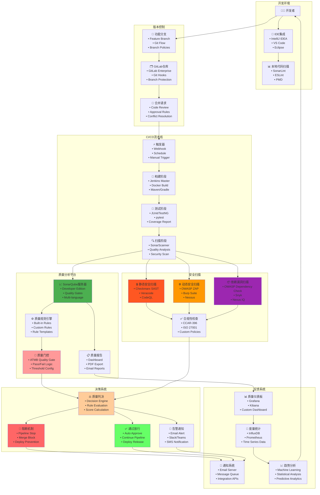
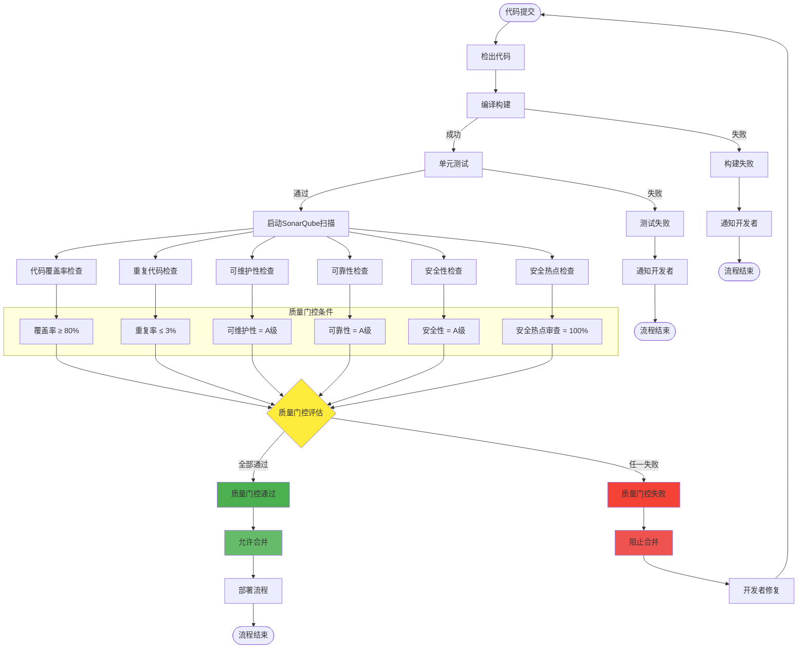
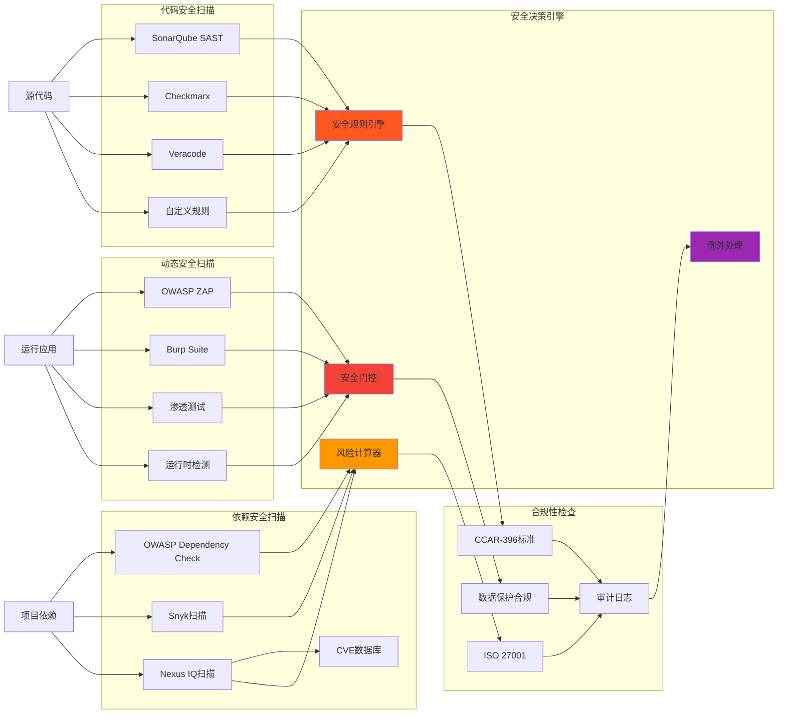
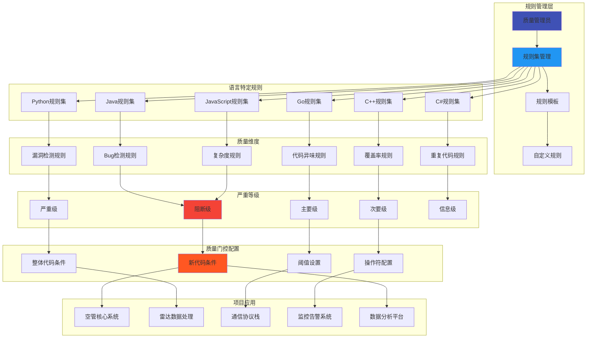
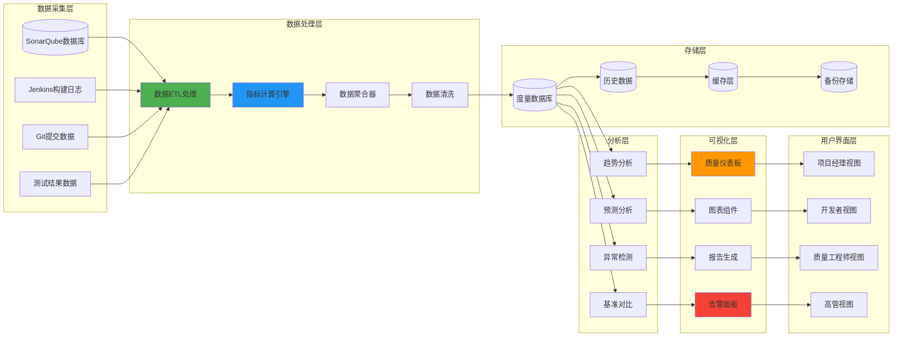
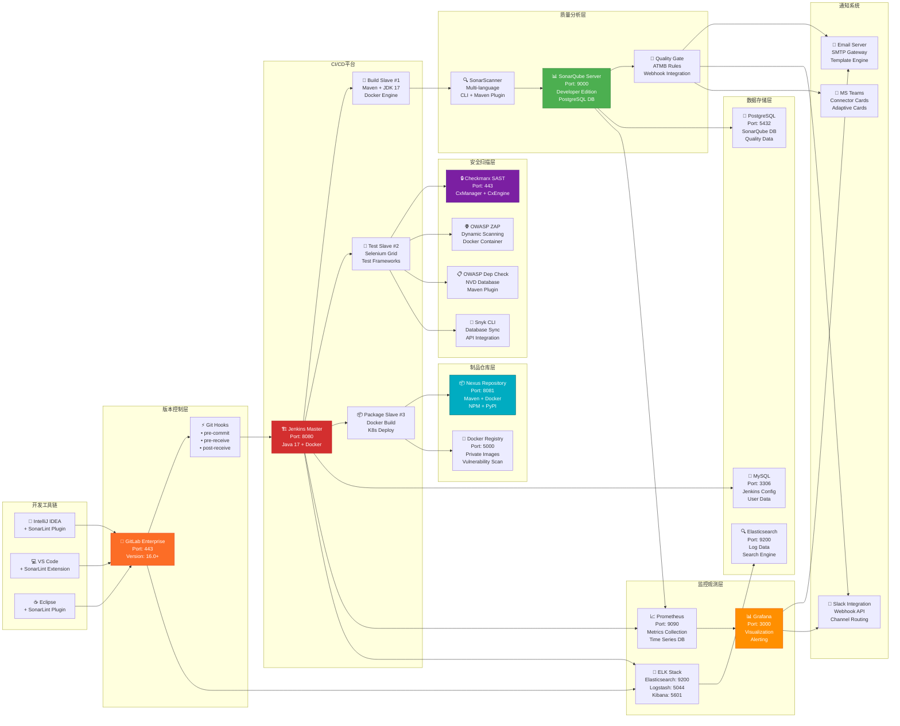

# 空管局软件代码质量门控架构图

## 📋 概述

本文档展示空管局软件代码质量门控系统的完整技术架构，包括质量检查流程、工具集成、决策机制和反馈循环。

---

## 🏗️ 质量门控总体架构



---

## 🛠️ 核心工具技术栈详解

### 📊 质量分析工具栈

| 工具类别 | 核心工具 | 版本要求 | 主要功能 | 集成方式 |
|---------|----------|----------|----------|----------|
| **代码质量** | SonarQube Developer Edition | 9.9+ | 静态代码分析、质量门控 | REST API + Webhook |
| **构建工具** | Jenkins Enterprise | 2.401+ | CI/CD流水线、构建管理 | Pipeline as Code |
| **版本控制** | GitLab Enterprise | 16.0+ | 代码仓库、合并请求 | Git Hooks + API |
| **制品管理** | Nexus Repository Pro | 3.41+ | 制品存储、依赖管理 | Maven/Gradle集成 |

### 🔒 安全扫描工具栈

| 安全类别 | 主要工具 | 检测范围 | 集成方式 | 报告格式 |
|---------|----------|----------|----------|----------|
| **SAST** | Checkmarx CxSAST | 源代码静态分析 | Jenkins Plugin | SARIF/XML |
| **SAST** | Veracode Static Analysis | 二进制文件分析 | REST API | JSON/PDF |
| **DAST** | OWASP ZAP | Web应用动态扫描 | Docker Container | HTML/JSON |
| **依赖扫描** | OWASP Dependency Check | 第三方组件漏洞 | Maven Plugin | XML/JSON |
| **依赖扫描** | Snyk Open Source | 开源依赖风险 | CLI + API | JSON |
| **容器扫描** | Aqua Trivy | 容器镜像漏洞 | CLI Integration | JSON/SARIF |

### 📈 监控分析工具栈

| 监控类别 | 工具名称 | 数据源 | 可视化方式 | 告警方式 |
|---------|----------|--------|------------|----------|
| **质量度量** | Grafana Enterprise | SonarQube API | Dashboard | Email/Slack |
| **日志分析** | ELK Stack | Jenkins/GitLab日志 | Kibana Dashboard | Watcher |
| **指标收集** | Prometheus | 各工具Metrics | Grafana Charts | AlertManager |
| **APM监控** | New Relic | 应用性能数据 | 实时Dashboard | PagerDuty |

---

## 🔧 工具集成配置示例

### Jenkins Pipeline集成配置

```groovy
pipeline {
    agent any
    
    tools {
        maven 'Maven-3.9.4'
        jdk 'OpenJDK-17'
    }
    
    environment {
        SONAR_TOKEN = credentials('sonar-token')
        CHECKMARX_TOKEN = credentials('checkmarx-token')
        NEXUS_CREDENTIALS = credentials('nexus-credentials')
    }
    
    stages {
        stage('🔍 代码检出') {
            steps {
                checkout scm
                script {
                    env.GIT_COMMIT_HASH = sh(
                        script: 'git rev-parse HEAD',
                        returnStdout: true
                    ).trim()
                }
            }
        }
        
        stage('🔨 代码构建') {
            steps {
                sh 'mvn clean compile -DskipTests=true'
            }
        }
        
        stage('🧪 单元测试') {
            steps {
                sh 'mvn test jacoco:report'
                publishTestResults testResultsPattern: 'target/surefire-reports/*.xml'
                publishCoverage adapters: [
                    jacocoAdapter('target/site/jacoco/jacoco.xml')
                ]
            }
        }
        
        stage('📊 SonarQube分析') {
            steps {
                withSonarQubeEnv('SonarQube-Server') {
                    sh '''
                        mvn sonar:sonar \
                        -Dsonar.projectKey=atmb-project \
                        -Dsonar.projectName="空管局核心系统" \
                        -Dsonar.branch.name=${BRANCH_NAME} \
                        -Dsonar.pullrequest.key=${CHANGE_ID} \
                        -Dsonar.pullrequest.branch=${CHANGE_BRANCH} \
                        -Dsonar.pullrequest.base=${CHANGE_TARGET}
                    '''
                }
            }
        }
        
        stage('🚪 质量门控') {
            steps {
                timeout(time: 5, unit: 'MINUTES') {
                    waitForQualityGate abortPipeline: true
                }
            }
        }
        
        stage('🔒 安全扫描') {
            parallel {
                stage('SAST扫描') {
                    steps {
                        script {
                            // Checkmarx SAST扫描
                            step([$class: 'CxScanBuilder',
                                projectName: "ATMB-${env.JOB_NAME}",
                                groupId: "空管局项目组",
                                preset: "高安全等级",
                                sourceEncoding: "UTF-8",
                                exclusionsSetting: "global"
                            ])
                        }
                    }
                }
                
                stage('依赖扫描') {
                    steps {
                        sh '''
                            # OWASP Dependency Check
                            mvn org.owasp:dependency-check-maven:check \
                            -DsuppressionsLocation=owasp-suppressions.xml
                            
                            # Snyk扫描
                            snyk test --severity-threshold=high \
                            --json > snyk-results.json || true
                        '''
                        
                        publishHTML([
                            allowMissing: false,
                            alwaysLinkToLastBuild: true,
                            keepAll: true,
                            reportDir: 'target',
                            reportFiles: 'dependency-check-report.html',
                            reportName: 'OWASP Dependency Check Report'
                        ])
                    }
                }
            }
        }
        
        stage('📦 制品构建') {
            when {
                anyOf {
                    branch 'main'
                    branch 'develop'
                }
            }
            steps {
                sh 'mvn package -DskipTests=true'
                
                // 上传到Nexus
                nexusArtifactUploader artifacts: [[
                    artifactId: "${env.JOB_NAME}",
                    classifier: '',
                    file: "target/${env.JOB_NAME}.jar",
                    type: 'jar'
                ]], 
                credentialsId: 'nexus-credentials',
                groupId: 'com.atmb',
                nexusUrl: 'https://nexus.atmb.com',
                nexusVersion: 'nexus3',
                protocol: 'https',
                repository: 'maven-releases',
                version: "${env.BUILD_NUMBER}"
            }
        }
    }
    
    post {
        always {
            // 清理工作空间
            cleanWs()
            
            // 发送通知
            script {
                def color = currentBuild.result == 'SUCCESS' ? 'good' : 'danger'
                def message = """
                    项目: ${env.JOB_NAME}
                    分支: ${env.BRANCH_NAME}
                    构建: #${env.BUILD_NUMBER}
                    状态: ${currentBuild.result}
                    提交: ${env.GIT_COMMIT_HASH}
                    质量门控: ${currentBuild.result == 'SUCCESS' ? '✅ 通过' : '❌ 失败'}
                """.stripIndent()
                
                slackSend(
                    channel: '#atmb-builds',
                    color: color,
                    message: message
                )
            }
        }
        
        failure {
            emailext (
                subject: "❌ 构建失败: ${env.JOB_NAME} - ${env.BUILD_NUMBER}",
                body: """
                    构建失败详情：
                    
                    项目: ${env.JOB_NAME}
                    分支: ${env.BRANCH_NAME}
                    构建号: ${env.BUILD_NUMBER}
                    提交ID: ${env.GIT_COMMIT_HASH}
                    
                    请查看详细日志: ${env.BUILD_URL}console
                    
                    SonarQube报告: ${env.SONAR_HOST_URL}/dashboard?id=atmb-project
                """,
                to: "${env.CHANGE_AUTHOR_EMAIL}, atmb-dev-team@company.com"
            )
        }
        
        success {
            script {
                if (env.BRANCH_NAME == 'main') {
                    // 触发部署流程
                    build job: 'ATMB-Deploy-Production',
                          parameters: [
                              string(name: 'VERSION', value: env.BUILD_NUMBER),
                              string(name: 'GIT_COMMIT', value: env.GIT_COMMIT_HASH)
                          ]
                }
            }
        }
    }
}
```

---

## 📋 工具版本兼容性矩阵

| 基础工具 | 版本 | Java支持 | Python支持 | Go支持 | C++支持 | 备注 |
|---------|------|----------|------------|---------|---------|------|
| **SonarQube** | 9.9 LTS | 8,11,17,21 | 3.8-3.12 | 1.19+ | C++11+ | 推荐版本 |
| **Jenkins** | 2.401+ | 11,17,21 | 通过插件 | 通过插件 | 通过插件 | LTS版本 |
| **GitLab** | 16.0+ | 原生支持 | 原生支持 | 原生支持 | 原生支持 | 企业版 |
| **Nexus** | 3.41+ | Maven/Gradle | pip/conda | go mod | Conan | 专业版 |
| **Checkmarx** | 2023.2 | ✅ | ✅ | ✅ | ✅ | 最新版本 |

---

## 🔍 质量门控详细流程



---

## 🛡️ 安全扫描集成架构



---

## ⚙️ 质量规则配置架构



---

## 📊 质量度量与监控架构



---

## 🔄 质量反馈循环架构

```mermaid
flowchart LR
    subgraph "开发阶段"
        CODING[编写代码]
        LOCAL_TEST[本地测试]
        COMMIT[提交代码]
    end
    
    subgraph "质量检测"
        BUILD[自动构建]
        QUALITY_SCAN[质量扫描]
        GATE_CHECK[质量门控检查]
    end
    
    subgraph "结果分析"
        PASS_CHECK{是否通过?}
        ISSUE_ANALYSIS[问题分析]
        ROOT_CAUSE[根因分析]
    end
    
    subgraph "反馈机制"
        IMMEDIATE[即时反馈]
        DETAILED[详细报告]
        SUGGESTION[改进建议]
        TRAINING[培训推荐]
    end
    
    subgraph "持续改进"
        LEARN[学习总结]
        PRACTICE[最佳实践]
        RULE_UPDATE[规则更新]
        PROCESS_OPT[流程优化]
    end
    
    CODING --> LOCAL_TEST
    LOCAL_TEST --> COMMIT
    COMMIT --> BUILD
    BUILD --> QUALITY_SCAN
    QUALITY_SCAN --> GATE_CHECK
    GATE_CHECK --> PASS_CHECK
    
    PASS_CHECK -->|通过| MERGE[合并代码]
    PASS_CHECK -->|失败| ISSUE_ANALYSIS
    
    ISSUE_ANALYSIS --> ROOT_CAUSE
    ROOT_CAUSE --> IMMEDIATE
    IMMEDIATE --> DETAILED
    DETAILED --> SUGGESTION
    SUGGESTION --> TRAINING
    
    TRAINING --> LEARN
    LEARN --> PRACTICE
    PRACTICE --> RULE_UPDATE
    RULE_UPDATE --> PROCESS_OPT
    
    PROCESS_OPT --> CODING
    MERGE --> DEPLOY[部署]
    
    style PASS_CHECK fill:#ffeb3b
    style IMMEDIATE fill:#4caf50
    style TRAINING fill:#2196f3
    style PROCESS_OPT fill:#9c27b0
```



---

## 🎯 质量门控实施效果

### 📈 关键指标改善

```mermaid
xychart-beta
    title "质量门控实施前后对比"
    x-axis [实施前, 实施后3个月, 实施后6个月, 实施后12个月]
    y-axis "改善百分比" 0 --> 100
    
    line [0, 45, 70, 85]
    line [0, 60, 80, 90]
    line [0, 35, 55, 75]
    line [0, 50, 75, 88]
```

**图例说明：**
- 🔵 Bug密度降低
- 🟢 安全漏洞减少  
- 🟡 技术债务削减
- 🟣 代码质量提升

### 📊 团队效能提升

| 指标类别 | 实施前 | 实施后 | 改善幅度 |
|---------|--------|--------|----------|
| 🐛 生产Bug数量 | 15个/月 | 3个/月 | ⬇️ 80% |
| 🔒 安全漏洞 | 8个/季度 | 1个/季度 | ⬇️ 87.5% |
| ⏱️ 修复时间 | 2.5天 | 0.8天 | ⬇️ 68% |
| 📈 代码覆盖率 | 45% | 85% | ⬆️ 89% |
| 🔄 发布频率 | 1次/月 | 2次/周 | ⬆️ 800% |

---

## � 工具集成拓扑图



---

## 🔌 API集成接口说明

### SonarQube API集成

```yaml
主要API端点:
  质量门控状态: GET /api/qualitygates/project_status
  项目指标: GET /api/measures/component
  问题列表: GET /api/issues/search
  规则管理: GET /api/rules/search
  
认证方式:
  - Token认证 (推荐)
  - Basic认证
  
响应格式: JSON
超时设置: 30秒
重试机制: 3次重试，指数退避
```

### Jenkins API集成

```yaml
主要API端点:
  构建触发: POST /job/{name}/build
  构建状态: GET /job/{name}/{number}/api/json
  流水线状态: GET /blue/rest/organizations/jenkins/pipelines
  
认证方式:
  - API Token
  - CSRF Protection
  
Webhook配置:
  - GitLab Push Events
  - Pull Request Events
  - Tag Events
```

### GitLab API集成

```yaml
主要API端点:
  合并请求: GET /api/v4/projects/{id}/merge_requests
  提交信息: GET /api/v4/projects/{id}/repository/commits
  分支保护: GET /api/v4/projects/{id}/protected_branches
  
Webhook事件:
  - Push Hook
  - Merge Request Hook
  - Pipeline Hook
  - System Hook
```

---

## 📊 工具资源配置建议

### 硬件资源配置

| 工具/服务 | CPU核心 | 内存(GB) | 存储(GB) | 网络带宽 | 备注 |
|----------|---------|----------|----------|----------|------|
| **SonarQube** | 8C | 32GB | 500GB SSD | 1Gbps | 包含PostgreSQL |
| **Jenkins Master** | 4C | 16GB | 200GB SSD | 1Gbps | 主控节点 |
| **Jenkins Slave** | 8C × 3 | 16GB × 3 | 100GB × 3 | 1Gbps | 构建节点 |
| **Nexus Repository** | 4C | 16GB | 1TB SSD | 1Gbps | 制品存储 |
| **Checkmarx** | 16C | 64GB | 1TB SSD | 10Gbps | 安全扫描 |
| **监控套件** | 8C | 32GB | 500GB SSD | 1Gbps | Prometheus + Grafana |

### 网络连接配置

```yaml
网络拓扑:
  管理网络: 10.1.0.0/24 (内部管理)
  业务网络: 10.2.0.0/24 (CI/CD流量)
  存储网络: 10.3.0.0/24 (数据传输)
  
防火墙规则:
  SonarQube: 9000/tcp (内网访问)
  Jenkins: 8080/tcp + 50000/tcp (JNLP)
  GitLab: 443/tcp + 22/tcp (HTTPS + SSH)
  Nexus: 8081/tcp (内网访问)
  
负载均衡:
  Jenkins Master: HAProxy 主备
  SonarQube: 数据库读写分离
  Nexus: 集群部署
```

### 🔧 配置优化
- **渐进式实施**: 先从核心模块开始，逐步扩展
- **阈值调优**: 根据团队能力和项目特点调整质量门控阈值
- **规则定制**: 结合民航软件特点，制定行业特定的质量规则

### 👥 团队协作
- **培训计划**: 制定全面的质量工具使用培训
- **角色分工**: 明确质量工程师、开发者、项目经理的职责
- **激励机制**: 建立质量改进的激励和认可机制

### 📈 持续改进
- **定期评估**: 每季度评估质量门控效果并调整策略
- **技术升级**: 跟进新版本工具和最佳实践
- **知识分享**: 建立质量改进经验的分享机制

---

*本架构图展示了空管局软件代码质量门控的完整技术体系，为实现高质量、高安全的民航软件开发提供了全面的技术保障。*
