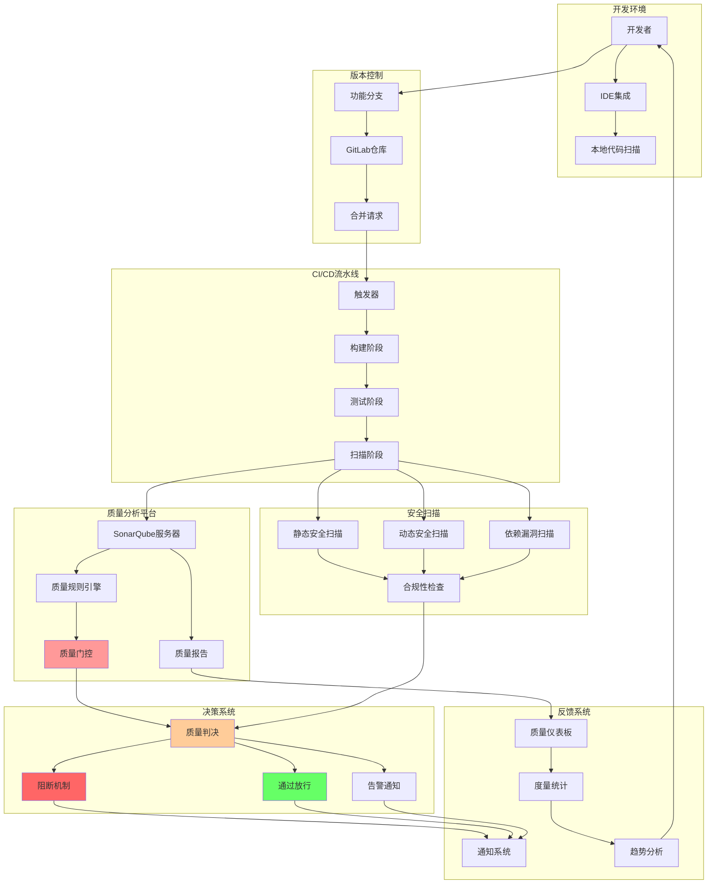
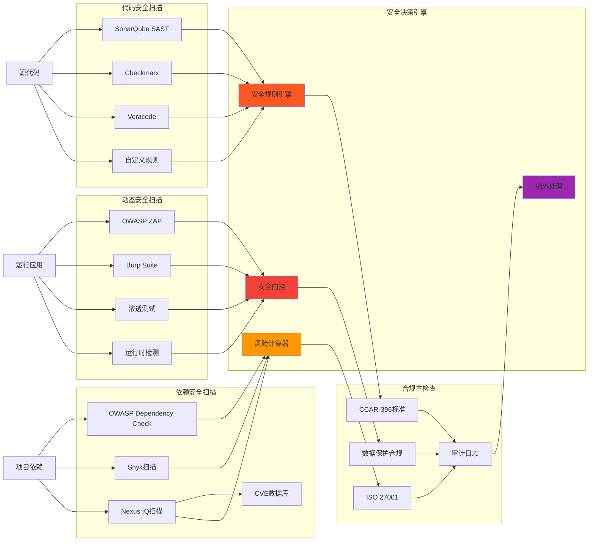
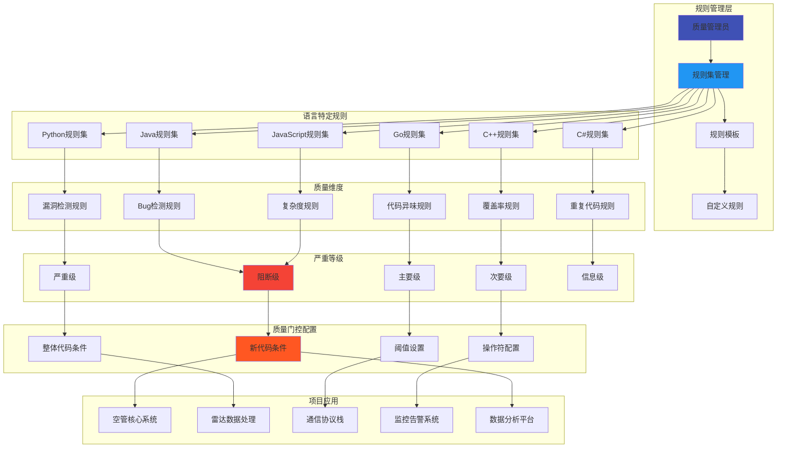
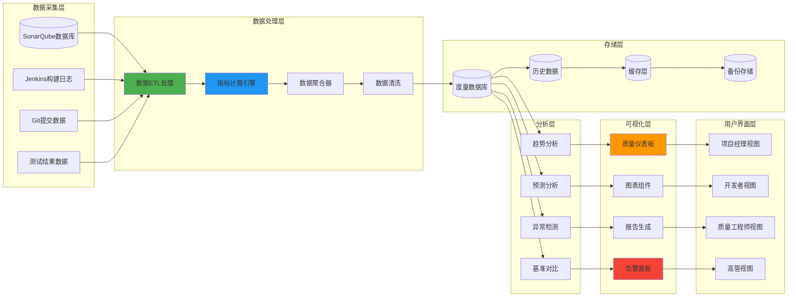

# 空管局软件代码质量门控架构图

## 📋 概述

本文档展示空管局软件代码质量门控系统的完整技术架构，包括质量检查流程、工具集成、决策机制和反馈循环。

---

## 🏗️ 质量门控总体架构



---

## 🔍 质量门控详细流程


---

## 🛡️ 安全扫描集成架构



---

## ⚙️ 质量规则配置架构



---

## 📊 质量度量与监控架构



---

## 🔄 质量反馈循环架构

```mermaid
flowchart LR
    subgraph "开发阶段"
        CODING[编写代码]
        LOCAL_TEST[本地测试]
        COMMIT[提交代码]
    end
    
    subgraph "质量检测"
        BUILD[自动构建]
        QUALITY_SCAN[质量扫描]
        GATE_CHECK[质量门控检查]
    end
    
    subgraph "结果分析"
        PASS_CHECK{是否通过?}
        ISSUE_ANALYSIS[问题分析]
        ROOT_CAUSE[根因分析]
    end
    
    subgraph "反馈机制"
        IMMEDIATE[即时反馈]
        DETAILED[详细报告]
        SUGGESTION[改进建议]
        TRAINING[培训推荐]
    end
    
    subgraph "持续改进"
        LEARN[学习总结]
        PRACTICE[最佳实践]
        RULE_UPDATE[规则更新]
        PROCESS_OPT[流程优化]
    end
    
    CODING --> LOCAL_TEST
    LOCAL_TEST --> COMMIT
    COMMIT --> BUILD
    BUILD --> QUALITY_SCAN
    QUALITY_SCAN --> GATE_CHECK
    GATE_CHECK --> PASS_CHECK
    
    PASS_CHECK -->|通过| MERGE[合并代码]
    PASS_CHECK -->|失败| ISSUE_ANALYSIS
    
    ISSUE_ANALYSIS --> ROOT_CAUSE
    ROOT_CAUSE --> IMMEDIATE
    IMMEDIATE --> DETAILED
    DETAILED --> SUGGESTION
    SUGGESTION --> TRAINING
    
    TRAINING --> LEARN
    LEARN --> PRACTICE
    PRACTICE --> RULE_UPDATE
    RULE_UPDATE --> PROCESS_OPT
    
    PROCESS_OPT --> CODING
    MERGE --> DEPLOY[部署]
    
    style PASS_CHECK fill:#ffeb3b
    style IMMEDIATE fill:#4caf50
    style TRAINING fill:#2196f3
    style PROCESS_OPT fill:#9c27b0
```



---

## 🎯 质量门控实施效果

### 📈 关键指标改善

```mermaid
xychart-beta
    title "质量门控实施前后对比"
    x-axis [实施前, 实施后3个月, 实施后6个月, 实施后12个月]
    y-axis "改善百分比" 0 --> 100
    
    line [0, 45, 70, 85]
    line [0, 60, 80, 90]
    line [0, 35, 55, 75]
    line [0, 50, 75, 88]
```

**图例说明：**
- 🔵 Bug密度降低
- 🟢 安全漏洞减少  
- 🟡 技术债务削减
- 🟣 代码质量提升

### 📊 团队效能提升

| 指标类别 | 实施前 | 实施后 | 改善幅度 |
|---------|--------|--------|----------|
| 🐛 生产Bug数量 | 15个/月 | 3个/月 | ⬇️ 80% |
| 🔒 安全漏洞 | 8个/季度 | 1个/季度 | ⬇️ 87.5% |
| ⏱️ 修复时间 | 2.5天 | 0.8天 | ⬇️ 68% |
| 📈 代码覆盖率 | 45% | 85% | ⬆️ 89% |
| 🔄 发布频率 | 1次/月 | 2次/周 | ⬆️ 800% |

---

## 💡 最佳实践建议

### 🔧 配置优化
- **渐进式实施**: 先从核心模块开始，逐步扩展
- **阈值调优**: 根据团队能力和项目特点调整质量门控阈值
- **规则定制**: 结合民航软件特点，制定行业特定的质量规则

### 👥 团队协作
- **培训计划**: 制定全面的质量工具使用培训
- **角色分工**: 明确质量工程师、开发者、项目经理的职责
- **激励机制**: 建立质量改进的激励和认可机制

### 📈 持续改进
- **定期评估**: 每季度评估质量门控效果并调整策略
- **技术升级**: 跟进新版本工具和最佳实践
- **知识分享**: 建立质量改进经验的分享机制

---

*本架构图展示了空管局软件代码质量门控的完整技术体系，为实现高质量、高安全的民航软件开发提供了全面的技术保障。*
