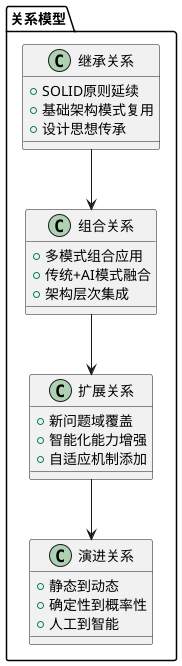
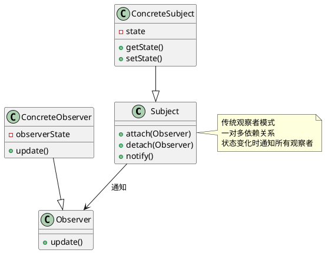
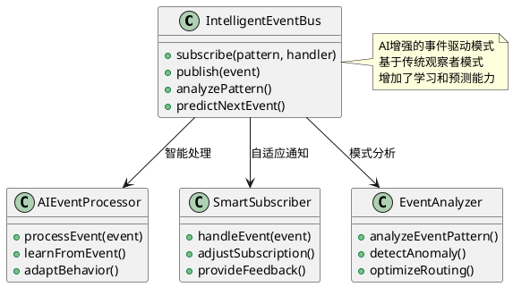
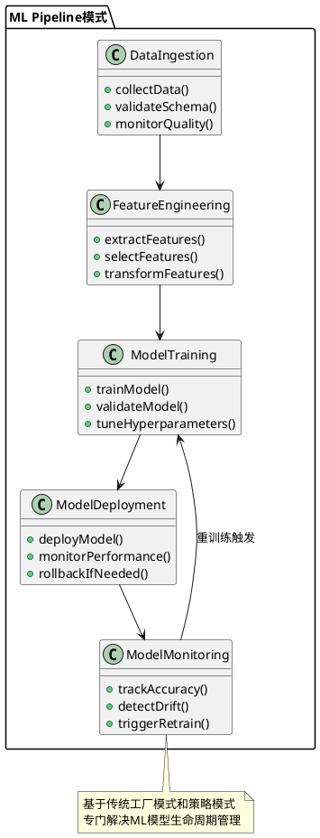
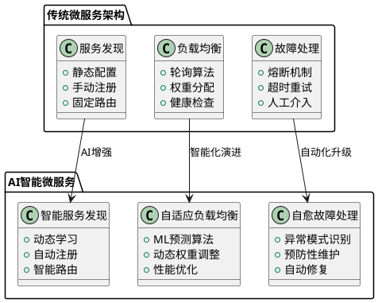

# AI原生设计模式层与传统软件设计的关系解析

## 1. 关系概述

AI原生设计模式层不是对传统软件设计的替代，而是在AI时代背景下的**演进和扩展**。两者存在以下四种核心关系：



## 2. 详细对比分析

### 2.1 传统软件设计 vs AI原生设计

| 维度                 | 传统软件设计       | AI原生设计模式                    | 关系说明                     |
| -------------------- | ------------------ | --------------------------------- | ---------------------------- |
| **核心关注点** | 代码结构、对象关系 | 数据流、智能决策、自适应          | 从结构化到行为化的演进       |
| **设计原则**   | SOLID原则、DRY原则 | SOLID + 数据优先、模型优先        | 继承基础原则，扩展AI特有原则 |
| **主要模式**   | GoF 23种模式       | ML Pipeline、数据管道、自适应服务 | 在传统模式基础上创新         |
| **解决问题**   | 代码复用、可维护性 | 数据处理、模型管理、智能交互      | 解决新时代的新问题           |
| **架构特点**   | 静态结构设计       | 动态自适应设计                    | 从静态到动态的演进           |

### 2.2 具体模式对比

#### 传统设计模式示例：观察者模式



#### AI原生模式示例：智能事件驱动模式



## 3. AI原生设计模式的三大核心领域

### 3.1 数据驱动架构模式

**与传统关系**：继承了传统的管道-过滤器模式、分层架构模式，但专门针对大数据和机器学习场景优化。

#### 传统方式：简单数据处理

```java
// 传统数据处理方式
public class DataProcessor {
    public ProcessedData process(RawData data) {
        ValidatedData validated = validator.validate(data);
        TransformedData transformed = transformer.transform(validated);
        return formatter.format(transformed);
    }
}
```

#### AI原生方式：智能数据管道

```python
# AI原生数据管道模式
class IntelligentDataPipeline:
    def __init__(self):
        self.quality_monitor = DataQualityMonitor()
        self.feature_engine = FeatureEngine()
        self.ml_processor = MLProcessor()
      
    def process(self, data_stream):
        # 实时质量监控
        quality_score = self.quality_monitor.assess(data_stream)
      
        # 智能特征提取
        features = self.feature_engine.extract_adaptive(data_stream)
      
        # ML增强处理
        processed = self.ml_processor.process_with_learning(features)
      
        return processed
```

**关系说明**：

- **继承**：保持了管道模式的基本结构
- **扩展**：增加了质量监控、特征工程、机器学习能力
- **演进**：从简单转换到智能处理

### 3.2 机器学习系统模式

**与传统关系**：基于传统的工厂模式、策略模式，但专门解决模型生命周期管理问题。

#### ML Pipeline模式架构



**与传统工厂模式的关系**：

- **继承**：使用工厂模式创建不同类型的模型
- **扩展**：增加了版本控制、A/B测试、性能监控
- **创新**：引入了模型漂移检测和自动重训练机制

### 3.3 智能微服务模式

**与传统关系**：基于传统微服务架构，但增加了自适应、自愈、自学习能力。

#### 传统微服务 vs 智能微服务对比



## 4. 核心设计原则的演进

### 4.1 传统SOLID原则的AI扩展

| 传统SOLID                       | AI扩展版本                               | 说明                           |
| ------------------------------- | ---------------------------------------- | ------------------------------ |
| **Single Responsibility** | **Single Learning Responsibility** | 每个AI组件专注一个学习任务     |
| **Open/Closed**           | **Adaptive/Extensible**            | 支持模型更新和能力扩展         |
| **Liskov Substitution**   | **Model Substitution**             | 不同模型版本可无缝替换         |
| **Interface Segregation** | **Service Interface Segregation**  | AI服务接口最小化和特化         |
| **Dependency Inversion**  | **Data Dependency Inversion**      | 依赖抽象的数据接口而非具体实现 |

### 4.2 新增AI原生设计原则

1. **数据优先原则**：设计以数据流为核心
2. **模型驱动原则**：业务逻辑由模型决策驱动
3. **持续学习原则**：系统具备在线学习能力
4. **可解释性原则**：决策过程透明可追溯
5. **自适应原则**：根据环境变化自动调整

## 5. 实际应用场景

### 5.1 电商推荐系统对比

#### 传统方式

```java
// 传统推荐系统
public class TraditionalRecommendation {
    public List<Product> recommend(User user) {
        // 基于规则的固定推荐逻辑
        if (user.getAge() > 30) {
            return getProductsByCategory("家居");
        } else {
            return getProductsByCategory("时尚");
        }
    }
}
```

#### AI原生方式

```python
# AI原生智能推荐系统
class IntelligentRecommendationService:
    def __init__(self):
        self.user_behavior_analyzer = UserBehaviorAnalyzer()
        self.recommendation_model = RecommendationModel()
        self.feedback_processor = FeedbackProcessor()
  
    def recommend(self, user_context):
        # 实时行为分析
        behavior_features = self.user_behavior_analyzer.analyze(user_context)
      
        # AI模型推理
        recommendations = self.recommendation_model.predict(behavior_features)
      
        # 在线学习反馈
        self.feedback_processor.collect_implicit_feedback(user_context)
      
        return recommendations
  
    def adapt_model(self, feedback_data):
        # 持续学习和模型更新
        self.recommendation_model.update_online(feedback_data)
```

## 6. 总结

AI原生设计模式层与传统软件设计的关系可以概括为：

### 🔄 **演进关系**

- **不是替代**：AI原生模式是传统设计的演进，不是推倒重建
- **是扩展**：在传统模式基础上增加智能化、自适应、数据驱动能力
- **是创新**：针对AI时代特有问题提出新的解决方案

### 🏗️ **结构关系**

- **底层基础**：继续使用传统设计的基本原则和模式
- **中间增强**：通过AI技术增强传统模式的能力
- **顶层创新**：针对数据处理、模型管理、智能交互的全新模式

### 💡 **价值关系**

- **传统设计**：解决代码组织、系统架构的基础问题
- **AI原生模式**：解决数据处理、智能决策、自适应系统的新问题
- **组合效果**：两者结合实现既稳定又智能的系统架构

AI原生设计模式层本质上是传统软件设计在AI时代的自然演进，它保持了软件工程的核心原则，同时引入了处理数据、模型、智能化需求的新模式和新方法。
