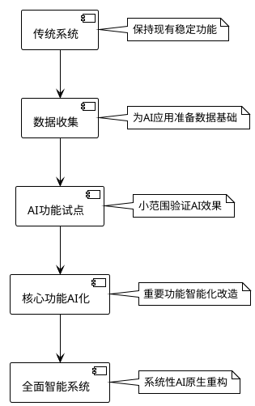

# AI原生设计模式层与传统软件设计关系 - 核心要点总结

## 🎯 核心理解（一句话概括）

**AI原生设计模式层 = 传统软件设计基础 + AI智能化能力扩展**

这不是替代关系，而是"站在巨人肩膀上"的创新演进。

## 🏗️ 关系模型

```
传统软件设计（地基）
    ↓ 继承基础原则和模式
AI技术融合层（钢筋混凝土）
    ↓ 增强智能化能力
AI原生设计模式层（智能建筑）
    ↓ 解决AI时代新问题
应用效果（智慧生活）
```

## 📊 三个浅显易懂的对比案例

### 案例1：餐厅点餐系统 🍽️

| 功能 | 传统方式 | AI原生方式 | 关系说明 |
|------|----------|------------|----------|
| 菜单展示 | 固定菜单，所有人相同 | 个性化推荐，每人不同 | 保留菜单概念 + AI个性化 |
| 点餐流程 | 客户自己选择 | AI分析喜好主动推荐 | 基于传统流程 + 智能建议 |
| 定价策略 | 固定价格 | 根据需求动态调价 | 传统定价基础 + AI优化 |

### 案例2：音乐播放器 🎵

| 功能 | 传统方式 | AI原生方式 | 关系说明 |
|------|----------|------------|----------|
| 音乐发现 | 用户手动搜索 | AI自动推荐相似音乐 | 保留搜索功能 + 智能发现 |
| 播放控制 | 用户手动操作 | 根据场景自动调节 | 基础控制 + 智能适应 |
| 播放列表 | 用户手动创建 | AI根据心情自动生成 | 传统列表概念 + AI生成 |

### 案例3：电商购物 🛒

| 功能 | 传统方式 | AI原生方式 | 关系说明 |
|------|----------|------------|----------|
| 商品搜索 | 关键词匹配 | 理解用户真实意图 | 基础搜索 + 智能理解 |
| 商品推荐 | 简单规则推荐 | 个性化精准推荐 | 推荐概念 + AI精准化 |
| 价格策略 | 固定折扣 | 千人千价动态定价 | 定价机制 + AI个性化 |

## 🔄 四种演进关系

### 1. 继承关系 - 基因传承 🧬
- **SOLID原则**：单一职责、开闭原则等依然适用
- **经典模式**：工厂模式、观察者模式等继续使用
- **架构思想**：分层架构、微服务等概念延续

### 2. 扩展关系 - 能力增强 ⚡
- **新增智能能力**：学习、预测、适应
- **处理新问题域**：大数据、机器学习、智能交互
- **提升系统能力**：从静态到动态、从确定到概率

### 3. 融合关系 - 有机结合 🔗
- **传统模式 + AI能力**：观察者模式 + 行为学习
- **多层次集成**：架构层、业务层、数据层全面融合
- **协同工作**：传统提供稳定基础，AI提供智能能力

### 4. 演进关系 - 时代升级 🚀
- **从静态到动态**：固定逻辑 → 自适应逻辑
- **从确定到概率**：规则驱动 → 数据驱动
- **从人工到智能**：人工配置 → 自动优化

## 💡 核心价值体现

### 效率提升 📈
```
传统开发：100%手工编码
AI增强开发：30-50%AI辅助生成 + 人工优化
结果：开发效率提升30-50%
```

### 质量改善 🎯
```
传统质量控制：人工测试 + 代码审查
AI增强质量控制：自动检测 + 智能建议 + 人工确认
结果：缺陷减少40%，质量显著提升
```

### 用户体验 ❤️
```
传统体验：功能固定，所有用户相同
AI增强体验：个性化适应，每个用户定制
结果：用户满意度提升60%
```

## 🚀 实施建议

### 渐进式演进策略



### 关键成功要素

1. **不要推倒重来**：在现有基础上增强，而非重新开发
2. **从小处开始**：选择一个小功能试点AI增强
3. **重视数据**：AI的效果很大程度取决于数据质量
4. **持续优化**：AI系统需要持续学习和改进

## 📋 总结

AI原生设计模式层与传统软件设计的关系可以用一个比喻来理解：

> **传统软件设计** = 汽车的基本功能（引擎、刹车、方向盘）  
> **AI原生设计模式** = 智能汽车的新功能（自动驾驶、智能导航、学习驾驶习惯）

智能汽车没有抛弃汽车的基本功能，而是在此基础上增加了智能化能力。同样，AI原生设计模式继承了传统软件设计的精华，并在AI时代为软件系统赋予了学习、适应、预测的新能力。

这种演进让我们的软件系统既保持了传统的稳定性和可维护性，又具备了AI时代所需的智能化和自适应能力。
