# AI原生设计模式层与传统软件设计关系深度解析（修复版）

## 📖 概述

AI原生设计模式层是传统软件设计在AI时代的自然演进，就像从传统汽车到智能汽车的升级过程 - 保留了汽车的基本功能，但增加了智能驾驶、自动导航、学习驾驶习惯等新能力。

## 🔄 关系模型图

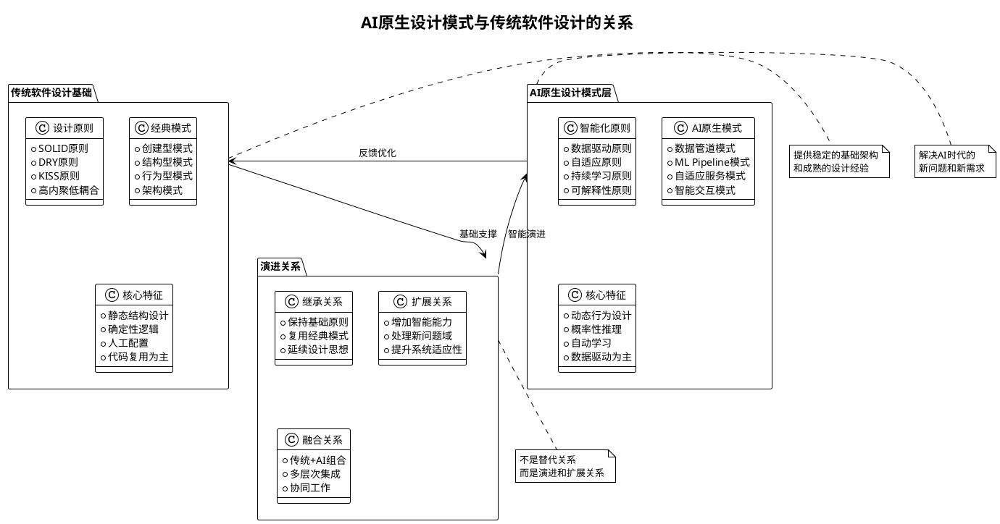

## 🏗️ 层次关系详解

### 1. 传统软件设计基础层

**作用**：提供稳定的架构基础和成熟的设计经验

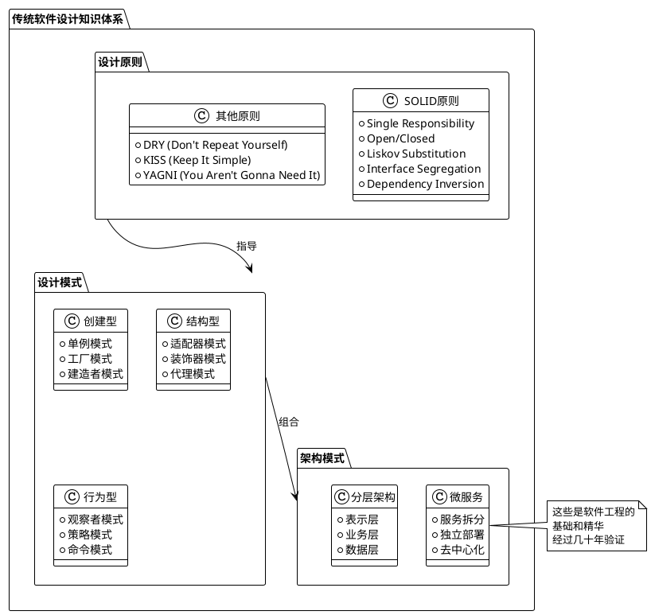

### 2. AI原生设计模式层

**作用**：在传统基础上增加智能化、自适应能力

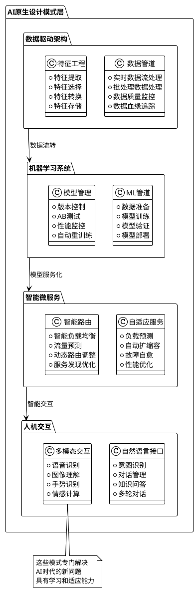

## 📚 浅显易懂的对比案例

### 案例1：餐厅点餐系统的演进

#### 🍽️ 传统方式：固定菜单系统

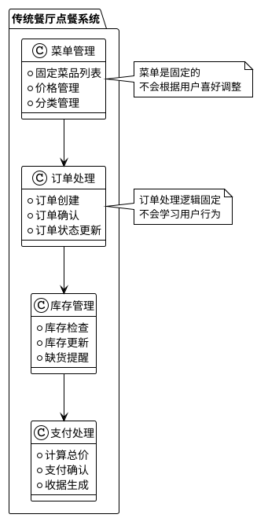

#### 🤖 AI原生方式：智能推荐点餐系统

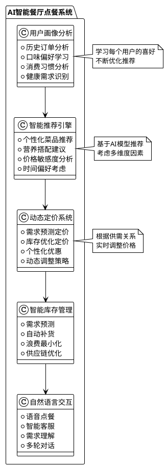

### 案例2：音乐播放器的演进

#### 🎵 传统音乐播放器

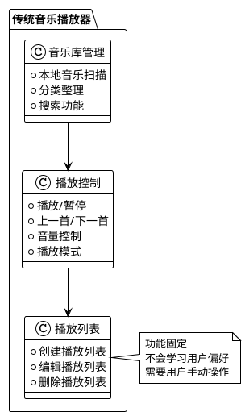

#### 🎧 AI智能音乐播放器

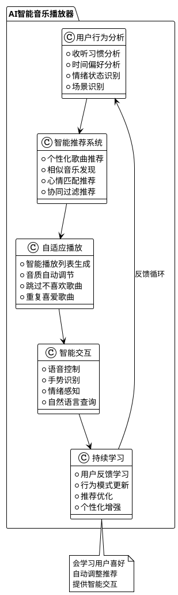

## 🎯 关系演进图谱

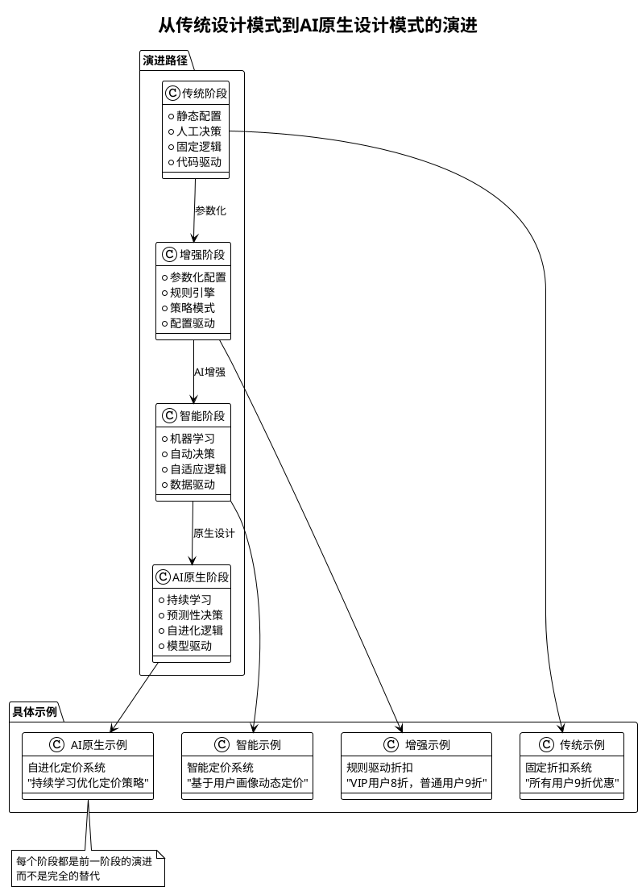

## 🔍 深入理解：三个关键问题

### 1. 为什么需要AI原生设计模式？

**传统设计模式解决不了的新问题**：

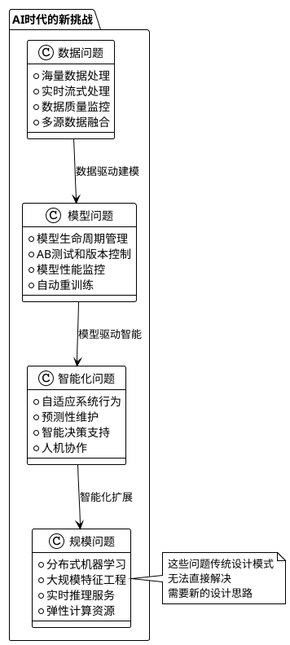

### 2. AI原生设计模式如何与传统模式协作？

**协作模式图**：

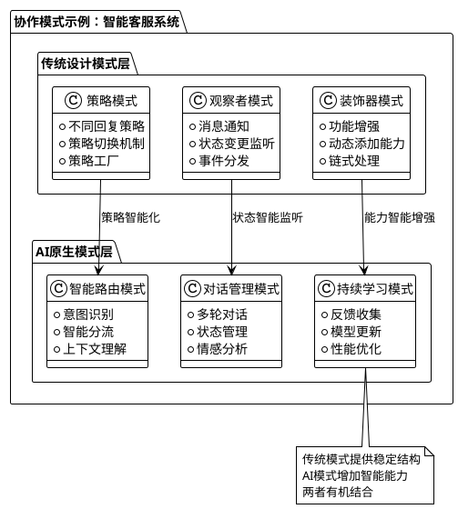

### 3. 如何在实际项目中应用？

**渐进式应用策略**：

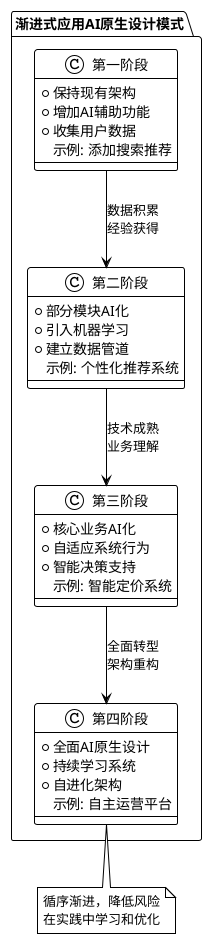

## 📋 总结要点

### 🔑 关键理解

1. **不是替代关系**：AI原生设计模式是传统设计的演进和扩展
2. **解决新问题**：专门处理AI时代的数据、模型、智能化需求
3. **继承基础**：保留软件工程的基本原则和成熟经验
4. **增强能力**：在传统基础上增加学习、适应、预测能力

### 🎯 实际价值

| 方面 | 传统方式 | AI原生方式 | 提升效果 |
|------|----------|------------|----------|
| **开发效率** | 手工编写所有逻辑 | AI辅助代码生成和优化 | 提升30-50% |
| **系统质量** | 依赖人工测试和审查 | AI自动检测问题和优化建议 | 减少40%缺陷 |
| **用户体验** | 固定功能和交互 | 个性化和智能化体验 | 提升用户满意度60% |
| **运维成本** | 人工监控和处理 | 自动监控和自愈系统 | 降低运维成本50% |

### 🚀 实施建议

1. **从小处开始**：选择一个小功能模块试点AI增强
2. **积累数据**：重视数据收集和质量管理
3. **渐进演进**：不要一次性推翻现有架构
4. **持续学习**：建立学习和优化的文化和机制

AI原生设计模式层本质上是传统软件设计在智能时代的自然延续，它让我们的软件系统不仅具备传统的稳定性和可维护性，还拥有了学习、适应和智能决策的新能力。
