# AI赋能软件设计全景图

## 1. 文档概述

本文档基于经典软件设计知识体系，结合AI技术的最新发展，构建了一个全面的AI赋能软件设计全景图。文档旨在为软件设计师、架构师和开发团队提供在AI时代下的软件设计方法论、工具和最佳实践。

## 2. AI赋能软件设计全景架构图

### 2.1 核心架构全景图

详细的架构图请参考：[AI赋能软件设计核心架构图.puml](./AI赋能软件设计核心架构图.puml)

以下是简化的概览图：

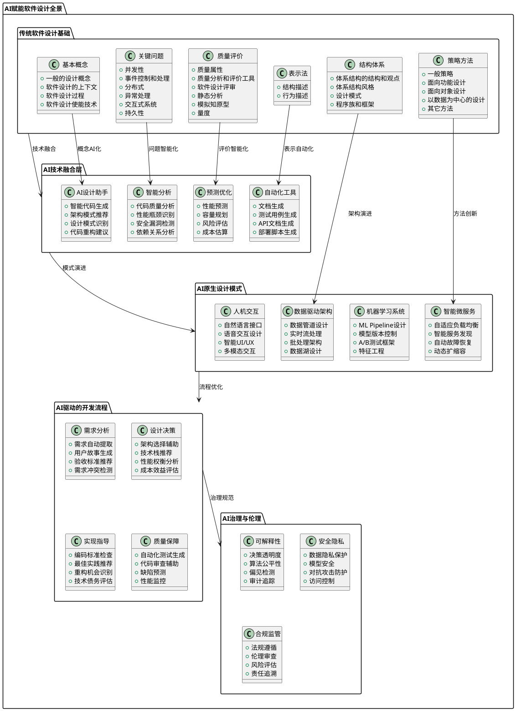

### 2.2 面向对象与微服务AI赋能设计图

专门针对面向对象设计与微服务架构的AI赋能详细图表：[面向对象与微服务AI赋能设计图.puml](./面向对象与微服务AI赋能设计图.puml)

### 2.3 UML建模语言AI增强应用图  

UML建模语言在AI时代的增强应用全景：[UML建模语言AI增强应用图.puml](./UML建模语言AI增强应用图.puml)

这三个PlantUML图表文件提供了不同层面的详细视图：
- **核心架构图**: 展示完整的AI赋能软件设计知识体系架构  
- **面向对象与微服务图**: 专注于OOD和微服务在AI时代的演进
- **UML增强应用图**: 展示UML建模语言的AI化改造和扩展

## 3. AI赋能软件设计核心领域详解

### 3.1 传统软件设计基础的AI增强

#### 3.1.1 基本概念的AI化改造
- **智能设计概念**: 引入机器学习辅助的设计决策
- **AI驱动的设计上下文**: 基于历史项目数据的上下文分析
- **自适应设计过程**: 根据项目特征动态调整设计流程
- **智能使能技术**: IDE集成AI助手、代码生成工具

#### 3.1.2 关键问题的智能解决方案
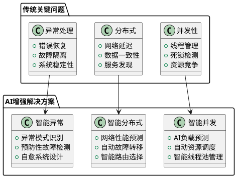

### 3.2 AI原生设计模式

#### 3.2.1 数据驱动架构模式
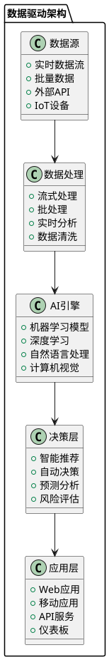

#### 3.2.2 机器学习系统设计模式
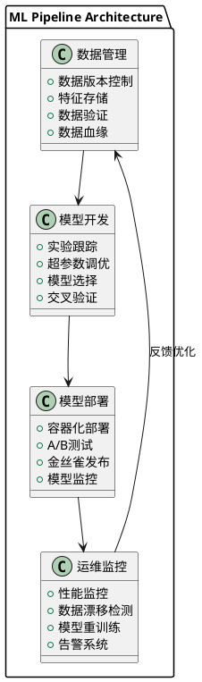

### 3.3 AI驱动的开发流程

#### 3.3.1 智能需求分析流程
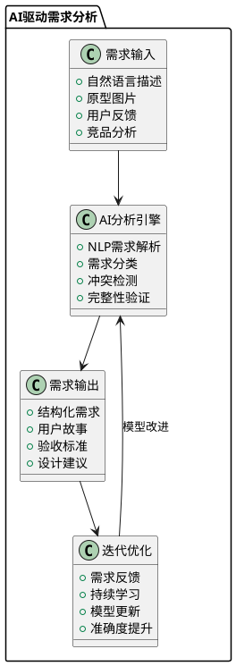

#### 3.3.2 智能设计决策支持系统
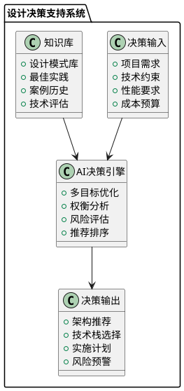

## 4. AI工具链集成架构

### 4.1 开发工具链AI化
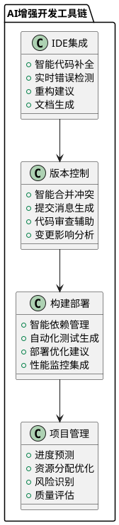

### 4.2 质量保障AI化
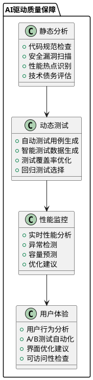

## 5. AI治理与伦理框架

### 5.1 AI系统治理架构
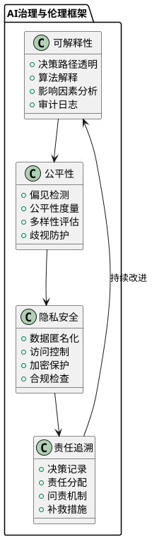

## 6. 实施路径与最佳实践

### 6.1 AI赋能软件设计实施路径
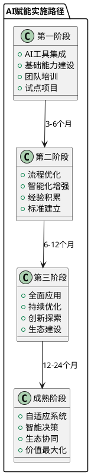

### 6.2 关键成功因素

#### 6.2.1 技术因素
- **AI基础设施**: 建立完善的AI开发和运营平台
- **数据质量**: 确保训练和使用数据的质量和完整性
- **模型管理**: 建立完整的模型生命周期管理体系
- **集成能力**: 与现有开发工具链的无缝集成

#### 6.2.2 组织因素
- **文化变革**: 建立拥抱AI技术的组织文化
- **技能提升**: 持续的团队AI技能培训和发展
- **流程优化**: 适应AI工具的开发流程调整
- **激励机制**: 建立促进AI应用的激励体系

#### 6.2.3 治理因素
- **伦理规范**: 建立AI使用的伦理准则和规范
- **风险管控**: 识别和管理AI应用的潜在风险
- **合规要求**: 确保AI系统符合相关法规要求
- **持续监控**: 建立AI系统的持续监控和改进机制

## 7. 实施指南与行动计划

### 7.1 AI赋能软件设计实施路线图

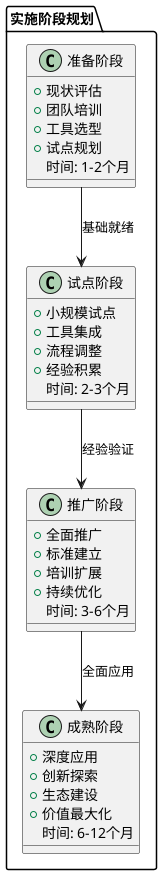

### 7.2 关键成功要素

#### 7.2.1 组织准备
- **领导支持**: 获得高层管理者的明确支持和资源投入
- **团队建设**: 组建专门的AI技术推广团队
- **文化准备**: 建立拥抱新技术和持续学习的组织文化
- **变革管理**: 制定完整的变革管理策略

#### 7.2.2 技术准备  
- **基础设施**: 建立支持AI应用的技术基础设施
- **工具选型**: 选择合适的AI辅助开发工具和平台
- **数据准备**: 收集和整理用于训练和改进AI模型的数据
- **标准制定**: 制定AI应用的技术标准和规范

#### 7.2.3 人员准备
- **技能提升**: 对开发团队进行AI相关技能培训
- **角色定义**: 明确AI时代下各角色的职责和要求
- **激励机制**: 建立促进AI技术应用的激励机制
- **持续学习**: 建立持续学习和知识更新机制

### 7.3 风险管控

#### 7.3.1 技术风险
- **AI模型质量**: 确保AI生成内容的质量和准确性
- **依赖风险**: 避免过度依赖AI工具导致技能退化
- **安全风险**: 防范AI系统可能带来的安全漏洞
- **兼容性风险**: 确保AI工具与现有系统的兼容性

#### 7.3.2 组织风险
- **抗拒变化**: 应对团队成员对新技术的抗拒心理
- **技能差距**: 解决团队技能水平差距过大的问题
- **资源投入**: 合理规划和控制AI技术投入成本
- **期望管理**: 合理设定AI应用的期望和目标

## 8. 总结与展望

AI赋能软件设计全景图展现了传统软件设计知识体系在AI时代的演进和发展。通过系统性地整合AI技术，我们可以显著提升软件设计的效率、质量和创新能力。

### 7.1 核心价值
1. **效率提升**: AI工具可以大幅提高设计和开发效率
2. **质量改善**: 智能分析和预测能力提升软件质量
3. **创新驱动**: AI原生设计模式推动架构创新
4. **风险控制**: 智能化风险识别和管理能力

### 7.2 未来趋势
1. **自适应架构**: 能够根据运行环境自动调整的智能架构
2. **代码自生成**: 基于需求描述自动生成高质量代码
3. **智能运维**: 全自动化的系统运维和优化
4. **人机协作**: 更加自然和高效的人机协作模式

通过本全景图的指导，组织和团队可以系统性地规划和实施AI赋能的软件设计转型，在数字化时代保持竞争优势。
