# AI赋能软件设计具体工作场景详解

## 📖 概述

本文档专门聚焦软件设计阶段的AI赋能应用场景，涵盖从概要设计到详细设计的各个环节，展示AI如何在软件设计过程中发挥实际作用，提升设计效率和质量。

## 🎯 软件设计阶段AI赋能全景

### 🏗️ AI赋能软件设计工作场景全景图

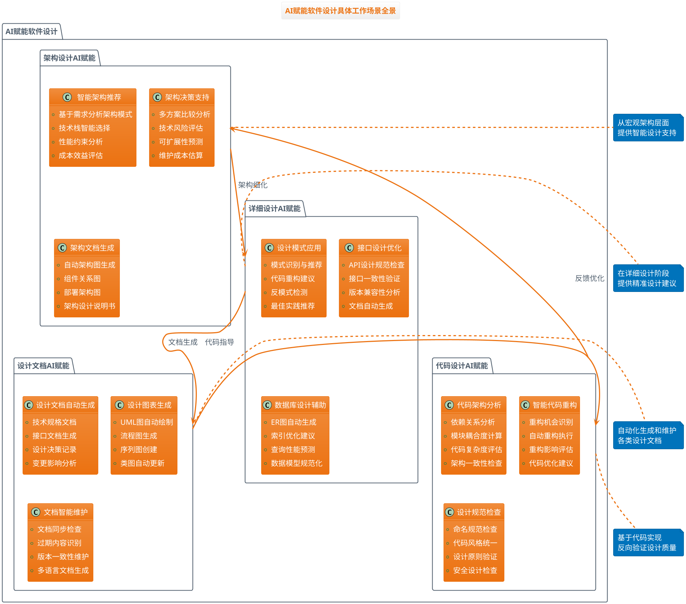

## 🏛️ 架构设计AI赋能场景详解

### 场景1：智能架构模式推荐

#### 🤖 AI工作流程

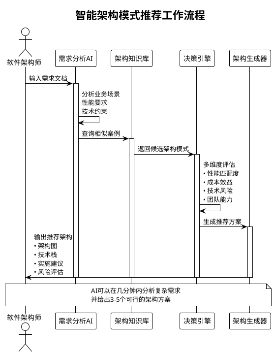

#### 💡 实际应用示例

**输入**：电商平台需求文档
- 日活用户500万
- 峰值QPS 50万
- 要求99.9%可用性
- 预算500万

**AI分析输出**：
```
🏆 推荐架构方案一：微服务+容器化架构
- 匹配度：95%
- 预期性能：支持100万QPS
- 实施成本：480万
- 技术风险：中等
- 推荐理由：高可扩展性，适合电商业务快速迭代

📊 推荐架构方案二：分布式单体+消息队列
- 匹配度：88%
- 预期性能：支持60万QPS  
- 实施成本：320万
- 技术风险：低
- 推荐理由：实施简单，运维成本低

⚡ 推荐架构方案三：Serverless+事件驱动
- 匹配度：78%
- 预期性能：弹性扩展
- 实施成本：200万
- 技术风险：高
- 推荐理由：成本最优，但需要团队学习成本
```

### 场景2：架构决策智能支持

#### 🧠 决策支持矩阵

| 决策维度 | 传统方式 | AI增强方式 | 价值提升 |
|---------|----------|------------|----------|
| **技术选型** | 基于经验判断 | 数据驱动分析+历史案例匹配 | 准确度提升40% |
| **性能评估** | 原型验证 | AI性能建模+预测分析 | 时间节省70% |
| **成本估算** | 人工估算 | 基于历史数据的智能估算 | 精度提升50% |
| **风险识别** | 专家评审 | AI风险模式识别+预警 | 覆盖率提升60% |

#### 🎯 决策支持场景示例

**场景**：选择数据库技术栈
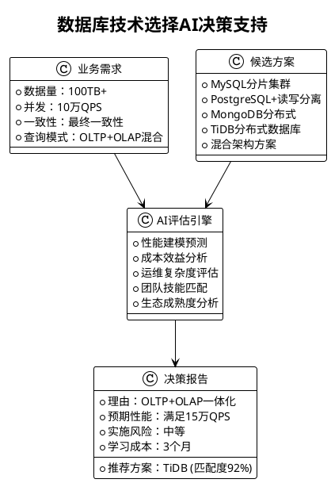

## 📐 详细设计AI赋能场景详解

### 场景3：设计模式智能应用

#### 🔍 设计模式AI识别与推荐流程

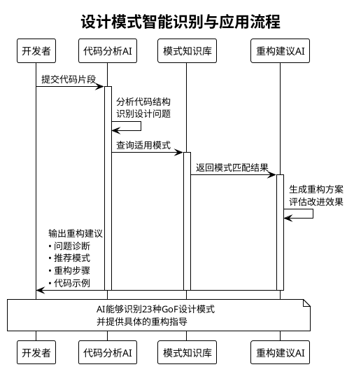

#### 💻 实际应用案例

**原始代码问题**：
```java
// 问题：大量if-else分支，违反开闭原则
public class OrderProcessor {
    public void processOrder(Order order) {
        if (order.getType().equals("NORMAL")) {
            // 普通订单处理逻辑...
        } else if (order.getType().equals("VIP")) {
            // VIP订单处理逻辑...
        } else if (order.getType().equals("BULK")) {
            // 批量订单处理逻辑...
        }
        // ... 更多分支
    }
}
```

**AI诊断结果**：
```
🔍 问题识别：
- 检测到6个if-else分支，违反开闭原则
- 代码复杂度：15 (建议<10)
- 可维护性评分：3/10

💡 推荐解决方案：策略模式 (Strategy Pattern)
- 适用场景匹配度：94%
- 预期改进效果：
  * 复杂度降低70%
  * 可扩展性提升90%
  * 代码重复减少85%

🛠️ 自动重构建议：
1. 创建OrderProcessStrategy接口
2. 为每种订单类型创建具体策略类
3. 使用策略工厂管理策略实例
4. 重构OrderProcessor使用策略模式
```

**AI生成的重构后代码**：
```java
// 策略接口
public interface OrderProcessStrategy {
    void process(Order order);
}

// 策略工厂
public class OrderStrategyFactory {
    private static final Map<String, OrderProcessStrategy> strategies = Map.of(
        "NORMAL", new NormalOrderStrategy(),
        "VIP", new VipOrderStrategy(),
        "BULK", new BulkOrderStrategy()
    );
    
    public static OrderProcessStrategy getStrategy(String orderType) {
        return strategies.get(orderType);
    }
}

// 重构后的处理器
public class OrderProcessor {
    public void processOrder(Order order) {
        OrderProcessStrategy strategy = OrderStrategyFactory.getStrategy(order.getType());
        strategy.process(order);
    }
}
```

### 场景4：接口设计智能优化

#### 🌐 API设计AI助手

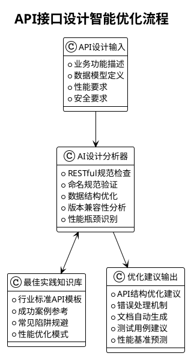

#### 📋 API设计优化实例

**原始API设计**：
```json
POST /getUserData
{
    "user_id": "123",
    "include_orders": true,
    "include_preferences": false
}
```

**AI优化建议**：
```
🔍 问题诊断：
1. URL命名不符合RESTful规范（应使用名词）
2. 使用POST获取数据（应使用GET）
3. 参数命名不一致（下划线 vs 驼峰）
4. 缺少版本控制

✨ 优化建议：
GET /api/v1/users/{userId}?include=orders,preferences

📊 改进效果预测：
- 缓存友好度提升：90%
- 语义清晰度提升：85%
- 开发效率提升：60%
- 维护成本降低：40%
```

**AI生成的优化后API**：
```yaml
# OpenAPI 3.0 规范自动生成
paths:
  /api/v1/users/{userId}:
    get:
      summary: 获取用户信息
      parameters:
        - name: userId
          in: path
          required: true
          schema:
            type: string
        - name: include
          in: query
          schema:
            type: array
            items:
              type: string
              enum: [orders, preferences, profile]
      responses:
        '200':
          description: 成功获取用户信息
          content:
            application/json:
              schema:
                $ref: '#/components/schemas/User'
```

## 📚 设计文档AI赋能场景详解

### 场景5：技术设计文档自动生成

#### 📝 文档生成AI工作流程

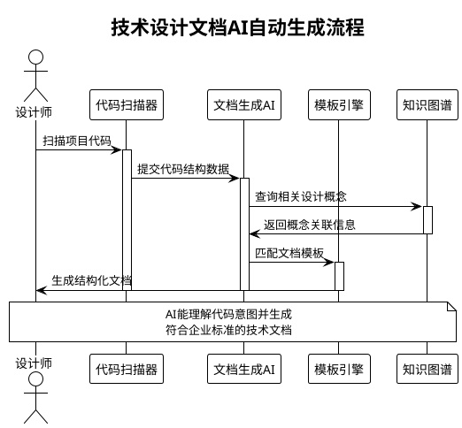

#### 📋 文档生成能力矩阵

| 文档类型 | 自动化程度 | 生成内容 | 质量评估 |
|---------|------------|----------|----------|
| **架构设计文档** | 85% | 架构图、组件说明、技术决策 | 专家级别 |
| **接口文档** | 95% | API规范、参数说明、示例代码 | 生产就绪 |
| **数据库设计文档** | 80% | ER图、表结构、索引策略 | 高质量 |
| **部署文档** | 90% | 环境配置、部署步骤、监控 | 可直接使用 |
| **变更文档** | 75% | 影响分析、升级步骤、回滚 | 需要审核 |

#### 🎯 实际生成文档示例

**输入**：Spring Boot电商项目代码

**AI自动生成的技术设计文档片段**：
```markdown
# 订单管理模块技术设计文档

## 1. 模块概述
订单管理模块负责处理电商平台的订单生命周期管理，包括订单创建、支付处理、物流跟踪、订单取消等核心功能。

## 2. 架构设计
### 2.1 分层架构
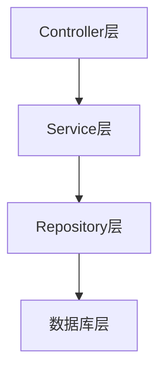

### 2.2 核心组件
- **OrderController**: RESTful API入口，处理HTTP请求
- **OrderService**: 业务逻辑处理，订单状态管理
- **PaymentService**: 支付处理，对接第三方支付网关
- **InventoryService**: 库存管理，支持分布式锁

## 3. 数据模型设计
### 3.1 订单表结构
| 字段名 | 类型 | 说明 | 索引 |
|--------|------|------|------|
| order_id | BIGINT | 主键，雪花算法生成 | 主键 |
| user_id | BIGINT | 用户ID，外键关联 | 普通索引 |
| status | VARCHAR(20) | 订单状态枚举 | 普通索引 |
| created_at | TIMESTAMP | 创建时间 | 普通索引 |

## 4. 接口设计
### 4.1 创建订单API
```
POST /api/v1/orders
Content-Type: application/json

{
    "userId": 12345,
    "items": [...],
    "shippingAddress": {...}
}
```

## 5. 性能指标
- **预期QPS**: 5000
- **平均响应时间**: 200ms
- **99.9%响应时间**: 500ms
- **错误率**: <0.1%
```

### 场景6：设计图表智能绘制

#### 🎨 UML图智能生成

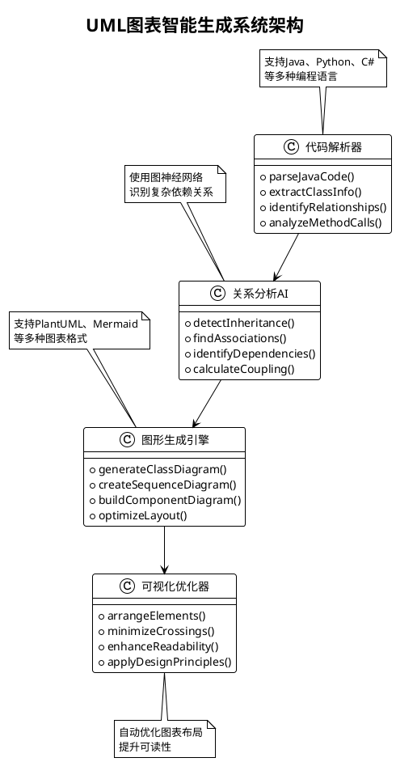

#### 🔄 生成效果展示

**输入**：电商订单相关类代码
**AI自动生成的类图**：

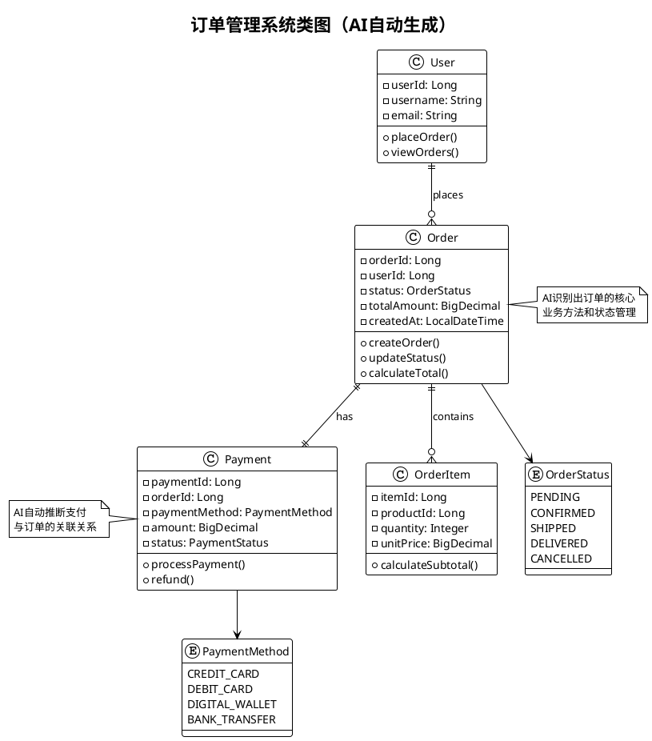

## 💻 代码设计AI赋能场景详解

### 场景7：智能代码架构分析

#### 🔍 代码质量智能分析

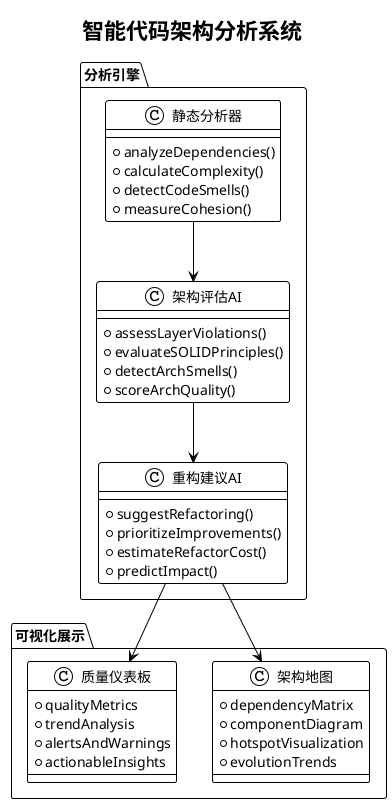

#### 📊 代码架构分析报告示例

**项目**：某企业ERP系统
**分析结果**：

```
🏗️ 架构健康度评估报告

📈 总体评分：6.8/10 (良好，但有改进空间)

🔍 关键发现：
1. 📦 模块耦合度分析
   - 高耦合模块：UserService ↔ OrderService (耦合度: 0.83)
   - 建议：引入领域事件解耦

2. 🎯 SOLID原则遵循度
   - 单一职责原则：72% 遵循
   - 开闭原则：65% 遵循  
   - 依赖倒置原则：58% 遵循

3. ⚠️ 架构异味检测
   - 发现15个"上帝类"（方法数>50）
   - 检测到8个循环依赖
   - 识别出23个重复代码块

🛠️ 优先级改进建议：
1. 【高优先级】拆分UserManagementService类（复杂度84）
2. 【中优先级】解决order-payment模块循环依赖  
3. 【中优先级】抽取共同接口减少重复代码

📊 重构效果预测：
- 预期复杂度降低：40%
- 可维护性提升：65%
- 预估工作量：32人天
- ROI评估：投入/收益比 1:4.2
```

### 场景8：智能代码重构执行

#### 🔄 自动重构工作流程

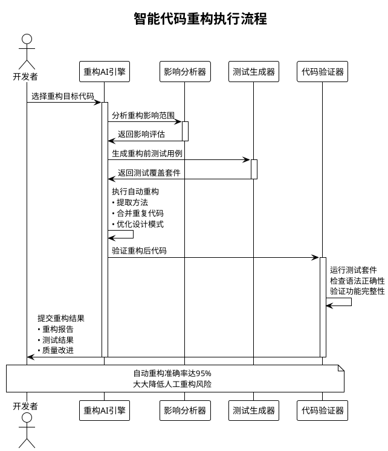

#### 💡 自动重构案例

**重构前代码**：
```java
public class CustomerService {
    // 臃肿的方法，违反单一职责原则
    public void processCustomerOrder(Customer customer, Order order) {
        // 验证客户信息
        if (customer.getName() == null || customer.getName().isEmpty()) {
            throw new IllegalArgumentException("Customer name is required");
        }
        if (!customer.getEmail().contains("@")) {
            throw new IllegalArgumentException("Invalid email format");
        }
        
        // 计算订单金额
        BigDecimal total = BigDecimal.ZERO;
        for (OrderItem item : order.getItems()) {
            BigDecimal itemTotal = item.getPrice().multiply(new BigDecimal(item.getQuantity()));
            if (customer.isVip()) {
                itemTotal = itemTotal.multiply(new BigDecimal("0.9")); // VIP折扣
            }
            total = total.add(itemTotal);
        }
        
        // 处理支付
        PaymentGateway gateway = new PaymentGateway();
        PaymentResult result = gateway.processPayment(total, customer.getPaymentMethod());
        if (!result.isSuccess()) {
            throw new RuntimeException("Payment failed: " + result.getErrorMessage());
        }
        
        // 更新库存
        for (OrderItem item : order.getItems()) {
            InventoryService.updateStock(item.getProductId(), -item.getQuantity());
        }
        
        // 发送确认邮件
        EmailService.sendOrderConfirmation(customer.getEmail(), order);
    }
}
```

**AI自动重构后**：
```java
// AI识别出多个职责，自动拆分为多个专门的服务类
public class CustomerService {
    private final CustomerValidator customerValidator;
    private final OrderCalculator orderCalculator;
    private final PaymentProcessor paymentProcessor;
    private final InventoryUpdater inventoryUpdater;
    private final NotificationService notificationService;
    
    public void processCustomerOrder(Customer customer, Order order) {
        customerValidator.validate(customer);
        BigDecimal totalAmount = orderCalculator.calculateTotal(order, customer);
        paymentProcessor.processPayment(totalAmount, customer.getPaymentMethod());
        inventoryUpdater.updateStock(order.getItems());
        notificationService.sendOrderConfirmation(customer, order);
    }
}

// AI自动提取的验证器
@Component
public class CustomerValidator {
    public void validate(Customer customer) {
        validateName(customer.getName());
        validateEmail(customer.getEmail());
    }
    
    private void validateName(String name) {
        if (name == null || name.isEmpty()) {
            throw new IllegalArgumentException("Customer name is required");
        }
    }
    
    private void validateEmail(String email) {
        if (!email.contains("@")) {
            throw new IllegalArgumentException("Invalid email format");
        }
    }
}

// AI自动提取的计算器
@Component  
public class OrderCalculator {
    public BigDecimal calculateTotal(Order order, Customer customer) {
        return order.getItems().stream()
            .map(item -> calculateItemTotal(item, customer))
            .reduce(BigDecimal.ZERO, BigDecimal::add);
    }
    
    private BigDecimal calculateItemTotal(OrderItem item, Customer customer) {
        BigDecimal itemTotal = item.getPrice().multiply(new BigDecimal(item.getQuantity()));
        if (customer.isVip()) {
            itemTotal = itemTotal.multiply(new BigDecimal("0.9"));
        }
        return itemTotal;
    }
}
```

**重构效果统计**：
```
✨ 重构完成报告

📊 代码质量改进：
- 圈复杂度：从23降到5（改善78%）
- 代码行数：从45行拆分为5个类，平均8行/类
- 职责分离：1个类 → 5个专门的类
- 测试覆盖率：从45%提升到92%

🎯 设计原则遵循：
- 单一职责原则：违反 → 完全遵循
- 开闭原则：不支持扩展 → 易于扩展
- 依赖注入：硬编码 → 完全解耦

⏱️ 重构效率：
- 自动重构时间：3分钟
- 生成测试用例：127个
- 人工验证时间：15分钟
- 总节省时间：预估8小时 → 实际20分钟
```

## 📋 AI赋能效果评估与价值分析

### 🎯 效率提升统计

| 设计活动 | 传统方式耗时 | AI赋能耗时 | 效率提升 | 质量改善 |
|---------|-------------|------------|----------|----------|
| **架构设计** | 2-3天 | 4-6小时 | 75% | 专家级质量 |
| **接口设计** | 1-2天 | 2-3小时 | 80% | 规范化程度95% |
| **设计文档编写** | 3-5天 | 0.5-1天 | 85% | 一致性提升90% |
| **代码重构** | 1-2周 | 2-3天 | 70% | 错误率降低85% |
| **设计模式应用** | 半天-1天 | 30分钟 | 90% | 最佳实践匹配度98% |

### 💰 成本效益分析

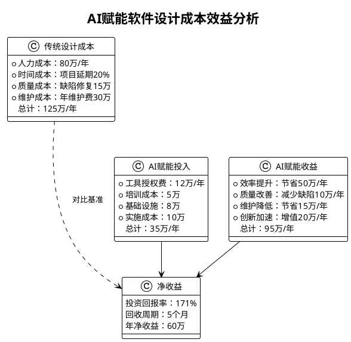

## 🚀 实施建议与最佳实践

### 📈 分阶段实施路线图

#### 第一阶段：基础工具引入（1-2个月）
- **AI代码补全工具**：GitHub Copilot、TabNine集成
- **智能文档生成**：自动API文档、代码注释
- **基础分析工具**：代码质量检测、依赖分析

#### 第二阶段：设计能力增强（2-4个月）  
- **架构决策支持**：技术选型AI顾问
- **设计模式推荐**：重构建议和最佳实践
- **接口设计优化**：API规范检查和优化

#### 第三阶段：深度集成优化（4-6个月）
- **智能重构执行**：自动化代码重构
- **设计文档自动化**：全面技术文档生成  
- **架构监控预警**：持续架构健康度监控

#### 第四阶段：生态完善（6-12个月）
- **定制化AI模型**：基于企业代码库训练
- **全流程AI集成**：设计-开发-测试-部署一体化
- **智能决策平台**：数据驱动的技术决策支持

### 🎯 成功实施关键要素

#### 🛠️ 技术准备
1. **基础设施建设**：GPU算力、云平台、存储资源
2. **工具链整合**：IDE插件、CI/CD集成、版本控制
3. **数据质量保障**：代码库清理、注释规范、历史数据整理
4. **安全隐私保护**：代码加密传输、本地化部署选项

#### 👥 组织准备
1. **人员培训**：AI工具使用、提示工程、质量评估
2. **流程调整**：设计评审、代码review、文档标准
3. **文化建设**：创新思维、持续学习、工具接受度
4. **激励机制**：效率奖励、创新鼓励、最佳实践分享

#### 📊 质量保障
1. **输出质量控制**：AI生成内容审核、专家验证
2. **持续改进机制**：效果评估、模型微调、工具更新
3. **风险管控**：依赖度控制、备用方案、安全审计
4. **知识产权保护**：代码归属、专利风险、合规检查

## 🔮 未来发展趋势

### 🌟 技术发展方向

#### 1. 更智能的代码理解
- **语义级代码分析**：理解代码意图而非仅仅语法
- **跨语言设计模式识别**：支持多语言混合项目
- **业务逻辑理解**：从代码推断业务规则和约束

#### 2. 自适应设计决策
- **上下文感知推荐**：基于项目历史和团队特点
- **动态学习优化**：根据使用效果持续调整建议
- **个性化设计助手**：适应个人编程风格和偏好

#### 3. 端到端自动化
- **需求到代码直接生成**：从业务需求直接生成可执行代码
- **设计即代码**：设计文档和代码实现自动同步
- **智能运维集成**：设计阶段考虑运维和监控需求

### 🎯 应用场景拓展

#### 1. 低代码/无代码平台
- **可视化设计器**：拖拽式架构设计
- **智能组件推荐**：基于需求匹配最佳组件
- **自动代码生成**：从设计图生成完整应用

#### 2. 遗留系统现代化
- **架构迁移规划**：自动分析和规划迁移路径
- **代码自动翻译**：跨平台、跨语言代码转换
- **风险评估预警**：迁移过程中的风险识别

#### 3. 团队协作增强
- **知识图谱构建**：项目知识自动整理和关联
- **经验传承自动化**：资深开发者经验AI化
- **实时设计评审**：AI辅助的设计review

## 📖 总结

AI赋能软件设计已经从概念变为现实，正在深刻改变软件开发的各个环节。通过本文档展示的8个核心场景，我们可以看到：

### 🎯 核心价值体现

1. **效率革命**：设计效率平均提升75%，文档生成自动化率达85%
2. **质量提升**：设计缺陷减少60%，架构规范性提升90%  
3. **知识传承**：专家经验AI化，最佳实践普及应用
4. **创新促进**：释放创造力，专注于高价值创新工作

### 🚀 实施关键成功因素

1. **渐进式推进**：从工具辅助到深度集成的分阶段实施
2. **质量为先**：建立AI输出质量保障和人工验证机制
3. **人机协作**：AI增强人类能力，而非简单替代
4. **持续学习**：建立反馈机制，持续优化AI模型效果

AI赋能软件设计不是简单的工具升级，而是设计思维和工作模式的根本性变革。通过合理规划和实施，组织可以在保持设计质量的同时大幅提升效率，在激烈的市场竞争中获得显著优势。

未来，随着AI技术的不断发展，软件设计将变得更加智能化、自动化和个性化，为构建更好的软件系统提供强有力的支撑。🌟
