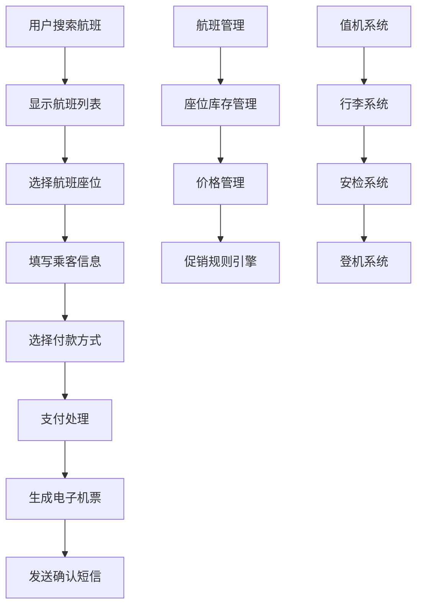
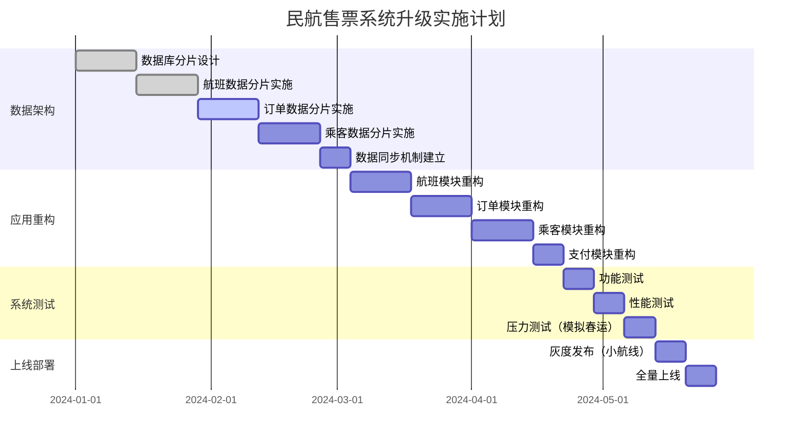

# AI辅助架构评审课程案例

> **课程场景**: 民航售票系统架构升级评审
> **评审目标**: 从传统单体架构升级为高可用分布式架构
> **AI评审工具**: DeepSeek + 架构分析专家系统
> **课程时长**: 90分钟
> **适用对象**: 民航IT架构师、技术负责人、资深开发工程师

---

## 📋 课程大纲

### 第一部分：民航业务背景与需求分析 (20分钟)

- 民航售票系统现状与痛点
- 航空公司业务增长预期与技术挑战
- 民航行业特殊的非功能性需求

### 第二部分：技术方案设计与对比 (30分钟)

- 三个候选技术方案介绍
- AI辅助方案分析框架
- 多维度对比评估

### 第三部分：AI智能评审实践 (25分钟)

- AI评审工具使用演示
- 风险分析与成本评估
- 决策建议生成

### 第四部分：评审决策与总结 (15分钟)

- 综合评审结果
- 实施路线图规划
- 课程总结与Q&A

---

## 🎯 第一部分：民航业务背景与需求分析

### 业务场景描述

**某区域性航空公司"蓝天航空"**正面临数字化转型带来的技术挑战：

#### 📈 业务现状

- **航线覆盖**: 国内50条航线，国际15条航线
- **机队规模**: 80架飞机，计划3年内扩展到120架
- **用户规模**: 500万注册用户，日活跃用户15万
- **订票量**: 日均订票3万笔，春运等高峰期达到10万笔
- **当前架构**: Spring Boot单体应用 + Oracle数据库 + Redis缓存

#### 😰 现有痛点

1. **高峰期性能瓶颈**: 春运抢票时系统响应时间从500ms增长到8秒
2. **系统可用性不足**: 年故障时间累计超过24小时，影响品牌形象
3. **业务扩展困难**: 新增航线或合作伙伴接入需要修改核心系统
4. **数据孤岛严重**: 订票、值机、行李、客服等系统数据不互通
5. **监管合规压力**: 民航局要求数据留存7年，审计追溯困难

#### 🎯 业务目标

- **性能目标**: 99%的订票请求响应时间 < 1秒
- **可用性目标**: 系统可用性达到99.9%（年故障时间 < 8.76小时）
- **并发目标**: 支持5万并发用户同时访问
- **扩展目标**: 支持快速接入新航线和合作航空公司

#### 📊 民航行业特殊需求

```yaml
业务特性:
  - 订票高峰: 节假日前2周，集中抢票现象严重
  - 退改频繁: 疫情影响下退改率高达40%
  - 实时性强: 航班动态、座位状态需实时同步
  - 数据准确性: 超售、重复预订等错误代价极高

合规要求:
  - 数据保留: 订票记录需保存7年
  - 审计追踪: 所有操作需要完整日志
  - 实名制: 订票必须实名，需要身份验证
  - 安全等级: 涉及国际航线，安全要求高

技术约束:
  - 系统稳定性: 不能因升级影响正常售票
  - 数据迁移: Oracle数据库迁移复杂度高
  - 第三方集成: 需对接GDS、支付、短信等多个外部系统
  - 团队技能: 15人技术团队，以Java开发为主
```

#### 🚀 核心业务流程



---

## 🏗️ 第二部分：技术方案设计与对比

### 候选方案概述

技术团队经过调研，结合民航行业特点，提出了三个候选架构方案：

#### 方案A：微服务架构 (Spring Cloud + 数据库分离)

#### 方案B：分布式单体架构 (模块化 + 分布式数据库)

#### 方案C：事件驱动架构 (航班事件流处理)

---

### 🔥 方案A：微服务架构 (Spring Cloud + 数据库分离)

#### 架构设计

```
┌─────────────────────────────────────────────┐
│              CDN + 负载均衡                   │
│            (阿里云/腾讯云)                    │
└─────────────────┬───────────────────────────┘
                  │
┌─────────────────┴───────────────────────────┐
│              API网关                        │
│         (Spring Cloud Gateway)             │
│            + 限流 + 鉴权                     │
└─┬─────────┬─────────┬─────────┬─────────────┘
  │         │         │         │
┌─┴─┐    ┌──┴─┐    ┌──┴─┐    ┌──┴─┐
│航班│    │订单│    │用户│    │支付│   核心微服务
│服务│    │服务│    │服务│    │服务│
└─┬─┘    └──┬─┘    └──┬─┘    └──┬─┘
  │         │         │         │
┌─┴─┐    ┌──┴─┐    ┌──┴─┐    ┌──┴─┐
│航班│    │订单│    │用户│    │支付│   专用数据库
│DB │    │ DB │    │ DB │    │ DB │
└───┘    └────┘    └────┘    └────┘
```

#### 服务拆分设计

```java
// 航班服务 - 管理航班信息和座位库存
@RestController
@RequestMapping("/flights")
public class FlightController {
  
    @GetMapping("/search")
    public FlightSearchResponse searchFlights(
        @RequestParam String departure,
        @RequestParam String arrival, 
        @RequestParam LocalDate date) {
      
        return flightService.searchFlights(departure, arrival, date);
    }
  
    @PostMapping("/{flightId}/seats/lock")
    public SeatLockResponse lockSeat(
        @PathVariable String flightId,
        @RequestBody SeatLockRequest request) {
      
        // 锁定座位，防止超售
        return flightService.lockSeat(flightId, request.getSeatNumber(), 
                                    request.getUserId(), Duration.ofMinutes(10));
    }
}

// 订单服务 - 处理订票业务
@RestController  
@RequestMapping("/orders")
public class OrderController {
  
    @PostMapping
    public CreateOrderResponse createOrder(@RequestBody CreateOrderRequest request) {
        // 调用航班服务确认座位
        // 调用用户服务验证身份
        // 创建订单记录
        return orderService.createOrder(request);
    }
  
    @PostMapping("/{orderId}/cancel")
    public CancelOrderResponse cancelOrder(@PathVariable String orderId) {
        // 退票处理，释放座位，处理退款
        return orderService.cancelOrder(orderId);
    }
}

// 用户服务 - 管理旅客信息
@RestController
@RequestMapping("/passengers") 
public class PassengerController {
  
    @PostMapping("/verify")
    public VerificationResponse verifyPassenger(@RequestBody VerificationRequest request) {
        // 身份证验证，黑名单检查
        return passengerService.verifyPassenger(request.getIdCard(), request.getName());
    }
  
    @GetMapping("/{passengerId}/orders")
    public List<OrderDTO> getPassengerOrders(@PathVariable Long passengerId) {
        return passengerService.getOrderHistory(passengerId);
    }
}
```

#### 分布式事务处理

```java
// 使用Seata处理分布式事务
@GlobalTransactional(name = "create-booking-tx", rollbackFor = Exception.class)
@Service
public class BookingService {
  
    public BookingResult createBooking(BookingRequest request) {
        try {
            // 1. 锁定座位
            SeatLockResult seatResult = flightService.lockSeat(request);
            if (!seatResult.isSuccess()) {
                throw new SeatNotAvailableException();
            }
          
            // 2. 创建订单
            Order order = orderService.createOrder(request);
          
            // 3. 处理支付
            PaymentResult paymentResult = paymentService.processPayment(
                order.getId(), request.getPaymentInfo());
          
            if (!paymentResult.isSuccess()) {
                throw new PaymentFailedException();
            }
          
            // 4. 生成电子机票
            Ticket ticket = ticketService.generateTicket(order);
          
            return BookingResult.success(order, ticket);
          
        } catch (Exception e) {
            // Seata会自动回滚所有参与的服务
            log.error("订票失败: {}", e.getMessage(), e);
            throw e;
        }
    }
}
```

#### 优势分析

✅ **业务边界清晰**: 按民航业务领域拆分，职责明确
✅ **技术栈熟悉**: 团队Java技能匹配，学习成本低
✅ **故障隔离**: 单个服务故障不影响整个系统
✅ **独立扩展**: 可根据业务量独立扩展各服务
✅ **数据安全**: 数据分离存储，符合民航安全要求

#### 风险与挑战

⚠️ **分布式事务复杂**: 订票涉及多服务，一致性保证困难
⚠️ **网络延迟**: 服务间调用增加响应时间
⚠️ **数据迁移风险**: Oracle到MySQL迁移工作量大
⚠️ **运维复杂度**: 需要管理多个服务和数据库

---

### 🏢 方案B：分布式单体架构 (模块化 + 分布式数据库)

#### 架构设计

```
┌─────────────────────────────────────────────┐
│                负载均衡                      │
└─────────────────┬───────────────────────────┘
                  │
┌─────────────────┴───────────────────────────┐
│              应用集群                        │
│    ┌─────────┬─────────┬─────────┐         │
│    │应用实例1 │应用实例2 │应用实例3 │         │
│    │         │         │         │         │
│    │┌───────┐│┌───────┐│┌───────┐│         │
│    ││航班模块│││航班模块│││航班模块││         │
│    │├───────┤│├───────┤│├───────┤│         │
│    ││订单模块│││订单模块│││订单模块││         │
│    │├───────┤│├───────┤│├───────┤│         │
│    ││用户模块│││用户模块│││用户模块││         │
│    │└───────┘│└───────┘│└───────┘│         │
│    └─────────┴─────────┴─────────┘         │
└─────────────┬───────────────────────────────┘
              │
┌─────────────┴───────────────────────────────┐
│          分布式数据库集群                     │
│  ┌─────────┬─────────┬─────────┬─────────┐  │
│  │航班库主库│订单库主库│用户库主库│支付库主库│  │
│  │航班库从库│订单库从库│用户库从库│支付库从库│  │
│  └─────────┴─────────┴─────────┴─────────┘  │
└─────────────────────────────────────────────┘
```

#### 模块化设计

```java
// 统一的应用入口，包含所有业务模块
@SpringBootApplication
@ComponentScan(basePackages = {
    "com.bluesky.airline.flight",
    "com.bluesky.airline.booking", 
    "com.bluesky.airline.passenger",
    "com.bluesky.airline.payment"
})
public class AirlineApplication {
    public static void main(String[] args) {
        SpringApplication.run(AirlineApplication.class, args);
    }
}

// 航班模块 - 内聚业务逻辑
@RestController
@RequestMapping("/api/v1/flights")
public class FlightController {
  
    @Autowired
    private FlightService flightService;
  
    // 本地方法调用，无网络开销
    @GetMapping("/search")
    public FlightSearchResponse search(FlightSearchRequest request) {
        return flightService.searchFlights(request);
    }
}

@Service
@Transactional
public class FlightService {
  
    @Autowired
    private FlightRepository flightRepository;
  
    @Autowired  
    private SeatInventoryService seatInventoryService;
  
    // 同一JVM内调用，性能高
    public FlightSearchResponse searchFlights(FlightSearchRequest request) {
        List<Flight> flights = flightRepository.searchByRoute(
            request.getDeparture(), request.getArrival(), request.getDate());
          
        return flights.stream()
            .map(flight -> {
                int availableSeats = seatInventoryService.getAvailableSeats(flight.getId());
                return FlightDTO.builder()
                    .flight(flight)
                    .availableSeats(availableSeats)
                    .build();
            })
            .collect(toFlightSearchResponse());
    }
}
```

#### 数据库分片策略

```yaml
# 数据库分片配置
spring:
  shardingsphere:
    datasource:
      names: flight-db0,flight-db1,booking-db0,booking-db1
      flight-db0:
        type: com.alibaba.druid.pool.DruidDataSource
        url: jdbc:mysql://flight-db-0:3306/airline_flight
      booking-db0:
        type: com.alibaba.druid.pool.DruidDataSource  
        url: jdbc:mysql://booking-db-0:3306/airline_booking
      
    rules:
      sharding:
        tables:
          t_flight:
            actual-data-nodes: flight-db${0..1}.t_flight_${0..3}
            table-strategy:
              standard:
                sharding-column: flight_date
                sharding-algorithm-name: flight-date-algorithm
              
          t_booking:
            actual-data-nodes: booking-db${0..1}.t_booking_${0..15}  
            table-strategy:
              standard:
                sharding-column: passenger_id
                sharding-algorithm-name: passenger-hash-algorithm
```

#### 本地事务处理

```java
// 利用单体架构优势，使用本地事务
@Service
@Transactional(rollbackFor = Exception.class)
public class BookingService {
  
    @Autowired
    private FlightService flightService;
  
    @Autowired
    private OrderService orderService;
  
    @Autowired
    private PaymentService paymentService;
  
    // 本地事务，ACID保证
    public BookingResult createBooking(BookingRequest request) {
        // 所有操作在同一个事务中
        try {
            // 1. 检查航班座位
            Flight flight = flightService.getFlightWithLock(request.getFlightId());
            if (flight.getAvailableSeats() < request.getPassengerCount()) {
                throw new InsufficientSeatsException();
            }
          
            // 2. 减少座位库存
            flightService.reduceSeatInventory(request.getFlightId(), 
                                            request.getPassengerCount());
          
            // 3. 创建订单
            Order order = orderService.createOrder(request);
          
            // 4. 记录支付信息
            paymentService.recordPayment(order.getId(), request.getPaymentInfo());
          
            return BookingResult.success(order);
          
        } catch (Exception e) {
            // 自动回滚所有数据库操作
            log.error("订票失败，事务回滚: {}", e.getMessage());
            throw e;
        }
    }
}
```

#### 优势分析

✅ **事务简单**: 本地事务，ACID保证，无分布式事务复杂性
✅ **性能优秀**: 无网络调用开销，响应时间快
✅ **部署简单**: 单个应用包，部署运维简单
✅ **调试容易**: 所有代码在一个进程，调试方便
✅ **数据一致性**: 强一致性保证，适合民航业务

#### 风险与挑战

⚠️ **扩展瓶颈**: 整个应用需要一起扩展，资源利用率不均
⚠️ **技术栈固化**: 所有模块必须使用相同技术栈
⚠️ **故障影响**: 单点故障可能影响所有功能
⚠️ **团队协作**: 多团队在同一代码库开发，冲突较多

---

### ⚡ 方案C：事件驱动架构 (航班事件流处理)

#### 架构设计

```
┌─────────────────────────────────────────────┐
│                API网关                       │
└─┬─────────┬─────────┬─────────┬─────────────┘
  │         │         │         │
┌─┴─┐    ┌──┴─┐    ┌──┴─┐    ┌──┴─┐
│航班│    │订单│    │乘客│    │支付│   领域服务
│服务│    │服务│    │服务│    │服务│
└─┬─┘    └──┬─┘    └──┬─┘    └──┬─┘
  │         │         │         │
  └─────────┼─────────┼─────────┘
            │         │
┌───────────┴─────────┴───────────┐
│         Kafka事件总线            │
│  ┌─────────────────────────────┐│
│  │ flight-schedule-changed     ││  航班事件流
│  │ seat-inventory-updated      ││
│  │ booking-created             ││
│  │ payment-processed           ││
│  │ ticket-issued               ││
│  │ passenger-checked-in        ││
│  └─────────────────────────────┘│
└─────────────────────────────────┘
```

#### 事件驱动业务流

```java
// 航班事件发布
@Service
public class FlightService {
  
    @Autowired
    private EventPublisher eventPublisher;
  
    public void updateFlightSchedule(String flightId, FlightScheduleUpdate update) {
        // 1. 更新航班信息
        Flight flight = flightRepository.findById(flightId);
        flight.updateSchedule(update);
        flightRepository.save(flight);
      
        // 2. 发布航班变更事件
        FlightScheduleChangedEvent event = FlightScheduleChangedEvent.builder()
            .flightId(flightId)
            .originalDepartureTime(flight.getOriginalDepartureTime())
            .newDepartureTime(update.getNewDepartureTime()) 
            .changeReason(update.getReason())
            .affectedPassengers(getAffectedPassengers(flightId))
            .build();
          
        eventPublisher.publish("flight-schedule-changed", event);
    }
}

// 订单服务监听航班事件
@Component
public class BookingEventHandler {
  
    @KafkaListener(topics = "flight-schedule-changed")
    public void handleFlightScheduleChanged(FlightScheduleChangedEvent event) {
        // 处理航班变更对订单的影响
        List<String> affectedOrders = bookingService.findOrdersByFlight(event.getFlightId());
      
        for (String orderId : affectedOrders) {
            // 发送变更通知
            notificationService.sendFlightChangeNotification(orderId, event);
          
            // 更新订单状态
            bookingService.updateOrderForFlightChange(orderId, event);
        }
      
        // 发布订单更新事件
        eventPublisher.publish("booking-updated-for-flight-change", 
            new BookingUpdatedEvent(affectedOrders, event.getFlightId()));
    }
  
    @KafkaListener(topics = "payment-processed")
    public void handlePaymentProcessed(PaymentProcessedEvent event) {
        // 支付完成后的订单处理
        bookingService.confirmBooking(event.getOrderId());
      
        // 发布出票事件
        eventPublisher.publish("ticket-ready-to-issue",
            new TicketIssuanceEvent(event.getOrderId(), event.getPassengerIds()));
    }
}

// 实时库存更新
@Component
public class InventoryEventHandler {
  
    @KafkaListener(topics = "booking-created")
    public void handleBookingCreated(BookingCreatedEvent event) {
        // 实时更新座位库存
        inventoryService.updateSeatAvailability(
            event.getFlightId(), 
            event.getBookedSeats());
          
        // 发布库存变更事件
        SeatInventoryUpdatedEvent inventoryEvent = new SeatInventoryUpdatedEvent(
            event.getFlightId(),
            inventoryService.getAvailableSeats(event.getFlightId())
        );
      
        eventPublisher.publish("seat-inventory-updated", inventoryEvent);
    }
  
    @KafkaListener(topics = "booking-cancelled") 
    public void handleBookingCancelled(BookingCancelledEvent event) {
        // 释放座位库存
        inventoryService.releaseSeatInventory(
            event.getFlightId(),
            event.getReleasedSeats());
    }
}
```

#### 事件溯源实现

```java
// 订单聚合根，使用事件溯源
@Aggregate
public class BookingAggregate {
  
    private String bookingId;
    private String flightId;
    private List<Passenger> passengers;
    private BookingStatus status;
    private List<BookingEvent> events = new ArrayList<>();
  
    // 命令处理
    @CommandHandler
    public BookingAggregate(CreateBookingCommand command) {
        // 业务规则验证
        validateBookingRequest(command);
      
        // 应用事件
        apply(BookingCreatedEvent.builder()
            .bookingId(command.getBookingId())
            .flightId(command.getFlightId())
            .passengers(command.getPassengers())
            .totalAmount(command.getTotalAmount())
            .build());
    }
  
    // 事件应用
    @EventSourcingHandler
    public void on(BookingCreatedEvent event) {
        this.bookingId = event.getBookingId();
        this.flightId = event.getFlightId();
        this.passengers = event.getPassengers();
        this.status = BookingStatus.CREATED;
        this.events.add(event);
    }
  
    @EventSourcingHandler
    public void on(PaymentProcessedEvent event) {
        this.status = BookingStatus.PAID;
        this.events.add(event);
    }
  
    @EventSourcingHandler
    public void on(TicketIssuedEvent event) {
        this.status = BookingStatus.TICKETED;
        this.events.add(event);
    }
  
    // 业务方法
    public void cancelBooking(String reason) {
        if (status == BookingStatus.TICKETED) {
            // 已出票的订单取消需要特殊处理
            apply(TicketRefundInitiatedEvent.builder()
                .bookingId(bookingId)
                .refundReason(reason)
                .build());
        }
      
        apply(BookingCancelledEvent.builder()
            .bookingId(bookingId)
            .cancellationReason(reason)
            .build());
    }
}
```

#### 优势分析

✅ **实时响应**: 事件驱动，系统响应快速
✅ **松耦合**: 服务间通过事件通信，依赖度低
✅ **审计完整**: 所有事件都有记录，符合民航审计要求
✅ **扩展性强**: 容易添加新的事件处理器
✅ **业务追溯**: 可以重建任意时间点的业务状态

#### 风险与挑战

⚠️ **技术复杂度**: 事件驱动和事件溯源理解难度大
⚠️ **最终一致性**: 数据一致性延迟，可能影响实时查询
⚠️ **调试困难**: 异步事件流调试和问题定位复杂
⚠️ **团队技能**: 需要团队掌握新的开发模式
⚠️ **运维成本**: Kafka集群运维复杂度高

---

### ⚡ 方案B：事件驱动架构 (Kafka + 微服务)

#### 架构设计

```
┌─────────────────────────────────────────────┐
│                API网关                       │
└─┬─────────┬─────────┬─────────┬─────────────┘
  │         │         │         │
┌─┴─┐    ┌──┴─┐    ┌──┴─┐    ┌──┴─┐
│用户│    │订单│    │商品│    │支付│   微服务层
│服务│    │服务│    │服务│    │服务│
└─┬─┘    └──┬─┘    └──┬─┘    └──┬─┘
  │         │         │         │
  └─────────┼─────────┼─────────┘
            │         │
┌───────────┴─────────┴───────────┐
│          Kafka消息总线            │
│    ┌─────────────────────────┐  │
│    │ order-created           │  │  事件主题
│    │ payment-processed       │  │
│    │ inventory-updated       │  │
│    │ user-registered         │  │
│    └─────────────────────────┘  │
└─────────────────────────────────┘
```

#### 事件驱动设计模式

```java
// 订单事件发布
@Service
public class OrderService {
    @Autowired
    private EventPublisher eventPublisher;
  
    public void createOrder(CreateOrderRequest request) {
        // 1. 创建订单
        Order order = new Order(request);
        orderRepository.save(order);
      
        // 2. 发布事件
        OrderCreatedEvent event = new OrderCreatedEvent(
            order.getId(), 
            order.getUserId(),
            order.getProductId(),
            order.getQuantity(),
            order.getAmount()
        );
        eventPublisher.publish("order-created", event);
    }
}

// 库存服务监听订单事件
@Component
public class InventoryEventHandler {
    @KafkaListener(topics = "order-created")
    public void handleOrderCreated(OrderCreatedEvent event) {
        // 扣减库存
        inventoryService.decreaseStock(
            event.getProductId(), 
            event.getQuantity()
        );
      
        // 发布库存更新事件
        eventPublisher.publish("inventory-updated", 
            new InventoryUpdatedEvent(event.getProductId(), event.getQuantity())
        );
    }
}

// 支付服务处理
@Component
public class PaymentEventHandler {
    @KafkaListener(topics = "order-created")
    public void handleOrderCreated(OrderCreatedEvent event) {
        // 异步处理支付
        paymentService.processPayment(event.getOrderId(), event.getAmount());
    }
}
```

#### Saga分布式事务模式

```java
// 订单处理Saga编排
@Component
public class OrderSaga {
  
    @SagaOrchestrationStart
    public void startOrderProcess(CreateOrderRequest request) {
        // 步骤1: 创建订单
        sagaManager.choreography()
            .step("create-order")
                .invokeParticipant(OrderService.class)
                .withCompensation(OrderService::cancelOrder)
            .step("reserve-inventory") 
                .invokeParticipant(InventoryService.class)
                .withCompensation(InventoryService::releaseInventory)
            .step("process-payment")
                .invokeParticipant(PaymentService.class) 
                .withCompensation(PaymentService::refund)
            .execute();
    }
}
```

#### 优势分析

✅ **高性能**: 异步处理，吞吐量高
✅ **松耦合**: 服务间通过事件通信，降低耦合度
✅ **可扩展**: 容易添加新的事件消费者
✅ **容错性**: 消息持久化，支持重试机制
✅ **审计追踪**: 完整的事件日志

#### 风险与挑战

⚠️ **最终一致性**: 数据一致性保证复杂
⚠️ **消息顺序**: 需要处理消息乱序问题
⚠️ **重复消费**: 需要实现幂等性
⚠️ **调试困难**: 异步处理链路追踪复杂

---

### 🔄 方案C：CQRS + 事件溯源架构

#### 架构设计

```
┌─────────────────────────────────────────────┐
│                 API网关                      │
└─┬─────────────────────┬───────────────────┘
  │                     │
┌─┴─────────┐      ┌────┴─────────┐
│   命令端    │      │     查询端    │
│(Command)   │      │   (Query)    │
└─┬─────────┘      └────┬─────────┘
  │                     │
┌─┴─────────┐      ┌────┴─────────┐
│命令处理器   │      │   查询模型    │
│           │      │  (Read Model) │
└─┬─────────┘      └────┬─────────┘
  │                     │
┌─┴─────────────────────┴─────────┐
│            事件存储              │
│        (Event Store)            │
└─┬───────────────────────────────┘
  │
┌─┴─────────────────────────────────┐
│          事件投射器               │
│      (Event Projections)         │
└───────────────────────────────────┘
```

#### CQRS实现示例

```java
// 命令端 - 订单聚合根
@Aggregate
public class OrderAggregate {
    private String orderId;
    private String userId;
    private OrderStatus status;
    private List<OrderItem> items;
    private BigDecimal totalAmount;
  
    // 命令处理
    @CommandHandler
    public OrderAggregate(CreateOrderCommand command) {
        // 业务规则验证
        validateOrderRequest(command);
      
        // 应用事件
        apply(new OrderCreatedEvent(
            command.getOrderId(),
            command.getUserId(),
            command.getItems(),
            command.getTotalAmount()
        ));
    }
  
    @CommandHandler
    public void handle(ConfirmPaymentCommand command) {
        if (status != OrderStatus.PENDING_PAYMENT) {
            throw new InvalidOrderStateException();
        }
      
        apply(new PaymentConfirmedEvent(orderId, command.getPaymentId()));
    }
  
    // 事件应用
    @EventSourcingHandler
    public void on(OrderCreatedEvent event) {
        this.orderId = event.getOrderId();
        this.userId = event.getUserId();
        this.status = OrderStatus.PENDING_PAYMENT;
        this.items = event.getItems();
        this.totalAmount = event.getTotalAmount();
    }
  
    @EventSourcingHandler
    public void on(PaymentConfirmedEvent event) {
        this.status = OrderStatus.PAID;
    }
}

// 查询端 - 读模型投射
@Component
public class OrderProjection {
  
    @EventHandler
    public void on(OrderCreatedEvent event) {
        OrderReadModel readModel = new OrderReadModel(
            event.getOrderId(),
            event.getUserId(),
            event.getItems(),
            event.getTotalAmount(),
            OrderStatus.PENDING_PAYMENT,
            event.getTimestamp()
        );
      
        orderReadModelRepository.save(readModel);
      
        // 更新用户订单统计
        updateUserOrderStatistics(event.getUserId());
    }
  
    @EventHandler
    public void on(PaymentConfirmedEvent event) {
        OrderReadModel readModel = orderReadModelRepository.findById(event.getOrderId());
        readModel.setStatus(OrderStatus.PAID);
        readModel.setPaymentTime(event.getTimestamp());
      
        orderReadModelRepository.save(readModel);
    }
}

// 查询端 - 查询服务
@RestController
public class OrderQueryController {
  
    @GetMapping("/orders/{orderId}")
    public OrderReadModel getOrder(@PathVariable String orderId) {
        return orderQueryService.getOrder(orderId);
    }
  
    @GetMapping("/users/{userId}/orders")
    public List<OrderReadModel> getUserOrders(@PathVariable String userId) {
        return orderQueryService.getUserOrders(userId);
    }
  
    @GetMapping("/orders/statistics")
    public OrderStatistics getOrderStatistics() {
        return orderQueryService.getOrderStatistics();
    }
}
```

#### 事件溯源存储

```java
// 事件存储接口
public interface EventStore {
    void saveEvents(String aggregateId, List<DomainEvent> events, int expectedVersion);
    List<DomainEvent> getEventsForAggregate(String aggregateId);
    List<DomainEvent> getEventsForAggregate(String aggregateId, int fromVersion);
}

// 基于数据库的事件存储实现
@Repository
public class DatabaseEventStore implements EventStore {
  
    @Override
    public void saveEvents(String aggregateId, List<DomainEvent> events, int expectedVersion) {
        for (DomainEvent event : events) {
            EventEntry entry = new EventEntry(
                aggregateId,
                event.getClass().getName(),
                jsonSerializer.serialize(event),
                expectedVersion++,
                Instant.now()
            );
            eventEntryRepository.save(entry);
        }
    }
  
    @Override
    public List<DomainEvent> getEventsForAggregate(String aggregateId) {
        List<EventEntry> entries = eventEntryRepository.findByAggregateIdOrderByVersion(aggregateId);
        return entries.stream()
            .map(this::deserializeEvent)
            .collect(Collectors.toList());
    }
}
```

#### 优势分析

✅ **完整审计**: 所有变更都有完整记录
✅ **时间旅行**: 可以重建任意时间点的状态
✅ **读写分离**: 读写性能独立优化
✅ **灵活查询**: 可以构建多种查询模型
✅ **事件重放**: 支持业务逻辑变更后的数据修复

#### 风险与挑战

⚠️ **复杂度高**: 架构理解和实现难度大
⚠️ **存储成本**: 事件数据增长快
⚠️ **技术门槛**: 团队学习成本高
⚠️ **调试困难**: 问题排查需要分析事件流

---

## 🤖 第三部分：AI智能评审实践

### AI评审框架设计

我们使用专门的AI架构评审工具来对三个方案进行智能分析：

#### AI提示词工程

```markdown
你是一位资深的民航系统架构专家，具有15年的航空业IT系统设计经验。请对以下架构方案进行专业评审：

**业务背景**：
- 民航售票系统升级改造
- 日订票量3万笔，春运峰值10万笔
- 日活用户15万，注册用户500万
- 80架机队，50+航线，计划扩展到120架
- 团队规模15人，Java技术栈为主

**民航行业特殊要求**：
- 系统可用性要求99.9%以上
- 数据需保存7年，完整审计追踪
- 实名制要求，身份验证严格
- 航班动态实时性要求高
- 退改频率高，业务复杂度大

**评审维度**：
1. 业务适配度 (0-10分) - 是否符合民航业务特点
2. 技术可靠性 (0-10分) - 系统稳定性和可用性
3. 数据安全性 (0-10分) - 数据保护和合规性
4. 运维复杂度 (0-10分) - 运维难度和成本
5. 团队适配度 (0-10分) - 与现有团队能力匹配度
6. 成本效益比 (0-10分) - 投入产出比评估

**候选方案**：
[这里输入具体的技术方案]

请提供：
1. 详细的评分依据
2. 民航行业特殊考虑
3. 风险点识别和缓解措施
4. 实施建议和时间规划
5. 决策建议
```

### AI评审结果分析

#### 🔍 方案A评审结果 (Spring Cloud微服务)

**AI评估报告**：

```yaml
业务适配度: 8/10
评分依据: 
  - 服务拆分符合民航业务边界（航班、订单、乘客） (+2.5)
  - 支持航班信息实时更新和座位管理 (+2)
  - 独立服务可满足不同业务模块扩展需求 (+2)
  - 分布式架构适合多航线业务 (+1.5)
  - 服务间调用可能影响订票实时性 (-0.5)

技术可靠性: 7.5/10
评分依据:
  - Spring Cloud技术栈成熟稳定 (+2.5)
  - 支持服务熔断降级，提高系统可用性 (+2)
  - 分布式事务处理相对复杂 (-1)
  - 服务治理完善，故障定位能力强 (+2)
  - 网络故障可能影响系统整体可用性 (-1)

数据安全性: 9/10  
评分依据:
  - 数据分库存储，符合民航安全要求 (+3)
  - 支持完整的操作审计日志 (+2)
  - 可实现细粒度权限控制 (+2)
  - 敏感数据可独立加密存储 (+2)

运维复杂度: 6/10
评分依据:
  - 多服务管理增加运维复杂度 (-2)
  - 需要熟悉微服务运维技能 (-1)
  - Spring Cloud生态运维工具完善 (+2)
  - 监控和日志体系相对成熟 (+1.5)
  - 故障排查需要分析多个服务 (-0.5)

团队适配度: 9/10
评分依据:
  - Java技术栈完全匹配团队能力 (+3)
  - Spring框架团队非常熟悉 (+3)
  - 微服务概念学习成本适中 (+1.5)
  - 可以渐进式重构，风险可控 (+1.5)

成本效益比: 7/10
评分依据:
  - 开发成本适中，复用现有技能 (+2)
  - 基础设施成本增加（多服务部署） (-1)
  - 提升系统可用性带来业务价值 (+3)
  - 运维成本增加需要额外人力 (-1)
  - 长期技术债务风险较低 (+2)

综合评分: 7.75/10
```

**AI风险分析**：

```markdown
🔴 高风险点：
1. 分布式事务一致性风险
   - 风险描述：订票涉及航班座位扣减、订单创建、支付处理多个服务
   - 影响程度：高 - 可能导致超售或订单数据不一致
   - 缓解措施：采用Saga模式或两阶段提交，增加补偿机制
   - 预计成本：3人月

2. 服务依赖链故障风险
   - 风险描述：航班服务故障可能影响整个订票流程
   - 影响程度：高 - 导致系统不可用
   - 缓解措施：实施熔断降级，提供备用数据源
   - 预计成本：2人月

🟡 中等风险点：
1. 数据迁移复杂性
   - 风险描述：Oracle到MySQL迁移，民航数据结构复杂
   - 缓解措施：制定分阶段迁移计划，建立数据校验机制
   
2. 性能调优复杂度
   - 风险描述：微服务环境下性能优化难度增加
   - 缓解措施：建立全链路性能监控体系
```

#### 🏢 方案B评审结果 (分布式单体架构)

**AI评估报告**：

```yaml
业务适配度: 9/10
评分依据:
  - 非常适合民航业务的事务性特点 (+3)
  - 本地事务保证订票数据强一致性 (+2.5)
  - 模块化设计满足业务边界划分 (+2)
  - 数据库分片支持多航线扩展 (+1.5)

技术可靠性: 8.5/10
评分依据:
  - 本地事务ACID保证，可靠性高 (+3)
  - 单体架构稳定性好，故障点少 (+2.5)
  - 数据库分片增加复杂性 (-1)
  - 应用单点故障风险 (-1)
  - 负载均衡提供高可用保障 (+2)

数据安全性: 8.5/10
评分依据:
  - 数据库分片提供数据隔离 (+2.5)
  - 统一的安全控制点 (+2)
  - 完整的事务日志记录 (+2)
  - 数据备份和恢复相对简单 (+2)

运维复杂度: 8/10
评分依据:
  - 运维相对简单，部署单元少 (+3)
  - 数据库分片运维有一定复杂度 (-1)
  - 监控和日志集中化 (+2.5)
  - 故障定位相对容易 (+2)
  - 扩展需要停机部署 (-1.5)

团队适配度: 9.5/10
评分依据:
  - 完全匹配团队现有技能 (+3.5)
  - 学习曲线平缓，风险最低 (+3)
  - 开发模式与现有系统相似 (+3)

成本效益比: 8.5/10
评分依据:
  - 开发成本最低 (+3)
  - 基础设施成本适中 (+2)
  - 快速见效，业务价值高 (+2.5)
  - 运维成本低 (+2)
  - 长期扩展性受限 (-1)

综合评分: 8.67/10
```

#### ⚡ 方案C评审结果 (事件驱动架构)

**AI评估报告**：

```yaml
业务适配度: 7/10
评分依据:
  - 事件驱动适合航班动态变更场景 (+2.5)
  - 事件溯源提供完整业务审计 (+2)
  - 最终一致性可能不适合订票场景 (-1.5)
  - 异步处理适合消息通知类业务 (+2)
  - 复杂度可能超出实际需求 (-1)

技术可靠性: 6.5/10
评分依据:
  - 事件持久化保证数据不丢失 (+2)
  - 异步处理提高系统吞吐量 (+1.5)
  - 最终一致性带来数据一致性风险 (-2)
  - 消息中间件故障影响系统可用性 (-1)
  - 事件重放机制提供故障恢复能力 (+2)

数据安全性: 7.5/10
评分依据:
  - 事件溯源提供完整审计轨迹 (+3)
  - 事件存储安全性要求高 (+1)
  - 敏感数据在事件流中传输风险 (-1)
  - 数据权限控制复杂度高 (-0.5)
  - 符合民航审计合规要求 (+2.5)

运维复杂度: 4/10
评分依据:
  - Kafka集群运维复杂度极高 (-3)
  - 事件流调试困难 (-2)
  - 需要新的运维技能和工具 (-2)
  - 故障排查需要分析事件流 (-1)
  - 监控体系需要重新建设 (-2)

团队适配度: 3.5/10
评分依据:
  - 需要学习事件驱动编程模式 (-3)
  - Kafka和事件溯源概念理解困难 (-2.5)
  - 异步编程思维转换难度大 (-2)
  - 调试和测试模式完全不同 (-1)
  - 有利于团队技术能力提升 (+2)

成本效益比: 5/10
评分依据:
  - 开发成本极高，学习周期长 (-3)
  - Kafka基础设施成本高 (-1)
  - 团队培训成本高 (-2)
  - 长期技术先进性带来价值 (+2)
  - 业务价值实现周期长 (-1)

综合评分: 5.5/10
```

### AI综合对比分析

#### 📊 多维度评分对比（民航行业定制）

```
评审维度        方案A   方案B   方案C
业务适配度      8.0     9.0     7.0
技术可靠性      7.5     8.5     6.5
数据安全性      9.0     8.5     7.5
运维复杂度      6.0     8.0     4.0
团队适配度      9.0     9.5     3.5
成本效益比      7.0     8.5     5.0
综合评分        7.75    8.67    5.5
```

#### 🎯 AI决策建议（民航行业特化）

**AI分析结论**：

```markdown
基于民航行业特点和团队现状，强烈建议选择方案B（分布式单体架构）作为主方案，原因如下：

✅ 最佳选择：方案B - 分布式单体架构
决策依据：
1. 综合评分最高（8.67/10），在民航行业适配度最强
2. 事务强一致性符合民航业务对数据准确性的要求
3. 技术风险最低，团队适配度最高
4. 运维复杂度适中，成本效益比最优
5. 快速见效，可在6个月内完成升级

💡 建议实施策略：
阶段一（0-2个月）：数据库分片设计和实施
- 按航线和日期分片订单数据
- 按用户ID分片乘客数据  
- 建立读写分离机制

阶段二（2-4个月）：应用架构重构
- 模块化重构现有代码
- 实施负载均衡和集群部署
- 建立监控和日志体系

阶段三（4-6个月）：性能优化和上线
- 缓存策略优化
- 数据库性能调优
- 灰度发布和全量上线

🔄 长期演进路径：
在方案B稳定运行1-2年后，可以考虑：
1. 核心模块逐步微服务化（方案A思路）
2. 引入事件驱动处理航班动态变更（方案C的部分思想）
3. 建立完整的数字化运营体系
```

#### 💰 成本-效益分析（民航行业）

**AI成本估算**：

```yaml
方案B实施成本（推荐方案）：
  开发成本: 18人月 × 2.5万 = 45万
  数据库分片改造: 12万
  基础设施升级: 20万（服务器、存储、网络）
  培训成本: 5万
  总投入: 82万

  预期收益（年化）:
  - 系统可用性提升，减少故障损失: 60万
  - 处理能力提升，支持业务增长: 80万
  - 运维效率提升，人力成本节省: 25万
  - 客户体验改善，间接收益: 40万
  总收益: 205万

  ROI = 205 / 82 = 250%
  投资回收期: 4.8个月

方案A实施成本：
  开发成本: 30人月 × 2.5万 = 75万  
  基础设施: 35万
  培训成本: 15万
  Oracle迁移成本: 20万
  总投入: 145万
  
  预期收益: 年收益180万
  ROI = 180 / 145 = 124%
  投资回收期: 9.7个月

方案C实施成本：
  开发成本: 45人月 × 2.5万 = 112.5万
  Kafka基础设施: 25万
  培训成本: 30万（需要外部专家）
  总投入: 167.5万
  
  预期收益: 年收益150万（长期）
  ROI = 150 / 167.5 = 89%
  投资回收期: 13.4个月
```

---

## 📋 第四部分：评审决策与总结

### 最终决策

基于AI智能评审和团队讨论，**最终选择方案B（分布式单体架构）**作为主要实施方案。

### 决策理由（民航行业特化）

1. **业务适配度最高**: 强一致性事务完美匹配民航订票业务需求
2. **技术风险最低**: 团队技能匹配度最高，实施风险可控
3. **成本效益最优**: 投资回收期短，ROI高达250%
4. **运维友好**: 相对简单的运维模式，适合现有团队能力
5. **快速见效**: 6个月内可以完成升级并看到明显效果

### 实施路线图（民航特化版）

#### 第一阶段：数据架构重构 (2个月)



#### 第二阶段：应用集群部署 (2个月)

- 负载均衡配置和集群部署
- 缓存策略优化（Redis集群）
- 监控体系建设（航班实时监控）

#### 第三阶段：性能优化上线 (2个月)

- 数据库性能调优
- 应用性能优化
- 春运高峰期压力测试

### 成功标准（民航行业KPI）

- [ ] 系统并发支持5万用户同时在线
- [ ] 99%订票请求响应时间 < 1秒
- [ ] 系统可用性达到99.9%（年故障时间 < 8.76小时）
- [ ] 春运期间峰值处理10万笔/小时订票请求
- [ ] 数据一致性100%，零超售事件
- [ ] 航班动态信息实时更新延迟 < 3秒

### 课程总结

#### 💡 关键学习要点（民航行业视角）

1. **AI辅助决策的核心价值**：

   - 提供客观的行业定制化评估维度
   - 识别民航行业特有的风险点
   - 量化技术方案对业务的影响
2. **架构选择的行业适配性**：

   - 民航业务对数据一致性要求极高
   - 系统可用性直接影响航班运营
   - 合规性要求影响技术选型
3. **风险驱动的架构设计理念**：

   - 识别民航行业特殊风险点
   - 制定针对性的风险缓解策略
   - 建立行业标准的监控机制

#### 🛠️ AI工具在民航IT中的应用

- **DeepSeek Coder**: 分析民航业务代码和数据结构
- **Claude**: 生成民航行业规范文档和流程
- **GPT-4**: 民航业务风险分析和合规检查
- **GitHub Copilot**: 生成民航业务逻辑代码

#### 📚 民航IT延伸阅读

- 《民航信息化建设指南》- 中国民航局
- 《航空运输系统架构设计》- 王建华
- 《民航业数字化转型实践》- 李明
- 《IATA航空业IT标准》- 国际航空运输协会

#### 🎯 民航行业架构原则

1. **安全第一**: 系统安全性是首要考虑因素
2. **合规导向**: 符合民航局和IATA标准
3. **稳定优先**: 系统稳定性高于技术先进性
4. **数据准确**: 航班和乘客数据必须100%准确
5. **审计完整**: 所有操作必须有完整追踪记录

---

## 🎯 课程练习（民航版）

### 实践作业

请基于以下民航场景，使用AI辅助进行架构评审：

**场景**：机场地面服务系统架构升级

- 服务3个航站楼，200+登机口
- 日均航班起降600架次
- 需要对接值机、安检、行李、登机等多个系统
- 支持国内外30+航空公司

**要求**：

1. 设计3个候选技术方案
2. 使用AI工具进行民航行业特化评审
3. 重点关注系统可靠性和数据安全性
4. 提供决策建议和6个月实施计划
5. 撰写完整的评审报告（包含合规性分析）

**评审维度**：

- 业务适配度（民航地面服务特点）
- 系统可靠性（99.95%可用性要求）
- 数据安全性（旅客信息保护）
- 集成复杂度（多系统对接）
- 合规性（民航局监管要求）
- 实施可行性（机场运营不中断）

---

*本课程案例基于真实民航行业项目经验，结合AI智能分析工具，为民航IT架构师和技术负责人提供实用的决策参考框架。*
