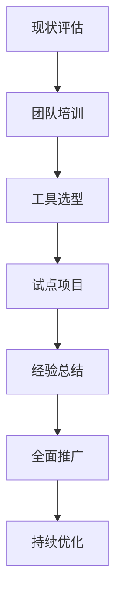

# AI赋能软件设计全景图项目

## 📖 项目概述

本项目基于传统软件设计知识体系，结合AI技术的最新发展，构建了一个全面的AI赋能软件设计全景图。项目旨在为软件设计师、架构师和开发团队提供在AI时代下的软件设计方法论、工具和最佳实践。

## 📁 文件结构

```
AI赋能软件设计全景图项目/
├── AI赋能软件设计全景图.md              # 主文档 - 详细的全景图说明
├── AI赋能软件设计核心架构图.puml         # 核心架构PlantUML图
├── 面向对象与微服务AI赋能设计图.puml     # OOD与微服务专题图
├── UML建模语言AI增强应用图.puml          # UML建模AI增强图
└── README_AI赋能软件设计全景图.md        # 本文档
```

## 🎯 核心价值

### 1. 知识体系完整性
- 覆盖传统软件设计的六大核心维度
- 整合AI技术的四大赋能层面
- 包含AI原生设计模式和治理框架

### 2. 方法论创新
- **传统设计基础** + **AI技术融合** = **智能化设计能力**
- 面向对象设计(OOD)的AI化改造
- 微服务架构的智能化演进
- UML建模语言的AI增强应用

### 3. 实践指导价值
- 提供详细的实施路线图
- 涵盖风险管控和成功要素
- 支持渐进式的组织变革

## 🔧 技术特色

### 传统软件设计知识体系
```
├── 基本概念层
│   ├── 设计概念、上下文、过程
│   └── 使能技术
├── 关键问题层  
│   ├── 并发性、分布式、异常处理
│   └── 事件控制、交互式系统、持久性
├── 架构结构层
│   ├── 架构风格、设计模式
│   └── 程序族和框架
├── 质量评价层
│   ├── 质量属性、分析工具
│   └── 设计评审、静态分析
├── 表示方法层
│   ├── 结构描述、行为描述
│   └── UML建模体系
└── 策略方法层
    ├── 面向对象设计
    ├── 面向功能设计
    ├── 数据中心设计
    └── 微服务架构
```

### AI技术赋能层
```
├── AI辅助设计
│   ├── 智能代码生成
│   ├── 架构模式推荐
│   └── 设计验证优化
├── 智能分析引擎
│   ├── 代码质量分析
│   ├── 性能瓶颈识别
│   └── 安全漏洞检测
├── 自动化工具
│   ├── 文档自动生成
│   ├── 测试用例生成
│   └── 部署脚本生成
└── 预测优化
    ├── 性能预测
    ├── 容量规划
    └── 风险评估
```

### AI原生设计模式
```
├── 数据驱动架构
│   ├── ML Pipeline设计
│   ├── 实时流处理
│   └── 数据湖架构
├── 智能交互模式
│   ├── 自然语言接口
│   ├── 多模态交互
│   └── 个性化系统
└── 自适应系统
    ├── 自愈系统设计
    ├── 自扩展架构
    └── 自学习机制
```

## 📊 核心图表说明

### 1. AI赋能软件设计核心架构图.puml
**用途**: 展示完整的AI赋能软件设计知识体系架构  
**特点**: 
- 包含传统软件设计的6个核心包
- AI技术赋能的4个主要层面
- AI原生设计模式的3个创新方向
- AI治理与伦理的完整框架

### 2. 面向对象与微服务AI赋能设计图.puml  
**用途**: 专注于OOD和微服务在AI时代的演进
**特点**:
- 传统OOD四大特性的AI增强
- SOLID原则的智能化应用
- 微服务架构的全面AI化改造
- 智能运维和治理体系

### 3. UML建模语言AI增强应用图.puml
**用途**: 展示UML建模语言的AI化改造和扩展
**特点**:
- 传统UML图形的AI增强生成
- 智能模型验证和优化
- AI原生建模扩展(ML系统、决策系统等)
- 完整的AI建模工具生态

## 🚀 使用指南

### 快速开始
1. **阅读主文档**: 从`AI赋能软件设计全景图.md`开始了解完整框架
2. **查看架构图**: 使用PlantUML工具渲染三个架构图文件
3. **选择应用场景**: 根据团队需求选择相应的实施路径

### 实施建议


### 工具要求
- **PlantUML**: 用于渲染架构图
- **Markdown编辑器**: 用于查看和编辑文档
- **AI开发工具**: 如GitHub Copilot、ChatGPT等
- **建模工具**: 支持UML和AI扩展的建模工具

## 🎓 适用人群

### 主要受众
- **软件架构师**: 了解AI时代的架构设计趋势和模式
- **技术负责人**: 规划团队的AI技术转型路径
- **开发团队**: 学习AI辅助的开发方法和最佳实践
- **产品经理**: 理解AI技术对产品设计的影响

### 适用场景
- **企业数字化转型**: 指导组织级的AI技术应用
- **团队能力建设**: 提升开发团队的AI应用能力
- **项目架构设计**: 在具体项目中应用AI赋能的设计方法
- **技术培训**: 作为AI+软件工程的培训教材

## 📈 价值收益

### 效率提升
- **代码生成效率**: 通过AI辅助提升30-50%的开发效率
- **设计质量**: 智能分析和建议减少设计缺陷
- **文档维护**: 自动化文档生成和更新

### 质量改善  
- **代码质量**: AI驱动的静态分析和重构建议
- **架构健康度**: 持续的架构质量监控和优化
- **测试覆盖率**: 自动化测试生成提升测试质量

### 创新能力
- **新技术应用**: 掌握AI原生的设计模式和架构
- **竞争优势**: 在AI时代保持技术领先地位
- **团队成长**: 提升团队的综合技术能力

## 🔗 相关资源

### 扩展阅读
- 《软件架构设计》
- 《面向对象设计原则》
- 《微服务架构设计模式》
- 《AI驱动的软件开发》

### 工具推荐
- **GitHub Copilot**: AI辅助编程
- **ChatGPT/Claude**: AI设计助手
- **PlantUML**: 架构图绘制
- **Mermaid**: 流程图和架构图

### 社区资源
- AI + 软件工程社区
- 架构师社区
- 开源AI工具项目

## 📞 联系方式

如有任何问题或建议，欢迎通过以下方式联系：
- 项目维护者: AI文档工作空间团队
- 更新频率: 持续更新，跟踪AI技术发展
- 版本管理: Git版本控制，支持协作开发

---

**版本**: v1.0  
**更新日期**: 2025年8月24日  
**维护状态**: 活跃维护中
