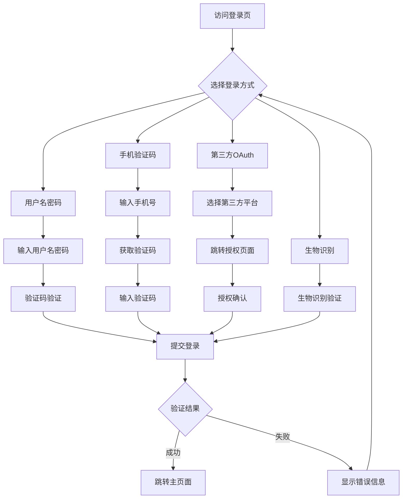

# 复杂登录功能概要设计文档

> **项目**: 智慧民航客户服务平台  
> **模块**: 多方式统一登录组件  
> **版本**: v2.0  
> **设计师**: AI辅助设计团队  
> **日期**: 2025-01-16  

---

## 1. 需求概述

### 1.1 功能目标
设计一个支持多种认证方式的统一登录组件，提供安全、便捷、用户友好的登录体验，支持PC端和移动端自适应。

### 1.2 用户场景
- **普通用户**：使用用户名/密码或手机验证码快速登录
- **企业用户**：通过企业邮箱或工号登录访问企业功能
- **移动用户**：支持指纹、Face ID等生物识别登录
- **社交用户**：通过微信、支付宝等第三方账号一键登录

### 1.3 业务价值
- **提升用户体验**：多样化登录方式，减少登录摩擦
- **增强安全性**：多因素认证，防止暴力破解
- **降低运营成本**：统一组件减少重复开发
- **提高转化率**：简化登录流程，提升用户留存

### 1.4 验收标准
- [ ] 支持5种登录方式且可灵活配置开关
- [ ] 登录成功率 > 98%，平均响应时间 < 2秒
- [ ] 兼容主流浏览器和移动设备
- [ ] 通过安全测试和渗透测试
- [ ] 支持国际化多语言切换

---

## 2. 核心关键要点

### 2.1 技术难点
- **状态同步**：多种登录方式的状态统一管理
- **安全验证**：防暴力破解、防机器人、密码加密传输
- **第三方集成**：OAuth2.0标准对接和异常处理
- **生物识别**：WebAuthn API的浏览器兼容性处理

### 2.2 性能要求
- **响应时间**：登录验证 < 2秒，页面加载 < 1秒
- **并发处理**：支持1000+并发登录请求
- **资源消耗**：组件大小 < 200KB，内存占用 < 10MB
- **缓存策略**：登录状态缓存7天，验证码缓存5分钟

### 2.3 安全考虑
- **数据传输**：HTTPS + 密码RSA加密
- **身份验证**：JWT Token + 刷新机制
- **防护策略**：验证码、登录频次限制、设备指纹
- **隐私保护**：用户数据最小化收集，符合GDPR标准

### 2.4 兼容性要求
- **浏览器支持**：Chrome 90+, Firefox 88+, Safari 14+, Edge 90+
- **移动设备**：iOS 14+, Android 10+
- **响应式设计**：320px-1920px屏幕自适应

---

## 3. 业务流程分析

### 3.1 用户操作流程


### 3.2 系统响应流程
参见系统顺序图：`复杂登录功能系统顺序图.puml`

### 3.3 异常处理流程
- **网络异常**：自动重试3次，超时提示用户检查网络
- **验证失败**：显示具体错误原因，引导用户正确操作
- **账号异常**：冻结/锁定账号时提供解锁指引
- **第三方故障**：提供其他登录方式作为备选方案

---

## 4. 界面设计规范

### 4.1 页面布局设计
```
┌─────────────────────────────────────┐
│           Logo + 标题               │
├─────────────────────────────────────┤
│  ┌─────┐ ┌─────┐ ┌─────┐ ┌─────┐   │
│  │密码 │ │短信 │ │社交 │ │指纹 │   │  ← 登录方式选项卡
│  └─────┘ └─────┘ └─────┘ └─────┘   │
├─────────────────────────────────────┤
│                                     │
│         登录表单区域                  │
│     (根据选择的方式动态切换)            │
│                                     │
├─────────────────────────────────────┤
│    [记住登录] [忘记密码] [注册账号]     │
└─────────────────────────────────────┘
```

### 4.2 组件设计清单
- **LoginContainer**: 登录容器组件
- **TabSelector**: 登录方式选择器
- **PasswordForm**: 用户名密码表单
- **SmsForm**: 手机验证码表单
- **SocialLogin**: 第三方登录组件
- **BiometricLogin**: 生物识别登录
- **CaptchaComponent**: 验证码组件
- **LoadingIndicator**: 加载状态指示器
- **ErrorMessage**: 错误提示组件

### 4.3 交互设计说明
- **切换动画**：登录方式切换使用滑动动画，时长300ms
- **输入验证**：实时验证用户输入，即时显示验证状态
- **加载状态**：登录过程显示加载动画，防止重复提交
- **错误提示**：错误信息显示3秒后自动消失，可手动关闭

### 4.4 响应式设计
- **桌面端(≥1024px)**: 居中卡片式布局，宽度固定400px
- **平板端(768-1023px)**: 适中卡片布局，宽度占屏幕60%
- **移动端(≤767px)**: 全屏布局，底部固定操作按钮

---

## 5. 接口设计说明

### 5.1 后端接口规范

#### 5.1.1 用户名密码登录
```http
POST /api/auth/login
Content-Type: application/json

{
  "username": "user@example.com",
  "password": "encrypted_password",
  "captcha": "1234",
  "captcha_key": "captcha_session_key",
  "remember_me": true
}

Response:
{
  "code": 200,
  "message": "登录成功",
  "data": {
    "access_token": "jwt_token",
    "refresh_token": "refresh_jwt_token",
    "expires_in": 3600,
    "user": {
      "id": 12345,
      "username": "user@example.com",
      "nickname": "张三",
      "avatar": "https://avatar.url"
    }
  }
}
```

#### 5.1.2 手机验证码登录
```http
POST /api/auth/sms-login
Content-Type: application/json

{
  "phone": "13800138000",
  "sms_code": "123456",
  "sms_token": "sms_session_token"
}
```

#### 5.1.3 第三方OAuth登录
```http
POST /api/auth/oauth-login
Content-Type: application/json

{
  "provider": "wechat", // wechat, qq, alipay
  "auth_code": "oauth_authorization_code",
  "state": "csrf_state_token"
}
```

### 5.2 错误码定义
| 错误码 | 错误信息 | 处理建议 |
|--------|----------|----------|
| 10001 | 用户名或密码错误 | 检查输入信息 |
| 10002 | 验证码错误或已过期 | 重新获取验证码 |
| 10003 | 账号已被锁定 | 联系客服解锁 |
| 10004 | 登录频率过快 | 稍后重试 |
| 10005 | 第三方授权失败 | 重新授权或换其他方式 |

---

## 6. 架构设计

### 6.1 MVVM模式应用

```
View Layer (Template)
    ↕ (Data Binding)
ViewModel Layer (Composition API)
    ↕ (State Management) 
Model Layer (API & Store)
```

### 6.2 组件化架构
```
LoginContainer (父组件)
├── TabSelector (选项卡组件)
├── FormContainer (表单容器)
│   ├── PasswordForm (密码登录)
│   ├── SmsForm (短信登录)
│   ├── SocialLogin (第三方登录)
│   └── BiometricLogin (生物识别)
├── CaptchaComponent (验证码组件)
└── ErrorMessage (错误提示)
```

### 6.3 状态管理设计
```javascript
// 登录状态管理 (Pinia/Vuex)
const loginStore = {
  state: {
    currentTab: 'password',        // 当前登录方式
    isLoading: false,             // 加载状态
    user: null,                   // 用户信息
    isLoggedIn: false,            // 登录状态
    loginError: null,             // 错误信息
    captchaRequired: false,       // 是否需要验证码
    smsCountdown: 0,              // 短信倒计时
  },
  
  mutations: {
    SET_CURRENT_TAB,
    SET_LOADING_STATE,
    SET_USER_INFO,
    SET_LOGIN_STATUS,
    SET_ERROR_MESSAGE,
    CLEAR_ERROR,
    // ...
  },
  
  actions: {
    async loginWithPassword(),
    async loginWithSms(),
    async loginWithOAuth(),
    async logout(),
    // ...
  }
}
```

---

## 7. 实现逻辑详述 ⭐⭐⭐

### 7.1 MVVM最佳实践

#### 7.1.1 Model层设计
```javascript
// models/auth.js - 认证数据模型
export class AuthModel {
  // 用户认证API封装
  static async loginWithPassword(credentials) {
    const encryptedPassword = encrypt(credentials.password);
    return await apiClient.post('/auth/login', {
      ...credentials,
      password: encryptedPassword
    });
  }
  
  static async loginWithSms(smsData) {
    return await apiClient.post('/auth/sms-login', smsData);
  }
  
  static async refreshToken(refreshToken) {
    return await apiClient.post('/auth/refresh', { refreshToken });
  }
  
  // 本地存储管理
  static saveTokens(tokens) {
    localStorage.setItem('access_token', tokens.access_token);
    localStorage.setItem('refresh_token', tokens.refresh_token);
  }
  
  static clearTokens() {
    localStorage.removeItem('access_token');
    localStorage.removeItem('refresh_token');
  }
}
```

#### 7.1.2 ViewModel层设计
```javascript
// composables/useLogin.js - 登录逻辑组合函数
import { ref, computed, reactive } from 'vue';
import { useStore } from 'vuex';
import { AuthModel } from '@/models/auth';

export function useLogin() {
  const store = useStore();
  
  // 响应式状态
  const currentTab = ref('password');
  const isLoading = ref(false);
  const formData = reactive({
    username: '',
    password: '',
    phone: '',
    smsCode: '',
    captcha: '',
    rememberMe: false
  });
  
  // 计算属性
  const canSubmit = computed(() => {
    switch (currentTab.value) {
      case 'password':
        return formData.username && formData.password && formData.captcha;
      case 'sms':
        return formData.phone && formData.smsCode;
      default:
        return false;
    }
  });
  
  // 登录方法
  const login = async () => {
    if (!canSubmit.value) return;
    
    isLoading.value = true;
    try {
      let result;
      switch (currentTab.value) {
        case 'password':
          result = await AuthModel.loginWithPassword({
            username: formData.username,
            password: formData.password,
            captcha: formData.captcha,
            remember_me: formData.rememberMe
          });
          break;
        case 'sms':
          result = await AuthModel.loginWithSms({
            phone: formData.phone,
            sms_code: formData.smsCode
          });
          break;
      }
      
      // 登录成功处理
      await store.dispatch('auth/setUser', result.data.user);
      AuthModel.saveTokens(result.data);
      
      // 跳转到目标页面
      router.push('/dashboard');
      
    } catch (error) {
      // 错误处理
      store.commit('auth/SET_ERROR', error.message);
    } finally {
      isLoading.value = false;
    }
  };
  
  // 切换登录方式
  const switchTab = (tab) => {
    currentTab.value = tab;
    clearError();
    resetForm();
  };
  
  return {
    currentTab,
    isLoading,
    formData,
    canSubmit,
    login,
    switchTab
  };
}
```

#### 7.1.3 View层设计
```vue
<!-- components/LoginContainer.vue -->
<template>
  <div class="login-container">
    <!-- 登录方式选择 -->
    <TabSelector 
      :current-tab="currentTab"
      @tab-change="switchTab"
    />
    
    <!-- 登录表单 -->
    <div class="form-container">
      <PasswordForm 
        v-if="currentTab === 'password'"
        v-model:form-data="formData"
        :loading="isLoading"
        @submit="login"
      />
      
      <SmsForm
        v-else-if="currentTab === 'sms'"
        v-model:form-data="formData"
        :loading="isLoading"
        @submit="login"
      />
      
      <!-- 其他登录方式... -->
    </div>
    
    <!-- 错误提示 -->
    <ErrorMessage 
      v-if="loginError"
      :message="loginError"
      @close="clearError"
    />
    
    <!-- 操作按钮 -->
    <div class="action-buttons">
      <button 
        class="login-btn"
        :disabled="!canSubmit || isLoading"
        @click="login"
      >
        {{ isLoading ? '登录中...' : '登录' }}
      </button>
    </div>
  </div>
</template>

<script setup>
import { useLogin } from '@/composables/useLogin';
import TabSelector from './TabSelector.vue';
import PasswordForm from './PasswordForm.vue';
import SmsForm from './SmsForm.vue';
import ErrorMessage from './ErrorMessage.vue';

// 使用组合函数
const {
  currentTab,
  isLoading, 
  formData,
  canSubmit,
  login,
  switchTab,
  loginError,
  clearError
} = useLogin();
</script>
```

### 7.2 数据绑定机制

#### 7.2.1 双向数据绑定实现
```javascript
// 自定义双向绑定组合函数
export function useFormBinding(initialData) {
  const formData = reactive({ ...initialData });
  
  // 创建双向绑定的计算属性
  const createBinding = (key) => computed({
    get: () => formData[key],
    set: (value) => {
      formData[key] = value;
      // 实时验证
      validateField(key, value);
    }
  });
  
  const validateField = (key, value) => {
    // 实时验证逻辑
    switch (key) {
      case 'username':
        if (!value) return '用户名不能为空';
        if (!isValidEmail(value)) return '请输入正确的邮箱格式';
        break;
      case 'password':
        if (value.length < 6) return '密码至少6位字符';
        break;
    }
  };
  
  return {
    formData,
    createBinding,
    validateField
  };
}
```

#### 7.2.2 单向数据流控制
```javascript
// 严格的单向数据流
const loginFlow = {
  // 数据只能通过actions修改
  state: reactive({
    user: null,
    loginStatus: 'idle' // idle, loading, success, error
  }),
  
  // 通过mutations修改状态
  mutations: {
    setLoginStatus(status) {
      loginFlow.state.loginStatus = status;
    },
    setUser(user) {
      loginFlow.state.user = user;
    }
  },
  
  // 异步操作统一通过actions处理
  actions: {
    async login(credentials) {
      loginFlow.mutations.setLoginStatus('loading');
      try {
        const user = await AuthModel.login(credentials);
        loginFlow.mutations.setUser(user);
        loginFlow.mutations.setLoginStatus('success');
      } catch (error) {
        loginFlow.mutations.setLoginStatus('error');
        throw error;
      }
    }
  }
};
```

### 7.3 事件处理策略

#### 7.3.1 命令模式应用
```javascript
// commands/loginCommands.js - 登录命令封装
export class LoginCommand {
  constructor(authService, router, store) {
    this.authService = authService;
    this.router = router;
    this.store = store;
  }
  
  async execute(credentials) {
    // 前置检查
    if (!this.canExecute(credentials)) {
      throw new Error('登录信息不完整');
    }
    
    // 执行登录
    const result = await this.authService.login(credentials);
    
    // 后置处理
    await this.postLogin(result);
    
    return result;
  }
  
  canExecute(credentials) {
    return credentials.username && credentials.password;
  }
  
  async postLogin(result) {
    // 保存用户信息
    await this.store.dispatch('setUser', result.user);
    
    // 跳转页面
    this.router.push('/dashboard');
    
    // 记录登录日志
    analytics.track('user_login', {
      method: 'password',
      timestamp: Date.now()
    });
  }
}

// 在组件中使用
const loginCommand = new LoginCommand(authService, router, store);

const handleLogin = async (credentials) => {
  try {
    await loginCommand.execute(credentials);
  } catch (error) {
    handleError(error);
  }
};
```

#### 7.3.2 异步操作处理
```javascript
// 统一的异步操作处理
export function useAsyncOperation() {
  const loading = ref(false);
  const error = ref(null);
  
  const execute = async (operation) => {
    loading.value = true;
    error.value = null;
    
    try {
      const result = await operation();
      return result;
    } catch (err) {
      error.value = err.message;
      throw err;
    } finally {
      loading.value = false;
    }
  };
  
  // 带重试机制的执行
  const executeWithRetry = async (operation, maxRetries = 3) => {
    let retries = 0;
    while (retries < maxRetries) {
      try {
        return await execute(operation);
      } catch (error) {
        retries++;
        if (retries >= maxRetries) throw error;
        
        // 指数退避重试
        await new Promise(resolve => 
          setTimeout(resolve, Math.pow(2, retries) * 1000)
        );
      }
    }
  };
  
  return {
    loading: readonly(loading),
    error: readonly(error),
    execute,
    executeWithRetry
  };
}
```

### 7.4 状态管理策略

#### 7.4.1 全局状态管理
```javascript
// stores/authStore.js - 认证状态管理
import { defineStore } from 'pinia';
import { AuthModel } from '@/models/auth';

export const useAuthStore = defineStore('auth', {
  state: () => ({
    user: null,
    isLoggedIn: false,
    loginHistory: [],
    preferences: {
      rememberMe: false,
      preferredLoginMethod: 'password'
    }
  }),
  
  getters: {
    userDisplayName: (state) => {
      return state.user?.nickname || state.user?.username || '未知用户';
    },
    
    hasPermission: (state) => (permission) => {
      return state.user?.permissions?.includes(permission) || false;
    },
    
    lastLoginTime: (state) => {
      return state.loginHistory[0]?.timestamp;
    }
  },
  
  actions: {
    async login(credentials) {
      try {
        const result = await AuthModel.loginWithPassword(credentials);
        
        this.user = result.user;
        this.isLoggedIn = true;
        this.recordLoginHistory();
        
        // 持久化登录状态
        if (credentials.rememberMe) {
          this.saveLoginState();
        }
        
        return result;
      } catch (error) {
        this.handleLoginError(error);
        throw error;
      }
    },
    
    async logout() {
      try {
        await AuthModel.logout();
      } finally {
        this.clearLoginState();
      }
    },
    
    recordLoginHistory() {
      this.loginHistory.unshift({
        timestamp: Date.now(),
        userAgent: navigator.userAgent,
        ip: '', // 从服务端获取
      });
      
      // 只保留最近10次登录记录
      if (this.loginHistory.length > 10) {
        this.loginHistory = this.loginHistory.slice(0, 10);
      }
    },
    
    saveLoginState() {
      localStorage.setItem('auth_state', JSON.stringify({
        user: this.user,
        isLoggedIn: this.isLoggedIn,
        timestamp: Date.now()
      }));
    },
    
    clearLoginState() {
      this.user = null;
      this.isLoggedIn = false;
      localStorage.removeItem('auth_state');
      AuthModel.clearTokens();
    }
  }
});
```

#### 7.4.2 组件局部状态
```javascript
// 组件内部状态管理最佳实践
export function useLoginForm() {
  // 表单状态
  const formState = reactive({
    data: {
      username: '',
      password: '',
      captcha: ''
    },
    errors: {},
    touched: {},
    isSubmitting: false
  });
  
  // 验证规则
  const validationRules = {
    username: [
      { required: true, message: '请输入用户名' },
      { type: 'email', message: '请输入正确的邮箱格式' }
    ],
    password: [
      { required: true, message: '请输入密码' },
      { min: 6, message: '密码至少6位字符' }
    ],
    captcha: [
      { required: true, message: '请输入验证码' }
    ]
  };
  
  // 实时验证
  const validateField = (field) => {
    const value = formState.data[field];
    const rules = validationRules[field];
    
    formState.touched[field] = true;
    
    for (const rule of rules) {
      if (rule.required && !value) {
        formState.errors[field] = rule.message;
        return false;
      }
      if (rule.type === 'email' && !isValidEmail(value)) {
        formState.errors[field] = rule.message;
        return false;
      }
      if (rule.min && value.length < rule.min) {
        formState.errors[field] = rule.message;
        return false;
      }
    }
    
    delete formState.errors[field];
    return true;
  };
  
  // 表单提交
  const handleSubmit = async () => {
    // 验证所有字段
    const isValid = Object.keys(validationRules).every(validateField);
    if (!isValid) return;
    
    formState.isSubmitting = true;
    try {
      await authStore.login(formState.data);
    } finally {
      formState.isSubmitting = false;
    }
  };
  
  return {
    formState: readonly(formState),
    validateField,
    handleSubmit
  };
}
```

### 7.5 错误处理机制

#### 7.5.1 统一异常处理
```javascript
// utils/errorHandler.js - 全局错误处理
export class ErrorHandler {
  static handle(error, context = '') {
    // 错误分类处理
    if (error.response) {
      // HTTP错误
      return this.handleHttpError(error.response, context);
    } else if (error.request) {
      // 网络错误
      return this.handleNetworkError(error, context);
    } else {
      // 其他错误
      return this.handleGenericError(error, context);
    }
  }
  
  static handleHttpError(response, context) {
    const { status, data } = response;
    
    switch (status) {
      case 401:
        return {
          type: 'auth',
          message: '登录已过期，请重新登录',
          action: 'redirect_login'
        };
      case 403:
        return {
          type: 'permission',
          message: '权限不足，无法执行此操作',
          action: 'show_message'
        };
      case 422:
        return {
          type: 'validation',
          message: data.message || '输入信息有误',
          fields: data.errors,
          action: 'highlight_fields'
        };
      case 429:
        return {
          type: 'rate_limit',
          message: '操作频率过快，请稍后重试',
          retryAfter: response.headers['retry-after'],
          action: 'delay_retry'
        };
      case 500:
        return {
          type: 'server',
          message: '服务器错误，请稍后重试',
          action: 'retry'
        };
      default:
        return {
          type: 'unknown',
          message: data.message || '未知错误',
          action: 'show_message'
        };
    }
  }
  
  static handleNetworkError(error, context) {
    return {
      type: 'network',
      message: '网络连接异常，请检查网络设置',
      action: 'retry'
    };
  }
}

// 在API请求中使用
apiClient.interceptors.response.use(
  response => response,
  error => {
    const errorInfo = ErrorHandler.handle(error, 'API Request');
    
    // 根据错误类型执行相应操作
    switch (errorInfo.action) {
      case 'redirect_login':
        router.push('/login');
        break;
      case 'show_message':
        ElMessage.error(errorInfo.message);
        break;
      case 'retry':
        // 实现自动重试逻辑
        break;
    }
    
    return Promise.reject(errorInfo);
  }
);
```

#### 7.5.2 用户友好提示
```javascript
// composables/useErrorMessage.js - 错误信息管理
export function useErrorMessage() {
  const errorMessages = reactive(new Map());
  
  const showError = (key, message, duration = 3000) => {
    errorMessages.set(key, {
      message,
      timestamp: Date.now(),
      type: 'error'
    });
    
    // 自动清除
    setTimeout(() => {
      clearError(key);
    }, duration);
  };
  
  const showWarning = (key, message, duration = 3000) => {
    errorMessages.set(key, {
      message,
      timestamp: Date.now(),
      type: 'warning'
    });
    
    setTimeout(() => {
      clearError(key);
    }, duration);
  };
  
  const clearError = (key) => {
    errorMessages.delete(key);
  };
  
  const clearAllErrors = () => {
    errorMessages.clear();
  };
  
  // 错误消息的计算属性
  const hasErrors = computed(() => errorMessages.size > 0);
  const errorList = computed(() => Array.from(errorMessages.values()));
  
  return {
    showError,
    showWarning,
    clearError,
    clearAllErrors,
    hasErrors,
    errorList
  };
}
```

---

## 8. AI赋能应用 🤖

### 8.1 设计阶段AI应用

#### 8.1.1 需求分析AI
```markdown
**AI提示词示例**：
"分析以下用户行为数据，为登录功能设计提供优化建议：
- 密码登录成功率：78%，失败原因：密码遗忘60%、输入错误40%
- 短信登录成功率：95%，用户偏好度：85%
- 社交登录使用率：45%，微信占比最高
- 移动端登录占比：70%，桌面端30%
- 用户平均登录时长：45秒

请提供：
1. 登录方式优先级排序建议
2. 用户界面优化建议
3. 用户体验改进措施"

**AI建议输出**：
1. 优先级：短信登录 > 社交登录 > 密码登录
2. 界面优化：移动优先设计，简化步骤，添加密码找回入口
3. 体验改进：一键登录、生物识别、智能推荐登录方式
```

#### 8.1.2 代码架构AI
```markdown
**AI代码生成提示**：
"请基于Vue 3 + TypeScript + Pinia生成一个符合MVVM模式的登录组件架构：

要求：
1. 支持多种登录方式切换
2. 统一的状态管理
3. 错误处理机制
4. 表单验证逻辑
5. 响应式设计

请生成：
1. 组件结构设计
2. 状态管理Store
3. 组合函数设计
4. TypeScript接口定义"
```

### 8.2 开发阶段AI应用

#### 8.2.1 代码生成AI
```javascript
// AI辅助生成的标准组件模板
// 使用GitHub Copilot生成基础结构
/**
 * 登录表单组件
 * @description AI辅助生成的标准MVVM组件
 */
export default defineComponent({
  name: 'LoginForm',
  props: {
    loginType: {
      type: String as PropType<'password' | 'sms' | 'social'>,
      required: true
    }
  },
  
  setup(props, { emit }) {
    // AI生成的标准状态管理
    const formState = reactive({
      // ...状态定义
    });
    
    // AI生成的标准验证逻辑
    const validateForm = () => {
      // ...验证实现
    };
    
    // AI生成的标准提交逻辑
    const handleSubmit = async () => {
      // ...提交实现
    };
    
    return {
      formState,
      validateForm,
      handleSubmit
    };
  }
});
```

#### 8.2.2 代码审查AI
```yaml
# .github/workflows/ai-code-review.yml
name: AI代码审查
on: [pull_request]

jobs:
  ai-review:
    runs-on: ubuntu-latest
    steps:
      - uses: actions/checkout@v2
      - name: AI代码质量检查
        uses: ai-code-reviewer@v1
        with:
          rules: |
            - 检查MVVM模式合规性
            - 验证组件单一职责原则
            - 确保状态管理规范性
            - 检查错误处理完整性
            - 验证TypeScript类型安全
          focus_areas:
            - "src/components/Login/**"
            - "src/stores/auth.ts"
            - "src/composables/useLogin.ts"
```

### 8.3 测试阶段AI应用

#### 8.3.1 测试用例生成
```javascript
// AI生成的综合测试用例
describe('LoginComponent - AI Generated Tests', () => {
  // AI分析组件逻辑生成的边界测试
  describe('表单验证边界测试', () => {
    it('应该处理极长用户名输入', () => {
      const longUsername = 'a'.repeat(1000);
      // AI生成的测试逻辑
    });
    
    it('应该处理特殊字符密码', () => {
      const specialPassword = '!@#$%^&*()_+-={}[]|\\:";\'<>?,./';
      // AI生成的测试逻辑
    });
  });
  
  // AI生成的异常场景测试
  describe('异常场景测试', () => {
    it('应该处理网络超时', async () => {
      // AI模拟网络超时场景
    });
    
    it('应该处理服务器500错误', async () => {
      // AI模拟服务器错误
    });
  });
  
  // AI生成的性能测试
  describe('性能测试', () => {
    it('组件初始化应该在100ms内完成', () => {
      // AI生成的性能测试代码
    });
  });
});
```

### 8.4 优化阶段AI应用

#### 8.4.1 性能优化AI
```javascript
// AI分析性能瓶颈并提供优化建议
/**
 * AI性能优化报告：
 * 
 * 发现的问题：
 * 1. 组件重复渲染：表单输入时整个组件重新渲染
 * 2. 内存泄漏：事件监听器未正确清理
 * 3. 包体积过大：未使用的依赖被打包
 * 
 * 优化建议：
 * 1. 使用computed和watch优化响应式更新
 * 2. 实现组件懒加载和代码分割
 * 3. 添加防抖处理减少API调用
 */

// AI建议的优化代码
const debouncedValidation = useDebounceFn((field, value) => {
  validateField(field, value);
}, 300);

const optimizedFormData = computed(() => {
  // AI优化的计算属性逻辑
});
```

---

## 9. 系统顺序图

参见独立文件：`复杂登录功能系统顺序图.puml`

---

## 10. 质量保证措施

### 10.1 代码规范标准
```json
// .eslintrc.js - AI推荐的规范配置
{
  "extends": [
    "@vue/typescript/recommended",
    "plugin:vue/vue3-recommended"
  ],
  "rules": {
    // MVVM模式强制规则
    "vue/no-direct-mutation-props": "error",
    "vue/no-side-effects-in-computed-properties": "error",
    
    // AI推荐的代码质量规则
    "complexity": ["error", 10],
    "max-depth": ["error", 4],
    "max-lines-per-function": ["error", 50]
  }
}
```

### 10.2 性能优化方案
- **代码分割**：按登录方式拆分组件，实现按需加载
- **缓存策略**：验证码图片缓存、用户信息本地缓存
- **预加载**：预加载用户常用登录方式的资源
- **CDN优化**：第三方库使用CDN加载

### 10.3 安全保证措施
- **输入验证**：前后端双重验证，防止注入攻击
- **数据加密**：密码RSA加密传输，本地存储AES加密
- **防护机制**：验证码、频率限制、设备指纹识别
- **隐私保护**：最小化数据收集，符合GDPR等法规

---

## 11. 开发计划和里程碑

### 11.1 开发阶段划分
- **第一周**：基础组件开发 + MVVM架构搭建
- **第二周**：多种登录方式实现 + 状态管理
- **第三周**：安全功能 + 错误处理 + 性能优化
- **第四周**：测试 + 文档 + 部署上线

### 11.2 验收标准
- [ ] 功能完整性：5种登录方式正常工作
- [ ] 性能指标：首屏加载 < 1s，登录响应 < 2s
- [ ] 兼容性测试：主流浏览器和设备正常使用
- [ ] 安全测试：通过渗透测试和安全扫描
- [ ] 用户体验：易用性测试评分 > 8.5/10

---

## 📊 总结

这个概要设计文档体现了以下最佳实践：

### ✅ **设计完整性**
- 从需求分析到实现细节的全覆盖
- 重点突出实现逻辑和架构设计
- AI赋能贯穿整个开发生命周期

### ✅ **技术规范性**
- 严格遵循MVVM模式最佳实践
- 组件化、模块化设计思想
- 统一的错误处理和状态管理

### ✅ **可操作性**
- 详细的代码示例和实现指导
- 明确的开发规范和质量标准
- 具体的AI工具应用场景

通过这样的概要设计文档，开发人员可以：
1. **避免架构混乱**：明确的MVVM分层设计
2. **提升代码质量**：详细的实现逻辑指导
3. **加速开发进度**：AI工具辅助和代码模板
4. **保证项目成功**：完整的质量保证体系

这正是解决您提到的"程序员直接操作DOM"、"页面拼凑导致维护性差"等问题的有效方案。
