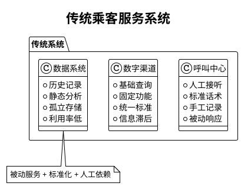

# 民航乘客服务系统AI原生设计模式讨论案例（10分钟版）

## 🛫 案例背景

**华夏航空公司**：中等规模国内航空公司，日均200班次，年运输量1000万人次。

### 📊 当前痛点数据
| 服务指标 | 现状 | 行业平均 | 差距 |
|---------|------|----------|------|
| 客服响应时间 | 3.5分钟 | 2.8分钟 | 慢25% |
| 服务满意度 | 3.4/5 | 3.8/5 | 低0.4分 |
| 问题解决率 | 65% | 72% | 低7% |
| 单次服务成本 | 45元 | 38元 | 高18% |

### 🎭 典型用户场景

#### 👨‍💼 张先生（商务旅客）- 改签困扰
**传统体验**：拨打客服等5分钟→询问信息3分钟→查询改签→无法解释高差价→15分钟完成，体验差
**痛点**：等待时间长、流程繁琐、信息不透明

#### 👩‍👧‍👦 李女士（家庭旅客）- 特殊需求
**传统体验**：APP找不到儿童餐申请→致电客服被告知时间限制→座位无法保证相邻
**痛点**：服务不贴心、需求难满足、缺乏主动关怀

#### 🎓 王同学（年轻旅客）- 信息不透明
**传统体验**：APP显示正常到机场却延误→无延误预警→信息前后不一致
**痛点**：信息滞后、缺乏预警、服务被动

## 🔄 系统对比

### 🏗️ 传统系统特点

### 🚀 AI原生系统增强功能

#### 🧠 核心AI增强点

| AI功能 | 具体能力 | 解决问题 | 价值提升 |
|--------|----------|----------|----------|
| **智能客服** | 自然语言理解、意图识别、7×24服务 | 响应慢、理解差 | 响应提速10倍 |
| **个性化推荐** | 用户画像、偏好学习、智能推荐 | 千人一面 | 满意度提升25% |
| **预测服务** | 延误预警、需求预测、主动通知 | 信息滞后 | 投诉减少60% |
| **智能决策** | 最优方案推荐、动态定价、风险评估 | 决策依赖经验 | 效率提升40% |
| **情感分析** | 情绪识别、关怀触发、贴心服务 | 服务冷冰冰 | 忠诚度提升30% |

#### 🌟 用户体验对比

**张先生的AI增强体验**：
- **2分钟完成改签**：AI主动推送改签建议→智能推荐最优航班→透明定价说明→一键确认
- **满意度大幅提升**：从抱怨变为称赞

**李女士的AI增强体验**：
- **主动贴心关怀**：识别亲子出行→自动安排相邻座位→预订儿童餐→推送出行攻略
- **建立情感连接**：感受到被理解和关爱

**王同学的AI增强体验**：
- **智慧预警服务**：提前4小时延误预警→实时更新最新情况→学生专属优惠推送
- **信息透明可靠**：从信息焦虑到安心出行

## 🎯 10分钟讨论设计

### 🤔 讨论问题（8分钟分组讨论）

#### 第1组：价值分析
**讨论问题**：AI原生设计模式相比传统系统，最大的价值变化是什么？

**引导要点**：
- 从"被动响应"到"主动服务"
- 从"标准化"到"个性化"  
- 从"人工经验"到"数据智能"

#### 第2组：用户体验
**讨论问题**：选择一个用户角色，分析AI增强如何改变其体验？

**选择角色**：□ 张先生（商务）□ 李女士（家庭）□ 王同学（年轻）

**分析维度**：
- 最大痛点解决
- 最有价值的AI功能
- 体验改善程度

#### 第3组：实施策略
**讨论问题**：如果你是项目负责人，优先实施哪个AI功能？为什么？

**评估维度**：
- 业务价值大小
- 实施难易程度
- 用户接受程度

#### 第4组：风险挑战
**讨论问题**：AI原生改造面临的最大挑战和风险是什么？

**关注点**：
- 技术风险：算法准确性、数据质量
- 业务风险：用户接受度、隐私保护
- 管理风险：投资回报、人员转型

### 💡 分享总结（2分钟快速分享）

每组30秒分享一个核心观点

## 📈 核心价值总结

### 🎯 量化价值

| 指标 | 传统 | AI增强 | 改善 |
|------|------|--------|------|
| 响应时间 | 3.5分钟 | 30秒 | -86% |
| 满意度 | 3.4分 | 4.2分 | +24% |
| 服务成本 | 45元 | 25元 | -44% |
| 个性化覆盖 | 0% | 90% | +90% |

### 💡 关键洞察

1. **服务理念转变**：从"等你来问"到"我来帮你"
2. **能力本质升级**：从"功能提供"到"价值创造"  
3. **用户关系重构**：从"服务提供商"到"出行伙伴"

## 📋 快速讨论记录表

### 个人思考（填空）

**你认为AI原生设计模式最大的价值是**：
□ 提升效率 □ 降低成本 □ 改善体验 □ 创造新价值

**最希望AI帮你解决的问题**：
_________________________________________________

**实施AI改造最大的挑战**：
□ 技术难度 □ 用户接受 □ 投资成本 □ 人员转型

### 小组结论（总结）

**小组角色**：第___组
**核心观点**：_____________________________________
**最有价值的发现**：_______________________________

---

## 🎓 讨论要点提炼

### ✨ 核心理念
AI原生设计模式的本质是**思维模式转变**：
- 不是简单的功能叠加，而是服务理念重构
- 不是技术驱动，而是用户价值驱动
- 不是一次性改造，而是持续进化能力

### 🚀 实践启示
1. **从小处着手**：选择用户痛点最明显的场景试点
2. **循序渐进**：从辅助决策到智能决策的演进路径  
3. **价值导向**：始终以用户体验和业务价值为中心
4. **持续学习**：建立数据驱动的持续优化机制

**一句话总结**：AI原生设计模式让软件从"工具"进化为"伙伴"，从被动服务变为主动关怀！🚀
