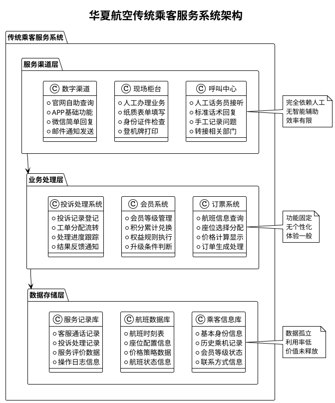
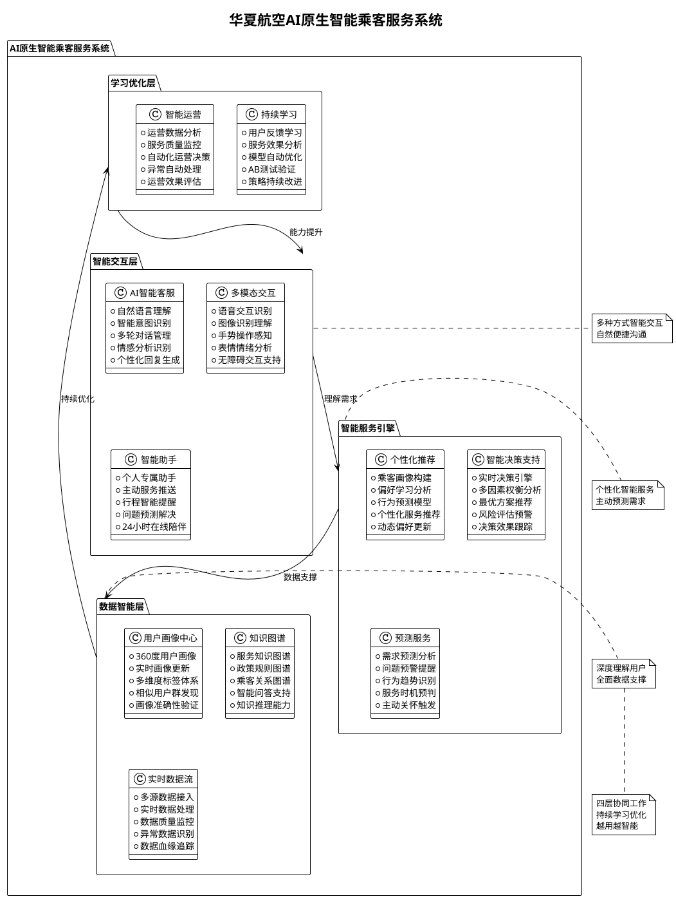

# 民航乘客服务系统AI原生设计模式讨论案例

## 🛫 案例背景

### 📋 公司概况
**华夏航空公司**是一家中等规模的国内航空公司，主要运营国内航线，日均航班约200班次，年旅客运输量超过1000万人次。公司一直以"安全、准点、服务"为经营理念，但在数字化时代面临着新的挑战。

### 🎯 业务现状
华夏航空的乘客服务系统已运行8年，虽然功能完善，但随着乘客需求的变化和竞争的加剧，系统的局限性日益凸显：

- **服务标准化程度高**：所有乘客享受相同的服务流程和标准
- **响应方式被动**：主要依靠乘客主动咨询和投诉来了解需求
- **人工依赖程度重**：客服中心有200名话务员，人工成本占服务成本的60%
- **数据利用率低**：虽然积累了大量乘客数据，但主要用于统计报表
- **个性化程度不足**：无法根据不同乘客提供差异化服务

### 📊 关键数据现状

| 指标类别 | 当前数据 | 行业平均 | 差距 |
|---------|---------|---------|------|
| **服务效率** |  |  |  |
| 客服电话接通率 | 78% | 85% | -7% |
| 平均等待时长 | 3.5分钟 | 2.8分钟 | +25% |
| 问题一次解决率 | 65% | 72% | -7% |
| **乘客体验** |  |  |  |
| 服务满意度评分 | 3.4/5 | 3.8/5 | -0.4 |
| 投诉处理时效 | 48小时 | 24小时 | +100% |
| 重复咨询率 | 35% | 25% | +40% |
| **运营成本** |  |  |  |
| 单次服务成本 | 45元 | 38元 | +18% |
| 客服人员流失率 | 25% | 20% | +25% |

### 🎭 典型乘客画像

#### 👨‍💼 张先生 - 商务旅客
- **基本信息**：35岁，互联网公司高管，金卡会员
- **出行特点**：每月飞行8-10次，主要往返北上广深
- **服务偏好**：重视时间效率，偏爱靠窗座位，经常需要改签
- **痛点**：希望快速办理值机，获得航班动态提醒，简化改签流程

#### 👩‍👧‍👦 李女士 - 家庭旅客  
- **基本信息**：32岁，全职妈妈，银卡会员，经常带6岁儿子出行
- **出行特点**：多为度假旅行，对价格敏感，关注安全和舒适
- **服务偏好**：需要特殊餐食，希望相邻座位，关心儿童服务
- **痛点**：担心孩子在飞机上的安全和舒适，希望获得贴心提醒和帮助

#### 🎓 王同学 - 年轻旅客
- **基本信息**：22岁，大学生，普通会员，预算有限
- **出行特点**：主要往返学校和家乡，多选择经济舱，对价格敏感
- **服务偏好**：喜欢自助服务，习惯手机操作，关注优惠信息
- **痛点**：希望操作简单便捷，获得实时信息，享受优惠服务

### 🏢 组织架构现状
**乘客服务部**下设三个中心：
- **呼叫中心**：200名话务员，7×24小时服务，处理咨询、投诉、预订
- **现场服务中心**：各机场柜台服务人员约150人，办理值机、改签等
- **数字服务中心**：20人技术团队，维护官网、APP、微信等数字渠道

### 💡 管理层期望
华夏航空CEO在年度工作会议上提出了明确要求：
> "我们要在未来2年内，将乘客服务满意度提升到4.2分以上，同时将服务成本降低20%。这需要我们拥抱新技术，特别是AI技术，实现服务的智能化转型。"

**具体目标**：
1. **效率提升**：客服响应时间缩短50%，问题一次解决率达到85%
2. **体验优化**：实现千人千面的个性化服务，满意度达到4.2/5
3. **成本控制**：在服务质量提升的同时，总体服务成本降低20%
4. **创新引领**：成为行业数字化服务转型的标杆企业

## 🔄 传统乘客服务系统架构

### 🏗️ 系统现状分析

### 😤 现有系统的典型问题场景

#### 场景1：张先生的改签困扰
> **时间**：周五晚上8点，张先生刚结束会议  
> **需求**：需要将明天上午的航班改签到下午  
> **体验过程**：
> 1. 拨打客服电话，等待5分钟才接通
> 2. 客服询问身份信息、航班信息，耗时3分钟
> 3. 查询可改签航班，发现需要补差价800元
> 4. 客服无法解释为什么差价这么高
> 5. 改签完成后，没有收到确认短信
> 
> **结果**：整个过程耗时15分钟，张先生感觉很不满意

#### 场景2：李女士的特殊需求
> **时间**：出发前一天  
> **需求**：为6岁儿子申请儿童餐，确认相邻座位  
> **体验过程**：
> 1. 通过APP查询，找不到儿童餐申请入口
> 2. 致电客服，被告知需要起飞前4小时申请
> 3. 关于座位安排，客服说"系统自动分配，无法保证"
> 4. 李女士担心到了机场座位不相邻
> 
> **结果**：李女士感到焦虑，对服务不够贴心感到失望

#### 场景3：王同学的信息困扰
> **时间**：春运期间  
> **需求**：查询航班是否会延误，是否有学生优惠  
> **体验过程**：
> 1. APP显示航班正常，但到机场后发现延误2小时
> 2. 想了解延误原因和预计起飞时间，现场工作人员也不清楚
> 3. 询问学生优惠政策，得到的回答前后不一致
> 4. 延误期间没有收到任何主动通知或补偿说明
> 
> **结果**：王同学感觉信息不透明，服务不够主动

### 📊 问题根因分析

| 问题类型 | 具体表现 | 根本原因 | 影响程度 |
|---------|----------|----------|----------|
| **响应效率低** | 等待时间长，处理速度慢 | 人工处理，无智能分流 | ⭐⭐⭐⭐⭐ |
| **个性化不足** | 千人一面，无差异服务 | 缺乏用户画像，无智能推荐 | ⭐⭐⭐⭐ |
| **信息孤立** | 数据分散，缺乏整合 | 系统独立，无数据联通 | ⭐⭐⭐⭐ |
| **被动服务** | 等待询问，缺乏预警 | 无预测能力，缺乏主动机制 | ⭐⭐⭐⭐ |
| **体验不一致** | 不同渠道服务标准不统一 | 缺乏统一的智能中台 | ⭐⭐⭐ |

## 🚀 AI原生乘客服务系统设计

### 🧠 智能化转型愿景
基于AI原生设计模式，华夏航空将构建一个"懂你、帮你、陪你"的智能乘客服务系统：

- **懂你**：通过AI分析，深度理解每位乘客的偏好和需求
- **帮你**：主动识别问题，提前提供解决方案
- **陪你**：全程贴心陪伴，让出行更加温暖便捷

### 🏗️ AI增强系统架构

### 🌟 AI增强后的用户体验

#### ✨ 张先生的智能改签体验
> **时间**：周五晚上8点  
> **智能体验过程**：
> 1. **主动提醒**：AI助手发现张先生会议延长，主动推送改签建议
> 2. **智能推荐**：基于历史偏好，推荐3个最适合的航班选择
> 3. **透明定价**：清楚说明差价原因，提供会员积分抵扣选项
> 4. **一键确认**：语音确认改签，自动更新行程，发送确认信息
> 5. **贴心服务**：提醒新航班的登机口、餐食选择等信息
> 
> **结果**：整个过程2分钟完成，张先生非常满意

#### 👩‍👧‍👦 李女士的贴心关怀体验
> **时间**：订票后即时  
> **智能体验过程**：
> 1. **需求识别**：系统识别出是亲子出行，主动询问特殊需求
> 2. **智能安排**：自动安排相邻座位，预订儿童餐
> 3. **出行指导**：推送儿童出行攻略，机场亲子设施介绍
> 4. **实时关怀**：航班当天主动提醒，提供绿色通道信息
> 5. **温暖服务**：空乘提前了解需求，提供贴心照顾
> 
> **结果**：李女士感受到被理解和关爱，成为忠实粉丝

#### 🎓 王同学的智慧出行体验
> **时间**：春运期间  
> **智能体验过程**：
> 1. **精准预警**：提前4小时推送延误预警和原因说明
> 2. **智能建议**：推荐改签其他航班或提供延误补偿方案
> 3. **实时更新**：每30分钟更新最新情况，缓解焦虑
> 4. **增值服务**：推送机场优惠信息，学生专属服务
> 5. **学习记忆**：记录偏好，为下次出行提供更好服务
> 
> **结果**：王同学虽遇延误但体验良好，还推荐给同学

## 🎯 学员讨论活动设计

### 🤔 讨论话题1：对比分析与价值发现（30分钟）

**讨论引导问题**：
1. **服务理念变化**：传统服务是"等你来问"，AI原生服务是"我来帮你"，这种变化带来什么价值？
2. **数据利用差异**：传统系统的数据主要用来做报表，AI原生系统如何让数据"活"起来？
3. **个性化程度**：从"千人一面"到"千人千面"，技术上需要哪些关键能力？

**小组分工讨论**：
- **A组**：从乘客体验角度分析价值
- **B组**：从运营效率角度分析价值  
- **C组**：从成本控制角度分析价值
- **D组**：从竞争优势角度分析价值

### 🎭 讨论话题2：角色体验与需求分析（45分钟）

**角色扮演设定**：
每组选择一个典型乘客画像，深入分析其在传统系统和AI原生系统中的不同体验。

#### 👨‍💼 商务旅客组（张先生）
**讨论重点**：
- 时间效率的重要性
- 简化流程的价值
- 主动服务的必要性
- 个性化偏好的满足

#### 👩‍👧‍👦 家庭旅客组（李女士）
**讨论重点**：
- 安全关怀的重要性
- 特殊需求的识别
- 贴心服务的价值
- 情感连接的建立

#### 🎓 年轻旅客组（王同学）
**讨论重点**：
- 信息透明的需求
- 自助服务的偏好
- 优惠信息的关注
- 便捷操作的要求

#### 🏢 服务提供方组（航空公司）
**讨论重点**：
- 服务成本的控制
- 运营效率的提升
- 竞争优势的构建
- 技术投入的回报

### 🛠️ 讨论话题3：实施策略与路径规划（30分钟）

**情景设定**：假设您是华夏航空的项目负责人，需要制定AI原生改造的实施计划。

**讨论框架**：

#### 📊 优先级评估矩阵
| 改造模块 | 业务价值 | 技术难度 | 投资规模 | 实施风险 | 综合评分 |
|---------|---------|---------|---------|---------|---------|
| 智能客服 | ⭐⭐⭐⭐⭐ | ⭐⭐⭐ | ⭐⭐ | ⭐⭐ |  |
| 个性化推荐 | ⭐⭐⭐⭐ | ⭐⭐⭐⭐ | ⭐⭐⭐ | ⭐⭐⭐ |  |
| 预测服务 | ⭐⭐⭐⭐ | ⭐⭐⭐⭐⭐ | ⭐⭐⭐⭐ | ⭐⭐⭐⭐ |  |
| 多模态交互 | ⭐⭐⭐ | ⭐⭐⭐⭐⭐ | ⭐⭐⭐⭐⭐ | ⭐⭐⭐⭐⭐ |  |

#### ⏰ 实施时间线
**第一阶段（0-6个月）**：基础建设
- 数据整合和清洗
- 用户画像体系构建  
- 智能客服MVP版本

**第二阶段（6-12个月）**：核心功能
- 个性化推荐系统
- 预测服务能力
- 智能决策支持

**第三阶段（12-24个月）**：全面升级
- 多模态交互能力
- 持续学习优化
- 生态协同服务

### 🎯 讨论话题4：挑战与风险应对（15分钟）

**关键挑战讨论**：

#### 技术挑战
- **数据质量**：如何确保数据的准确性和完整性？
- **算法准确性**：如何提高AI预测和推荐的准确率？
- **系统集成**：如何与现有系统无缝整合？

#### 业务挑战  
- **用户接受度**：如何让用户信任和接受AI服务？
- **服务标准**：如何保证AI服务的一致性和可靠性？
- **隐私保护**：如何在个性化服务和隐私保护间平衡？

#### 组织挑战
- **人员转型**：如何帮助现有员工适应新系统？
- **文化变革**：如何建立数据驱动的服务文化？
- **投资回报**：如何评估和证明AI投资的价值？

## 📈 预期成果与价值

### 🎯 量化目标对比

| 关键指标 | 当前状况 | 目标状况 | 提升幅度 |
|---------|---------|---------|---------|
| **服务效率** |  |  |  |
| 客服响应时间 | 3.5分钟 | 30秒 | -86% |
| 问题解决率 | 65% | 85% | +31% |
| 服务可用性 | 工作时间 | 24×7 | +100% |
| **用户体验** |  |  |  |
| 满意度评分 | 3.4/5 | 4.2/5 | +24% |
| 个性化覆盖 | 0% | 90% | +90% |
| 主动服务比例 | 5% | 60% | +1100% |
| **运营效率** |  |  |  |
| 单次服务成本 | 45元 | 25元 | -44% |
| 人员利用率 | 60% | 85% | +42% |
| 重复咨询率 | 35% | 15% | -57% |

### 💡 核心价值洞察

1. **从被动到主动**：AI让服务从"坐等咨询"变为"主动关怀"
2. **从标准到个性**：每个乘客都能获得量身定制的专属服务
3. **从经验到数据**：决策依据从"凭感觉"转为"看数据"
4. **从孤立到协同**：各个服务环节智能联动，形成服务闭环

## 📋 讨论工作表

### 📝 个人思考记录

**你认为AI原生设计模式在乘客服务中最大的价值是什么？**
_________________________________________________

**如果你是乘客，最希望AI帮你解决什么问题？**
_________________________________________________

**从技术角度，你觉得实施的最大挑战是什么？**
_________________________________________________

**你对隐私保护和个性化服务的平衡有什么看法？**
_________________________________________________

### 🎯 小组讨论总结

**小组角色**：□ 商务旅客  □ 家庭旅客  □ 年轻旅客  □ 服务提供方

**关键发现**：
1. _______________________________________________
2. _______________________________________________  
3. _______________________________________________

**最有价值的AI能力**：
_________________________________________________

**最担心的风险点**：
_________________________________________________

**给华夏航空的建议**：
_________________________________________________

---

**讨论总结**：通过这个聚焦的乘客服务案例，学员能够深刻理解AI原生设计模式如何将传统的"功能导向"转变为"用户价值导向"，体会到AI不仅是技术工具，更是重新定义服务理念的催化剂。🚀
