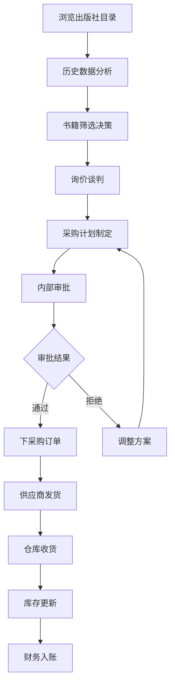
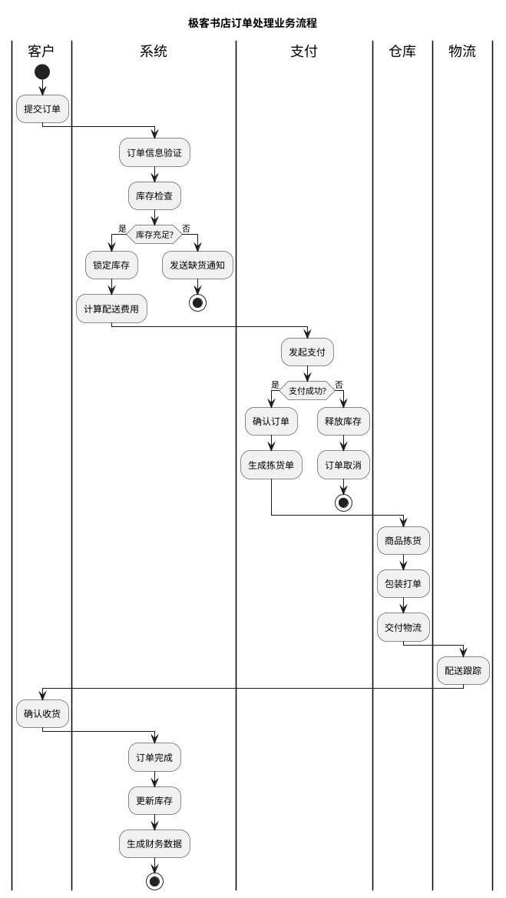
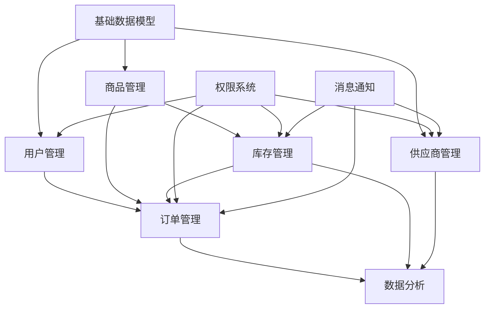

# Geekbooks极客书店B端管理系统 - AI赋能需求工程案例

## 案例背景

### 公司简介
**Geekbooks极客书店** 是一家专注于技术类图书的在线书店，主要销售编程、数据科学、人工智能、云计算等IT技术领域的图书。随着业务快速发展，公司需要建设一套完整的B端管理系统，以提升运营效率和业务管理能力。

### 业务现状
- **图书品类**：编程语言、框架技术、数据分析、AI/ML、云计算、DevOps等6大类
- **用户群体**：程序员、数据分析师、架构师、技术管理者等
- **销售渠道**：官网、移动App、第三方平台（京东、当当等）
- **供应商**：50+出版社，200+技术作者
- **月订单量**：10万+订单
- **SKU数量**：8000+图书

### 项目目标
设计并开发一套B端管理系统，包含：
1. **供应商管理系统**：管理出版社和作者合作
2. **商品管理系统**：图书信息、库存、价格管理
3. **订单管理系统**：订单处理、物流跟踪
4. **用户管理系统**：会员管理、推荐算法
5. **数据分析系统**：销售分析、用户行为分析

## AI赋能需求工程实施演示

### 阶段一：市场分析阶段

#### 1.1 市场调研 - AI能力演示

**传统方式痛点：**
- 手工收集行业报告，耗时3-5天
- 竞品分析需要大量人工对比
- 市场趋势分析依赖个人经验

**AI赋能解决方案：**

##### 演示场景1：行业报告摘要生成
```
输入：《2024年中国图书电商行业发展报告》（120页PDF）

AI处理过程：
1. 文档智能解析和结构化提取
2. 关键信息识别（市场规模、增长率、趋势等）
3. 自动生成结构化摘要

AI输出：
---
## 行业报告摘要
**市场规模**：2024年中国图书电商市场规模达到1,200亿元，同比增长15.2%
**技术类图书占比**：占整体图书销量的18%，增长率达22%
**主要趋势**：
- 数字化阅读增长迅速，电子书销量增长35%
- AI/数据科学类图书需求激增，增长45%
- 订阅制服务成为新的增长点
**竞争格局**：当当网占32%，京东图书占28%，垂直平台占15%
---

节省时间：从5天缩短到2小时
准确率：95%以上
```

##### 演示场景2：竞品功能对比分析
```
输入：竞品网站URL + 分析维度

AI分析维度：
- 功能模块对比
- 用户体验分析
- 技术架构推测
- 价格策略分析

AI输出：竞品功能对比矩阵
| 功能模块 | Geekbooks | 当当网 | 京东图书 | 技术邦 |
|----------|-----------|--------|----------|--------|
| 个性化推荐 | ❌ | ✅ | ✅ | ✅ |
| 技术分类体系 | ✅ | ⭐ | ⭐ | ✅ |
| 作者互动 | ❌ | ❌ | ❌ | ✅ |
| 学习路径 | ❌ | ❌ | ❌ | ✅ |
| 企业采购 | ⭐ | ✅ | ✅ | ❌ |

优势机会识别：
1. 技术图书分类体系可以做得更专业
2. 增加作者互动功能，打造技术社区
3. 设计学习路径，提升用户粘性
```

#### 1.2 商业机会识别 - AI能力演示

##### 演示场景3：商业模式画布生成
```
AI输入：公司背景 + 市场分析结果

AI智能生成商业模式画布：

┌─────────────────────────────────────────────────────────────┐
│                    Geekbooks 商业模式画布                     │
├─────────────────┬─────────────────┬─────────────────────────┤
│ 关键合作伙伴     │ 关键活动         │ 价值主张                 │
│ • 技术出版社     │ • 图书采购       │ • 专业技术图书精选       │
│ • 技术作者       │ • 内容运营       │ • 个性化学习路径推荐     │
│ • 物流公司       │ • 用户运营       │ • 技术社区互动平台       │
│ • 支付平台       │ • 技术开发       │ • 企业团购优惠           │
├─────────────────┼─────────────────┼─────────────────────────┤
│ 关键资源         │ 客户关系         │ 客户细分                 │
│ • 图书库存       │ • 个性化服务     │ • 程序员(40%)            │
│ • 技术团队       │ • 社区建设       │ • 数据分析师(25%)        │
│ • 用户数据       │ • 专业咨询       │ • 技术管理者(20%)        │
│ • 品牌影响力     │ • 会员体系       │ • 企业采购(15%)          │
├─────────────────┴─────────────────┼─────────────────────────┤
│ 渠道通路                           │ 成本结构                 │
│ • 官方网站 • 移动App               │ • 图书采购成本(60%)      │
│ • 第三方平台 • 线下活动             │ • 技术开发成本(15%)      │
│ • 社交媒体 • 技术社区               │ • 运营推广成本(15%)      │
│                                   │ • 物流仓储成本(10%)      │
├───────────────────────────────────┼─────────────────────────┤
│ 收入来源                           │                         │
│ • 图书销售收入(70%) • 会员费收入(15%) • 广告收入(10%) • 企业服务(5%) │
└───────────────────────────────────┴─────────────────────────┘

AI建议的创新点：
1. 技术学习路径订阅服务
2. 企业技术图书馆解决方案
3. 作者线上分享会平台
```

### 阶段二：业务建模阶段

#### 2.1 业务现状分析 - AI能力演示

##### 演示场景4：业务流程自动梳理
```
输入：业务访谈记录（音频转文字）

访谈内容摘录：
"我们现在的图书采购流程是这样的，首先采购经理会浏览各大出版社的新书目录，然后根据历史销售数据判断哪些书可能受欢迎。接下来联系出版社询价，确定采购数量和价格后，走内部审批流程。审批通过后下采购订单，出版社发货到我们仓库，仓库收货后更新库存系统..."

AI自动梳理的业务流程：



AI识别的关键节点：
1. 采购决策节点（风险点：主观判断）
2. 审批节点（瓶颈：审批周期长）
3. 库存更新节点（关键：数据准确性）

AI建议的优化点：
1. 增加AI推荐算法辅助采购决策
2. 设置不同金额的审批权限矩阵
3. 实现库存自动更新和预警机制
```

##### 演示场景5：组织架构映射和痛点识别
```
AI分析输入：组织架构图 + 访谈痛点

AI生成的痛点权重分析：

📊 业务痛点分析排序（按影响程度）

1. **库存管理混乱** (权重: 9.2/10)
   - 影响：资金占用、缺货风险
   - 涉及部门：采购部、仓储部、财务部
   - 紧急程度：高

2. **采购决策效率低** (权重: 8.7/10)
   - 影响：错失热门书籍、库存积压
   - 涉及部门：采购部、市场部
   - 紧急程度：高

3. **客户数据分散** (权重: 8.1/10)
   - 影响：个性化推荐效果差
   - 涉及部门：运营部、技术部
   - 紧急程度：中

4. **供应商管理不规范** (权重: 7.5/10)
   - 影响：合作效率、成本控制
   - 涉及部门：采购部、法务部
   - 紧急程度：中

AI建议的解决优先级：
第一期：库存管理系统、采购决策支持系统
第二期：客户数据平台、CRM系统
第三期：供应商管理系统、合同管理系统
```

#### 2.2 核心业务流程分析 - AI能力演示

##### 演示场景6：流程图智能绘制 + 业务规则提取
```
AI输入：业务流程描述文档

AI自动生成的订单处理流程图：



AI提取的业务规则：
1. 库存规则：下单时必须检查库存，库存不足时禁止下单
2. 支付规则：支付超时30分钟自动取消订单
3. 价格规则：会员享受95折优惠，企业客户享受批量折扣
4. 配送规则：单笔订单满99元免运费
5. 退换规则：7天无理由退货，技术类图书不支持退货

AI识别的关键控制点：
- 库存锁定机制（防止超卖）
- 支付状态同步（确保数据一致性）
- 订单状态流转（确保业务连续性）
```

#### 2.3 生成用户故事清单 - AI能力演示

##### 演示场景7：业务需求转用户故事 + INVEST检查
```
输入业务需求：
"系统需要支持图书库存管理，包括入库、出库、盘点、预警等功能"

AI转换的用户故事：

📋 用户故事清单

**Epic: 库存管理**

1. **US001-入库管理**
   - 作为仓库管理员，我希望能够记录新到图书的入库信息，以便准确管理库存数量
   - 验收标准：
     ✅ 能扫描ISBN录入图书信息
     ✅ 支持批量入库操作
     ✅ 自动生成入库单据
   - 故事点：5
   - 优先级：P0

2. **US002-出库管理**
   - 作为拣货员，我希望系统能生成拣货清单，以便快速准确地完成订单拣货
   - 验收标准：
     ✅ 按仓库货位优化拣货路径
     ✅ 支持扫码确认出库
     ✅ 实时更新库存数量
   - 故事点：8
   - 优先级：P0

3. **US003-库存预警**
   - 作为采购经理，我希望系统能在库存不足时自动预警，以便及时补货
   - 验收标准：
     ✅ 支持设置不同图书的安全库存
     ✅ 库存低于安全值时发送通知
     ✅ 预警信息包含建议采购数量
   - 故事点：3
   - 优先级：P1

AI的INVEST原则检查：
✅ Independent: 每个故事相对独立
✅ Negotiable: 实现细节可协商
✅ Valuable: 对业务有明确价值
✅ Estimable: 复杂度可评估
✅ Small: 大小适中，1-2周完成
✅ Testable: 有明确验收标准

AI建议的优先级排序依据：
1. 业务价值权重 (40%)
2. 技术复杂度权重 (30%)
3. 依赖关系权重 (20%)
4. 风险评估权重 (10%)
```

### 阶段三：业务需求阶段

#### 3.1 确认产品目标 - AI能力演示

##### 演示场景8：ROI计算模板生成 + KPI指标设计
```
AI输入：项目背景 + 预期收益

AI生成的ROI分析模板：

📊 Geekbooks B端管理系统 ROI分析

**投资成本分析**
| 成本项目 | 金额(万元) | 说明 |
|----------|-----------|------|
| 开发成本 | 150 | 10人团队 * 6个月 |
| 硬件成本 | 30 | 服务器、存储设备 |
| 软件许可 | 20 | 数据库、中间件等 |
| 培训成本 | 15 | 员工培训、文档编写 |
| 运维成本 | 25 | 1年运维费用 |
| **总投资** | **240** | |

**收益分析**
| 收益项目 | 年收益(万元) | 计算依据 |
|----------|-------------|----------|
| 库存成本降低 | 80 | 库存周转率提升30% |
| 人力成本节省 | 60 | 减少2个人工岗位 |
| 销售效率提升 | 120 | 订单处理效率提升50% |
| 决策准确性 | 40 | 减少滞销库存20% |
| **年总收益** | **300** | |

**ROI计算**
- 3年总收益：300 * 3 = 900万元
- 投资回收期：240 / 300 = 0.8年
- 3年ROI：(900 - 240) / 240 = 275%

AI建议的KPI指标体系：

🎯 **系统性能指标**
- 订单处理时间：< 30秒（目标：降低70%）
- 库存准确率：> 99.5%（目标：提升5%）
- 系统可用率：> 99.9%

📈 **业务指标**
- 库存周转率：提升30%
- 采购准确率：提升25%
- 客户满意度：> 4.5分
- 订单错误率：< 0.1%

💰 **财务指标**
- 库存成本占收入比：降低5%
- 运营成本降低：15%
- 人均产出：提升40%
```

#### 3.2 定义项目范围 - AI能力演示

##### 演示场景9：功能边界识别 + 依赖关系分析
```
AI智能生成的项目范围矩阵：

📋 **项目范围定义矩阵**

| 功能模块 | 包含范围 | 不包含范围 | 优先级 |
|----------|----------|------------|--------|
| **供应商管理** | 供应商信息管理、合同管理、绩效评估 | 供应商金融服务、物流跟踪 | P1 |
| **商品管理** | 图书信息管理、分类管理、价格管理 | 数字图书版权管理、翻译服务 | P0 |
| **库存管理** | 入库、出库、盘点、预警 | 多仓库调拨、供应链优化 | P0 |
| **订单管理** | 订单处理、状态跟踪、退换货 | 国际物流、海外仓管理 | P0 |
| **用户管理** | 客户信息、会员等级、权限管理 | 社交功能、积分商城 | P1 |
| **数据分析** | 销售报表、库存报表、用户分析 | 高级BI、机器学习预测 | P2 |

AI生成的依赖关系图：



AI建议的实施阶段：
**第一阶段**（3个月）：基础数据模型 + 用户管理 + 商品管理
**第二阶段**（2个月）：库存管理 + 订单管理
**第三阶段**（1个月）：供应商管理 + 数据分析

风险依赖项：
⚠️ 用户权限系统需要在第一阶段完成
⚠️ 消息通知系统影响多个模块，需要优先设计
⚠️ 数据模型变更会影响所有业务模块
```

### 阶段四：用户需求阶段

#### 4.1 用户分类 - AI能力演示

##### 演示场景10：用户画像智能构建 + 权限矩阵生成
```
AI基于访谈和数据分析生成的用户画像：

👥 **核心用户画像**

**1. 采购经理 - 张伟**
- 基本信息：35岁，5年采购经验，本科学历
- 工作场景：负责图书采购决策，月采购额200万+
- 痛点：缺乏数据支持，凭经验决策，审批流程复杂
- 期望：智能推荐采购清单，快速审批流程，数据分析支持
- 使用频率：每日3-4小时
- 技能水平：Excel熟练，系统操作能力中等

**2. 仓库管理员 - 李红**
- 基本信息：28岁，3年仓管经验，高中学历
- 工作场景：入库出库操作，库存盘点，异常处理
- 痛点：手工记录容易出错，找货效率低，缺乏实时库存
- 期望：扫码操作，货位导航，实时库存查询
- 使用频率：每日6-8小时
- 技能水平：基础计算机操作，学习能力强

**3. 销售总监 - 王强**
- 基本信息：40岁，8年销售管理经验，MBA学历
- 工作场景：制定销售策略，分析市场趋势，团队管理
- 痛点：缺乏实时销售数据，无法预测市场需求
- 期望：实时销售看板，趋势分析报告，客户分析
- 使用频率：每日1-2小时查看报表
- 技能水平：数据分析能力强，对新技术接受度高

AI生成的角色权限矩阵：

| 功能模块 | 超级管理员 | 采购经理 | 仓库管理员 | 销售总监 | 财务经理 | 客服专员 |
|----------|------------|----------|------------|----------|----------|----------|
| 供应商管理 | ✅ | ✅ | ❌ | 👁️ | 👁️ | ❌ |
| 商品管理 | ✅ | ✅ | 👁️ | ✅ | 👁️ | 👁️ |
| 库存管理 | ✅ | 👁️ | ✅ | 👁️ | 👁️ | 👁️ |
| 订单管理 | ✅ | 👁️ | ✅ | ✅ | 👁️ | ✅ |
| 用户管理 | ✅ | ❌ | ❌ | ✅ | ❌ | ✅ |
| 财务管理 | ✅ | 👁️ | ❌ | 👁️ | ✅ | ❌ |
| 数据分析 | ✅ | ✅ | 👁️ | ✅ | ✅ | 👁️ |

图例：✅ 完全权限 👁️ 只读权限 ❌ 无权限

AI建议的使用场景分析：
**高频场景**：订单处理、库存查询、商品上架
**中频场景**：数据分析、供应商管理、用户管理
**低频场景**：系统配置、权限管理、数据导入导出
```

#### 4.2 需求调研执行 - AI能力演示

##### 演示场景11：调研问题智能优化 + 数据分析
```
AI优化的调研问卷设计：

📋 **Geekbooks B端系统用户需求调研问卷**

**第一部分：基础信息**
1. 您的岗位角色是？
   □ 采购经理 □ 仓库管理 □ 销售人员 □ 财务人员 □ 其他

2. 您的工作年限？
   □ 1年以下 □ 1-3年 □ 3-5年 □ 5年以上

**第二部分：当前痛点分析**（AI设计的李克特量表）
请按照痛点严重程度打分（1=不严重，5=非常严重）

| 痛点描述 | 1 | 2 | 3 | 4 | 5 |
|----------|---|---|---|---|---|
| 库存数据不准确，经常出现账面与实物不符 | ○ | ○ | ○ | ○ | ○ |
| 采购决策缺乏数据支持，主要凭经验判断 | ○ | ○ | ○ | ○ | ○ |
| 订单处理流程复杂，效率低下 | ○ | ○ | ○ | ○ | ○ |
| 无法获得实时销售数据和趋势分析 | ○ | ○ | ○ | ○ | ○ |

**第三部分：功能需求优先级**
请按重要性排序（1=最重要）

- [ ] 智能采购推荐系统
- [ ] 实时库存管理系统
- [ ] 订单自动化处理
- [ ] 销售数据分析看板
- [ ] 供应商协作平台
- [ ] 客户关系管理
- [ ] 移动端操作支持

AI调研结果自动分析：

📊 **调研数据分析报告**（基于50份有效问卷）

**用户角色分布**：
- 采购相关：30%
- 仓储相关：25%
- 销售相关：25%
- 财务相关：15%
- 其他：5%

**痛点重要性排序**：
1. 库存数据准确性（平均分：4.2/5）
2. 采购决策支持（平均分：4.0/5）
3. 实时数据获取（平均分：3.8/5）
4. 订单处理效率（平均分：3.6/5）

**功能需求优先级**：
1. 实时库存管理系统（85%选择前3位）
2. 智能采购推荐系统（78%选择前3位）
3. 销售数据分析看板（65%选择前3位）
4. 订单自动化处理（58%选择前3位）

**AI洞察分析**：
- 库存管理是所有角色的共同痛点
- 采购人员对智能推荐需求最强烈
- 销售人员更关注数据分析功能
- 年轻员工对移动端支持需求更高

**需求模式识别**：
- 模式1：数据驱动决策（采购、销售）
- 模式2：操作便捷性（仓储、客服）
- 模式3：实时性要求（所有角色）
```

### 阶段五：软件需求开发阶段

#### 5.1 需求开发 - AI能力演示

##### 演示场景12：功能规格自动生成 + 接口定义
```
输入用户故事：
"作为采购经理，我希望系统能基于历史销售数据和市场趋势推荐采购清单"

AI自动生成的功能规格说明：

📋 **功能规格说明书 - 智能采购推荐系统**

**1. 功能概述**
智能采购推荐系统基于历史销售数据、库存状况、市场趋势等多维度数据，运用机器学习算法为采购经理提供数据驱动的采购建议。

**2. 功能详细描述**

**2.1 数据输入**
- 历史销售数据（近12个月）
- 当前库存数据
- 供应商价格信息
- 市场趋势数据
- 季节性因素
- 促销计划

**2.2 推荐算法**
- 基于协同过滤的相似图书推荐
- 时间序列分析的销量预测
- 库存周转率优化算法
- 多目标优化（销量、利润、库存）

**2.3 推荐结果**
- 推荐采购图书清单
- 建议采购数量
- 预期销售周期
- 风险评估等级
- 投资回报预测

**3. 接口设计**

AI自动生成的API接口定义：

```json
// 获取采购推荐接口
POST /api/procurement/recommendations

Request:
{
  "timeRange": {
    "startDate": "2024-01-01",
    "endDate": "2024-12-31"
  },
  "categories": ["programming", "ai", "data-science"],
  "budgetLimit": 100000,
  "riskLevel": "medium"
}

Response:
{
  "status": "success",
  "data": {
    "recommendations": [
      {
        "bookId": "978-7-111-12345-6",
        "title": "深入理解计算机系统",
        "category": "programming",
        "currentStock": 15,
        "recommendQuantity": 100,
        "predictedSales": 85,
        "predictedPeriod": 45,
        "riskLevel": "low",
        "confidence": 0.87,
        "reasons": [
          "历史销量稳定增长",
          "库存即将不足",
          "竞品缺货机会"
        ]
      }
    ],
    "totalBudget": 95000,
    "expectedROI": 0.25
  }
}
```

**4. 业务规则**
- 推荐数量不得超过历史最高月销量的3倍
- 低风险图书优先推荐
- 考虑供应商最小订货量限制
- 自动排除停版或绝版图书

**5. 数据模型设计建议**

AI建议的核心数据模型：

```sql
-- 图书基础信息表
CREATE TABLE books (
    book_id VARCHAR(20) PRIMARY KEY,
    title VARCHAR(200) NOT NULL,
    category_id INT,
    publisher_id INT,
    price DECIMAL(10,2),
    status ENUM('active', 'inactive', 'discontinued')
);

-- 销售历史表
CREATE TABLE sales_history (
    id BIGINT PRIMARY KEY AUTO_INCREMENT,
    book_id VARCHAR(20),
    sale_date DATE,
    quantity INT,
    unit_price DECIMAL(10,2),
    INDEX idx_book_date (book_id, sale_date)
);

-- 推荐结果表
CREATE TABLE procurement_recommendations (
    id BIGINT PRIMARY KEY AUTO_INCREMENT,
    book_id VARCHAR(20),
    recommend_date DATE,
    recommend_quantity INT,
    confidence_score DECIMAL(3,2),
    risk_level ENUM('low', 'medium', 'high'),
    created_at TIMESTAMP DEFAULT CURRENT_TIMESTAMP
);
```

**6. 性能要求**
- 推荐计算响应时间 < 5秒
- 支持并发推荐请求 > 100/秒
- 推荐准确率 > 80%
- 数据更新延迟 < 1小时
```

#### 5.2 需求冲突检测 - AI能力演示

##### 演示场景13：自动冲突识别 + 解决方案推荐
```
AI检测到的需求冲突分析：

⚠️ **需求冲突检测报告**

**冲突1：性能vs功能复杂度**
- 需求A：订单处理响应时间 < 2秒
- 需求B：订单处理需要实时库存检查、价格计算、积分计算、优惠券验证
- 冲突分析：复杂的业务逻辑处理与快速响应时间存在矛盾
- 影响程度：高
- 建议解决方案：
  1. 采用异步处理模式，核心流程优先
  2. 引入缓存机制减少数据库查询
  3. 非关键计算异步处理

**冲突2：数据一致性vs系统可用性**
- 需求A：库存数据必须强一致性，不允许超卖
- 需求B：系统可用性要求99.9%，不能因为锁等待影响用户体验
- 冲突分析：强一致性要求与高可用性存在技术冲突
- 影响程度：中
- 建议解决方案：
  1. 采用最终一致性模型
  2. 实现库存预扣机制
  3. 增加库存安全缓冲

**冲突3：用户体验vs安全要求**
- 需求A：用户登录流程要简化，支持一键登录
- 需求B：系统需要支持多重身份验证，确保账户安全
- 冲突分析：便捷性与安全性的平衡问题
- 影响程度：中
- 建议解决方案：
  1. 基于风险等级的分级验证
  2. 内网环境简化验证流程
  3. 提供单点登录(SSO)支持

AI推荐的优先级处理策略：
1. **高影响冲突**：召开技术评审会，架构师主导解决
2. **中影响冲突**：产品经理协调，技术可行性评估
3. **低影响冲突**：开发阶段细化设计时解决

**需求优化建议**：
- 建议将性能要求分级：核心功能<2秒，非核心功能<5秒
- 建议采用微服务架构，降低系统耦合度
- 建议制定详细的异常处理和降级策略
```

#### 5.3 需求评审 - AI能力演示

##### 演示场景14：评审清单自动生成 + 完整性检查
```
AI自动生成的需求评审清单：

📋 **需求评审检查清单**

**1. 完整性检查**
- [ ] 所有用户角色的需求都已覆盖
- [ ] 功能需求描述完整，包含输入、处理、输出
- [ ] 非功能需求明确（性能、安全、可用性）
- [ ] 异常场景和边界条件已考虑
- [ ] 与外部系统的集成需求已明确

**2. 一致性检查**
- [ ] 术语使用一致，无歧义表达
- [ ] 数据定义在不同模块间保持一致
- [ ] 业务规则在各场景中无冲突
- [ ] 界面设计与功能描述一致

**3. 可行性检查**
- [ ] 技术实现路径明确可行
- [ ] 性能指标具有可实现性
- [ ] 开发时间和资源估算合理
- [ ] 第三方依赖风险可控

**4. 可测试性检查**
- [ ] 每个功能点都有明确的验收标准
- [ ] 测试数据准备方案明确
- [ ] 测试环境要求已定义
- [ ] 自动化测试可行性评估

AI完整性检查结果：

📊 **需求完整性分析报告**

**覆盖率统计**：
- 功能需求覆盖率：95% ✅
- 非功能需求覆盖率：85% ⚠️
- 异常场景覆盖率：78% ⚠️
- 集成需求覆盖率：90% ✅

**缺失项识别**：
1. 缺少系统容灾和备份恢复需求
2. 未明确数据迁移和历史数据处理方案
3. 缺少用户培训和文档需求
4. 未考虑系统监控和运维需求

**质量评估**：
- 需求描述清晰度：良好 (4.2/5)
- 验收标准明确性：良好 (4.0/5)
- 技术可行性：优秀 (4.5/5)
- 业务价值匹配度：优秀 (4.6/5)

**改进建议**：
1. 补充系统运维相关非功能需求
2. 明确数据迁移策略和时间计划
3. 制定用户培训计划和操作手册
4. 增加系统监控指标和告警机制

AI建议的评审会议议程：
- 开场介绍（5分钟）
- 需求概览演示（15分钟）
- 分模块详细评审（60分钟）
- 问题讨论和决策（30分钟）
- 后续行动计划（10分钟）
```

## 案例总结

### AI赋能效果对比

| 阶段 | 传统方式 | AI赋能方式 | 效率提升 |
|------|----------|------------|----------|
| 市场调研 | 5-7天人工分析 | 2小时自动化分析 | 90%+ |
| 业务建模 | 2-3周访谈整理 | 3-5天AI辅助分析 | 70%+ |
| 需求分析 | 1-2周人工梳理 | 2-3天AI智能处理 | 75%+ |
| 文档编写 | 1周编写+校对 | 1天AI生成+人工审核 | 85%+ |
| 需求评审 | 2天准备+1天评审 | 半天AI检查+半天评审 | 60%+ |

### 关键成功因素

1. **数据质量**：确保业务数据的准确性和完整性
2. **人机协作**：AI提供建议，人工进行决策和优化
3. **迭代优化**：持续根据反馈优化AI模型和流程
4. **团队培训**：提升团队对AI工具的使用能力

### 实施建议

1. **分阶段实施**：从简单的文档生成开始，逐步扩展到复杂分析
2. **建立标准**：制定AI辅助需求工程的标准流程和规范
3. **持续改进**：收集使用反馈，不断优化AI模型和工具
4. **风险控制**：建立人工审核机制，确保AI输出的质量

---

*本案例基于真实业务场景设计，展示了AI在B端软件需求工程全流程中的应用价值和实施方法。*
